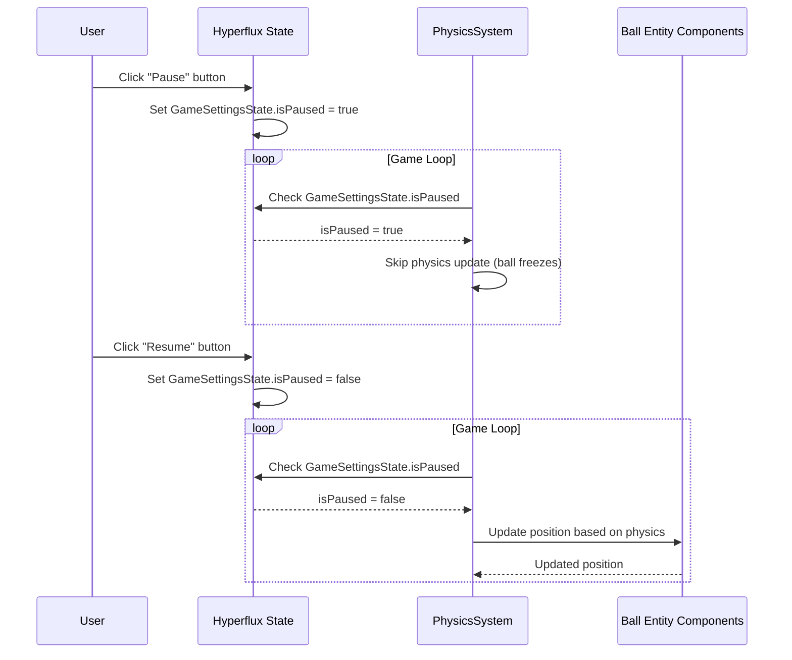
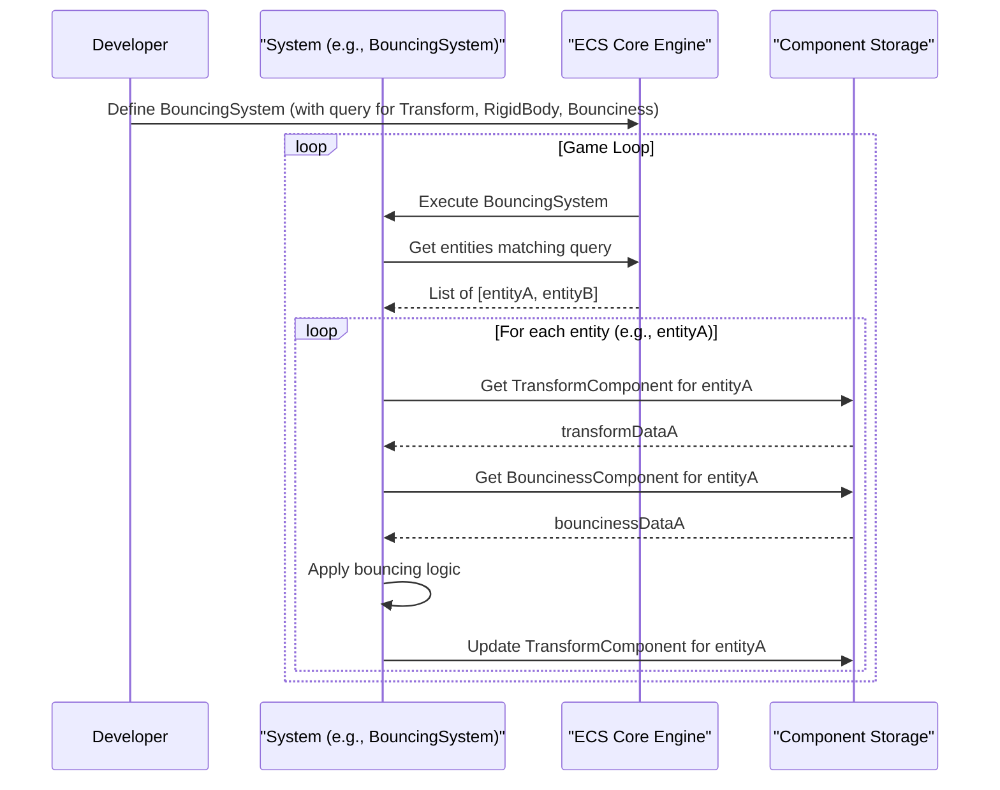
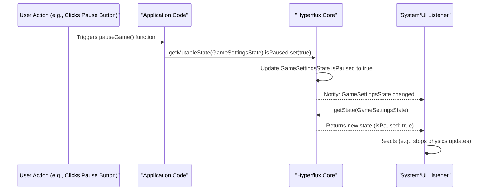

# ECS (Entity-component-system) & state management (Hyperflux)

## Overview

The iR Engine is built upon two fundamental architectural patterns: the Entity-component-system (ECS) for organizing game objects and their behaviors, and Hyperflux for state management. Together, these systems provide a structured approach to defining objects in the virtual world, their properties, behaviors, and how data is shared across different parts of the engine. This chapter explores how these core systems work together to create a flexible, modular, and performant foundation for interactive applications.

## Entity-component-system (ECS)

ECS is an architectural pattern that separates identity (entities), data (components), and logic (systems). This separation provides numerous benefits including improved modularity, better performance through data-oriented design, and enhanced flexibility.

### Entity: the identifier

An entity is simply a unique identifier that represents a distinct object in the virtual world. On its own, an entity doesn't have any properties or behaviors—it's essentially just an ID number.

```typescript
// Conceptual example of creating an entity
import { createEntity } from '@ir-engine/ecs';

const ballEntity = createEntity(); // Returns a unique entity ID
```

Entities serve as containers to which components can be attached. For example, a ball entity might have components for position, appearance, physics properties, and custom behaviors.

### Component: the data

Components are pure data containers that define the properties or characteristics of an entity. Each component type represents a specific aspect of an entity, such as its position, appearance, or physics properties.

```typescript
// Example of defining a component
import { defineComponent, S } from '@ir-engine/ecs'; // S is for schema definition

export const BouncinessComponent = defineComponent({
  name: 'BouncinessComponent', // A unique name
  schema: S.Object({           // Defines the data structure
    factor: S.Number()         // e.g., 0.8 for 80% bounciness
  })
});
```

Components can be attached to entities to give them specific properties:

```typescript
// Example of attaching components to an entity
import { setComponent } from '@ir-engine/ecs';

// Assume ballEntity exists and components are defined
setComponent(ballEntity, TransformComponent, { position: {x:0, y:10, z:0} });
setComponent(ballEntity, MeshComponent, { type: 'sphere', color: 'red' });
setComponent(ballEntity, RigidBodyComponent, { mass: 1 });
setComponent(ballEntity, BouncinessComponent, { factor: 0.8 });
```

The combination of components attached to an entity defines what that entity is and what data it contains. An entity can have any number of components, allowing for flexible object composition.

### System: the logic

Systems contain the logic that operates on entities with specific sets of components. They implement behaviors by processing entities that match certain component criteria.

```typescript
// Example of defining a system
import { defineSystem, defineQuery, getComponent } from '@ir-engine/ecs';

// Query for entities that have all these components
const bouncyThingsQuery = defineQuery([
  TransformComponent,
  RigidBodyComponent,
  BouncinessComponent 
]);

export const BouncingSystem = defineSystem({
  uuid: 'my.engine.BouncingSystem', // A unique ID for the system
  execute: () => { // This function runs repeatedly (e.g., every frame)
    for (const entity of bouncyThingsQuery()) { // Loop through matching entities
      const transform = getComponent(entity, TransformComponent);
      const bounciness = getComponent(entity, BouncinessComponent);
      // Add logic here: e.g., if (transform.position.y < 0) bounce!
      // Update transform.position based on physics and bounciness.factor
    }
  }
});
```

Systems use queries to efficiently find entities with specific component combinations. The `defineQuery` function creates a query that, when called, returns all entities that have the specified components. The system then processes these entities according to its logic.

## Hyperflux state management

While ECS is excellent for managing game world objects and their properties, applications often need to manage other types of state that don't fit neatly into the entity-component model. This includes:

- Application settings (e.g., audio volume, graphics quality)
- UI state (e.g., which menus are open)
- Game state (e.g., current score, whether the game is paused)
- Editor state (e.g., undo/redo history)

Hyperflux is a state management library used in the iR Engine to handle these types of global or shared state.

### Defining state

State in Hyperflux is defined using the `defineState` function:

```typescript
// Example of defining state with Hyperflux
import { defineState } from '@ir-engine/hyperflux';

export const GameSettingsState = defineState({
  name: 'GameSettingsState', // A unique name for this state
  initial: {                 // Default values when the app starts
    isPaused: false,
    masterVolume: 0.8        // Volume from 0.0 to 1.0
  }
});
```

This creates a global `GameSettingsState` that any part of the engine can access or modify.

### Accessing and modifying state

Hyperflux provides functions to read and update state:

```typescript
// Example of accessing and modifying state
import { getMutableState, getState } from '@ir-engine/hyperflux';
import { GameSettingsState } from './GameSettingsState';

// Reading state
const settings = getState(GameSettingsState);
console.log(`Game paused: ${settings.isPaused}, Volume: ${settings.masterVolume}`);

// Modifying state
function pauseGame() {
  const settings = getMutableState(GameSettingsState);
  settings.isPaused.set(true);
}

function setVolume(volume) {
  const settings = getMutableState(GameSettingsState);
  settings.masterVolume.set(volume);
}
```

The `getState` function provides read-only access to the current state, while `getMutableState` allows for modifying the state.

### Reacting to state changes

One of the key features of Hyperflux is its reactivity—parts of the application can automatically respond to state changes:

```typescript
// Example of a system that reacts to state changes
import { defineSystem, defineQuery, getComponent, getState } from '@ir-engine/ecs';
import { GameSettingsState } from './GameSettingsState';

export const PhysicsSystem = defineSystem({
  uuid: 'my.engine.PhysicsSystem',
  execute: () => {
    const settings = getState(GameSettingsState);
    
    // Skip physics updates if the game is paused
    if (settings.isPaused) {
      return;
    }
    
    // Process physics for all relevant entities
    for (const entity of physicsQuery()) {
      // Physics logic here
    }
  }
});
```

In this example, the `PhysicsSystem` checks the `isPaused` state before processing physics. If the game is paused, it skips the update, effectively freezing all physics objects in place.

## ECS and Hyperflux working together

ECS and Hyperflux complement each other to provide a comprehensive solution for managing application state:

1. **ECS for game world objects**: Entities, components, and systems manage the objects in the virtual world, their properties, and behaviors.

2. **Hyperflux for global state**: Hyperflux manages application-wide settings, UI state, game state, and other shared data.

3. **Integration points**: Systems can access Hyperflux state to modify their behavior based on global settings or game state.

Here's an example of how they work together for a bouncing ball in a game:



This diagram shows how user actions can modify Hyperflux state, which then affects how systems process entities and their components.

## Implementation details

### ECS internals

The iR Engine's ECS implementation is built for performance and flexibility:

1. **Entities as IDs**: Entities are represented as simple numeric IDs for efficiency.

2. **Component storage**: Components are stored in optimized data structures, often using a pattern called "Structure of Arrays" for better cache locality and performance.

3. **Query optimization**: The system efficiently tracks which entities have which components, allowing for fast queries.

4. **System execution**: Systems are executed in a controlled order, with dependencies between systems respected.



This diagram illustrates the flow of execution in the ECS system, showing how systems query for entities, access their components, and update them.

### Hyperflux internals

Hyperflux uses a reactive state management approach:

1. **State definition**: When state is defined with `defineState`, Hyperflux creates a dedicated store for that state.

2. **Subscription mechanism**: Parts of the application can subscribe to specific pieces of state, being notified when they change.

3. **Efficient updates**: Hyperflux tracks which parts of the state have changed and only notifies subscribers affected by those changes.

4. **Immutability**: State updates create new state objects rather than modifying existing ones, which helps with tracking changes and maintaining consistency.



This diagram shows how state changes propagate through the Hyperflux system, from the initial action to the systems that react to the change.

## Benefits and applications

The combination of ECS and Hyperflux provides several key benefits:

1. **Modularity**: The separation of entities, components, and systems promotes modular code that's easier to maintain and extend.

2. **Performance**: The data-oriented design of ECS and the efficient update mechanism of Hyperflux contribute to high performance.

3. **Flexibility**: New types of objects can be created by combining existing components, and new behaviors can be added through new systems.

4. **Reactivity**: Changes in state automatically propagate to the parts of the application that depend on that state.

5. **Scalability**: The architecture scales well to complex applications with many objects and behaviors.

These benefits make ECS and Hyperflux well-suited for a wide range of applications, from games and simulations to interactive experiences and virtual environments.

## Next steps

With an understanding of how ECS and Hyperflux provide the foundation for the iR Engine, the next chapter explores how the engine manages the various assets (3D models, textures, sounds, etc.) that bring the virtual world to life.

Next: [Asset management system](02_asset_management_system_.md)

---


