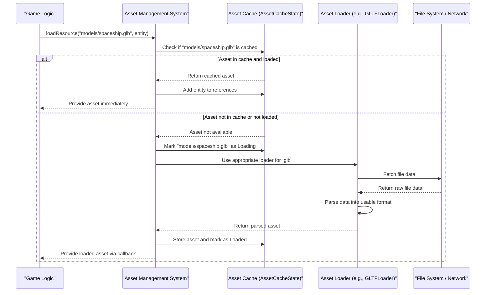

# Asset management system

## Overview

The Asset Management System is responsible for handling all the digital resources that make up a virtual world in the iR Engine. These resources, known as assets, include 3D models, textures, audio files, and more. The system provides a structured approach to locating, loading, processing, and managing these assets efficiently.

By centralizing asset handling, the engine ensures that resources are loaded when needed, shared between different parts of the application, and properly managed throughout their lifecycle. This chapter explores the concepts, structure, and implementation of the Asset Management System within the iR Engine.

## Core concepts

### Assets

Assets are the digital resources that make up a game or virtual environment. The iR Engine supports various types of assets:

```typescript
// Simplified from src/assets/constants/AssetType.ts
export enum AssetType {
  Model = 'Model',   // 3D models (characters, objects, environments)
  Image = 'Image',   // Textures and images
  Audio = 'Audio',   // Sound effects and music
  // ... and others
}

export enum AssetExt {
  GLB = 'glb',       // For 3D models in glTF binary format
  GLTF = 'gltf',     // For 3D models in glTF text format
  PNG = 'png',       // For images
  JPEG = 'jpeg',     // For images
  MP3 = 'mp3',       // For audio
  WAV = 'wav',       // For audio
  // ... and others
}
```

These enumerations help the system identify and categorize assets based on their type and file extension, enabling appropriate handling for each asset type.

### Asset loaders

Asset loaders are specialized components that know how to read specific file formats and convert them into usable in-memory representations. Different asset types require different loaders:

- **Model loaders**: Parse 3D model files (e.g., GLB, GLTF) into geometry, materials, and animations
- **Image loaders**: Load image files (e.g., PNG, JPEG) into textures
- **Audio loaders**: Process audio files (e.g., MP3, WAV) into playable sound resources

The system selects the appropriate loader based on the asset's file extension:

```typescript
// Simplified concept from src/assets/classes/AssetLoader.ts
function getLoader(fileName: string) {
  const fileExtension = fileName.split('.').pop()?.toLowerCase();

  switch (fileExtension) {
    case 'glb':
    case 'gltf':
      return new GLTFLoader();
    case 'png':
    case 'jpg':
    case 'jpeg':
      return new TextureLoader();
    case 'mp3':
    case 'wav':
      return new AudioLoader();
    // ... other asset types
    default:
      throw new Error(`No loader available for extension: ${fileExtension}`);
  }
}
```

### Asset cache

The Asset Cache is a central repository that stores loaded assets in memory, preventing redundant loading of the same asset. In the iR Engine, this cache is implemented using Hyperflux state management:

```typescript
// Simplified from src/assets/state/AssetCacheState.ts
import { defineState } from '@ir-engine/hyperflux';
import { Entity } from '@ir-engine/ecs';

export enum ResourceStatus { Unloaded, Loading, Loaded, Error }

export const AssetCacheState = defineState({
  name: 'AssetCacheState',
  initial: {} as Record<string, {
    asset: unknown;         // The actual loaded data
    status: ResourceStatus; // Current loading status
    references: Entity[];   // Entities using this asset
    // ... other metadata
  }>
});
```

The cache provides several key benefits:
- **Performance**: Assets are loaded only once, even if used by multiple entities
- **Memory efficiency**: Assets can be shared rather than duplicated
- **Reference tracking**: The system knows which entities are using each asset
- **Status tracking**: The loading state of each asset is monitored

## Implementation

### Loading assets

The primary interface for requesting assets is through functions like `loadResource`:

```typescript
// Simplified concept from src/assets/functions/resourceLoaderFunctions.ts
function loadResource(
  url: string,                  // Path to the asset
  resourceType: AssetType,      // Type of asset expected
  entity: Entity,               // Entity requesting the asset
  onLoad: (asset: any) => void, // Callback when loading succeeds
  onProgress?: (event: ProgressEvent) => void, // Optional progress tracking
  onError?: (error: Error) => void,           // Optional error handling
  abortSignal?: AbortSignal                   // Optional cancellation
): void {
  // Check if the asset is already in the cache
  const cacheState = getState(AssetCacheState);
  const cachedAsset = cacheState[url];

  if (cachedAsset) {
    // Asset is in the cache
    if (cachedAsset.status === ResourceStatus.Loaded) {
      // Asset is already loaded - add the entity to references and return the asset
      addEntityToAssetReferences(url, entity);
      onLoad(cachedAsset.asset);
      return;
    } else if (cachedAsset.status === ResourceStatus.Loading) {
      // Asset is currently loading - add the entity to references and wait
      addEntityToAssetReferences(url, entity);
      // Set up a listener for when loading completes
      // ...
      return;
    }
  }

  // Asset is not in the cache or needs to be reloaded
  // Mark as loading in the cache
  const mutableCache = getMutableState(AssetCacheState);
  mutableCache[url].set({
    asset: null,
    status: ResourceStatus.Loading,
    references: [entity]
  });

  // Get the appropriate loader for this asset type
  const loader = getLoader(url);

  // Start loading the asset
  loader.load(
    url,
    (loadedAsset) => {
      // Update cache with the loaded asset
      mutableCache[url].set({
        asset: loadedAsset,
        status: ResourceStatus.Loaded,
        references: [entity]
      });
      // Notify the requester
      onLoad(loadedAsset);
    },
    onProgress,
    (error) => {
      // Update cache with error status
      mutableCache[url].set({
        asset: null,
        status: ResourceStatus.Error,
        references: [entity],
        error: error.message
      });
      // Notify the requester of the error
      if (onError) onError(error);
    }
  );
}
```

This function:
1. Checks if the asset is already in the cache
2. If it's loaded, returns it immediately
3. If it's loading, adds the entity to the references and sets up a callback
4. If it's not in the cache, starts loading it with the appropriate loader
5. Updates the cache with the loaded asset or error information

### Unloading assets

When an entity no longer needs an asset, the system must be notified to update reference counts:

```typescript
// Simplified concept from src/assets/functions/resourceLoaderFunctions.ts
function unloadResource(url: string, entity: Entity): void {
  const mutableCache = getMutableState(AssetCacheState);
  const cachedAsset = mutableCache[url].value;

  if (!cachedAsset) return; // Asset not in cache

  // Remove the entity from references
  const newReferences = cachedAsset.references.filter(ref => ref !== entity);

  if (newReferences.length === 0) {
    // No more references - asset can be fully unloaded
    // Perform any cleanup needed for this asset type
    // ...

    // Remove from cache
    mutableCache[url].set(undefined);
  } else {
    // Update references
    mutableCache[url].merge({
      references: newReferences
    });
  }
}
```

This function:
1. Removes the entity from the asset's reference list
2. If no entities are using the asset anymore, performs cleanup and removes it from the cache
3. Otherwise, updates the reference list in the cache

### Asset loading workflow

The process of loading an asset follows this general workflow:



This diagram illustrates the two main paths:
1. **Cache hit**: The asset is already loaded, so it's returned immediately
2. **Cache miss**: The asset needs to be loaded, which involves fetching the file and processing it

## Practical examples

### Loading a 3D model for an entity

Let's consider a practical example of loading a 3D model for a spaceship entity:

```typescript
// Define a component to specify which model an entity should use
import { defineComponent, S } from '@ir-engine/ecs';

const ModelComponent = defineComponent({
  name: 'ModelComponent',
  schema: S.Object({
    src: S.String() // URL or path to the model file
  })
});

// Create a spaceship entity and specify its model
const spaceshipEntity = createEntity();
setComponent(spaceshipEntity, ModelComponent, {
  src: "models/spaceship.glb"
});

// A system that processes entities with ModelComponent
const ModelSystem = defineSystem({
  uuid: 'game.ModelSystem',
  execute: () => {
    // Find all entities with ModelComponent
    const entities = modelQuery();

    for (const entity of entities) {
      const modelComp = getComponent(entity, ModelComponent);

      // Check if this entity already has its model loaded
      if (!hasComponent(entity, LoadedModelComponent)) {
        // Request the model to be loaded
        loadResource(
          modelComp.src,
          AssetType.Model,
          entity,
          (loadedModel) => {
            // Model loaded successfully
            // Attach the loaded model to the entity
            setComponent(entity, LoadedModelComponent, {
              model: loadedModel
            });
          },
          undefined, // No progress tracking
          (error) => {
            console.error(`Failed to load model ${modelComp.src}:`, error);
          }
        );
      }
    }
  }
});
```

This example shows how:
1. A component (`ModelComponent`) specifies which model an entity should use
2. A system processes entities with this component
3. The system requests the model through the Asset Management System
4. When the model is loaded, it's attached to the entity through another component

### Managing asset dependencies

Many assets have dependencies on other assets. For example, a 3D model might reference texture files. The Asset Management System handles these dependencies automatically:

```typescript
// Simplified concept of handling asset dependencies
function loadModelWithDependencies(modelUrl: string, entity: Entity): void {
  loadResource(
    modelUrl,
    AssetType.Model,
    entity,
    (loadedModel) => {
      // Model loaded successfully

      // Extract texture dependencies from the model
      const textureDependencies = extractTextureDependencies(loadedModel);

      // Load each texture dependency
      for (const textureUrl of textureDependencies) {
        loadResource(
          textureUrl,
          AssetType.Image,
          entity,
          (loadedTexture) => {
            // Assign the loaded texture to the model
            assignTextureToModel(loadedModel, textureUrl, loadedTexture);
          }
        );
      }

      // Now the model with all its textures is ready to use
    }
  );
}
```

This example demonstrates how the system can:
1. Load a primary asset (the model)
2. Identify its dependencies (textures)
3. Load those dependencies
4. Connect the dependencies to the primary asset

## Benefits of the asset management system

The Asset Management System provides several key benefits:

1. **Efficiency**: Assets are loaded only once and shared between entities that need them
2. **Abstraction**: Game logic doesn't need to know the details of how assets are loaded
3. **Organization**: Assets are categorized and managed in a structured way
4. **Memory management**: Reference counting ensures assets are unloaded when no longer needed
5. **Asynchronous loading**: Assets can be loaded in the background without blocking the main application
6. **Error handling**: Loading failures are managed gracefully with appropriate error reporting

These benefits make the Asset Management System a critical component of the iR Engine, enabling efficient resource handling for complex applications.

## Next steps

With an understanding of how the Asset Management System loads and manages resources, the next chapter explores how these assets are organized in a scene and rendered to the screen.

Next: [Scene graph & rendering abstraction](03_scene_graph___rendering_abstraction_.md)

---


