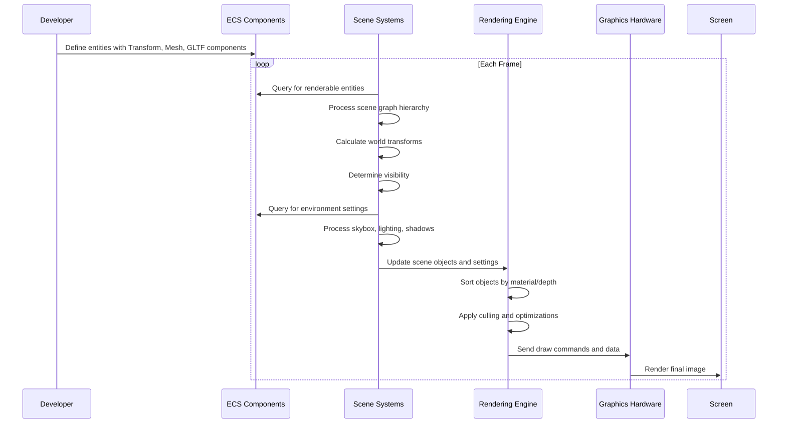

# Scene graph & rendering abstraction

## Overview

The Scene Graph & Rendering Abstraction system is responsible for organizing and visualizing 3D objects in the iR Engine. It provides a structured approach to defining spatial relationships between objects, their visual appearance, and how they are rendered on screen. By separating the logical structure of a scene from the rendering process, the system enables flexible, efficient, and visually compelling 3D environments. This chapter explores the concepts, structure, and implementation of the Scene Graph & Rendering Abstraction within the iR Engine.

## Scene graph

The scene graph is a hierarchical organization of entities in 3D space, defining parent-child relationships that determine how objects are positioned relative to one another.

### Transform component

At the core of the scene graph is the `TransformComponent`, which defines an entity's position, rotation, and scale:

```typescript
// Simplified concept of TransformComponent
const TransformComponent = defineComponent({
  name: 'TransformComponent',
  schema: S.Object({
    position: S.Object({
      x: S.Number({ default: 0 }),
      y: S.Number({ default: 0 }),
      z: S.Number({ default: 0 })
    }),
    rotation: S.Object({
      x: S.Number({ default: 0 }),
      y: S.Number({ default: 0 }),
      z: S.Number({ default: 0 })
    }),
    scale: S.Object({
      x: S.Number({ default: 1 }),
      y: S.Number({ default: 1 }),
      z: S.Number({ default: 1 })
    })
  })
});
```

The `TransformComponent` has several key characteristics:
- It defines an entity's position, rotation, and scale in 3D space
- For root entities (those without parents), these values are in world space
- For child entities, these values are relative to their parent's space
- Changes to a parent's transform cascade to all its children

### Parent-child relationships

Entities can form hierarchical relationships, creating a tree-like structure:

```typescript
// Example of creating a parent-child relationship
const parentEntity = createEntity();
const childEntity = createEntity();

// Set up the parent's transform
setComponent(parentEntity, TransformComponent, {
  position: { x: 10, y: 0, z: 0 }
});

// Set up the child's transform (relative to parent)
setComponent(childEntity, TransformComponent, {
  position: { x: 0, y: 5, z: 0 }
});

// Establish the parent-child relationship
setComponent(childEntity, ParentComponent, {
  parent: parentEntity
});
```

In this example:
- The parent entity is at position (10, 0, 0) in world space
- The child entity is at position (0, 5, 0) relative to its parent
- The child's actual world position is (10, 5, 0)
- If the parent moves to (20, 0, 0), the child automatically moves to (20, 5, 0)

This hierarchical structure is powerful for:
- Creating complex objects with multiple parts
- Animating articulated structures (like characters)
- Organizing scenes logically
- Efficiently transforming groups of objects

## Rendering components

While the scene graph defines spatial relationships, rendering components determine how entities appear visually.

### Mesh component

The `MeshComponent` defines an entity's visual appearance:

```typescript
// Simplified concept of MeshComponent
const MeshComponent = defineComponent({
  name: 'MeshComponent',
  schema: S.Object({
    geometryType: S.String(), // e.g., 'box', 'sphere', 'custom'
    geometryParameters: S.Object({}), // Parameters specific to the geometry type
    materialType: S.String(), // e.g., 'standard', 'basic', 'phong'
    materialProps: S.Object({}) // Material properties like color, roughness, etc.
  })
});
```

The `MeshComponent`:
- Specifies the shape (geometry) of the object
- Defines how the surface looks (material)
- Can reference simple built-in shapes or complex custom geometries
- Can use basic colors or detailed textures and material properties

### GLTF component

For complex models, the `GLTFComponent` provides a powerful way to load and display pre-built 3D assets:

```typescript
// Simplified concept of GLTFComponent
const GLTFComponent = defineComponent({
  name: 'GLTFComponent',
  schema: S.Object({
    src: S.String(), // Path to the .glb or .gltf file
    visible: S.Bool({ default: true }),
    castShadow: S.Bool({ default: true }),
    receiveShadow: S.Bool({ default: true })
  })
});
```

The `GLTFComponent`:
- References a GLTF/GLB file containing a 3D model
- Uses the Asset Management System to load the model
- Automatically creates child entities for each part of the model
- Sets up appropriate `TransformComponent` and `MeshComponent` instances
- Maintains the hierarchical structure defined in the GLTF file

### Object component

The `ObjectComponent` serves as a bridge between the ECS architecture and the underlying rendering system:

```typescript
// Simplified concept of ObjectComponent
const ObjectComponent = defineComponent({
  name: 'ObjectComponent',
  schema: S.Object({
    object: S.Any(), // Reference to the actual 3D object in the renderer
    visible: S.Bool({ default: true })
  })
});
```

The `ObjectComponent`:
- Is typically added automatically by systems like `SceneObjectSystem`
- Holds a reference to the actual 3D object in the rendering engine
- Allows systems to directly manipulate the renderer's objects
- Serves as a cache to avoid recreating objects unnecessarily

## Environment components

Beyond individual objects, the scene's overall environment significantly impacts visual quality and mood.

### Skybox component

The `SkyboxComponent` defines the background of the entire scene:

```typescript
// Simplified concept of SkyboxComponent
const SkyboxComponent = defineComponent({
  name: 'SkyboxComponent',
  schema: S.Object({
    backgroundType: S.Enum({
      NONE: 0,
      COLOR: 1,
      EQUIRECTANGULAR: 2,
      CUBEMAP: 3
    }),
    backgroundColor: S.Object({ /* RGB color */ }),
    equirectangularPath: S.String(),
    cubemapPaths: S.Object({ /* Paths for 6 sides */ })
  })
});
```

The `SkyboxComponent`:
- Creates the background environment for the entire scene
- Can use a simple color, a 360° panoramic image, or a cubemap
- Provides a sense of place and atmosphere
- Often serves as a source of ambient lighting

### Environment map component

The `EnvMapComponent` controls how objects reflect their surroundings:

```typescript
// Simplified concept of EnvMapComponent
const EnvMapComponent = defineComponent({
  name: 'EnvMapComponent',
  schema: S.Object({
    type: S.Enum({ /* Types of environment maps */ }),
    path: S.String(),
    intensity: S.Number({ default: 1.0 })
  })
});
```

The `EnvMapComponent`:
- Defines how reflective surfaces appear
- Makes materials like metal and glass look realistic
- Can use the skybox or a separate environment map
- Affects the overall lighting quality of the scene

### Shadow component

The `ShadowComponent` controls shadow casting and receiving:

```typescript
// Simplified concept of ShadowComponent
const ShadowComponent = defineComponent({
  name: 'ShadowComponent',
  schema: S.Object({
    cast: S.Bool({ default: true }),
    receive: S.Bool({ default: true })
  })
});
```

The `ShadowComponent`:
- Determines if an object casts shadows onto other objects
- Controls if an object receives shadows from other objects
- Significantly enhances visual realism and depth perception
- Can be applied to individual objects or entire hierarchies

## Rendering systems

Several systems work together to process these components and render the scene.

### Scene object system

The `SceneObjectSystem` is responsible for managing renderable objects:

```typescript
// Simplified concept of SceneObjectSystem
const SceneObjectSystem = defineSystem({
  uuid: 'ir-engine.SceneObjectSystem',
  execute: () => {
    // Find all entities with MeshComponent or GLTFComponent
    const renderableEntities = renderableQuery();
    
    for (const entity of renderableEntities) {
      // Get or create an ObjectComponent for this entity
      const objectComp = getOrCreateObjectComponent(entity);
      
      // Update the object's transform
      updateObjectTransform(entity, objectComp);
      
      // Update visibility, shadows, etc.
      updateObjectProperties(entity, objectComp);
    }
  }
});
```

The `SceneObjectSystem`:
- Processes entities with visual components
- Creates and updates `ObjectComponent` instances
- Calculates world transforms by traversing the scene graph
- Updates visibility and other rendering properties
- Bridges between the ECS and the rendering engine

### Environment system

The `EnvironmentSystem` manages scene-wide visual settings:

```typescript
// Simplified concept of EnvironmentSystem
const EnvironmentSystem = defineSystem({
  uuid: 'ir-engine.EnvironmentSystem',
  execute: () => {
    // Find entities with environment components
    const skyboxEntities = skyboxQuery();
    const envMapEntities = envMapQuery();
    
    // Apply skybox settings
    for (const entity of skyboxEntities) {
      const skybox = getComponent(entity, SkyboxComponent);
      applySkyboxToRenderer(skybox);
    }
    
    // Apply environment map settings
    for (const entity of envMapEntities) {
      const envMap = getComponent(entity, EnvMapComponent);
      applyEnvMapToRenderer(envMap);
    }
  }
});
```

The `EnvironmentSystem`:
- Processes entities with environment components
- Configures the renderer's global settings
- Sets up skyboxes, environment maps, and lighting
- Ensures consistent environment across the scene

## Practical example

Let's create a simple space scene with a spaceship, a planet, and a starry background:

```typescript
// Create the main scene entity
const sceneEntity = createEntity();

// Set up the starry background
setComponent(sceneEntity, SkyboxComponent, { 
  backgroundType: SkyTypeEnum.EQUIRECTANGULAR,
  equirectangularPath: "textures/starry_sky.ktx2"
});

// Create the spaceship entity
const spaceshipEntity = createEntity();

// Position the spaceship
setComponent(spaceshipEntity, TransformComponent, {
  position: { x: 0, y: 50, z: -100 },
  rotation: { x: 0, y: Math.PI / 4, z: 0 },
  scale: { x: 1, y: 1, z: 1 }
});

// Load the spaceship model
setComponent(spaceshipEntity, GLTFComponent, {
  src: "models/spaceship.glb",
  castShadow: true,
  receiveShadow: true
});

// Create the planet entity
const planetEntity = createEntity();

// Position the planet
setComponent(planetEntity, TransformComponent, {
  position: { x: 200, y: 0, z: -500 },
  scale: { x: 100, y: 100, z: 100 }
});

// Give the planet a visual appearance
setComponent(planetEntity, MeshComponent, {
  geometryType: 'sphere',
  materialProps: { 
    color: 'blue',
    roughness: 0.7,
    metalness: 0.2
  }
});

// Make the planet cast and receive shadows
setComponent(planetEntity, ShadowComponent, { 
  cast: true, 
  receive: true 
});

// Add a light source
const lightEntity = createEntity();
setComponent(lightEntity, TransformComponent, {
  position: { x: 500, y: 300, z: 0 }
});
setComponent(lightEntity, LightComponent, {
  type: 'directional',
  intensity: 1.5,
  castShadow: true
});
```

This example demonstrates:
1. Setting up a skybox for the background
2. Creating a spaceship using a GLTF model
3. Creating a planet using a basic sphere geometry
4. Adding shadows for realism
5. Including a light source to illuminate the scene

When the engine runs, the systems will:
1. Load the necessary assets (starry sky texture, spaceship model)
2. Process the scene graph to determine object positions
3. Set up the rendering environment (skybox, lighting)
4. Render the scene from the perspective of a camera

## Rendering pipeline

The rendering process follows a specific sequence:



This pipeline:
1. Starts with the ECS components that define the scene
2. Processes the scene graph to determine spatial relationships
3. Updates the renderer with the current scene state
4. Optimizes the rendering process
5. Sends commands to the GPU
6. Displays the final image on screen

## Benefits of the scene graph & rendering abstraction

The Scene Graph & Rendering Abstraction system provides several key benefits:

1. **Hierarchical organization**: The scene graph enables intuitive organization of complex scenes
2. **Relative positioning**: Parent-child relationships simplify positioning and animation
3. **Separation of concerns**: The ECS architecture separates spatial data from rendering logic
4. **Rendering abstraction**: The system hides the complexity of the underlying rendering engine
5. **Efficient updates**: Only changed components trigger updates to the rendering state
6. **Flexible environment**: Skyboxes, lighting, and shadows create visually rich environments

These benefits make the Scene Graph & Rendering Abstraction a powerful system for creating and visualizing 3D worlds in the iR Engine.

## Next steps

With an understanding of how objects are organized and rendered in the scene, the next chapter explores how characters and avatars are represented and animated.

Next: [Avatar system](04_avatar_system_.md)

---


