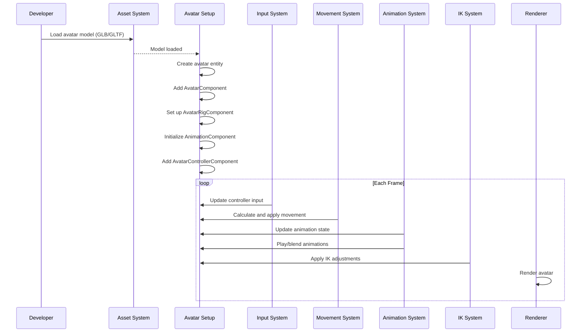

# Avatar system

## Overview

The Avatar System is responsible for creating and managing interactive characters within the iR Engine. It provides a comprehensive framework for defining character appearance, skeletal structure, animations, movement, and realistic behaviors.

By combining specialized components and systems, the Avatar System enables developers to create lifelike digital actors that can represent players or non-player characters (NPCs) in virtual environments. This chapter explores the concepts, structure, and implementation of the Avatar System within the iR Engine.

## Core components

### Avatar component

The `AvatarComponent` serves as the primary identifier for avatar entities and stores fundamental character properties:

```typescript
// Simplified from src/avatar/components/AvatarComponent.ts
import { defineComponent, S } from '@ir-engine/ecs';

export const AvatarComponent = defineComponent({
  name: 'AvatarComponent',
  schema: S.Object({
    avatarHeight: S.Number(), // Overall height of the avatar
    // Additional physical properties like torsoLength, eyeHeight, etc.
  })
});
```

This component:
- Marks an entity as an avatar
- Defines basic physical characteristics
- Provides reference values for animations and interactions
- Serves as a central point for avatar-specific data

### Rig component

The `AvatarRigComponent` defines the skeletal structure of the avatar:

```typescript
// Simplified from src/avatar/components/AvatarAnimationComponent.ts
import { defineComponent, S } from '@ir-engine/ecs';
// import { VRMHumanBoneName } from '../maps/VRMHumanBoneName';

export const AvatarRigComponent = defineComponent({
  name: 'AvatarRigComponent',
  schema: S.Object({
    // Maps standard bone names to entity IDs
    bonesToEntities: S.Record(S.String() /* VRMHumanBoneName */, S.Entity()),
    // Additional rig data for animation retargeting
  })
});
```

This component:
- Maps standardized bone names (e.g., "hips", "leftHand", "head") to actual bone entities
- Enables animation systems to find and manipulate specific body parts
- Provides a consistent interface regardless of the original model's bone naming
- Supports animation retargeting between different character models

### Animation components

Two components work together to manage avatar animations:

```typescript
// Simplified from src/avatar/components/AnimationComponent.ts
import { defineComponent, S } from '@ir-engine/ecs';
// import { AnimationMixer, AnimationClip } from 'three';

export const AnimationComponent = defineComponent({
  name: 'AnimationComponent',
  schema: S.Object({
    mixer: S.Type<any /* AnimationMixer */>(),
    animations: S.Array(S.Type<any /* AnimationClip */>())
  })
});

// Simplified from src/avatar/components/AvatarAnimationComponent.ts
export const AvatarAnimationComponent = defineComponent({
  name: 'AvatarAnimationComponent',
  schema: S.Object({
    animationGraph: S.Object({
      // Animation state machine properties
    }),
    locomotion: S.Object({
      x: S.Number({ default: 0 }),
      y: S.Number({ default: 0 }),
      z: S.Number({ default: 0 })
    })
  })
});
```

These components work together:
- `AnimationComponent` stores the raw animation data and the mixer that plays them
- `AvatarAnimationComponent` manages the animation state and blending logic
- The locomotion values drive movement-related animations
- The animation graph determines which animations play and how they blend

### Controller component

The `AvatarControllerComponent` manages movement intent and control state:

```typescript
// Simplified from src/avatar/components/AvatarControllerComponent.ts
import { defineComponent, S } from '@ir-engine/ecs';

export const AvatarControllerComponent = defineComponent({
  name: 'AvatarControllerComponent',
  schema: S.Object({
    cameraEntity: S.Entity(), // Camera associated with this avatar
    isJumping: S.Bool({ default: false }),
    isWalking: S.Bool({ default: false }),
    gamepadLocalInput: S.Object({
      x: S.Number({ default: 0 }),
      y: S.Number({ default: 0 }),
      z: S.Number({ default: 0 })
    })
  })
});
```

This component:
- Stores the player's input or AI's movement intent
- Tracks movement states like jumping or walking
- Links to the camera entity for view-relative movement
- Provides input values that drive both movement and animations

### Inverse kinematics components

For realistic limb positioning, the Avatar System includes inverse kinematics (IK) components:

```typescript
// Simplified from src/avatar/components/AvatarIKComponents.ts
import { defineComponent, S } from '@ir-engine/ecs';

export const AvatarIKComponent = defineComponent({
  name: 'AvatarIKComponent',
  schema: S.Object({
    enabled: S.Bool({ default: true }),
    // IK settings and parameters
  })
});

export const AvatarIKTargetComponent = defineComponent({
  name: 'AvatarIKTargetComponent',
  schema: S.Object({
    targetType: S.String(), // e.g., "leftFoot", "rightHand"
    weight: S.Number({ default: 1.0 })
  })
});
```

These components:
- Enable precise positioning of limbs (e.g., feet on uneven ground, hands on objects)
- Define target positions for specific body parts
- Control the influence of IK on the final pose
- Allow for dynamic adjustment of limb positions based on the environment

## Avatar systems

Several systems work together to process these components and bring avatars to life.

### Animation system

The `AvatarAnimationSystem` manages the playback and blending of animations:

```typescript
// Simplified concept from src/avatar/systems/AvatarAnimationSystem.tsx
const AvatarAnimationSystem = defineSystem({
  uuid: 'ir-engine.AvatarAnimationSystem',
  execute: (deltaSeconds) => {
    // Find all entities with animation components
    const entities = avatarAnimationQuery();

    for (const entity of entities) {
      // Get the animation state and mixer
      const animState = getComponent(entity, AvatarAnimationComponent);
      const animComp = getComponent(entity, AnimationComponent);

      // Update animation state based on movement
      updateAnimationState(entity, animState);

      // Update the animation graph (play/blend animations)
      updateAnimationGraph(entity, deltaSeconds, animComp.mixer, animState);

      // Update the animation mixer
      animComp.mixer.update(deltaSeconds);
    }
  }
});
```

This system:
- Processes all entities with avatar animation components
- Updates animation states based on movement and actions
- Manages the animation graph to determine which animations play
- Updates the animation mixer to advance the animations
- Ensures smooth blending between different animations

### Movement system

The `AvatarMovementSystem` handles avatar locomotion:

```typescript
// Simplified concept from src/avatar/systems/AvatarMovementSystem.ts
const AvatarMovementSystem = defineSystem({
  uuid: 'ir-engine.AvatarMovementSystem',
  execute: (deltaSeconds) => {
    // Find all entities with controller components
    const entities = avatarControllerQuery();

    for (const entity of entities) {
      // Get the controller and transform components
      const controller = getComponent(entity, AvatarControllerComponent);
      const transform = getMutableComponent(entity, TransformComponent);

      // Calculate movement based on input
      const movement = calculateMovement(entity, controller, deltaSeconds);

      // Apply physics (gravity, collisions, etc.)
      const finalMovement = applyPhysics(entity, movement);

      // Update the avatar's position
      transform.position.x += finalMovement.x;
      transform.position.y += finalMovement.y;
      transform.position.z += finalMovement.z;

      // Update rotation to face movement direction
      if (finalMovement.lengthSquared() > 0) {
        transform.rotation = calculateFacingRotation(finalMovement);
      }
    }
  }
});
```

This system:
- Processes all entities with avatar controller components
- Translates input values into movement vectors
- Applies physics constraints like gravity and collisions
- Updates the avatar's position and rotation
- Ensures realistic movement behavior

### Inverse kinematics system

The `AvatarIKSystem` adjusts limb positions for realistic interactions:

```typescript
// Simplified concept from src/avatar/systems/AvatarIKSystem.tsx
const AvatarIKSystem = defineSystem({
  uuid: 'ir-engine.AvatarIKSystem',
  execute: () => {
    // Find all entities with IK components
    const entities = avatarIKQuery();

    for (const entity of entities) {
      // Get the rig component
      const rig = getComponent(entity, AvatarRigComponent);

      // Process foot IK for ground adaptation
      processFootIK(entity, rig);

      // Process hand IK for object interaction
      processHandIK(entity, rig);

      // Process look-at IK for head tracking
      processLookAtIK(entity, rig);
    }
  }
});
```

This system:
- Processes all entities with avatar IK components
- Adjusts foot positions to match the ground surface
- Positions hands to interact with objects
- Orients the head to look at points of interest
- Applies these adjustments after standard animations

## Avatar workflow

The process of creating and animating an avatar follows this general workflow:



This diagram illustrates:
1. The initial setup phase where the avatar is created and configured
2. The per-frame update cycle that processes input, movement, animations, and IK
3. The flow of data between different systems that bring the avatar to life

## Practical example

Let's create a simple character that can walk and wave:

```typescript
// Create an entity for our avatar
const characterEntity = createEntity();

// Add the basic avatar component
setComponent(characterEntity, AvatarComponent, {
  avatarHeight: 1.8 // 1.8 meters tall
});

// Load the 3D model using GLTFComponent
setComponent(characterEntity, GLTFComponent, {
  src: "models/character.glb",
  castShadow: true,
  receiveShadow: true
});

// Add controller component for movement
setComponent(characterEntity, AvatarControllerComponent, {
  cameraEntity: mainCameraEntity,
  isJumping: false,
  isWalking: false,
  gamepadLocalInput: { x: 0, y: 0, z: 0 }
});

// The following components would typically be added automatically
// by systems after the model is loaded:
// - AvatarRigComponent (set up by analyzing the model's skeleton)
// - AnimationComponent (populated with animations from the model)
// - AvatarAnimationComponent (initialized with default state)

// To make the character walk forward:
function moveCharacterForward() {
  const controller = getMutableComponent(characterEntity, AvatarControllerComponent);
  controller.gamepadLocalInput.z = 1; // Forward movement
  controller.isWalking = true;
}

// To make the character wave:
function makeCharacterWave() {
  // This is simplified; real systems use animation graphs/layers
  const animState = getMutableComponent(characterEntity, AvatarAnimationComponent);
  animState.playEmote = "wave";
}
```

This example demonstrates:
1. Creating an avatar entity with basic components
2. Loading a character model with the GLTFComponent
3. Setting up controller input for movement
4. Triggering walking and waving animations

## Implementation details

### Rig setup

When a model is loaded, the system analyzes its skeleton to set up the rig:

```typescript
// Simplified concept from src/avatar/components/AvatarAnimationComponent.ts
function setupAvatarRig(avatarEntity, gltfModel) {
  // Create a new rig component
  setComponent(avatarEntity, AvatarRigComponent, {
    bonesToEntities: {}
  });

  // Get the rig component for updating
  const rig = getMutableComponent(avatarEntity, AvatarRigComponent);

  // Iterate through the model's bones
  for (const node of gltfModel.nodes) {
    if (node.isBone) {
      // Try to match the bone name to a standard name
      const standardBoneName = mapBoneNameToStandard(node.name);

      if (standardBoneName) {
        // Map the standard bone name to this bone entity
        rig.bonesToEntities[standardBoneName] = node.entity;
      }
    }
  }
}
```

This function:
- Creates an AvatarRigComponent for the avatar
- Analyzes the loaded model's skeleton
- Maps bone names to standardized names (e.g., "mixamo_leftArm" → "leftUpperArm")
- Builds a dictionary of bone entities for animation and IK systems

### Animation graph

The animation system uses an animation graph to manage animation states:

```typescript
// Simplified concept from src/avatar/animation/AvatarAnimationGraph.ts
function updateAnimationGraph(entity, deltaSeconds, mixer, animState) {
  // Get the current locomotion values
  const { x, y, z } = animState.locomotion;
  const speed = Math.sqrt(x*x + y*y + z*z);

  // Determine which animation to play based on speed
  if (speed < 0.1) {
    // Play idle animation
    playAnimation(mixer, "idle", 1.0);
    fadeOutAnimation(mixer, "walk");
  } else {
    // Play walk animation with intensity based on speed
    playAnimation(mixer, "walk", 1.0, speed);
    fadeOutAnimation(mixer, "idle");
  }

  // Handle emote animations (like waving)
  if (animState.playEmote) {
    playAnimation(mixer, animState.playEmote, 1.0);
    // Clear the emote after starting it
    animState.playEmote = null;
  }
}
```

This function:
- Analyzes the current movement state
- Determines which animations should play
- Manages blending between different animations
- Handles special animations like emotes

### Inverse kinematics

The IK system adjusts limb positions for realistic interactions:

```typescript
// Simplified concept from src/avatar/animation/TwoBoneIKSolver.ts
function solveTwoBoneIK(rootMatrix, upperBone, lowerBone, endBone, targetPosition, poleVector) {
  // Calculate the total chain length
  const upperLength = upperBone.length;
  const lowerLength = lowerBone.length;
  const totalLength = upperLength + lowerLength;

  // Get the root position
  const rootPosition = new Vector3().setFromMatrixPosition(rootMatrix);

  // Calculate the direction to the target
  const targetDirection = new Vector3().subVectors(targetPosition, rootPosition).normalize();

  // Calculate the distance to the target
  const targetDistance = rootPosition.distanceTo(targetPosition);

  // If the target is too far, extend the limb as far as possible
  if (targetDistance > totalLength) {
    // Fully extend the limb toward the target
    upperBone.quaternion.setFromUnitVectors(new Vector3(1, 0, 0), targetDirection);
    lowerBone.quaternion.set(0, 0, 0, 1); // No bend
  } else {
    // Calculate the angles using the law of cosines
    const upperAngle = Math.acos(
      (targetDistance*targetDistance + upperLength*upperLength - lowerLength*lowerLength) /
      (2 * targetDistance * upperLength)
    );
    const lowerAngle = Math.acos(
      (upperLength*upperLength + lowerLength*lowerLength - targetDistance*targetDistance) /
      (2 * upperLength * lowerLength)
    );

    // Apply the calculated angles to the bones
    // (Simplified - actual implementation would use quaternions and pole vectors)
    upperBone.rotation.y = upperAngle;
    lowerBone.rotation.y = Math.PI - lowerAngle;
  }
}
```

This function:
- Implements a two-bone IK solver (e.g., for arms or legs)
- Calculates the appropriate angles to reach a target position
- Handles cases where the target is beyond reach
- Applies the calculated rotations to the bones

## Benefits of the avatar system

The Avatar System provides several key benefits:

1. **Modular design**: Components can be added or removed to create different types of avatars
2. **Animation flexibility**: The animation graph enables complex blending and transitions
3. **Realistic movement**: IK systems ensure natural limb positioning and ground adaptation
4. **Standardized interface**: The rig component provides a consistent way to work with different models
5. **Separation of concerns**: Different systems handle specific aspects of avatar behavior
6. **Extensibility**: New components and systems can be added to enhance avatar capabilities

These benefits make the Avatar System a powerful tool for creating lifelike characters in virtual environments.

## Next steps

With an understanding of how characters are represented and animated, the next chapter explores how they interact with the world around them.

Next: [Interaction system](05_interaction_system_.md)

---


