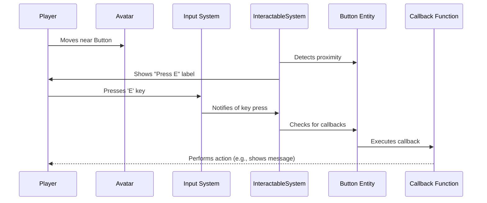

# Interaction system

## Overview

The Interaction System enables entities in the iR Engine to respond to user actions and interact with each other. It provides a framework for creating interactive objects that can be clicked, grabbed, mounted, or otherwise manipulated by avatars or other entities.

By defining how objects respond to proximity, input, and other triggers, the system creates a responsive and engaging virtual environment. This chapter explores the concepts, structure, and implementation of the Interaction System within the iR Engine.

## Core components

### Interactable component

The `InteractableComponent` is the foundation for making objects responsive to user actions:

```typescript
// Simplified from src/interaction/components/InteractableComponent.ts
import { defineComponent, S } from '@ir-engine/ecs';

export const InteractableComponent = defineComponent({
  name: 'InteractableComponent',
  schema: S.Object({
    label: S.String(), // Text to display (e.g., "Press E")
    activationDistance: S.Number({ default: 2 }), // How close the avatar needs to be
    clickInteract: S.Bool({ default: true }), // Can be activated by clicking/key press
    callbacks: S.Array(S.Object({
      callbackID: S.String(), // ID of the callback function
      target: S.Entity() // Entity where the callback is defined
    }))
  })
});
```

This component:
- Marks an entity as interactive
- Defines a label to display when an avatar is nearby
- Specifies the distance at which interaction becomes available
- Determines whether the object can be activated by clicking or key press
- Lists callback functions to execute when interaction occurs

### Grabbable component

The `GrabbableComponent` enables objects to be picked up and held:

```typescript
// Simplified from src/grabbable/GrabbableComponent.ts
import { defineComponent, S } from '@ir-engine/ecs';

export const GrabbableComponent = defineComponent({
  name: 'GrabbableComponent',
  schema: S.Object({
    grabDistance: S.Number({ default: 1 }), // Maximum distance for grabbing
    attachmentOffset: S.Object({ // Position offset when grabbed
      x: S.Number({ default: 0 }),
      y: S.Number({ default: 0 }),
      z: S.Number({ default: 0 })
    }),
    throwVelocityMultiplier: S.Number({ default: 1 }) // Affects throw strength
  })
});

// Added when an object is currently being grabbed
export const GrabbedComponent = defineComponent({
  name: 'GrabbedComponent',
  schema: S.Object({
    grabberEntity: S.Entity(), // Entity doing the grabbing
    attachmentPoint: S.String() // e.g., "leftHand" or "rightHand"
  })
});
```

These components:
- Mark an entity as something that can be picked up
- Define how the object behaves when grabbed
- Track which entity is currently holding the object
- Specify where the object attaches to the grabber

### Mount point component

The `MountPointComponent` creates attachment points for avatars or other entities:

```typescript
// Simplified from src/scene/components/MountPointComponent.ts
import { defineComponent, S } from '@ir-engine/ecs';

export const MountPointComponent = defineComponent({
  name: 'MountPointComponent',
  schema: S.Object({
    type: S.String(), // e.g., "seat", "driver", "passenger"
    offset: S.Object({ // Position offset for the mounted entity
      x: S.Number({ default: 0 }),
      y: S.Number({ default: 0 }),
      z: S.Number({ default: 0 })
    }),
    rotation: S.Object({ // Rotation for the mounted entity
      x: S.Number({ default: 0 }),
      y: S.Number({ default: 0 }),
      z: S.Number({ default: 0 })
    }),
    animation: S.String({ default: "" }) // Animation to play when mounted
  })
});

// Added to an entity that is currently mounted
export const SittingComponent = defineComponent({
  name: 'SittingComponent',
  schema: S.Object({
    mountPointEntity: S.Entity() // Entity with the MountPointComponent
  })
});
```

These components:
- Define locations where entities can attach (like seats in a vehicle)
- Specify the position and orientation for mounted entities
- Indicate which animation to play when mounted
- Track which entities are currently mounted

### Callback component

The `CallbackComponent` defines functions that execute when interactions occur:

```typescript
// Simplified from src/spatial/src/common/CallbackComponent.ts
import { defineComponent, S } from '@ir-engine/ecs';

export const CallbackComponent = defineComponent({
  name: 'CallbackComponent',
  schema: S.Object({
    callbacks: S.Record(S.String(), S.Function())
  })
});

// Helper function to set a callback
export function setCallback(entity, callbackID, callbackFunction) {
  const callbacks = getComponent(entity, CallbackComponent)?.callbacks || {};
  callbacks[callbackID] = callbackFunction;
  setComponent(entity, CallbackComponent, { callbacks });
}
```

This component:
- Stores callback functions by ID
- Allows entities to define custom behavior for interactions
- Provides a way to register, update, and execute callbacks

## Interaction systems

Several systems work together to process these components and enable interactions.

### Interactable system

The `InteractableSystem` manages proximity detection and interaction triggering:

```typescript
// Simplified concept from src/interaction/systems/InteractableSystem.ts
const InteractableSystem = defineSystem({
  uuid: 'ir-engine.InteractableSystem',
  execute: () => {
    // Find all entities with InteractableComponent
    const interactables = interactableQuery();

    // Find the local avatar entity
    const avatarEntity = getLocalAvatarEntity();
    if (!avatarEntity) return;

    // Get the avatar's position
    const avatarPosition = getComponent(avatarEntity, TransformComponent).position;

    // Process each interactable
    for (const entity of interactables) {
      const interactable = getComponent(entity, InteractableComponent);
      const transform = getComponent(entity, TransformComponent);

      // Calculate distance to avatar
      const distance = calculateDistance(avatarPosition, transform.position);

      // Check if within activation distance
      if (distance <= interactable.activationDistance) {
        // Show interaction label
        showInteractionLabel(entity, interactable.label);

        // Check for interaction input
        if (interactable.clickInteract && isInteractKeyPressed()) {
          // Execute callbacks
          executeInteractionCallbacks(avatarEntity, entity, interactable.callbacks);
        }
      } else {
        // Hide interaction label
        hideInteractionLabel(entity);
      }
    }
  }
});
```

This system:
- Processes all entities with `InteractableComponent`
- Calculates distances between the avatar and interactable objects
- Shows or hides interaction labels based on proximity
- Detects interaction input (like key presses)
- Executes callback functions when interaction occurs

### Grabbable system

The `GrabbableSystem` handles object grabbing and manipulation:

```typescript
// Simplified concept from src/grabbable/GrabbableSystem.tsx
const GrabbableSystem = defineSystem({
  uuid: 'ir-engine.GrabbableSystem',
  execute: () => {
    // Find all entities that are currently grabbed
    const grabbedEntities = grabbedQuery();

    for (const entity of grabbedEntities) {
      const grabbed = getComponent(entity, GrabbedComponent);
      const grabber = grabbed.grabberEntity;

      // Get the attachment point (hand) transform
      const attachmentPoint = getAttachmentPointTransform(grabber, grabbed.attachmentPoint);
      if (!attachmentPoint) continue;

      // Update the grabbed object's transform to follow the hand
      const transform = getMutableComponent(entity, TransformComponent);
      transform.position = calculateGrabbedPosition(attachmentPoint, entity);
      transform.rotation = calculateGrabbedRotation(attachmentPoint, entity);

      // If the object has physics, update its kinematic target
      if (hasComponent(entity, RigidBodyComponent)) {
        const rigidBody = getMutableComponent(entity, RigidBodyComponent);
        rigidBody.targetKinematicPosition = transform.position;
        rigidBody.targetKinematicRotation = transform.rotation;
      }
    }

    // Check for grab/release input
    if (isGrabInputPressed()) {
      const avatarEntity = getLocalAvatarEntity();
      const nearbyGrabbable = findNearestGrabbable(avatarEntity);

      if (nearbyGrabbable) {
        // Grab the object
        GrabbableComponent.grab(avatarEntity, nearbyGrabbable);
      }
    }

    if (isReleaseInputPressed()) {
      const avatarEntity = getLocalAvatarEntity();
      const heldObject = getHeldObject(avatarEntity);

      if (heldObject) {
        // Release the object
        GrabbableComponent.drop(avatarEntity, heldObject);
      }
    }
  }
});
```

This system:
- Updates the position and rotation of grabbed objects to follow the grabber's hand
- Handles physics interactions for grabbed objects
- Detects grab and release input
- Initiates grab and drop actions

### Mount point system

The `MountPointSystem` manages entity mounting and dismounting:

```typescript
// Simplified concept from src/interaction/systems/MountPointSystem.ts
const MountPointSystem = defineSystem({
  uuid: 'ir-engine.MountPointSystem',
  execute: () => {
    // Find all entities that are currently mounted/sitting
    const sittingEntities = sittingQuery();

    for (const entity of sittingEntities) {
      const sitting = getComponent(entity, SittingComponent);
      const mountPoint = getComponent(sitting.mountPointEntity, MountPointComponent);

      // Get the mount point's transform
      const mountTransform = getComponent(sitting.mountPointEntity, TransformComponent);

      // Update the mounted entity's transform
      const transform = getMutableComponent(entity, TransformComponent);
      transform.position = calculateMountedPosition(mountTransform, mountPoint);
      transform.rotation = calculateMountedRotation(mountTransform, mountPoint);

      // Check for dismount input
      if (isDismountInputPressed(entity)) {
        // Unmount the entity
        MountPointComponent.unmountEntity(entity);
      }
    }
  }
});
```

This system:
- Updates the position and rotation of mounted entities
- Aligns entities with their mount points
- Detects dismount input
- Initiates unmounting actions

## Interaction workflow

The process of interaction follows this general workflow:



This diagram illustrates:
1. The proximity detection that triggers UI feedback
2. The input detection that initiates interaction
3. The callback execution that performs the actual action
4. The feedback loop that informs the player of the result

## Practical example

Let's create a simple interactive button that displays a message when pressed:

```typescript
// Create an entity for the button
const buttonEntity = createEntity();

// Add visual components
setComponent(buttonEntity, TransformComponent, {
  position: { x: 0, y: 1, z: -2 },
  rotation: { x: 0, y: 0, z: 0 },
  scale: { x: 0.2, y: 0.2, z: 0.05 }
});

setComponent(buttonEntity, MeshComponent, {
  geometryType: 'box',
  materialProps: { color: 'red' }
});

// Make the button interactable
setComponent(buttonEntity, InteractableComponent, {
  label: "Press E to activate",
  activationDistance: 2,
  clickInteract: true,
  callbacks: [
    { callbackID: "showMessageCallback", target: buttonEntity }
  ]
});

// Define the callback function
setCallback(buttonEntity, "showMessageCallback", (interactingEntity, targetEntity) => {
  console.log("Button Activated! You pressed it!");
  // In a real application, this could:
  // - Open a door
  // - Play a sound
  // - Change a game state
  // - Trigger an animation
});
```

This example demonstrates:
1. Creating a button entity with visual representation
2. Making it interactable with a label and activation distance
3. Defining a callback function that executes when the button is pressed

## Additional interaction examples

### Grabbable object

Creating an object that can be picked up and held:

```typescript
// Create an entity for a grabbable box
const boxEntity = createEntity();

// Add visual components
setComponent(boxEntity, TransformComponent, {
  position: { x: 1, y: 1, z: -2 },
  rotation: { x: 0, y: 0, z: 0 },
  scale: { x: 0.2, y: 0.2, z: 0.2 }
});

setComponent(boxEntity, MeshComponent, {
  geometryType: 'box',
  materialProps: { color: 'blue' }
});

// Add physics for realistic behavior
setComponent(boxEntity, RigidBodyComponent, {
  type: 'dynamic',
  mass: 1
});

// Make the box grabbable
setComponent(boxEntity, GrabbableComponent, {
  grabDistance: 1.5,
  throwVelocityMultiplier: 1.5
});

// Optional: Add a callback for when the box is grabbed
setCallback(boxEntity, GrabbableComponent.grabbableCallbackName, (grabber, grabbedItem) => {
  console.log("Box grabbed by:", grabber);
  // Could trigger a sound, particle effect, etc.
});
```

This example shows:
1. Creating a box entity with visual and physics components
2. Making it grabbable with specific grab distance and throw properties
3. Adding a callback that executes when the box is grabbed

### Mountable chair

Creating a chair that an avatar can sit on:

```typescript
// Create an entity for a chair
const chairEntity = createEntity();

// Add visual components
setComponent(chairEntity, TransformComponent, {
  position: { x: -1, y: 0, z: -2 },
  rotation: { x: 0, y: 0, z: 0 },
  scale: { x: 1, y: 1, z: 1 }
});

setComponent(chairEntity, GLTFComponent, {
  src: "models/chair.glb"
});

// Add a mount point for sitting
setComponent(chairEntity, MountPointComponent, {
  type: "seat",
  offset: { x: 0, y: 0.5, z: 0 },
  rotation: { x: 0, y: 0, z: 0 },
  animation: "sitting"
});

// Make the chair interactable to initiate sitting
setComponent(chairEntity, InteractableComponent, {
  label: "Sit",
  activationDistance: 2,
  clickInteract: true,
  callbacks: [
    { callbackID: MountPointComponent.mountCallbackName, target: chairEntity }
  ]
});
```

This example demonstrates:
1. Creating a chair entity with a 3D model
2. Adding a mount point that defines where and how an avatar sits
3. Making the chair interactable to trigger the mounting action

## Implementation details

### Interactable detection

The `InteractableSystem` uses several methods to detect potential interactions:

```typescript
// Simplified concept from src/interaction/functions/interactableFunctions.ts
function gatherAvailableInteractables(interactables) {
  const result = [];
  const avatarEntity = getLocalAvatarEntity();
  if (!avatarEntity) return result;

  const avatarPosition = getComponent(avatarEntity, TransformComponent).position;

  // Process each interactable
  for (const entity of interactables) {
    const interactable = getComponent(entity, InteractableComponent);
    const transform = getComponent(entity, TransformComponent);

    // Calculate distance to avatar
    const distance = calculateDistance(avatarPosition, transform.position);

    // Check if within activation distance
    if (distance <= interactable.activationDistance) {
      result.push({
        entity,
        distance,
        interactable
      });
    }
  }

  // Sort by distance (closest first)
  result.sort((a, b) => a.distance - b.distance);

  return result;
}
```

This function:
- Collects all interactable entities within activation distance of the avatar
- Calculates the distance to each interactable
- Sorts them by distance to prioritize closer interactions
- Returns a list of potential interactions

### Callback execution

When an interaction occurs, the system executes the appropriate callbacks:

```typescript
// Simplified concept
function executeInteractionCallbacks(interactingEntity, targetEntity, callbacks) {
  for (const callback of callbacks) {
    const { callbackID, target } = callback;

    // Get the callback component from the target entity
    const callbackComponent = getComponent(target, CallbackComponent);
    if (!callbackComponent) continue;

    // Get the callback function
    const callbackFunction = callbackComponent.callbacks[callbackID];
    if (!callbackFunction) continue;

    // Execute the callback
    callbackFunction(interactingEntity, targetEntity);
  }
}
```

This function:
- Processes each callback defined in the interaction
- Retrieves the callback function from the target entity
- Executes the function with the interacting and target entities as parameters

### Grab mechanics

The `GrabbableComponent` provides static methods for grabbing and dropping objects:

```typescript
// Simplified from src/grabbable/GrabbableComponent.ts
GrabbableComponent.grab = (grabberEntity, grabbableEntity, handedness) => {
  // Validate entities have the required components
  if (!hasComponent(grabberEntity, GrabberComponent) ||
      !hasComponent(grabbableEntity, GrabbableComponent)) {
    return;
  }

  // Dispatch a network action to ensure consistency across clients
  dispatchAction(
    GrabbableNetworkAction.setGrabbedObject({
      entityUUID: getEntityUUID(grabbableEntity),
      grabberEntityUUID: getEntityUUID(grabberEntity),
      grabbed: true,
      attachmentPoint: handedness // 'left' or 'right' hand
    })
  );
};

GrabbableComponent.drop = (grabberEntity, grabbableEntity) => {
  // Similar validation

  // Dispatch a network action to release the object
  dispatchAction(
    GrabbableNetworkAction.setGrabbedObject({
      entityUUID: getEntityUUID(grabbableEntity),
      grabberEntityUUID: getEntityUUID(grabberEntity),
      grabbed: false
    })
  );
};
```

These methods:
- Validate that the entities have the required components
- Dispatch network actions to ensure consistency across clients
- Trigger the actual grab or drop operation

## Benefits of the interaction system

The Interaction System provides several key benefits:

1. **Modularity**: Components can be mixed and matched to create different types of interactions
2. **Flexibility**: Callbacks allow for custom behavior without modifying the core system
3. **Consistency**: Standard interaction patterns create a predictable user experience
4. **Extensibility**: New interaction types can be added by creating new components and systems
5. **Feedback**: Visual and audio cues help users understand available interactions
6. **Networking**: Actions can be synchronized across clients for multiplayer experiences

These benefits make the Interaction System a powerful tool for creating engaging and responsive virtual environments.

## Next steps

With an understanding of how entities can interact with each other, the next chapter explores how to create complex behaviors and game logic without writing extensive code.

Next: [Visual scripting system](06_visual_scripting_system_.md)

---


