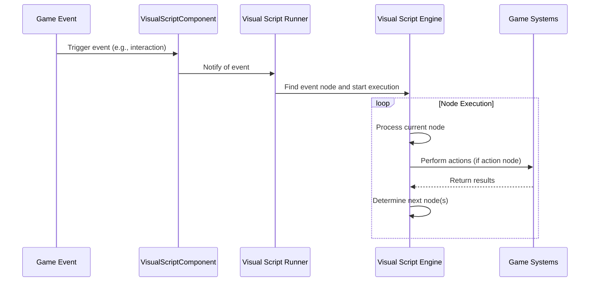

# Visual scripting system

## Overview

The Visual Scripting System provides a graphical programming interface for creating interactive behaviors in the iR Engine without writing traditional code. It enables developers, designers, and artists to build complex logic by connecting visual nodes in a graph-based editor. By representing programming concepts as visual elements, the system makes game logic more accessible and easier to understand. This chapter explores the concepts, structure, and implementation of the Visual Scripting System within the iR Engine.

## Core concepts

### Visual scripting fundamentals

Visual scripting is a programming paradigm that uses graphical elements instead of text-based code:

- **Nodes**: Visual blocks that represent specific functions, events, data, or operations
- **Connections**: Lines (or "wires") that connect nodes to define execution flow and data flow
- **Execution flow**: Determines the sequence in which nodes are processed
- **Data flow**: Defines how information passes between nodes

This approach offers several advantages:
- Makes programming more accessible to non-programmers
- Provides visual clarity for complex logic flows
- Enables rapid prototyping and iteration
- Reduces syntax errors common in text-based programming

### Visual script component

The `VisualScriptComponent` serves as the container for visual scripts attached to entities:

```typescript
// Simplified from src/visualscript/components/VisualScriptComponent.tsx
import { defineComponent, S } from '@ir-engine/ecs';

export const VisualScriptComponent = defineComponent({
  name: 'VisualScriptComponent',
  schema: S.Object({
    visualScript: S.Object({}), // The script graph data (JSON)
    run: S.Bool({ default: true }), // Is the script currently running?
    disabled: S.Bool({ default: false }) // Is the script temporarily disabled?
  })
});
```

This component:
- Stores the complete visual script graph as a JSON structure
- Controls whether the script is currently active
- Provides a way to temporarily disable the script without removing it
- Serves as the entry point for the visual script execution system

### Node types

Visual scripts are composed of different types of nodes, each serving a specific purpose:

#### Event nodes

Event nodes serve as entry points for script execution:

```typescript
// Conceptual example of an event node definition
const OnInteractEventNode = {
  type: 'OnInteract',
  category: 'Events',
  outputs: [
    { name: 'exec', type: 'execution' }, // Execution output
    { name: 'interactingEntity', type: 'entity' } // Data output
  ],
  // Internal implementation that connects to the interaction system
  onEvent: (entity, interactingEntity) => {
    // Trigger execution flow starting from this node
    return { interactingEntity };
  }
};
```

Event nodes:
- Respond to specific game events (e.g., interaction, collision, timer)
- Provide the starting point for execution flow
- Often output relevant data about the event (e.g., the entity that triggered it)
- Connect to system events from other parts of the engine

#### Action nodes

Action nodes perform operations that affect the game world:

```typescript
// Conceptual example of an action node definition
const SetMaterialColorNode = {
  type: 'SetMaterialColor',
  category: 'Rendering',
  inputs: [
    { name: 'exec', type: 'execution' }, // Execution input
    { name: 'entity', type: 'entity', defaultValue: 'self' }, // Target entity
    { name: 'color', type: 'color' } // Color value
  ],
  outputs: [
    { name: 'exec', type: 'execution' } // Execution output
  ],
  // Internal implementation
  execute: (inputs) => {
    const { entity, color } = inputs;
    // Get the material component
    const material = getComponent(entity, MaterialComponent);
    if (material) {
      // Update the color
      setComponent(entity, MaterialComponent, {
        ...material,
        color: color
      });
    }
    // Continue execution flow
    return {};
  }
};
```

Action nodes:
- Perform specific operations when executed
- Take input data to configure their behavior
- Often modify component data or trigger engine functions
- Continue the execution flow to the next node

#### Data nodes

Data nodes provide values to other nodes:

```typescript
// Conceptual example of a data node definition
const ColorValueNode = {
  type: 'Color',
  category: 'Values',
  inputs: [
    { name: 'r', type: 'number', defaultValue: 1.0 },
    { name: 'g', type: 'number', defaultValue: 0.0 },
    { name: 'b', type: 'number', defaultValue: 0.0 },
    { name: 'a', type: 'number', defaultValue: 1.0 }
  ],
  outputs: [
    { name: 'color', type: 'color' } // Data output
  ],
  // Internal implementation
  getValue: (inputs) => {
    const { r, g, b, a } = inputs;
    return { color: { r, g, b, a } };
  }
};
```

Data nodes:
- Provide constant values or computed data
- Can take inputs to calculate their output values
- Connect to input pins of action or logic nodes
- Do not participate in execution flow, only data flow

#### Flow control nodes

Flow control nodes manage the execution path:

```typescript
// Conceptual example of a flow control node definition
const BranchNode = {
  type: 'Branch',
  category: 'Flow',
  inputs: [
    { name: 'exec', type: 'execution' }, // Execution input
    { name: 'condition', type: 'boolean' } // Condition value
  ],
  outputs: [
    { name: 'true', type: 'execution' }, // Execution output if condition is true
    { name: 'false', type: 'execution' } // Execution output if condition is false
  ],
  // Internal implementation
  execute: (inputs) => {
    const { condition } = inputs;
    // Determine which execution path to follow
    return { outputExec: condition ? 'true' : 'false' };
  }
};
```

Flow control nodes:
- Control the path of execution based on conditions
- Include branches, loops, sequences, and delays
- Often take data inputs to determine flow decisions
- Direct execution to different output pins based on logic

## Visual script execution

The process of executing a visual script involves several components working together:

### Visual script system

The `VisualScriptSystem` initializes and manages the visual scripting environment:

```typescript
// Simplified concept from src/visualscript/systems/VisualScriptSystem.ts
const VisualScriptSystem = defineSystem({
  uuid: 'ir-engine.VisualScriptSystem',
  execute: () => {
    // Register node profiles if not already registered
    if (!VisualScriptState.isProfileRegistered(VisualScriptDomain.ECS)) {
      VisualScriptState.registerProfile(registerEngineProfile, VisualScriptDomain.ECS);
    }
    
    // Process global visual script actions
    processVisualScriptActions();
  }
});
```

This system:
- Registers available node types from different profiles
- Processes global actions related to visual scripts
- Initializes the visual scripting environment
- Provides the foundation for script execution

### Visual script runner

The `useVisualScriptRunner` hook manages the execution of individual scripts:

```typescript
// Simplified concept from src/visualscript/systems/useVisualScriptRunner.ts
function useVisualScriptRunner({ visualScriptJson, autoRun, registry }) {
  const [engine, setEngine] = useState(null);
  const [running, setRunning] = useState(autoRun);
  
  // Initialize the engine when the script changes
  useEffect(() => {
    if (!visualScriptJson || !registry || !running) return;
    
    // Parse the JSON into a node graph
    const nodes = readGraphFromJSON({ graphJson: visualScriptJson, registry }).nodes;
    
    // Create a new engine instance
    const newEngine = new VisualScriptEngine(nodes);
    setEngine(newEngine);
    
    // Execute initial nodes
    newEngine.executeAllSync();
    
    // Emit start event for event nodes
    registry.dependencies?.ILifecycleEventEmitter?.startEvent.emit();
    
    // Clean up when unmounted
    return () => {
      newEngine.dispose();
    };
  }, [visualScriptJson, registry, running]);
  
  // Play/pause functions
  const play = () => setRunning(true);
  const pause = () => setRunning(false);
  
  return { engine, playing: running, play, pause };
}
```

This hook:
- Parses the visual script JSON into a node graph
- Creates and manages a `VisualScriptEngine` instance
- Executes initial nodes and emits start events
- Provides controls for playing and pausing the script
- Handles cleanup when the script is no longer needed

### Execution flow

The execution of a visual script follows this general process:



This diagram illustrates:
1. An event in the game world triggers execution
2. The Visual Script Component receives the event
3. The Visual Script Runner finds the corresponding event node
4. The Visual Script Engine processes nodes in sequence
5. Action nodes interact with game systems to affect the world
6. The execution continues until all paths are complete

## Practical example

Let's create a visual script for an interactive button that changes color and plays a sound when activated:

```typescript
// Create a button entity
const buttonEntity = createEntity();

// Add visual components
setComponent(buttonEntity, TransformComponent, {
  position: { x: 0, y: 1, z: -2 },
  rotation: { x: 0, y: 0, z: 0 },
  scale: { x: 0.2, y: 0.2, z: 0.05 }
});

setComponent(buttonEntity, MeshComponent, {
  geometryType: 'box',
  materialProps: { color: 'blue' }
});

// Make the button interactable
setComponent(buttonEntity, InteractableComponent, {
  label: "Press E to activate",
  activationDistance: 2,
  clickInteract: true
});

// Add a visual script component
setComponent(buttonEntity, VisualScriptComponent, {
  visualScript: {
    // This would be a JSON representation of the node graph:
    // - OnInteract event node
    // - SetMaterialColor action node (set to red)
    // - PlaySound action node
    // With appropriate connections between them
    nodes: [
      {
        id: "node1",
        type: "OnInteract",
        position: { x: 100, y: 100 }
      },
      {
        id: "node2",
        type: "SetMaterialColor",
        position: { x: 300, y: 100 },
        data: {
          entity: "self",
          color: { r: 1, g: 0, b: 0, a: 1 }
        }
      },
      {
        id: "node3",
        type: "PlaySound",
        position: { x: 500, y: 100 },
        data: {
          soundFile: "sounds/button_click.mp3"
        }
      }
    ],
    connections: [
      {
        source: { nodeId: "node1", pinId: "exec" },
        target: { nodeId: "node2", pinId: "exec" },
        type: "execution"
      },
      {
        source: { nodeId: "node2", pinId: "exec" },
        target: { nodeId: "node3", pinId: "exec" },
        type: "execution"
      }
    ]
  },
  run: true,
  disabled: false
});
```

This example demonstrates:
1. Creating a button entity with visual and interactive components
2. Adding a visual script component with a graph of nodes
3. Defining the execution flow from interaction to color change to sound
4. Configuring the script to run automatically

When a player interacts with this button:
1. The `OnInteract` event node activates
2. Execution flows to the `SetMaterialColor` node, changing the button to red
3. Execution continues to the `PlaySound` node, playing the click sound
4. The script completes until the next interaction

## Implementation details

### Node registration

The engine registers available node types through profiles:

```typescript
// Simplified concept from src/visualscript/nodes/profiles/engine/registerEngineProfile.ts
function registerEngineProfile(registry) {
  // Register component getters
  registerComponentGetters(registry);
  
  // Register component setters
  registerComponentSetters(registry);
  
  // Register event nodes
  registerEventNodes(registry);
  
  // Register action nodes
  registerActionNodes(registry);
  
  // Register flow control nodes
  registerFlowControlNodes(registry);
  
  // Register value nodes
  registerValueNodes(registry);
}

function registerComponentSetters(registry) {
  // Register a node for setting material color
  registry.registerNodeType({
    type: 'SetMaterialColor',
    category: 'Components',
    inputs: [
      { name: 'exec', type: 'execution' },
      { name: 'entity', type: 'entity', defaultValue: 'self' },
      { name: 'color', type: 'color' }
    ],
    outputs: [
      { name: 'exec', type: 'execution' }
    ],
    execute: (inputs, context) => {
      const { entity, color } = inputs;
      const targetEntity = entity === 'self' ? context.entity : entity;
      
      // Implementation that uses setComponent to update material color
      // ...
      
      return {};
    }
  });
  
  // Register other component setters
  // ...
}
```

This function:
- Registers different categories of nodes with the registry
- Defines the inputs, outputs, and behavior of each node
- Provides the implementation that connects nodes to engine functionality
- Makes nodes available for use in visual scripts

### Script serialization

Visual scripts are serialized to and from JSON for storage and editing:

```typescript
// Simplified concept of script serialization
function serializeVisualScript(graph) {
  const nodes = [];
  const connections = [];
  
  // Serialize each node
  for (const node of graph.nodes) {
    nodes.push({
      id: node.id,
      type: node.type,
      position: node.position,
      data: node.data
    });
  }
  
  // Serialize each connection
  for (const connection of graph.connections) {
    connections.push({
      source: {
        nodeId: connection.source.nodeId,
        pinId: connection.source.pinId
      },
      target: {
        nodeId: connection.target.nodeId,
        pinId: connection.target.pinId
      },
      type: connection.type
    });
  }
  
  return { nodes, connections };
}

function deserializeVisualScript(json, registry) {
  const graph = { nodes: [], connections: [] };
  
  // Create nodes from JSON
  for (const nodeData of json.nodes) {
    const nodeType = registry.getNodeType(nodeData.type);
    if (!nodeType) continue;
    
    const node = createNode(nodeType, nodeData.id, nodeData.position, nodeData.data);
    graph.nodes.push(node);
  }
  
  // Create connections from JSON
  for (const connectionData of json.connections) {
    const connection = createConnection(
      connectionData.source,
      connectionData.target,
      connectionData.type
    );
    graph.connections.push(connection);
  }
  
  return graph;
}
```

These functions:
- Convert between in-memory graph representations and JSON
- Preserve node types, positions, data, and connections
- Allow scripts to be saved, loaded, and edited
- Work with the node registry to instantiate the correct node types

## Benefits of visual scripting

The Visual Scripting System provides several key benefits:

1. **Accessibility**: Makes programming accessible to team members without coding experience
2. **Visualization**: Provides a clear visual representation of logic flow
3. **Rapid iteration**: Enables quick changes and experimentation without recompiling
4. **Reduced errors**: Eliminates many syntax errors common in text-based programming
5. **Component integration**: Seamlessly works with the ECS architecture
6. **Extensibility**: Can be extended with custom node types for specific game features

These benefits make the Visual Scripting System a powerful tool for creating interactive behaviors in the iR Engine.

## Next steps

With an understanding of how to create complex behaviors using visual scripting, the next chapter explores how all these systems are organized and integrated into the engine's modular architecture.

Next: [Engine module system](07_engine_module_system_.md)

---


