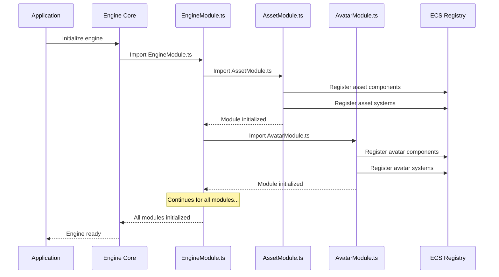

# Engine module system

## Overview

The Engine Module System provides the organizational structure for the iR Engine, defining how different functional components are grouped, loaded, and initialized. It serves as the blueprint that ensures all engine subsystems are properly integrated and available when an application starts. By using a modular approach, the engine achieves better maintainability, extensibility, and clarity in its architecture. This chapter explores the concepts, structure, and implementation of the Engine Module System within the iR Engine.

## Core concepts

### Engine modules

An engine module is a self-contained package of related functionality that encapsulates a specific aspect of the engine:

- **Definition**: A module groups together related components, systems, and state definitions
- **Scope**: Each module focuses on a specific domain (e.g., assets, avatars, rendering)
- **Independence**: Modules can function with minimal dependencies on other modules
- **Integration**: Modules connect to the core engine through standardized interfaces

Examples of engine modules include:
- `AssetModule`: Manages loading and caching of assets
- `AvatarModule`: Handles character representation and animation
- `SceneModule`: Controls 3D scene structure and rendering
- `InteractionModule`: Manages object interactions and user input
- `VisualScriptModule`: Provides visual programming capabilities

### Module initialization

Modules are initialized through JavaScript/TypeScript's import mechanism:

```typescript
// When this file is imported, all its top-level code executes
// Simplified concept from a module file like src/avatar/AvatarModule.ts

import { defineSystem, defineComponent } from '@ir-engine/ecs';
import { AvatarSystemLogic } from './systems/AvatarSystemLogic';
import { AvatarComponentDefinition } from './components/AvatarComponentDefinition';

// This code runs immediately when the module is imported
export const AvatarComponent = defineComponent(AvatarComponentDefinition);
export const AvatarSystem = defineSystem(AvatarSystemLogic);

// Additional initialization code can be placed here
console.log("Avatar Module initialized");
```

Key aspects of module initialization:
- Top-level code in a module file executes when the file is imported
- Component and system definitions register with the ECS
- State definitions register with Hyperflux
- Initialization happens automatically without explicit function calls

### Central module registry

The `EngineModule.ts` file serves as the central registry for all core engine modules:

```typescript
// From: core-engine/src/EngineModule.ts

// Import foundational spatial and ECS utilities
import '@ir-engine/spatial';

// Import and initialize all core modules
export * from './assets/AssetModule';
export * from './audio/MediaModule';
export * from './avatar/AvatarModule';
export * from './grabbable/GrabbableSystem';
export * from './interaction/systems/InteractableSystem';
export * from './mocap/MocapModule';
export * from './postprocessing/PopulateEffectRegistry';
export * from './scene/SceneModule';
export * from './visualscript/VisualScriptModule';
```

This file:
- Imports all core engine modules
- Executes their initialization code
- Re-exports their public interfaces
- Establishes the complete engine functionality

## Module structure

A typical engine module follows a consistent structure:

### Components

Each module defines its domain-specific components:

```typescript
// Simplified concept from src/avatar/components/AvatarComponent.ts
import { defineComponent, S } from '@ir-engine/ecs';

export const AvatarComponent = defineComponent({
  name: 'AvatarComponent',
  schema: S.Object({
    avatarHeight: S.Number({ default: 1.8 }),
    // Other avatar properties
  })
});
```

These components:
- Store domain-specific data
- Follow the ECS pattern described in Chapter 1
- Use schema definitions for type safety and validation
- Are exported for use by systems within and outside the module

### Systems

Each module defines systems that operate on its components:

```typescript
// Simplified concept from src/avatar/systems/AvatarAnimationSystem.tsx
import { defineSystem, defineQuery } from '@ir-engine/ecs';
import { AvatarComponent } from '../components/AvatarComponent';
import { AnimationComponent } from '../components/AnimationComponent';

const avatarAnimationQuery = defineQuery([AvatarComponent, AnimationComponent]);

export const AvatarAnimationSystem = defineSystem({
  uuid: 'ir-engine.AvatarAnimationSystem',
  execute: () => {
    const entities = avatarAnimationQuery();
    
    for (const entity of entities) {
      // Animation logic
    }
  }
});
```

These systems:
- Implement the module's behavior
- Query for entities with specific component combinations
- Process data and update component values
- Are registered with the ECS when the module is imported

### State

Many modules define Hyperflux state for global data:

```typescript
// Simplified concept from src/avatar/state/AvatarSettingsState.ts
import { defineState } from '@ir-engine/hyperflux';

export const AvatarSettingsState = defineState({
  name: 'AvatarSettingsState',
  initial: {
    walkSpeed: 2.0,
    runSpeed: 5.0,
    jumpHeight: 1.0
  }
});
```

This state:
- Stores configuration and runtime data
- Is accessible throughout the engine
- Follows the Hyperflux pattern described in Chapter 1
- Provides a central point for module settings

### Module file

Each module has a main file that imports and exports its components:

```typescript
// Simplified concept from src/avatar/AvatarModule.ts

// Import and re-export components
export * from './components/AvatarComponent';
export * from './components/AvatarRigComponent';
export * from './components/AvatarAnimationComponent';

// Import and re-export systems
export * from './systems/AvatarAnimationSystem';
export * from './systems/AvatarMovementSystem';
export * from './systems/AvatarIKSystem';

// Import and re-export state
export * from './state/AvatarSettingsState';

// Any additional initialization code
console.log('Avatar Module initialized');
```

This file:
- Serves as the entry point for the module
- Re-exports all public interfaces
- Performs any necessary initialization
- Is imported by the central `EngineModule.ts`

## Initialization flow

The process of initializing the engine follows this sequence:



This diagram illustrates:
1. The application initializes the engine core
2. The engine core imports the central `EngineModule.ts`
3. `EngineModule.ts` imports each module file
4. Each module file registers its components and systems
5. Once all modules are initialized, the engine is ready

## Extending the engine

Developers can extend the engine with custom modules following the same pattern:

```typescript
// Custom game module: src/game/VehicleModule.ts

import { defineComponent, defineSystem, S } from '@ir-engine/ecs';

// Define vehicle components
export const VehicleComponent = defineComponent({
  name: 'VehicleComponent',
  schema: S.Object({
    maxSpeed: S.Number({ default: 100 }),
    acceleration: S.Number({ default: 10 }),
    handling: S.Number({ default: 0.8 })
  })
});

// Define vehicle systems
export const VehiclePhysicsSystem = defineSystem({
  uuid: 'game.VehiclePhysicsSystem',
  execute: () => {
    // Vehicle physics logic
  }
});

// Additional initialization
console.log('Vehicle Module initialized');
```

To use this custom module:

```typescript
// In the main application file

// Initialize the iR Engine core
import '@ir-engine/core';

// Import custom game modules
import './game/VehicleModule';
import './game/RaceTrackModule';
import './game/GameplayModule';

// Start the application
startGame();
```

This approach:
- Follows the same pattern as core engine modules
- Allows for clean organization of game-specific features
- Integrates seamlessly with the engine's ECS and Hyperflux
- Enables modular development of game systems

## Implementation details

### Module dependencies

Modules often depend on each other, requiring careful import ordering:

```typescript
// Simplified concept of module dependencies

// In EngineModule.ts, the import order matters
import '@ir-engine/spatial'; // Foundational ECS must come first

// Core systems that others depend on
export * from './assets/AssetModule'; // Asset system is needed by many others
export * from './scene/SceneModule'; // Scene system builds on assets

// Systems that depend on the core
export * from './avatar/AvatarModule'; // Avatars need assets and scene
export * from './interaction/systems/InteractableSystem'; // Interactions need scene

// Higher-level systems
export * from './visualscript/VisualScriptModule'; // Visual scripting can use all other systems
```

The import order ensures that:
- Foundational systems are initialized first
- Dependencies are available when needed
- Circular dependencies are avoided
- The engine builds up from low-level to high-level features

### Lazy loading

Some modules support lazy loading for better performance:

```typescript
// Simplified concept of lazy loading

// Instead of immediate initialization
// export * from './heavyFeature/HeavyFeatureModule';

// Use a function to load on demand
export function loadHeavyFeature() {
  return import('./heavyFeature/HeavyFeatureModule').then(module => {
    console.log('Heavy feature loaded');
    return module;
  });
}
```

This approach:
- Delays loading until the feature is needed
- Reduces initial startup time
- Conserves memory for unused features
- Allows for more efficient resource usage

## Benefits of the module system

The Engine Module System provides several key benefits:

1. **Organization**: Groups related functionality into logical units
2. **Maintainability**: Makes the codebase easier to understand and update
3. **Extensibility**: Provides a clear pattern for adding new features
4. **Encapsulation**: Isolates implementation details within modules
5. **Initialization**: Ensures proper setup sequence for all engine features
6. **Reusability**: Allows modules to be shared across different projects
7. **Scalability**: Supports growing the engine with minimal refactoring

These benefits make the Engine Module System a critical architectural component that enables the iR Engine to remain flexible and powerful as it evolves.

## Conclusion

The Engine Module System serves as the organizational backbone of the iR Engine, providing a structured approach to grouping, loading, and initializing the engine's many subsystems. By using JavaScript/TypeScript's import mechanism for automatic initialization and a central registry in `EngineModule.ts`, the system ensures that all components of the engine are properly integrated and ready for use.

Throughout this documentation, we've explored the core systems that make up the iR Engine:
- ECS and state management with Hyperflux (Chapter 1)
- Asset management for loading resources (Chapter 2)
- Scene graph and rendering for visualization (Chapter 3)
- Avatar system for character representation (Chapter 4)
- Interaction system for object manipulation (Chapter 5)
- Visual scripting for accessible programming (Chapter 6)
- Engine module system for organization (Chapter 7)

With this understanding of the iR Engine's architecture and systems, you're now equipped to build upon this foundation to create rich, interactive experiences.

---


