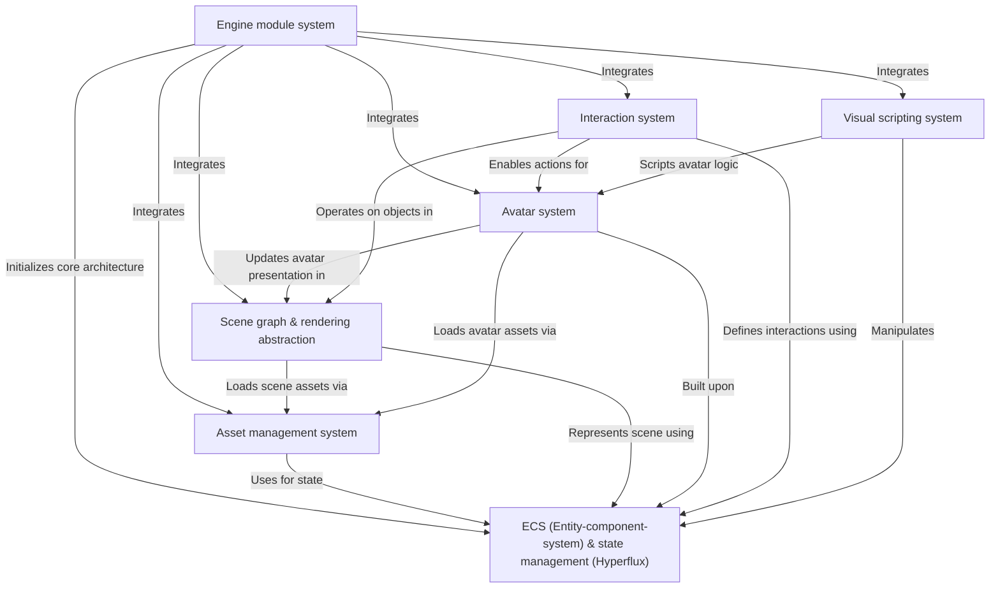

# Core engine

The iR Engine Core Engine is a foundational framework for building 3D interactive experiences. It uses an Entity-component-system (ECS) architecture for managing game objects and their behaviors, coupled with the Hyperflux library for state management. The engine provides specialized systems for handling assets (like 3D models and textures), structuring and rendering complex 3D scenes, managing lifelike avatars with animations and IK, enabling rich interactions (like grabbing or mounting objects), and creating game logic through a visual scripting interface.

## Architecture overview

The Core Engine consists of several interconnected systems that work together to provide a complete framework for interactive applications:

## Documentation chapters

1. [ECS (Entity-component-system) & state management (Hyperflux)](01_ecs__entity_component_system____state_management__hyperflux__.md)
2. [Asset management system](02_asset_management_system_.md)
3. [Scene graph & rendering abstraction](03_scene_graph___rendering_abstraction_.md)
4. [Avatar system](04_avatar_system_.md)
5. [Interaction system](05_interaction_system_.md)
6. [Visual scripting system](06_visual_scripting_system_.md)
7. [Engine module system](07_engine_module_system_.md)

---

