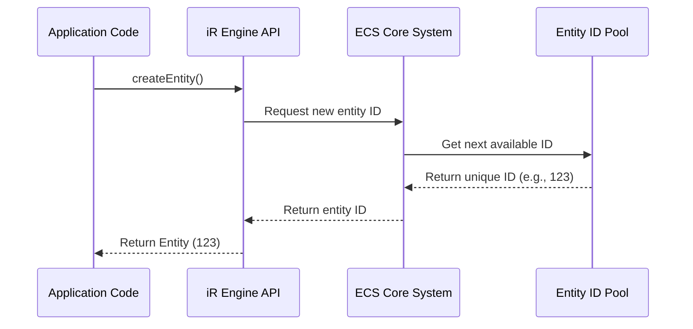

# Entity

## Overview

An entity is the fundamental unit of identity in the iR Engine's Entity Component System (ECS). It serves as a unique identifier for any distinct object or element within an application, from player characters and environmental objects to UI elements and abstract concepts. Entities themselves are lightweight and contain no data or behavior; they are simply unique numerical IDs that other parts of the system can reference. This simplicity is a key strength of the ECS architecture, enabling efficient creation, management, and destruction of application elements.

## Core concepts

### Entity as an identifier

In the ECS architecture, an entity is essentially a unique identification number:

- It represents the existence of a distinct object in the application
- It serves as a reference point that components and systems can target
- It contains no inherent data or behavior on its own
- It provides a way to group related components together

This approach separates the concept of identity (the entity) from characteristics (components) and behavior (systems), creating a flexible and modular architecture.

### Entity lifecycle

Entities have a simple lifecycle within the system:

1. **Creation**: An entity is created and assigned a unique ID
2. **Component attachment**: Components are attached to the entity to define its characteristics
3. **Processing**: Systems operate on the entity based on its components
4. **Component modification**: Components can be added, removed, or modified throughout the entity's life
5. **Destruction**: When no longer needed, the entity is destroyed and its ID can be recycled

This lifecycle allows for dynamic object creation and management during application runtime.

## Implementation

### Entity type definition

In the iR Engine, entities are implemented as numeric identifiers with type safety:

```typescript
// Simplified from: src/Entity.ts
export type Entity = OpaqueType<'entity'> & number;

// A special entity ID that means "no entity" or "invalid"
export const UndefinedEntity = 0 as Entity;
```

The `OpaqueType` wrapper provides type safety by making `Entity` distinct from regular numbers, while maintaining the performance benefits of using primitive values.

### Creating entities

Entities are created through a dedicated function that ensures uniqueness:

```typescript
// Simplified example based on engine internals
import { createEntity } from '@ir-engine/ecs';

// Create a new entity
const playerEntity = createEntity();
console.log("Player entity ID:", playerEntity); // e.g., 1

// Create more entities
const ballEntity = createEntity(); // e.g., 2
const opponentEntity = createEntity(); // e.g., 3
```

The `createEntity` function:
1. Requests a new unique ID from the underlying ECS implementation
2. Registers this ID within the current world or engine context
3. Returns the ID as an `Entity` type

### Entity creation internals

Under the hood, entity creation involves interaction between several layers:



The actual implementation often leverages optimized libraries like `bitecs` for efficient entity management:

```typescript
// Simplified conceptual implementation
import * as bitECS from 'bitecs';

// The world is the central container for all entities and components
const world = bitECS.createWorld();

function createEntityInWorld(): Entity {
  // Request a new unique entity ID from the bitECS library
  const newEntityId = bitECS.addEntity(world);
  return newEntityId as Entity;
}
```

The world (often accessed through `Hyperflux.store` in iR Engine) maintains the registry of all active entities and their associated components.

### Entity operations

Beyond creation, several operations can be performed with entities:

#### Checking entity validity

```typescript
// Simplified example
import { isValidEntity } from '@ir-engine/ecs';

const entity = createEntity();
const isValid = isValidEntity(entity); // true

const invalidEntity = UndefinedEntity;
const isInvalid = isValidEntity(invalidEntity); // false
```

#### Destroying entities

```typescript
// Simplified example
import { destroyEntity } from '@ir-engine/ecs';

const entity = createEntity();
// ... use the entity ...

// When no longer needed
destroyEntity(entity);
```

When an entity is destroyed:
1. All its associated components are removed
2. Systems stop processing it
3. Its ID may be recycled for future entities

## Practical examples

### Game object representation

In a game context, entities can represent various objects:

```typescript
// Create entities for a simple game
const playerEntity = createEntity();
const enemyEntity = createEntity();
const projectileEntity = createEntity();

// These entities are just IDs at this point
// They need components to define what they are and how they behave
```

Without components, these entities are just empty identifiers. The next step would be to attach components like position, appearance, and behavior to give them substance.

### Entity relationships

Entities can form relationships through specialized components:

```typescript
// Create parent and child entities
const parentEntity = createEntity();
const childEntity = createEntity();

// Create a relationship through components (conceptual example)
addComponent(childEntity, ParentComponent, { parentId: parentEntity });
addComponent(parentEntity, ChildrenComponent, { childIds: [childEntity] });
```

This approach allows for complex hierarchies and relationships while maintaining the simplicity of entities as pure identifiers.

## Benefits of the entity approach

The entity-as-identifier approach provides several key advantages:

1. **Performance efficiency**: Entities are lightweight (just numbers), making them cheap to create, store, and pass around
2. **Memory optimization**: No memory is wasted on unused features since entities only have the components they need
3. **Flexibility**: Any type of game object can be represented by the same entity concept with different component combinations
4. **Composition over inheritance**: Behavior and properties are composed through component attachment rather than class inheritance
5. **Runtime dynamism**: Components can be added or removed during runtime, changing what an entity represents or how it behaves

These benefits make the ECS architecture particularly well-suited for complex, performance-sensitive applications like games.

## Next steps

While entities provide identity, they need components to define their characteristics and data. The next chapter explores how components attach meaningful data to entities.

Next: [Component](02_component_.md)

---


