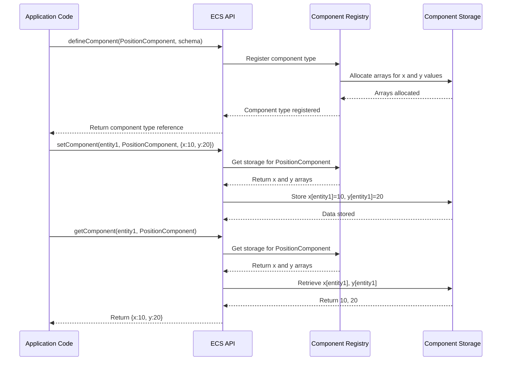

# Component

## Overview

Components are the data containers in the iR Engine's Entity Component System (ECS). They represent specific aspects or characteristics of entities, such as position, health, appearance, or behavior parameters. Unlike traditional object-oriented approaches where data and behavior are combined in classes, components in ECS are pure data structures with no inherent logic or behavior.

This separation allows for a more modular, flexible, and performance-optimized approach to building complex applications. By attaching different combinations of components to entities, developers can create diverse object types without deep inheritance hierarchies.

## Core concepts

### Component purpose

Components serve several essential purposes in the ECS architecture:

1. **Data storage**: They contain the specific data that defines an aspect of an entity
2. **Type definition**: They establish what kind of information an entity possesses
3. **Aspect identification**: They mark entities as having particular characteristics
4. **Composition building blocks**: They enable the creation of complex entities through combination

By focusing solely on data storage, components maintain a clear separation of concerns within the ECS architecture.

### Component structure

Each component type has a defined structure that specifies:

- What data fields it contains
- The data type of each field
- Default values for fields when not explicitly set
- Any validation or transformation rules

This structure is defined through a schema, which serves as a blueprint for creating component instances.

## Implementation

### Defining components

Components are defined using the `defineComponent` function, which registers a new component type with the system:

```typescript
// Import the necessary functions and types
import { defineComponent, S } from '@ir-engine/ecs';

// Define a position component with x and y coordinates
const PositionComponent = defineComponent({
  name: 'PositionComponent', // Human-readable name for debugging
  schema: S.Object({          // Schema defining the data structure
    x: S.Number({ default: 0 }), // x coordinate with default value 0
    y: S.Number({ default: 0 })  // y coordinate with default value 0
  })
});

// Define a velocity component for movement
const VelocityComponent = defineComponent({
  name: 'VelocityComponent',
  schema: S.Object({
    x: S.Number({ default: 0 }), // x velocity with default value 0
    y: S.Number({ default: 0 })  // y velocity with default value 0
  })
});

// Define a health component
const HealthComponent = defineComponent({
  name: 'HealthComponent',
  schema: S.Object({
    current: S.Number({ default: 100 }), // Current health with default 100
    maximum: S.Number({ default: 100 })  // Maximum health with default 100
  })
});
```

The `defineComponent` function:
1. Takes a configuration object with a name and schema
2. Registers the component type with the ECS system
3. Sets up internal storage for component data
4. Returns a reference to the component type for later use

The schema system (represented by `S`) provides a way to define the structure of component data, including field types, default values, and validation rules. This will be explored in more detail in the [Component Schema](05_component_schema_.md) chapter.

### Component operations

Once component types are defined, several operations can be performed with them:

#### Attaching components to entities

```typescript
// Import necessary functions
import { createEntity, setComponent } from '@ir-engine/ecs';
// Assume PositionComponent and VelocityComponent are defined as above

// Create a new entity
const ballEntity = createEntity();

// Attach a position component to the entity
setComponent(ballEntity, PositionComponent, { x: 100, y: 200 });

// Attach a velocity component to the entity
setComponent(ballEntity, VelocityComponent, { x: 5, y: -3 });
```

The `setComponent` function:
1. Takes an entity ID, a component type, and component data
2. Creates or updates the component data for the specified entity
3. Registers the component as being attached to the entity

#### Retrieving component data

```typescript
// Import necessary functions
import { getComponent } from '@ir-engine/ecs';
// Assume ballEntity has PositionComponent attached

// Get the position component data for the entity
const position = getComponent(ballEntity, PositionComponent);

// Access the component data
console.log(`Ball position: (${position.x}, ${position.y})`);
// Output: Ball position: (100, 200)
```

The `getComponent` function:
1. Takes an entity ID and a component type
2. Retrieves the component data for the specified entity
3. Returns the data as an object with the structure defined in the schema

#### Checking component existence

```typescript
// Import necessary functions
import { hasComponent } from '@ir-engine/ecs';
// Assume ballEntity has PositionComponent but not HealthComponent

// Check if the entity has a position component
const hasPosition = hasComponent(ballEntity, PositionComponent);
console.log(`Has position: ${hasPosition}`); // Output: Has position: true

// Check if the entity has a health component
const hasHealth = hasComponent(ballEntity, HealthComponent);
console.log(`Has health: ${hasHealth}`); // Output: Has health: false
```

The `hasComponent` function:
1. Takes an entity ID and a component type
2. Checks if the entity has the specified component attached
3. Returns a boolean indicating the presence of the component

#### Removing components

```typescript
// Import necessary functions
import { removeComponent } from '@ir-engine/ecs';
// Assume ballEntity has VelocityComponent attached

// Remove the velocity component from the entity
removeComponent(ballEntity, VelocityComponent);

// Verify the component was removed
const stillHasVelocity = hasComponent(ballEntity, VelocityComponent);
console.log(`Still has velocity: ${stillHasVelocity}`);
// Output: Still has velocity: false
```

The `removeComponent` function:
1. Takes an entity ID and a component type
2. Detaches the component from the entity
3. Cleans up any associated data

### Component storage internals

Under the hood, components are typically stored in a memory-efficient manner using a pattern called "Structure of Arrays" (SoA):



Instead of storing each entity's components as separate objects, the system typically:
1. Maintains arrays for each component field (e.g., `positionX[]`, `positionY[]`)
2. Uses entity IDs as indices into these arrays
3. Stores component data directly in these arrays

This approach:
- Improves cache locality for better performance
- Reduces memory fragmentation
- Enables efficient batch processing of components
- Minimizes garbage collection overhead

A simplified conceptual implementation might look like:

```typescript
// Simplified conceptual implementation (not actual code)
class ComponentStorage {
  // Arrays to store component data
  private positionX = new Float32Array(MAX_ENTITIES);
  private positionY = new Float32Array(MAX_ENTITIES);

  // Bitset to track which entities have this component
  private hasComponent = new Uint8Array(MAX_ENTITIES);

  // Set component data for an entity
  setPositionComponent(entity, data) {
    this.positionX[entity] = data.x;
    this.positionY[entity] = data.y;
    this.hasComponent[entity] = 1;
  }

  // Get component data for an entity
  getPositionComponent(entity) {
    if (this.hasComponent[entity]) {
      return {
        x: this.positionX[entity],
        y: this.positionY[entity]
      };
    }
    return undefined;
  }

  // Check if an entity has this component
  hasPositionComponent(entity) {
    return this.hasComponent[entity] === 1;
  }

  // Remove component from an entity
  removePositionComponent(entity) {
    this.hasComponent[entity] = 0;
  }
}
```

In practice, the iR Engine often uses optimized libraries like `bitecs` to handle this storage efficiently.

## Practical examples

### Creating a game character

Components can be combined to create complex game objects:

```typescript
// Create a player entity
const playerEntity = createEntity();

// Add position and movement components
setComponent(playerEntity, PositionComponent, { x: 50, y: 50 });
setComponent(playerEntity, VelocityComponent, { x: 0, y: 0 });

// Add health and status components
setComponent(playerEntity, HealthComponent, { current: 100, maximum: 100 });
setComponent(playerEntity, StatusComponent, {
  isInvulnerable: false,
  stunned: false
});

// Add input control component
setComponent(playerEntity, PlayerInputComponent, {
  moveSpeed: 5,
  jumpHeight: 10
});

// Add visual representation component
setComponent(playerEntity, SpriteComponent, {
  texture: 'player_sprite',
  width: 32,
  height: 32
});
```

This approach allows for flexible entity creation by mixing and matching components as needed.

### Component-based state changes

Components can be added or removed to change an entity's state:

```typescript
// Make the player temporarily invulnerable
const status = getComponent(playerEntity, StatusComponent);
status.isInvulnerable = true;
setComponent(playerEntity, StatusComponent, status);

// Add a temporary power-up effect
setComponent(playerEntity, PowerUpComponent, {
  type: 'speed_boost',
  duration: 10,
  multiplier: 2.0
});

// Later, when the power-up expires
removeComponent(playerEntity, PowerUpComponent);
```

This dynamic composition allows entities to change their behavior and characteristics at runtime.

## Benefits of components

The component-based approach provides several key advantages:

1. **Data-oriented design**: Components focus on structured data, which aligns well with modern CPU architecture
2. **Composition over inheritance**: Entities are composed of components rather than inheriting from class hierarchies
3. **Flexibility**: New entity types can be created by combining existing components in different ways
4. **Modularity**: Components can be developed and tested independently
5. **Performance**: The Structure of Arrays storage pattern improves cache locality and processing efficiency
6. **Clarity**: Each component has a clear, single responsibility

These benefits make components a powerful tool for building complex, performant applications.

## Next steps

While components provide the data for entities, they don't contain the logic to process that data. The next chapter explores how systems use components to implement behavior and logic.

Next: [System](03_system_.md)

---


