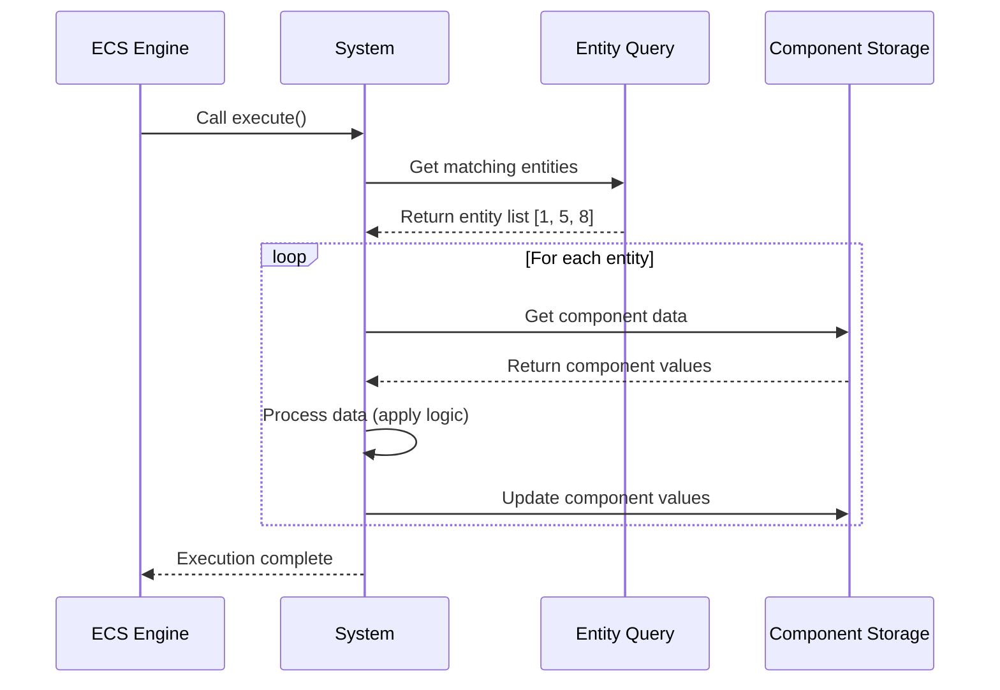

# System

## Overview

Systems are the logic processors in the iR Engine's Entity Component System (ECS). They contain the algorithms and behaviors that operate on entities based on the components they possess. While entities provide identity and components store data, systems implement the actual functionality that makes applications dynamic and interactive.

Systems typically query for entities with specific component combinations, process their data according to game rules or application logic, and update component values accordingly. This separation of logic from data is a key principle of the ECS architecture, enabling modular, maintainable, and performant code.

## Core concepts

### System purpose

Systems serve several essential purposes in the ECS architecture:

1. **Logic implementation**: They contain the algorithms and behaviors that drive application functionality
2. **Entity processing**: They operate on groups of entities that match specific component criteria
3. **Component manipulation**: They read and modify component data to implement behaviors
4. **State management**: They control how the application state evolves over time
5. **Event handling**: They respond to inputs, triggers, and other events

By focusing solely on logic and behavior, systems maintain a clear separation of concerns within the ECS architecture.

### System structure

A typical system consists of several key elements:

1. **Query**: A specification of which entities the system should process, based on component requirements
2. **Execute function**: The logic that runs when the system is invoked, typically once per frame or update cycle
3. **Identifier**: A unique name or ID that distinguishes the system from others
4. **Execution order**: Configuration that determines when the system runs relative to other systems

This structure allows systems to focus on specific aspects of application behavior while coordinating with other systems.

## Implementation

### Defining queries

Before creating a system, you typically define a query that specifies which entities the system should process:

```typescript
// Import the necessary functions
import { defineQuery } from '@ir-engine/ecs';
// Assume PositionComponent and VelocityComponent are already defined

// Define a query for entities with both position and velocity components
const movableEntitiesQuery = defineQuery([
  PositionComponent,
  VelocityComponent
]);
```

The `defineQuery` function:
1. Takes an array of component types that entities must possess
2. Returns a function that, when called, returns the current list of matching entities
3. Efficiently tracks entities as components are added or removed

Queries can be more complex, including:
- Required components (entities must have these)
- Optional components (entities may have these)
- Excluded components (entities must not have these)

### Creating systems

Systems are defined using the `defineSystem` function, which registers a new system with the ECS:

```typescript
// Import the necessary functions
import { defineSystem, getComponent } from '@ir-engine/ecs';
// Assume movableEntitiesQuery is defined as above

// Define a movement system
const MovementSystem = defineSystem({
  // Unique identifier for the system
  uuid: 'game.MovementSystem',

  // Logic to execute when the system runs
  execute: () => {
    // Get all entities matching our query
    const entities = movableEntitiesQuery();

    // Process each entity
    for (const entity of entities) {
      // Get the entity's components
      const position = getComponent(entity, PositionComponent);
      const velocity = getComponent(entity, VelocityComponent);

      // Update position based on velocity
      position.x += velocity.dx;
      position.y += velocity.dy;
    }
  },

  // Configuration for system execution order
  insert: {
    after: ['game.InputSystem'],
    before: ['game.CollisionSystem']
  }
});
```

The `defineSystem` function:
1. Takes a configuration object with a unique ID, execute function, and insertion details
2. Registers the system with the ECS engine
3. Returns a reference to the system for later use

The `execute` function is the heart of the system, containing the logic that processes entities and updates their components.

### System execution flow

When a system runs, it typically follows this sequence:



This flow ensures that:
1. The system only processes entities that match its criteria
2. Component data is accessed efficiently
3. Updates are applied consistently

### System execution order

Systems can specify their execution order relative to other systems:

```typescript
// Define a system with explicit ordering
const PhysicsSystem = defineSystem({
  uuid: 'game.PhysicsSystem',
  execute: () => {
    // Physics simulation logic
  },
  insert: {
    after: ['game.InputSystem'],     // Run after input is processed
    before: ['game.RenderSystem'],   // Run before rendering
    fixedUpdate: true                // Run at a fixed time step
  }
});
```

The `insert` configuration allows systems to specify:
- Which systems should run before this one (`after`)
- Which systems should run after this one (`before`)
- Whether the system requires a fixed update rate (`fixedUpdate`)

This ordering ensures that dependencies between systems are respected and that operations occur in the correct sequence.

## System types and patterns

Different types of systems serve different purposes in an application:

### Processing systems

These systems iterate through entities and update their components:

```typescript
// A typical processing system
const MovementSystem = defineSystem({
  uuid: 'game.MovementSystem',
  execute: () => {
    const entities = movableEntitiesQuery();
    for (const entity of entities) {
      const position = getComponent(entity, PositionComponent);
      const velocity = getComponent(entity, VelocityComponent);
      position.x += velocity.dx;
      position.y += velocity.dy;
    }
  }
});
```

Processing systems are the most common type, handling regular updates to entity state.

### Event systems

These systems respond to specific events or inputs:

```typescript
// An event-handling system
const InputSystem = defineSystem({
  uuid: 'game.InputSystem',
  execute: () => {
    const entities = playerControlledQuery();

    // Check for input events
    if (isKeyPressed('ArrowRight')) {
      for (const entity of entities) {
        const velocity = getComponent(entity, VelocityComponent);
        velocity.dx = 5; // Move right
      }
    } else if (isKeyPressed('ArrowLeft')) {
      for (const entity of entities) {
        const velocity = getComponent(entity, VelocityComponent);
        velocity.dx = -5; // Move left
      }
    } else {
      for (const entity of entities) {
        const velocity = getComponent(entity, VelocityComponent);
        velocity.dx = 0; // Stop horizontal movement
      }
    }
  }
});
```

Event systems translate external inputs or triggers into component state changes.

### Lifecycle systems

These systems manage entity creation, initialization, and destruction:

```typescript
// A system that spawns enemies
const EnemySpawnSystem = defineSystem({
  uuid: 'game.EnemySpawnSystem',
  execute: () => {
    const timeComponent = getComponent(globalEntity, TimeComponent);

    // Spawn a new enemy every 5 seconds
    if (timeComponent.elapsed % 5 < 0.016) { // Assuming 60 FPS
      const enemyEntity = createEntity();

      // Initialize with required components
      setComponent(enemyEntity, PositionComponent, {
        x: Math.random() * 800,
        y: 0
      });
      setComponent(enemyEntity, VelocityComponent, {
        dx: 0,
        dy: 2
      });
      setComponent(enemyEntity, EnemyComponent, {
        health: 100,
        type: 'basic'
      });
    }
  }
});
```

Lifecycle systems ensure that entities are created, configured, and removed appropriately.

## Practical examples

### Game physics system

A system that implements basic physics for game objects:

```typescript
// Define queries for physics processing
const physicsBodyQuery = defineQuery([
  PositionComponent,
  VelocityComponent,
  PhysicsBodyComponent
]);

const gravityAffectedQuery = defineQuery([
  VelocityComponent,
  GravityAffectedComponent
]);

// Define the physics system
const PhysicsSystem = defineSystem({
  uuid: 'game.PhysicsSystem',
  execute: (deltaTime) => {
    // Apply gravity to affected entities
    const gravityEntities = gravityAffectedQuery();
    for (const entity of gravityEntities) {
      const velocity = getComponent(entity, VelocityComponent);
      velocity.dy += 9.8 * deltaTime; // Apply gravity
    }

    // Update positions based on velocity
    const physicsEntities = physicsBodyQuery();
    for (const entity of physicsEntities) {
      const position = getComponent(entity, PositionComponent);
      const velocity = getComponent(entity, VelocityComponent);
      const body = getComponent(entity, PhysicsBodyComponent);

      // Apply velocity with drag
      position.x += velocity.dx * deltaTime;
      position.y += velocity.dy * deltaTime;

      // Apply drag
      velocity.dx *= (1 - body.drag * deltaTime);
      velocity.dy *= (1 - body.drag * deltaTime);
    }
  },
  insert: {
    fixedUpdate: true // Physics typically runs at a fixed time step
  }
});
```

This system demonstrates how physics behavior can be implemented by processing entities with the appropriate components.

### Collision detection system

A system that checks for collisions between entities:

```typescript
// Define a query for collidable entities
const collidableQuery = defineQuery([
  PositionComponent,
  ColliderComponent
]);

// Define the collision system
const CollisionSystem = defineSystem({
  uuid: 'game.CollisionSystem',
  execute: () => {
    const entities = collidableQuery();

    // Check each entity against all others
    for (let i = 0; i < entities.length; i++) {
      const entityA = entities[i];
      const posA = getComponent(entityA, PositionComponent);
      const colliderA = getComponent(entityA, ColliderComponent);

      for (let j = i + 1; j < entities.length; j++) {
        const entityB = entities[j];
        const posB = getComponent(entityB, PositionComponent);
        const colliderB = getComponent(entityB, ColliderComponent);

        // Simple circle collision check
        const dx = posA.x - posB.x;
        const dy = posA.y - posB.y;
        const distance = Math.sqrt(dx * dx + dy * dy);
        const minDistance = colliderA.radius + colliderB.radius;

        if (distance < minDistance) {
          // Collision detected!
          // Add collision response or trigger events
          setComponent(entityA, CollisionEventComponent, {
            collidedWith: entityB
          });
          setComponent(entityB, CollisionEventComponent, {
            collidedWith: entityA
          });
        }
      }
    }
  },
  insert: {
    after: ['game.PhysicsSystem'],
    before: ['game.CollisionResponseSystem']
  }
});
```

This system shows how to implement interaction between entities by checking for spatial relationships.

## Benefits of systems

The system-based approach provides several key advantages:

1. **Separation of concerns**: Systems focus on specific behaviors, making code more modular and maintainable
2. **Performance optimization**: Systems can process entities in batches, taking advantage of cache locality
3. **Flexibility**: New behaviors can be added by creating new systems without modifying existing code
4. **Testability**: Systems can be tested in isolation with mock entities and components
5. **Scalability**: Systems can be parallelized to take advantage of multi-core processors

These benefits make systems a powerful tool for implementing complex application logic.

## Next steps

While systems provide the logic for processing entities and components, they need to be managed and coordinated by a central authority. The next chapter explores the engine or world that orchestrates the entire ECS.

Next: [Engine (World)](04_engine__world__.md)

---


