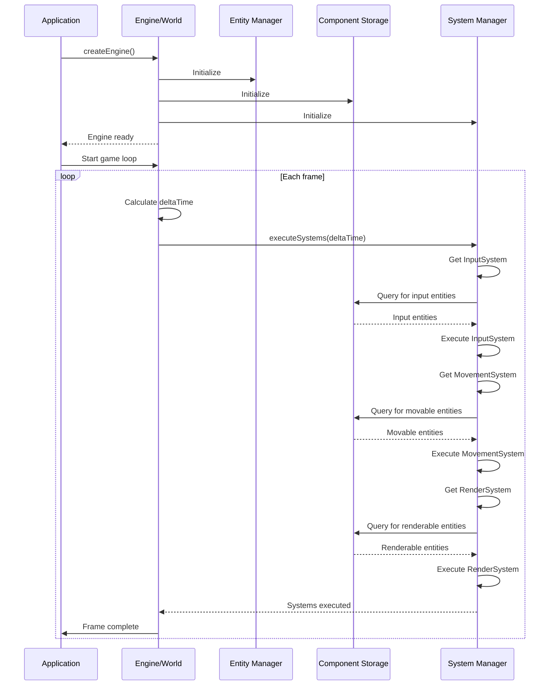

# Engine (world)

## Overview

The Engine, often referred to as the World in ECS terminology, is the central coordinator of the iR Engine's Entity Component System. It serves as the container for all entities, components, and systems, providing the context in which they operate. The Engine manages entity creation and destruction, stores component data, orchestrates system execution, and maintains the application's main loop.

By centralizing these responsibilities, the Engine ensures that all parts of the ECS work together coherently, creating a unified environment for game or application logic. This chapter explores the concept, structure, and implementation of the Engine within the iR Engine.

## Core concepts

### Engine purpose

The Engine serves several essential purposes in the ECS architecture:

1. **Central repository**: It maintains a comprehensive store of all entities and their component data
2. **Entity management**: It handles the creation, tracking, and destruction of entities
3. **Component storage**: It provides efficient storage and retrieval mechanisms for component data
4. **System orchestration**: It manages the execution of systems in the correct order and frequency
5. **Application loop**: It drives the main update cycle that keeps the application running

By fulfilling these roles, the Engine acts as the foundation upon which the entire ECS architecture operates.

### Engine responsibilities

The Engine's responsibilities can be broken down into several key areas:

#### Entity management

- Creating new entities with unique identifiers
- Tracking which entities exist in the world
- Destroying entities when they are no longer needed
- Recycling entity IDs for efficiency

#### Component storage

- Allocating memory for component data
- Associating component data with specific entities
- Providing access to component data through queries
- Managing component addition and removal

#### System execution

- Maintaining a registry of available systems
- Determining the execution order of systems
- Invoking system execution at appropriate times
- Providing systems with access to relevant entities and components

#### Application loop

- Tracking time and calculating delta time between frames
- Processing input events
- Updating game state through system execution
- Triggering rendering and output

## Implementation

### Engine initialization

The Engine is typically initialized at application startup:

```typescript
// Simplified from: src/Engine.ts
import * as bitECS from 'bitecs';
import { createHyperStore, HyperStore } from '@ir-engine/hyperflux';

export class Engine {
  static instance: Engine;
  store: HyperStore;

  constructor() {
    // Initialize internal state
  }
}

export function createEngine(): Engine {
  if (Engine.instance) {
    throw new Error('Engine already created!');
  }

  // Create the singleton instance
  Engine.instance = new Engine();

  // Create the world/store using bitECS and Hyperflux
  const world = bitECS.createWorld(createHyperStore());
  Engine.instance.store = world as HyperStore;

  // Perform additional initialization
  console.log("iR Engine initialized");

  return Engine.instance;
}
```

The `createEngine` function:
1. Creates a singleton instance of the Engine class
2. Initializes the underlying ECS world using `bitECS.createWorld`
3. Enhances it with Hyperflux state management capabilities
4. Returns the initialized Engine instance

The resulting `Engine.instance.store` (often also accessible as `Hyperflux.store`) serves as the central repository for all ECS data.

### System execution

The Engine orchestrates the execution of systems through a dedicated function:

```typescript
// Simplified from: src/EngineFunctions.ts
import { DefaultSystemPipeline } from './SystemGroups';
import { executeSystem } from './SystemFunctions';
import { ECSState } from './ECSState';

export function executeSystems(deltaTime: number): void {
  // Update engine time tracking
  const ecsState = ECSState.get();
  ecsState.deltaSeconds = deltaTime;
  ecsState.elapsedSeconds += deltaTime;

  // Execute all systems in the pipeline
  for (const systemOrGroupUUID of DefaultSystemPipeline) {
    executeSystem(systemOrGroupUUID);
  }

  // Update performance metrics
  ecsState.lastSystemExecutionTime = performance.now() - ecsState.frameStartTime;
}
```

The `executeSystems` function:
1. Updates time-related state (delta time, elapsed time)
2. Iterates through a predefined pipeline of systems
3. Executes each system or system group in order
4. Tracks performance metrics for monitoring

The `DefaultSystemPipeline` typically organizes systems into logical groups like input processing, simulation, and rendering, ensuring they execute in the correct sequence.

### Application loop

The Engine drives the main application loop:

```typescript
// Simplified concept
import { executeSystems } from './EngineFunctions';

function gameLoop(timestamp: number): void {
  // Calculate time since last frame
  const deltaTime = (timestamp - lastTimestamp) / 1000; // Convert to seconds
  lastTimestamp = timestamp;

  // Process input events
  processInputEvents();

  // Update game state by executing systems
  executeSystems(deltaTime);

  // Render the current state
  renderFrame();

  // Schedule the next frame
  requestAnimationFrame(gameLoop);
}

// Start the game loop
let lastTimestamp = performance.now();
requestAnimationFrame(gameLoop);
```

This loop:
1. Calculates the time elapsed since the last frame
2. Processes any pending input events
3. Updates the game state by executing all systems
4. Renders the current state to the screen
5. Schedules the next iteration of the loop

This continuous cycle drives the entire application, typically running at 60 frames per second or higher.

### System groups and execution order

Systems are organized into groups to manage execution order:

```typescript
// Simplified from: src/SystemGroups.ts
export const InputSystemGroup = 'ir-engine.InputSystemGroup';
export const SimulationSystemGroup = 'ir-engine.SimulationSystemGroup';
export const PhysicsSystemGroup = 'ir-engine.PhysicsSystemGroup';
export const RenderSystemGroup = 'ir-engine.RenderSystemGroup';

// Define the default execution pipeline
export const DefaultSystemPipeline = [
  InputSystemGroup,
  SimulationSystemGroup,
  PhysicsSystemGroup,
  RenderSystemGroup
];
```

Systems can specify their position within these groups using the `insert` configuration:

```typescript
// Example system with explicit ordering
const MovementSystem = defineSystem({
  uuid: 'game.MovementSystem',
  execute: () => {
    // Movement logic
  },
  insert: {
    after: ['game.InputSystem'],
    before: ['game.CollisionSystem'],
    group: SimulationSystemGroup
  }
});
```

This configuration ensures that systems execute in a logical order, with dependencies properly respected.

## Engine workflow

The Engine coordinates the flow of data and execution throughout the ECS:



This workflow illustrates how:
1. The Engine initializes all ECS subsystems
2. The game loop drives continuous updates
3. Systems query for relevant entities
4. Component data flows between storage and systems
5. The process repeats for each frame

## Engine internals

Under the hood, the Engine leverages specialized libraries and data structures:

### bitECS integration

The iR Engine often uses `bitecs`, a high-performance ECS library, for core functionality:

```typescript
// Simplified concept
import * as bitECS from 'bitecs';

// Create the world
const world = bitECS.createWorld();

// Create an entity
const entity = bitECS.addEntity(world);

// Define a component (simplified)
const PositionComponent = bitECS.defineComponent(world, {
  x: bitECS.Types.f32,
  y: bitECS.Types.f32
});

// Set component data
bitECS.addComponent(world, PositionComponent, entity);
PositionComponent.x[entity] = 10;
PositionComponent.y[entity] = 20;

// Query for entities
const query = bitECS.defineQuery([PositionComponent]);
const entities = query(world);
```

The `bitecs` library provides highly optimized implementations of ECS concepts, using typed arrays and efficient memory layouts for performance.

### Hyperflux integration

The iR Engine enhances the basic ECS with Hyperflux for advanced state management:

```typescript
// Simplified concept
import { createHyperStore, HyperStore } from '@ir-engine/hyperflux';

// Create a Hyperflux store
const store = createHyperStore();

// Create a world with Hyperflux integration
const world = bitECS.createWorld(store);

// Access the store for state management
const gameState = store.state.game;
gameState.score.set(100);
```

This integration allows the Engine to manage both ECS data and application state in a unified way.

## Practical examples

### Complete game initialization

A typical game initialization using the Engine might look like:

```typescript
// Initialize the engine
const engine = createEngine();

// Define components
const PositionComponent = defineComponent({
  name: 'PositionComponent',
  schema: S.Object({
    x: S.Number({ default: 0 }),
    y: S.Number({ default: 0 })
  })
});

const VelocityComponent = defineComponent({
  name: 'VelocityComponent',
  schema: S.Object({
    dx: S.Number({ default: 0 }),
    dy: S.Number({ default: 0 })
  })
});

// Define systems
const MovementSystem = defineSystem({
  uuid: 'game.MovementSystem',
  execute: () => {
    const entities = movableEntitiesQuery();
    for (const entity of entities) {
      const position = getComponent(entity, PositionComponent);
      const velocity = getComponent(entity, VelocityComponent);
      position.x += velocity.dx;
      position.y += velocity.dy;
    }
  }
});

// Create initial entities
const playerEntity = createEntity();
setComponent(playerEntity, PositionComponent, { x: 100, y: 100 });
setComponent(playerEntity, VelocityComponent, { dx: 0, dy: 0 });

// Start the game loop
startGameLoop();
```

This example shows how the Engine provides the foundation for defining components, systems, and entities, and then orchestrates their interaction through the game loop.

### System dependencies and ordering

The Engine manages complex system dependencies:

```typescript
// Define systems with explicit ordering
const InputSystem = defineSystem({
  uuid: 'game.InputSystem',
  execute: () => {
    // Process input and update player velocity
  },
  insert: {
    group: InputSystemGroup
  }
});

const PhysicsSystem = defineSystem({
  uuid: 'game.PhysicsSystem',
  execute: () => {
    // Apply physics simulation
  },
  insert: {
    after: ['game.InputSystem'],
    group: SimulationSystemGroup
  }
});

const CollisionSystem = defineSystem({
  uuid: 'game.CollisionSystem',
  execute: () => {
    // Detect and resolve collisions
  },
  insert: {
    after: ['game.PhysicsSystem'],
    group: SimulationSystemGroup
  }
});

const RenderSystem = defineSystem({
  uuid: 'game.RenderSystem',
  execute: () => {
    // Render game objects
  },
  insert: {
    after: ['game.CollisionSystem'],
    group: RenderSystemGroup
  }
});
```

The Engine ensures these systems execute in the correct order, respecting both explicit dependencies and group assignments.

## Benefits of the Engine

The Engine-centered approach provides several key advantages:

1. **Centralized management**: All ECS components are coordinated through a single point of control
2. **Consistent execution**: Systems run in a predictable order with proper timing
3. **Efficient data access**: The Engine optimizes component storage and retrieval
4. **Simplified API**: Developers interact with a unified interface rather than separate subsystems
5. **Performance optimization**: The Engine can implement specialized optimizations for different platforms

These benefits make the Engine a critical component of the ECS architecture, providing the foundation that enables all other parts to work together effectively.

## Next steps

With an understanding of how the Engine coordinates entities, components, and systems, the next chapter explores how component data is structured and defined through component schemas.

Next: [Component Schema](05_component_schema_.md)

---


