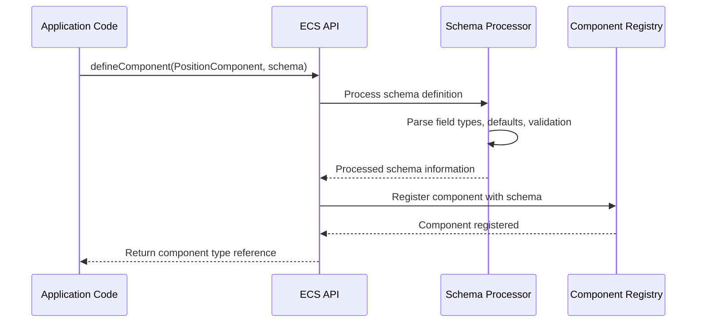

# Component schema

## Overview

Component schemas define the structure, data types, default values, and validation rules for components in the iR Engine's Entity Component System. They serve as blueprints that ensure consistency and type safety across all instances of a component type.

By formalizing the data structure of components, schemas enable efficient storage, serialization, validation, and editor integration. This chapter explores the concept, structure, and implementation of component schemas within the iR Engine, demonstrating how they enhance the robustness and usability of the ECS architecture.

## Core concepts

### Schema purpose

Component schemas serve several essential purposes in the ECS architecture:

1. **Data structure definition**: They specify what fields a component contains and their data types
2. **Default value specification**: They provide initial values for component fields when not explicitly set
3. **Validation enforcement**: They define rules and constraints for component data
4. **Serialization guidance**: They inform how component data should be saved and loaded
5. **Editor integration**: They enable automatic UI generation for component inspection and editing

By formalizing these aspects, schemas ensure that components maintain consistent structure and valid data throughout the application lifecycle.

### Schema structure

A component schema typically defines:

- The fields that make up the component
- The data type of each field (number, string, boolean, object, array, etc.)
- Default values for fields when not explicitly provided
- Validation rules (minimum/maximum values, required fields, etc.)
- Serialization options (which fields should be saved/loaded)

This structure provides a complete specification for how component data should be created, validated, and processed.

## Implementation

### Schema definition

In the iR Engine, component schemas are defined using a utility often referred to as `S` (from `src/schemas/JSONSchemas.ts`):

```typescript
// Import the necessary functions and schema utilities
import { defineComponent, S } from '@ir-engine/ecs';

// Define a position component with x and y coordinates
const PositionComponent = defineComponent({
  name: 'PositionComponent', // Human-readable name for debugging
  schema: S.Object({          // Define the component's data structure
    x: S.Number({ default: 0 }), // x coordinate with default value 0
    y: S.Number({ default: 0 })  // y coordinate with default value 0
  })
});
```

The `S` utility provides a type-safe way to define schemas with various data types and options:

- `S.Object({ ... })`: Defines an object with named fields
- `S.Number({ ... })`: Defines a numeric field with options
- `S.String({ ... })`: Defines a text field with options
- `S.Bool({ ... })`: Defines a boolean field with options
- `S.Array(...)`: Defines an array field with options

Each field definition can include options like `default` (initial value), `minimum`/`maximum` (validation constraints), and `serialized` (whether to include in serialization).

### Schema types

The schema system supports a variety of data types to accommodate different component needs:

#### Primitive types

```typescript
// Number field with default and constraints
const healthField = S.Number({
  default: 100,   // Default value
  minimum: 0,     // Minimum allowed value
  maximum: 100    // Maximum allowed value
});

// String field with default
const nameField = S.String({
  default: "Player" // Default value
});

// Boolean field with default
const activeField = S.Bool({
  default: true    // Default value
});
```

#### Composite types

```typescript
// Array of numbers with default
const scoresField = S.Array(S.Number(), {
  default: [0, 0, 0] // Default value
});

// Enumeration with default
const colorField = S.Enum({
  RED: 0,
  GREEN: 1,
  BLUE: 2
}, {
  default: 0  // Default to RED
});

// Nested object with defaults
const transformField = S.Object({
  position: S.Object({
    x: S.Number({ default: 0 }),
    y: S.Number({ default: 0 }),
    z: S.Number({ default: 0 })
  }),
  rotation: S.Object({
    x: S.Number({ default: 0 }),
    y: S.Number({ default: 0 }),
    z: S.Number({ default: 0 }),
    w: S.Number({ default: 1 })
  })
});
```

These types can be combined and nested to create complex component structures while maintaining type safety and validation.

### Schema reuse

Schemas can be defined separately and reused across multiple components:

```typescript
// Define reusable schemas
const Vector2Schema = S.Object({
  x: S.Number({ default: 0 }),
  y: S.Number({ default: 0 })
});

const Vector3Schema = S.Object({
  x: S.Number({ default: 0 }),
  y: S.Number({ default: 0 }),
  z: S.Number({ default: 0 })
});

const QuaternionSchema = S.Object({
  x: S.Number({ default: 0 }),
  y: S.Number({ default: 0 }),
  z: S.Number({ default: 0 }),
  w: S.Number({ default: 1 })
});

// Use the schemas in component definitions
const PositionComponent = defineComponent({
  name: 'PositionComponent',
  schema: Vector2Schema
});

const TransformComponent = defineComponent({
  name: 'TransformComponent',
  schema: S.Object({
    position: Vector3Schema,
    rotation: QuaternionSchema,
    scale: Vector3Schema
  })
});
```

This approach promotes consistency and reduces duplication by allowing common data structures to be defined once and used in multiple components.

### Schema validation

Schemas can include validation rules to ensure component data meets specific requirements:

```typescript
// Define a component with validation rules
const CharacterStatsComponent = defineComponent({
  name: 'CharacterStatsComponent',
  schema: S.Object({
    health: S.Number({
      default: 100,
      minimum: 0,      // Health cannot be negative
      maximum: 100     // Health cannot exceed 100
    }),
    strength: S.Number({
      default: 10,
      minimum: 1       // Strength must be at least 1
    }),
    level: S.Number({
      default: 1,
      minimum: 1,      // Level must be at least 1
      integer: true    // Level must be an integer
    }),
    name: S.String({
      default: "Hero",
      minLength: 2,    // Name must be at least 2 characters
      maxLength: 20    // Name cannot exceed 20 characters
    })
  })
});
```

When component data is set, these validation rules are checked:
- If a value is below its minimum, it might be clamped to the minimum
- If a value exceeds its maximum, it might be clamped to the maximum
- If a value doesn't meet other constraints, it might be adjusted or trigger a warning

This validation helps catch data errors early, preventing issues that might arise from invalid component states.

## Schema processing

When a component with a schema is defined and used, several processes occur:

### Schema registration

When `defineComponent` is called with a schema:



The schema processor analyzes the schema definition, extracting information about fields, types, defaults, and validation rules. This processed information is stored with the component definition in the registry.

### Default value application

When a component is added to an entity without specifying all fields:

```typescript
// Create an entity
const entity = createEntity();

// Add a position component with partial data
setComponent(entity, PositionComponent, { x: 10 });

// The y field will use its default value (0)
const position = getComponent(entity, PositionComponent);
console.log(position); // Output: { x: 10, y: 0 }
```

The schema's default values are applied for any fields not explicitly provided, ensuring the component always has a complete data structure.

### Validation enforcement

When component data is set, validation rules are applied:

```typescript
// Create an entity
const entity = createEntity();

// Try to set health to an invalid value
setComponent(entity, CharacterStatsComponent, {
  health: -20,  // Below minimum (0)
  level: 0.5    // Below minimum (1) and not an integer
});

// The values will be adjusted according to validation rules
const stats = getComponent(entity, CharacterStatsComponent);
console.log(stats.health); // Output: 0 (clamped to minimum)
console.log(stats.level);  // Output: 1 (clamped to minimum and converted to integer)
```

This validation ensures that component data always meets the requirements specified in the schema, preventing invalid states.

## Practical examples

### Character component

A complete character component with various data types and validation:

```typescript
// Define a character component
const CharacterComponent = defineComponent({
  name: 'CharacterComponent',
  schema: S.Object({
    // Basic information
    name: S.String({ default: "Character", minLength: 1 }),
    level: S.Number({ default: 1, minimum: 1, integer: true }),

    // Stats
    stats: S.Object({
      health: S.Number({ default: 100, minimum: 0 }),
      mana: S.Number({ default: 50, minimum: 0 }),
      strength: S.Number({ default: 10, minimum: 1 }),
      dexterity: S.Number({ default: 10, minimum: 1 }),
      intelligence: S.Number({ default: 10, minimum: 1 })
    }),

    // Equipment slots
    equipment: S.Object({
      weapon: S.String({ default: "" }),
      armor: S.String({ default: "" }),
      helmet: S.String({ default: "" }),
      boots: S.String({ default: "" })
    }),

    // Inventory
    inventory: S.Array(S.String(), { default: [] }),

    // Status effects
    statusEffects: S.Array(S.Object({
      type: S.String(),
      duration: S.Number({ default: 0, minimum: 0 }),
      strength: S.Number({ default: 1 })
    }), { default: [] })
  })
});
```

This example demonstrates how schemas can define complex, nested data structures with appropriate defaults and validation rules.

### Physics body component

A physics component with validation to ensure physical properties are valid:

```typescript
// Define a physics body component
const PhysicsBodyComponent = defineComponent({
  name: 'PhysicsBodyComponent',
  schema: S.Object({
    // Physical properties
    mass: S.Number({
      default: 1.0,
      minimum: 0.001,  // Mass must be positive
      maximum: 1000    // Limit maximum mass for stability
    }),

    // Collision properties
    collider: S.Object({
      type: S.Enum({
        BOX: 0,
        SPHERE: 1,
        CAPSULE: 2
      }, { default: 0 }),

      // Dimensions depend on collider type
      dimensions: S.Object({
        x: S.Number({ default: 1.0, minimum: 0.01 }),
        y: S.Number({ default: 1.0, minimum: 0.01 }),
        z: S.Number({ default: 1.0, minimum: 0.01 })
      }),

      radius: S.Number({ default: 0.5, minimum: 0.01 })
    }),

    // Physics material properties
    material: S.Object({
      friction: S.Number({ default: 0.5, minimum: 0, maximum: 1 }),
      restitution: S.Number({ default: 0.3, minimum: 0, maximum: 1 }),
      density: S.Number({ default: 1.0, minimum: 0.01 })
    }),

    // Physics flags
    flags: S.Object({
      isKinematic: S.Bool({ default: false }),
      isTrigger: S.Bool({ default: false }),
      useGravity: S.Bool({ default: true })
    })
  })
});
```

This example shows how schemas can enforce physical constraints (positive mass, valid friction values) to ensure the physics simulation remains stable.

## Benefits of schemas

The schema-based approach provides several key advantages:

1. **Type safety**: Schemas ensure that component data always has the expected structure and types
2. **Default values**: Schemas simplify component creation by providing sensible defaults
3. **Validation**: Schemas catch invalid data early, preventing runtime errors
4. **Serialization**: Schemas enable automatic serialization and deserialization of component data
5. **Editor integration**: Schemas provide metadata for building component editors and inspectors
6. **Documentation**: Schemas serve as self-documenting specifications for component data

These benefits make schemas an essential part of a robust ECS implementation, enhancing both developer experience and application reliability.

## Conclusion

Component schemas provide a powerful mechanism for defining, validating, and managing component data in the iR Engine's Entity Component System. By formalizing the structure of components, schemas ensure consistency, type safety, and proper initialization throughout the application. They serve as blueprints that guide the creation and manipulation of component data, enabling features like validation, serialization, and editor integration.

With an understanding of entities, components, systems, the engine, and component schemas, you now have a comprehensive view of the iR Engine's Entity Component System architecture. These concepts provide a solid foundation for building complex, performant applications with clear separation of concerns and modular design.

---


