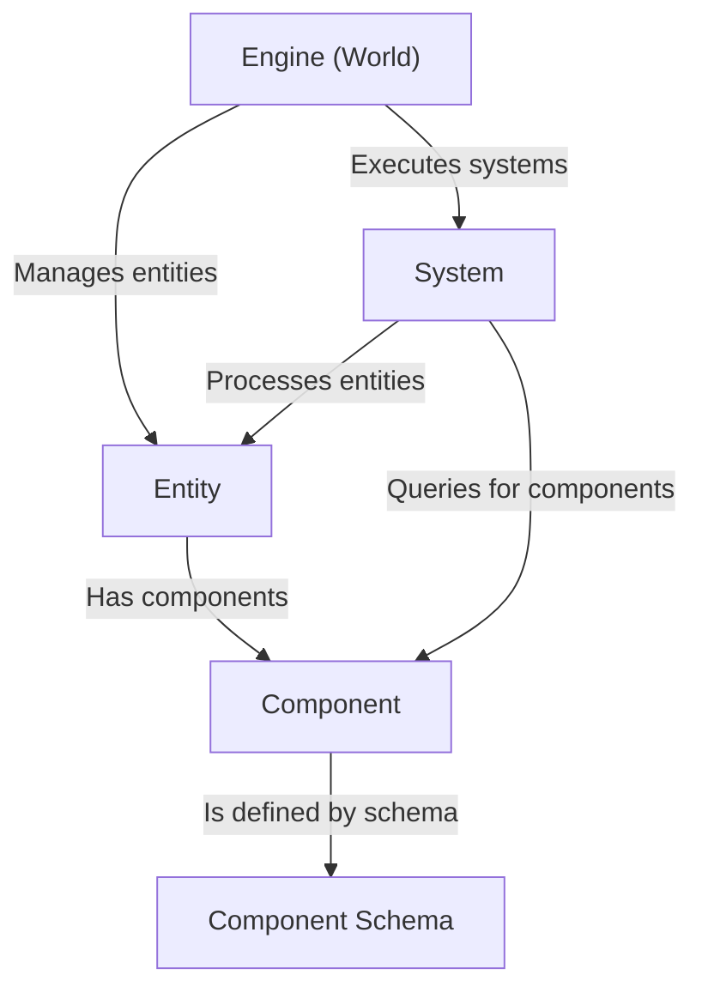

# Entity component system

The Entity Component System (ECS) is a software architecture pattern used in the iR Engine for organizing game and application elements in a modular, efficient manner. This pattern separates identity, data, and logic into three distinct concepts:

1. **Entities** are unique identifiers that represent individual objects in the application
2. **Components** are pure data containers that define the properties and characteristics of entities
3. **Systems** contain the logic that processes entities based on the components they possess

This separation provides numerous benefits, including improved performance, better code organization, and enhanced flexibility. The ECS architecture is particularly well-suited for complex applications with many interacting objects, such as games, simulations, and interactive environments.

## Architecture overview

The ECS architecture in iR Engine consists of five key elements that work together:

1. **Entity**: A unique identifier (typically a number) that represents a distinct object in the application
2. **Component**: A container for related data that defines specific aspects of an entity (e.g., position, health, appearance)
3. **System**: Logic that processes entities with specific component combinations to implement behaviors
4. **Engine (World)**: The central manager that maintains all entities and components, and orchestrates system execution
5. **Component Schema**: Definitions that specify the structure, data types, and default values for components

## Documentation chapters

1. [Entity](01_entity_.md)
2. [Component](02_component_.md)
3. [System](03_system_.md)
4. [Engine (World)](04_engine__world__.md)
5. [Component Schema](05_component_schema_.md)

---

