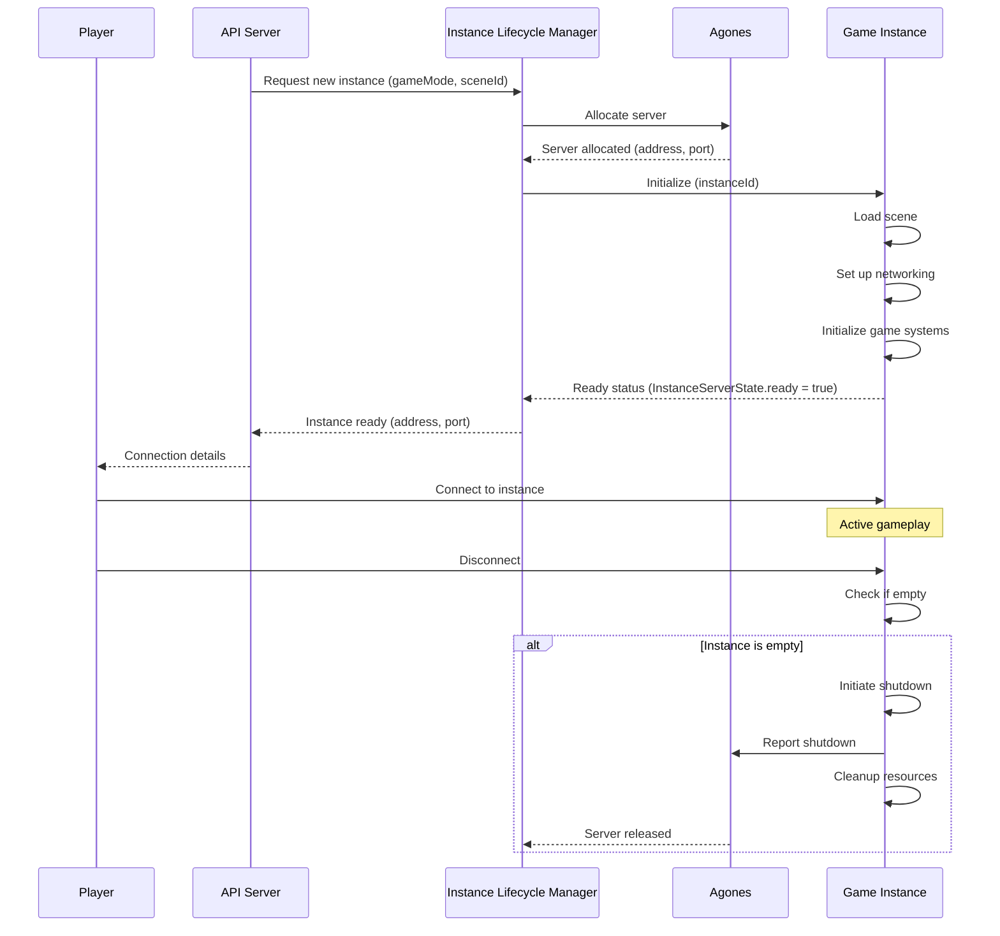

# Instance lifecycle management

## Overview

The Instance Lifecycle Management system is a core component of the iR Engine's multiplayer infrastructure that handles the creation, initialization, operation, and termination of game server instances. It ensures that game environments are efficiently provisioned when needed and properly released when no longer in use.

By managing the complete lifecycle of server instances, this system enables dynamic scaling of multiplayer games while optimizing resource utilization. This chapter explores the implementation, stages, and workflow of instance lifecycle management within the iR Engine.

## Core concepts

### Game instances

In the iR Engine, an instance represents a discrete game environment:

- **Game session**: A specific match or gameplay session (e.g., a 5v5 team match)
- **World shard**: A portion of a larger persistent game world
- **Media room**: A communication space with audio/video capabilities
- **Dedicated environment**: A self-contained space for specific gameplay activities
- **Resource boundary**: A unit of server resources allocated to a specific purpose

Each instance operates independently with its own state, players, and resources.

### Lifecycle stages

Game instances progress through several defined stages:

1. **Request and creation**: The initial request and allocation of server resources
2. **Initialization**: Setting up the game environment and required systems
3. **Ready state**: The instance is prepared and available for players to join
4. **Active gameplay**: The instance is hosting active gameplay with connected players
5. **Updates and maintenance**: Modifications to the running instance as needed
6. **Shutdown and cleanup**: Termination of the instance and release of resources

These stages ensure proper management of server resources throughout the instance's existence.

### Orchestration integration

The lifecycle management system often integrates with container orchestration platforms:

- **Kubernetes**: Container orchestration for managing server deployments
- **Agones**: Game server-specific extension for Kubernetes
- **Fleet management**: Grouping and scaling of similar server instances
- **Health monitoring**: Tracking the status and performance of instances
- **Resource allocation**: Efficient distribution of computing resources

This integration enables scalable and reliable deployment of game servers.

## Implementation

### Instance state management

The system tracks instance state through a dedicated state structure:

```typescript
// From: src/InstanceServerState.ts
import { defineState } from '@ir-engine/hyperflux';
import { InstanceType } from './types/InstanceType';

export const InstanceServerState = defineState({
  name: 'ee.instanceserver.InstanceServerState',
  initial: {
    // Whether the instance is ready for players
    ready: false,

    // Details about this specific instance
    instance: null! as InstanceType,

    // Whether this is a media-only instance
    isMediaInstance: false,

    // The current scene being hosted
    currentScene: null! as { name: string, sceneId: string },

    // Connection information
    address: '',
    port: -1,

    // Other state properties as needed
  }
});
```

This state structure:
- Tracks whether the instance is ready for players
- Stores details about the specific instance being hosted
- Indicates whether it's a media-only instance
- Maintains information about the current scene
- Records network connection details
- Provides a central reference point for instance status

### Instance initialization

The initialization process prepares a server for hosting a specific game instance:

```typescript
// Simplified from: src/channels.ts
async function initializeInstance(app, instanceId) {
  const logger = app.get('logger');
  logger.info(`Initializing instance ${instanceId}`);

  // Get instance data from the database
  const instanceResult = await app.service('instance').get(instanceId);

  // Update the instance state
  const instanceServerState = getMutableState(InstanceServerState);
  instanceServerState.instance.set(instanceResult);

  // If using Kubernetes/Agones, mark this server as allocated
  if (config.kubernetes.enabled) {
    const serverState = app.get('serverState');
    await serverState.agonesSDK.allocate();
    logger.info('Agones server allocated');
  }

  // Initialize the game engine
  await initializeEngine(app);

  // Load the appropriate scene
  await loadScene(instanceResult.sceneId);

  // Mark the instance as ready
  instanceServerState.ready.set(true);
  logger.info(`Instance ${instanceId} initialized and ready`);

  return instanceResult;
}
```

This function:
1. Retrieves instance data from the database
2. Updates the instance state with the retrieved data
3. Allocates the server through Agones if using Kubernetes
4. Initializes the game engine with appropriate settings
5. Loads the required scene for this instance
6. Marks the instance as ready for players to join

### Scene loading

Loading the appropriate scene is a critical part of instance initialization:

```typescript
// Simplified from: src/channels.ts
async function loadScene(sceneId) {
  const logger = app.get('logger');
  logger.info(`Loading scene ${sceneId}`);

  // Get scene data from the database
  const sceneResult = await app.service('scene').get(sceneId);

  // Update the current scene in the instance state
  const instanceServerState = getMutableState(InstanceServerState);
  instanceServerState.currentScene.set({
    name: sceneResult.name,
    sceneId: sceneResult.id
  });

  // Load the scene in the engine
  SceneState.loadScene(sceneResult.url, sceneResult.id);

  // Initialize scene-specific systems
  initializeSceneSystems(sceneResult);

  logger.info(`Scene ${sceneId} loaded successfully`);
}
```

This function:
1. Retrieves scene data from the database
2. Updates the current scene information in the instance state
3. Loads the scene into the game engine
4. Initializes any scene-specific systems or components
5. Logs the successful scene loading

### User connection handling

The system manages user connections to instances:

```typescript
// Simplified from: src/channels.ts
async function updateInstance(app, user, instanceId) {
  const logger = app.get('logger');

  // Check if the instance exists
  const instanceResult = await app.service('instance').get(instanceId);
  if (!instanceResult) {
    throw new Error(`Instance ${instanceId} not found`);
  }

  // Get the current instance state
  const instanceServerState = getState(InstanceServerState);

  // If the instance is not initialized, initialize it
  if (!instanceServerState.instance || instanceServerState.instance.id !== instanceId) {
    await initializeInstance(app, instanceId);
  }

  // Check if the instance is ready
  if (!instanceServerState.ready) {
    throw new Error(`Instance ${instanceId} is not ready`);
  }

  // Check if the user is authorized to join this instance
  if (!isUserAuthorized(user, instanceResult)) {
    throw new Error(`User ${user.id} is not authorized to join instance ${instanceId}`);
  }

  // Add the user to the instance
  await addUserToInstance(app, user, instanceId);

  logger.info(`User ${user.id} connected to instance ${instanceId}`);
  return instanceResult;
}
```

This function:
1. Verifies that the requested instance exists
2. Checks if the instance is already initialized on this server
3. Initializes the instance if necessary
4. Ensures the instance is ready for players
5. Verifies that the user is authorized to join
6. Adds the user to the instance
7. Returns the instance details

### User disconnection and cleanup

The system handles user disconnections and potential instance shutdown:

```typescript
// Simplified from: src/channels.ts
async function handleUserDisconnect(app, user) {
  const logger = app.get('logger');
  logger.info(`User ${user.id} disconnected`);

  // Get the current instance state
  const instanceServerState = getState(InstanceServerState);
  const instanceId = instanceServerState.instance?.id;

  if (!instanceId) {
    logger.warn('No active instance found during user disconnect');
    return;
  }

  // Remove the user from the instance
  await removeUserFromInstance(app, user, instanceId);

  // Check if the instance is now empty
  const connectedUsers = await getInstanceUsers(app, instanceId);

  // If the instance is empty and configured for auto-shutdown, shut it down
  if (connectedUsers.length === 0 && instanceServerState.instance?.autoShutdownWhenEmpty) {
    logger.info(`Instance ${instanceId} is empty, initiating shutdown`);
    await shutdownServer(app, instanceId);
  }
}
```

This function:
1. Logs the user disconnection
2. Identifies the current instance
3. Removes the user from the instance
4. Checks if the instance is now empty
5. Initiates server shutdown if the instance is empty and configured for auto-shutdown

### Server shutdown

The shutdown process terminates an instance and releases resources:

```typescript
// Simplified from: src/channels.ts
async function shutdownServer(app, instanceId) {
  const logger = app.get('logger');
  logger.info(`Shutting down instance ${instanceId}`);

  // Mark the instance as ended in the database
  await app.service('instance').patch(instanceId, {
    ended: true,
    endedAt: new Date()
  });

  // Disconnect any remaining users
  await disconnectAllUsers(app, instanceId);

  // Perform any necessary cleanup
  await cleanupInstance(app, instanceId);

  // If using Kubernetes/Agones, tell it we're shutting down
  if (config.kubernetes.enabled) {
    const serverState = app.get('serverState');
    await serverState.agonesSDK.shutdown();
    logger.info('Agones server shutdown initiated');
  }

  logger.info(`Instance ${instanceId} shutdown complete`);
}
```

This function:
1. Marks the instance as ended in the database
2. Disconnects any remaining users
3. Performs necessary cleanup operations
4. Signals to Agones that the server is shutting down
5. Logs the completion of the shutdown process

## Server process initialization

The server process itself is initialized when it first starts:

```typescript
// Simplified from: src/start.ts
import { AgonesSDK } from '@google-cloud/agones-sdk';

async function start() {
  const logger = app.get('logger');
  logger.info('Starting instance server');

  // Initialize the application
  const app = await createApp();

  // If using Kubernetes/Agones, connect to the Agones SDK
  if (config.kubernetes.enabled) {
    const agonesSDK = new AgonesSDK();

    // Connect to the Agones system
    await agonesSDK.connect();
    logger.info('Connected to Agones SDK');

    // Tell Agones this server is ready to host a game
    await agonesSDK.ready();
    logger.info('Reported ready status to Agones');

    // Set up a health check heartbeat
    setInterval(() => agonesSDK.health(), 1000);

    // Store the SDK for later use
    app.set('serverState', { agonesSDK });
  }

  // Start listening for connections
  const server = app.listen(app.get('port'));
  logger.info(`Instance server listening on port ${app.get('port')}`);

  return { app, server };
}
```

This function:
1. Creates the application instance
2. Connects to the Agones SDK if using Kubernetes
3. Reports ready status to Agones
4. Sets up a health check heartbeat
5. Starts listening for connections
6. Returns the application and server instances

## Instance lifecycle workflow

The complete instance lifecycle follows this sequence:



This diagram illustrates:
1. The API server requests a new instance
2. The Instance Lifecycle Manager allocates a server through Agones
3. The instance initializes and loads the required scene
4. The instance reports ready status
5. The player connects to the instance
6. Active gameplay occurs
7. The player disconnects
8. If the instance is empty, shutdown is initiated
9. The instance reports shutdown to Agones
10. Resources are cleaned up and released

## Integration with other components

The instance lifecycle management system integrates with several other components of the multiplayer infrastructure:

### Mediasoup WebRTC

The WebRTC communication system is initialized during instance startup:

```typescript
// Simplified integration with Mediasoup
async function initializeEngine(app) {
  // Initialize the WebRTC system
  const { routers, workers } = await startWebRTC();
  app.set('routers', routers);
  app.set('workers', workers);

  // Register the Mediasoup server system
  Engine.instance.systemRegistry.add(MediasoupServerSystem);

  logger.info('WebRTC communication system initialized');
}
```

This integration:
- Initializes the Mediasoup WebRTC system during instance startup
- Makes communication capabilities available to connected players
- Ensures real-time interaction is possible within the instance

### User connection and authorization

The instance lifecycle interacts with user authentication:

```typescript
// Simplified integration with user connection
app.on('connection', (connection) => {
  // When a user connects
  connection.on('login', async (authResult) => {
    try {
      // Authenticate the user
      const user = await authenticateUser(authResult);

      // Get the requested instance ID
      const { instanceId } = connection.handshake.query;

      // Update or initialize the instance
      await updateInstance(app, user, instanceId);

      // Notify the user of successful connection
      connection.emit('instance-ready', {
        status: 'success',
        instanceId
      });
    } catch (error) {
      connection.emit('instance-ready', {
        status: 'error',
        message: error.message
      });
    }
  });

  // When a user disconnects
  connection.on('disconnect', async () => {
    const user = connection.user;
    if (user) {
      await handleUserDisconnect(app, user);
    }
  });
});
```

This integration:
- Processes user authentication when connecting to an instance
- Ensures the instance is initialized and ready
- Handles user disconnection and potential instance shutdown
- Maintains the relationship between users and instances

### FeathersJS services

The instance lifecycle uses FeathersJS services for data management:

```typescript
// Simplified integration with FeathersJS services
async function initializeInstance(app, instanceId) {
  // Get instance data from the database using the instance service
  const instanceResult = await app.service('instance').get(instanceId);

  // Get scene data using the scene service
  const sceneResult = await app.service('scene').get(instanceResult.sceneId);

  // Update instance status using the instance service
  await app.service('instance').patch(instanceId, {
    status: 'active',
    currentUsers: 0
  });

  // Other initialization steps
}
```

This integration:
- Uses FeathersJS services to access and update instance data
- Maintains consistent state between the server and database
- Leverages the service architecture for data operations

## Benefits of instance lifecycle management

The Instance Lifecycle Management system provides several key advantages:

1. **Resource efficiency**: Ensures server resources are only used when needed
2. **Dynamic scaling**: Supports creating and removing instances based on demand
3. **Isolation**: Keeps game sessions separate and independent
4. **Reliability**: Handles the complete lifecycle including proper cleanup
5. **Orchestration**: Integrates with container orchestration for robust deployment
6. **Automation**: Reduces manual intervention in server management
7. **Observability**: Provides visibility into instance status and health

These benefits make the instance lifecycle management system an essential component for creating scalable and efficient multiplayer games.

## Next steps

With an understanding of how game instances are managed, the next chapter explores how users connect to these instances and get authorized to participate.

Next: [User connection and authorization](03_user_connection_and_authorization_.md)

---


