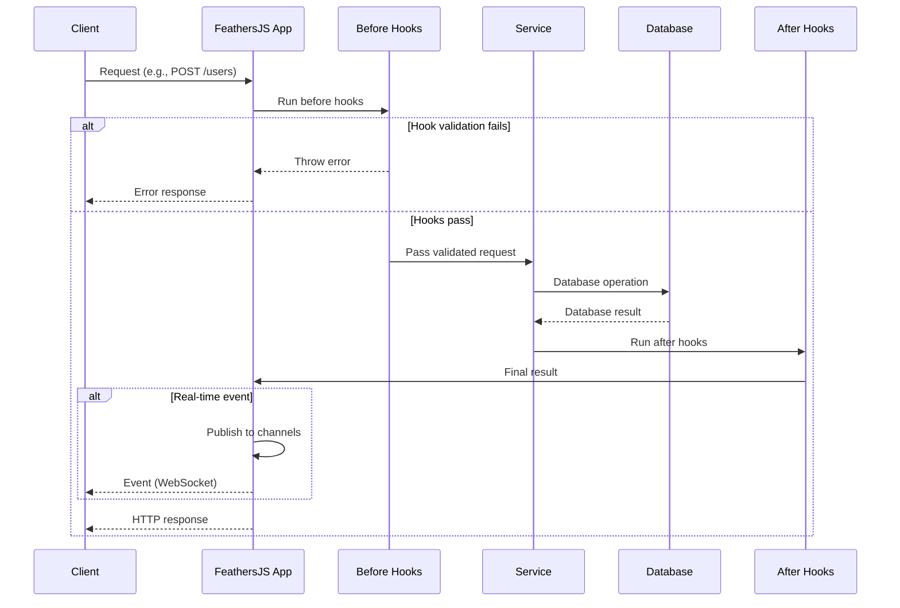

# FeathersJS application & services

## Overview

The FeathersJS Application & Services component forms the foundation of the iR Engine's multiplayer infrastructure, providing a structured framework for building and organizing server-side functionality. It enables the creation of modular, reusable services that handle specific aspects of the multiplayer system, such as user management, instance tracking, and real-time communication. By leveraging FeathersJS's architecture, the iR Engine achieves a clean separation of concerns, standardized API patterns, and robust real-time capabilities. This chapter explores the implementation, structure, and benefits of the FeathersJS framework within the iR Engine.

## Core concepts

### Application structure

The FeathersJS application provides a structured environment for server-side code:

- **Application instance**: The central `app` object that coordinates all functionality
- **Service registration**: A mechanism for adding services to the application
- **Middleware**: Functions that process requests and responses
- **Configuration**: Settings that control application behavior
- **Hooks**: Logic that runs before, after, or during service method execution

This structure creates a consistent and organized approach to server development.

### Service-oriented architecture

Services are the primary building blocks of a FeathersJS application:

- **Resource encapsulation**: Each service manages a specific type of data or functionality
- **Standard methods**: Consistent interfaces (`find`, `get`, `create`, `update`, `patch`, `remove`)
- **Data access**: Abstraction over database operations
- **Business logic**: Implementation of domain-specific rules
- **Event emission**: Automatic events when data changes

This service-oriented approach promotes modularity and reusability.

### Real-time capabilities

FeathersJS includes built-in support for real-time communication:

- **WebSocket integration**: Seamless support for persistent connections
- **Event broadcasting**: Automatic publication of service events
- **Channels**: Selective distribution of events to specific clients
- **Real-time updates**: Instant notification of data changes
- **Bi-directional communication**: Both server-to-client and client-to-server messaging

These capabilities are essential for responsive multiplayer experiences.

## Implementation

### Application initialization

The FeathersJS application is initialized during server startup:

```typescript
// Simplified from: src/start.ts
import { createFeathersKoaApp } from '@ir-engine/server-core/src/createApp';
import { ServerMode } from '@ir-engine/server-core/src/ServerState';

export const start = async () => {
  // Create the Feathers application with Koa as the HTTP framework
  const app = await createFeathersKoaApp(ServerMode.Instance, {
    // Configuration options
    logger: createLogger('instance-server'),
    authentication: {
      entity: 'identity-provider',
      service: 'identity-provider',
      authStrategies: ['jwt']
    },
    paginate: {
      default: 10,
      max: 100
    }
  });
  
  // Configure services
  app.configure(configureServices);
  
  // Configure channels for real-time events
  app.configure(configureChannels);
  
  // Configure middleware
  app.configure(configureMiddleware);
  
  // Start listening for connections
  const server = app.listen(app.get('port'));
  
  // Log successful startup
  app.get('logger').info(`Server started on port ${app.get('port')}`);
  
  return app;
};
```

This function:
1. Creates a FeathersJS application using Koa as the HTTP framework
2. Configures the application with appropriate settings
3. Sets up services, channels, and middleware
4. Starts the server listening for connections
5. Returns the initialized application

### Service definition

Services are defined to handle specific resources or functionality:

```typescript
// Simplified service definition
import { ServiceMethods } from '@feathersjs/feathers';
import { Application } from '../declarations';

// Interface for the service methods
interface UserService extends ServiceMethods<any> {
  // Additional custom methods can be defined here
}

// Implementation of the service
class UserServiceImpl implements UserService {
  app: Application;
  options: any;
  
  constructor(options = {}, app: Application) {
    this.options = options;
    this.app = app;
  }
  
  // Find multiple users
  async find(params?: any): Promise<any> {
    const { query = {} } = params || {};
    
    // Database query logic
    const users = await this.app.get('knex')('user')
      .where(query)
      .select('*');
    
    return {
      total: users.length,
      limit: query.$limit || 10,
      skip: query.$skip || 0,
      data: users
    };
  }
  
  // Get a single user by ID
  async get(id: string, params?: any): Promise<any> {
    const user = await this.app.get('knex')('user')
      .where({ id })
      .first();
    
    if (!user) {
      throw new Error('User not found');
    }
    
    return user;
  }
  
  // Create a new user
  async create(data: any, params?: any): Promise<any> {
    // Validation logic
    if (!data.email) {
      throw new Error('Email is required');
    }
    
    // Create the user
    const [id] = await this.app.get('knex')('user')
      .insert(data)
      .returning('id');
    
    // Return the created user
    return this.get(id, params);
  }
  
  // Update a user (replace)
  async update(id: string, data: any, params?: any): Promise<any> {
    // Update logic
    await this.app.get('knex')('user')
      .where({ id })
      .update(data);
    
    // Return the updated user
    return this.get(id, params);
  }
  
  // Patch a user (partial update)
  async patch(id: string, data: any, params?: any): Promise<any> {
    // Patch logic
    await this.app.get('knex')('user')
      .where({ id })
      .update(data);
    
    // Return the patched user
    return this.get(id, params);
  }
  
  // Remove a user
  async remove(id: string, params?: any): Promise<any> {
    // Get the user before removal
    const user = await this.get(id, params);
    
    // Remove the user
    await this.app.get('knex')('user')
      .where({ id })
      .delete();
    
    // Return the removed user
    return user;
  }
}

// Function to register the service with the application
export default function(app: Application): void {
  // Create an instance of the service
  const service = new UserServiceImpl({}, app);
  
  // Register the service on a path
  app.use('/users', service);
  
  // Get the registered service
  const userService = app.service('users');
  
  // Set up hooks
  userService.hooks({
    before: {
      all: [/* hooks that run before all methods */],
      find: [/* hooks that run before find */],
      get: [/* hooks that run before get */],
      create: [/* hooks that run before create */],
      update: [/* hooks that run before update */],
      patch: [/* hooks that run before patch */],
      remove: [/* hooks that run before remove */]
    },
    after: {
      all: [/* hooks that run after all methods */],
      // ... other method hooks
    },
    error: {
      all: [/* hooks that run on errors */],
      // ... other method hooks
    }
  });
}
```

This code:
1. Defines a service interface extending FeathersJS's `ServiceMethods`
2. Implements the standard service methods (`find`, `get`, `create`, etc.)
3. Includes database interaction logic for each method
4. Registers the service with the application on a specific path
5. Sets up hooks for additional processing before and after method execution

### Hook implementation

Hooks provide a way to add logic before, after, or during service method execution:

```typescript
// Example authentication hook
import { Hook, HookContext } from '@feathersjs/feathers';

// Hook to authenticate users
export const authenticate: Hook = async (context: HookContext) => {
  // Get the authentication service
  const { app, params } = context;
  const authService = app.service('authentication');
  
  // Check if the request includes an authentication token
  if (!params.headers?.authorization) {
    throw new Error('Authentication token missing');
  }
  
  try {
    // Verify the token
    const authResult = await authService.strategies.jwt.authenticate({
      accessToken: params.headers.authorization.replace('Bearer ', '')
    }, {});
    
    // Add the authenticated user to the context
    context.params.user = authResult.user;
    
    // Continue with the request
    return context;
  } catch (error) {
    throw new Error('Invalid authentication token');
  }
};

// Example validation hook
export const validateUserData: Hook = (context: HookContext) => {
  const { data } = context;
  
  // Check required fields
  if (!data.email) {
    throw new Error('Email is required');
  }
  
  if (!data.password) {
    throw new Error('Password is required');
  }
  
  // Validate email format
  const emailRegex = /^[^\s@]+@[^\s@]+\.[^\s@]+$/;
  if (!emailRegex.test(data.email)) {
    throw new Error('Invalid email format');
  }
  
  // Continue with the request
  return context;
};
```

These hooks:
1. Implement specific functionality that can be applied to service methods
2. Modify the context object to affect the request or response
3. Can be combined and reused across different services
4. Provide a clean way to separate concerns like authentication and validation

### Channel configuration

Channels are configured to manage real-time event distribution:

```typescript
// Simplified from: src/channels.ts
export default function(app: Application): void {
  app.on('connection', (connection: any) => {
    // When a client connects
    console.log('New connection', connection);
    
    // On successful login
    connection.on('login', (authResult: any) => {
      // Add this connection to the user's channel
      app.channel(`userIds/${authResult.user.id}`).join(connection);
      
      // If the user is connected to an instance
      if (connection.instanceId) {
        // Add this connection to the instance's channel
        app.channel(`instanceIds/${connection.instanceId}`).join(connection);
      }
    });
    
    // On disconnection
    connection.on('disconnect', () => {
      // Remove this connection from all channels
      app.channel(app.channels).leave(connection);
    });
  });
  
  // Configure event publishing
  app.publish((data: any, context: any) => {
    const { service, path, method, result } = context;
    
    // Determine which channels should receive this event
    if (path === 'messages' && method === 'create') {
      // If this is a new message, send it to the instance channel
      return app.channel(`instanceIds/${result.instanceId}`);
    }
    
    if (path === 'users' && (method === 'patch' || method === 'update')) {
      // If a user is updated, send it to that user's channel
      return app.channel(`userIds/${result.id}`);
    }
    
    // Default: no publishing
    return null;
  });
}
```

This configuration:
1. Sets up event handlers for client connections, logins, and disconnections
2. Manages channel membership based on user authentication and instance association
3. Defines publishing rules to determine which clients receive which events
4. Creates a selective real-time communication system

## Service usage

Services are used throughout the application to access and manipulate data:

```typescript
// Example of using services in the application
async function handleUserConnection(app: Application, userId: string, instanceId: string) {
  try {
    // Get user information
    const user = await app.service('users').get(userId);
    
    // Get instance information
    const instance = await app.service('instances').get(instanceId);
    
    // Check if the user is banned
    const bans = await app.service('bans').find({
      query: {
        userId: userId,
        active: true
      }
    });
    
    if (bans.total > 0) {
      throw new Error('User is banned');
    }
    
    // Record the user's connection to the instance
    await app.service('user-instances').create({
      userId: userId,
      instanceId: instanceId,
      connectedAt: new Date()
    });
    
    // Notify other users in the instance
    await app.service('messages').create({
      type: 'user-joined',
      instanceId: instanceId,
      userId: userId,
      content: `${user.name} has joined the instance`
    });
    
    return { user, instance };
  } catch (error) {
    console.error('Error handling user connection:', error);
    throw error;
  }
}
```

This function:
1. Uses multiple services to retrieve and manipulate data
2. Follows a consistent pattern for service method calls
3. Leverages the standard service methods (`get`, `find`, `create`)
4. Demonstrates how services work together to implement complex functionality

## Service workflow

The complete service workflow follows this sequence:



This diagram illustrates:
1. The client sends a request to the FeathersJS application
2. Before hooks run to validate and process the request
3. If hooks pass, the service method executes the core logic
4. The service interacts with the database
5. After hooks process the result
6. Real-time events are published to appropriate channels
7. The response is sent back to the client

## Integration with other components

The FeathersJS application integrates with several other components of the multiplayer infrastructure:

### Instance lifecycle management

Services manage instance lifecycle data:

```typescript
// Example of instance lifecycle integration
class InstanceService {
  // Create a new instance
  async create(data: any, params?: any): Promise<any> {
    // Create the instance record
    const instance = await this.app.get('knex')('instance')
      .insert({
        name: data.name,
        sceneId: data.sceneId,
        maxUsers: data.maxUsers || 10,
        isPrivate: data.isPrivate || false,
        createdAt: new Date(),
        status: 'initializing'
      })
      .returning('*')
      .then(rows => rows[0]);
    
    // Request instance server allocation
    if (this.app.get('kubernetes').enabled) {
      await this.allocateInstanceServer(instance.id);
    }
    
    return instance;
  }
  
  // Update instance status
  async updateStatus(id: string, status: string): Promise<any> {
    return this.patch(id, { status });
  }
  
  // End an instance
  async end(id: string): Promise<any> {
    return this.patch(id, {
      status: 'ended',
      endedAt: new Date()
    });
  }
}
```

This integration:
- Provides services for creating, updating, and ending instances
- Maintains instance state in the database
- Coordinates with the instance lifecycle management system
- Triggers server allocation when needed

### User connection and authorization

Services handle user authentication and authorization:

```typescript
// Example of user connection integration
class AuthenticationService {
  // Verify a token
  async verifyToken(token: string): Promise<any> {
    return this.app.service('authentication').strategies.jwt.authenticate({
      accessToken: token
    }, {});
  }
}

class InstanceAuthorizationService {
  // Check if a user is authorized for an instance
  async checkAuthorization(userId: string, instanceId: string): Promise<boolean> {
    const instance = await this.app.service('instances').get(instanceId);
    
    // Public instances are open to all
    if (!instance.isPrivate) {
      return true;
    }
    
    // Check for explicit authorization
    const authorizations = await this.find({
      query: {
        userId,
        instanceId
      }
    });
    
    return authorizations.total > 0;
  }
}
```

This integration:
- Provides services for authentication and authorization
- Verifies user identity through token validation
- Checks instance-specific permissions
- Supports the user connection process

### WebRTC communication

Services coordinate with the WebRTC communication system:

```typescript
// Example of WebRTC integration
class MediasoupService {
  // Create a WebRTC transport
  async createTransport(data: any): Promise<any> {
    const { userId, instanceId, direction } = data;
    
    // Ensure the user is connected to the instance
    await this.app.service('user-instances').get({
      userId,
      instanceId
    });
    
    // Create the transport
    const transport = await handleWebRtcTransportCreate({
      userId,
      direction
    });
    
    // Store the transport
    return this.app.service('transports').create({
      userId,
      instanceId,
      direction,
      transportId: transport.id,
      iceParameters: transport.iceParameters,
      iceCandidates: transport.iceCandidates,
      dtlsParameters: transport.dtlsParameters
    });
  }
}
```

This integration:
- Provides services for managing WebRTC components
- Coordinates with the Mediasoup WebRTC system
- Stores transport information for connected users
- Ensures users are authorized for WebRTC operations

## Benefits of FeathersJS

The FeathersJS Application & Services component provides several key advantages:

1. **Modularity**: Organizes server functionality into discrete, focused services
2. **Standardization**: Provides consistent interfaces for data operations
3. **Real-time capabilities**: Enables instant updates through WebSocket integration
4. **Middleware support**: Allows for request/response processing with hooks
5. **Authentication**: Includes built-in support for user authentication
6. **Scalability**: Supports horizontal scaling through stateless service design
7. **Extensibility**: Makes it easy to add new functionality through additional services

These benefits make FeathersJS an ideal foundation for the iR Engine's multiplayer infrastructure.

## Next steps

With an understanding of how the application is structured and services are organized, the next chapter explores how the system manages state and actions.

Next: [Hyperflux state & action system](05_hyperflux_state___action_system_.md)

---


