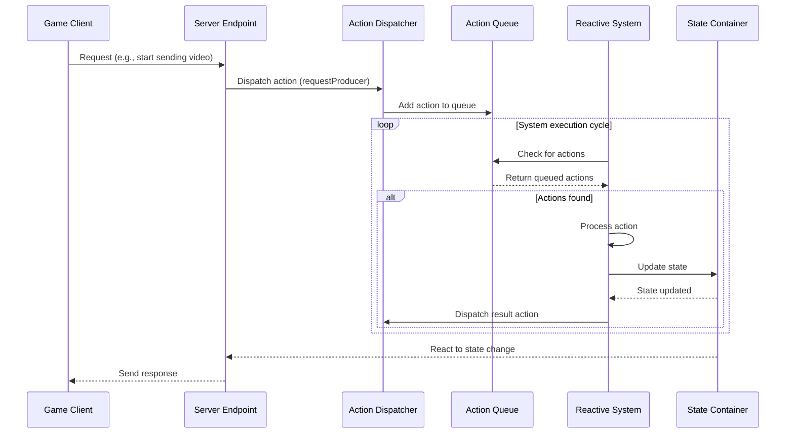

# Hyperflux state & action system

## Overview

The Hyperflux State & Action System is a core component of the iR Engine's multiplayer infrastructure that provides a reactive state management solution for tracking and synchronizing application state. It enables different parts of the system to maintain awareness of current conditions and coordinate responses to events in a structured manner. 

By implementing a centralized approach to state management with a clear action dispatch mechanism, Hyperflux creates a predictable data flow that enhances maintainability and scalability. This chapter explores the implementation, patterns, and benefits of the Hyperflux system within the iR Engine.

## Core concepts

### State management

Hyperflux provides a structured approach to managing application state:

- **State containers**: Dedicated objects that store specific pieces of information
- **Immutability**: State changes create new state objects rather than modifying existing ones
- **Centralization**: Single source of truth for each piece of state
- **Reactivity**: Automatic notifications when state changes
- **Accessibility**: Consistent patterns for accessing state throughout the application

This approach creates a predictable and maintainable state management system.

### Action-based communication

Actions serve as the primary mechanism for signaling events and requesting changes:

- **Action definition**: Structured objects that describe what happened or what should happen
- **Action dispatch**: A process for sending actions to the system
- **Action queues**: Collections of actions waiting to be processed
- **Type safety**: Strongly typed actions with defined payloads
- **Traceability**: Clear path of action creation and handling

This pattern creates a decoupled communication system between components.

### Reactive systems

Reactive systems (or reactors) respond to state changes and actions:

- **Continuous monitoring**: Systems that watch for specific state changes or actions
- **Selective processing**: Handling only relevant actions or state updates
- **Side effects**: Performing operations in response to changes
- **State updates**: Modifying state based on actions or other state changes
- **Component coordination**: Enabling different parts of the system to work together

This reactive approach creates a dynamic and responsive application architecture.

## Implementation

### State definition

States are defined using a declarative pattern:

```typescript
// From: src/InstanceServerState.ts
import { defineState } from '@ir-engine/hyperflux';
import { InstanceType } from './types/InstanceType';

export const InstanceServerState = defineState({
  name: 'ee.instanceserver.InstanceServerState',
  initial: {
    // Whether the instance is ready for players
    ready: false,
    
    // Details about this specific instance
    instance: null! as InstanceType,
    
    // Whether this is a media-only instance
    isMediaInstance: false,
    
    // The current scene being hosted
    currentScene: null! as { name: string, sceneId: string },
    
    // Connection information
    address: '',
    port: -1
  }
});
```

This code:
- Defines a state container named `InstanceServerState`
- Specifies the initial values for each state property
- Uses TypeScript for type safety
- Creates a centralized location for instance-related state

### State access and modification

Hyperflux provides utilities for accessing and modifying state:

```typescript
// Example of state access and modification
import { getState, getMutableState } from '@ir-engine/hyperflux';
import { InstanceServerState } from './InstanceServerState';

// Read-only access to state
function checkIfInstanceReady(): boolean {
  const instanceState = getState(InstanceServerState);
  return instanceState.ready;
}

// Modifying state
function markInstanceAsReady(): void {
  const mutableInstanceState = getMutableState(InstanceServerState);
  mutableInstanceState.ready.set(true);
  
  console.log('Instance is now ready for players');
}
```

This code:
- Uses `getState` for read-only access to state
- Uses `getMutableState` for modifying state
- Provides a clear distinction between reading and writing
- Follows a consistent pattern for state operations

### Action definition

Actions are defined using a structured pattern:

```typescript
// Example of action definitions
import { defineAction } from '@ir-engine/hyperflux';

// Define a namespace for related actions
export const MediasoupMediaProducerActions = {
  // Action to request a new producer
  requestProducer: defineAction({
    type: 'ee.mediasoup.PRODUCER_REQUEST', // Unique type identifier
    
    // Function to create the action with payload
    creator: (payload: {
      networkId: string;
      peerID: string;
      kind: 'audio' | 'video';
      rtpParameters: any;
      appData?: any;
    }) => {
      return { payload };
    }
  }),
  
  // Action to notify that a producer was created
  producerCreated: defineAction({
    type: 'ee.mediasoup.PRODUCER_CREATED',
    
    creator: (payload: {
      networkId: string;
      peerID: string;
      producerId: string;
      kind: 'audio' | 'video';
    }) => {
      return { payload };
    }
  })
};
```

This code:
- Defines a namespace for related actions
- Creates actions with unique type identifiers
- Specifies the payload structure for each action
- Provides creator functions for type-safe action creation

### Action dispatch

Actions are dispatched to signal events or request changes:

```typescript
// Example of action dispatch
import { dispatchAction } from '@ir-engine/hyperflux';
import { MediasoupMediaProducerActions } from './MediasoupMediaProducerActions';

// Function to handle a client request to produce media
function handleClientProducerRequest(
  networkId: string,
  peerID: string,
  kind: 'audio' | 'video',
  rtpParameters: any
): void {
  // Dispatch an action to request a producer
  dispatchAction(MediasoupMediaProducerActions.requestProducer({
    networkId,
    peerID,
    kind,
    rtpParameters
  }));
  
  console.log(`Dispatched request for ${kind} producer from peer ${peerID}`);
}
```

This code:
- Uses `dispatchAction` to send an action to the system
- Creates the action using the defined creator function
- Includes all necessary payload data
- Follows a consistent pattern for action dispatch

### Action queues

Action queues collect actions for processing:

```typescript
// Example of action queue definition
import { defineActionQueue } from '@ir-engine/hyperflux';
import { MediasoupMediaProducerActions } from './MediasoupMediaProducerActions';

// Create a queue for producer request actions
const requestProducerActionQueue = defineActionQueue(
  MediasoupMediaProducerActions.requestProducer.matches
);

// Create a queue for producer created actions
const producerCreatedActionQueue = defineActionQueue(
  MediasoupMediaProducerActions.producerCreated.matches
);
```

This code:
- Creates queues for specific action types
- Uses action matchers to filter actions
- Provides a way to collect actions for processing
- Separates action dispatch from action handling

### Reactive systems

Systems react to actions and state changes:

```typescript
// Simplified from: src/MediasoupServerSystem.tsx
import { defineSystem, useHookstate } from '@ir-engine/hyperflux';
import { MediasoupMediaProducerActions } from './MediasoupMediaProducerActions';
import { MediasoupMediaProducerState } from './MediasoupMediaProducerState';

// Define action queues
const requestProducerActionQueue = defineActionQueue(
  MediasoupMediaProducerActions.requestProducer.matches
);

// Define the system
export const MediasoupServerSystem = defineSystem({
  uuid: 'ee.instanceserver.MediasoupServerSystem',
  
  execute: () => {
    // Process all producer request actions
    for (const action of requestProducerActionQueue()) {
      handleRequestProducer(action);
    }
    
    // Other processing logic
  }
});

// Handler for producer requests
async function handleRequestProducer(action) {
  const { networkId, peerID, kind, rtpParameters } = action.payload;
  
  try {
    // Get the transport for this peer
    const transport = getTransportForPeer(networkId, peerID);
    
    // Create the producer
    const producer = await transport.produce({
      kind,
      rtpParameters
    });
    
    // Update state
    const producerState = getMutableState(MediasoupMediaProducerState);
    producerState.producers[networkId].merge({
      [producer.id]: {
        id: producer.id,
        peerID,
        kind
      }
    });
    
    // Dispatch a success action
    dispatchAction(MediasoupMediaProducerActions.producerCreated({
      networkId,
      peerID,
      producerId: producer.id,
      kind
    }));
    
    console.log(`Created ${kind} producer ${producer.id} for peer ${peerID}`);
  } catch (error) {
    console.error(`Failed to create producer:`, error);
    // Handle error
  }
}
```

This code:
- Defines a system with a unique identifier
- Implements an `execute` function that runs regularly
- Processes actions from the action queue
- Updates state based on action results
- Dispatches new actions to signal completion

### React-style components

Hyperflux supports React-style components for reactive logic:

```typescript
// Example of a React-style component
import { useHookstate } from '@ir-engine/hyperflux';
import { NetworkState } from './NetworkState';

// Component that reacts to network changes
const NetworkMonitor = () => {
  // Subscribe to network state
  const networks = useHookstate(getMutableState(NetworkState).networks);
  
  // Effect that runs when networks change
  useEffect(() => {
    console.log('Network state changed:', networks.value);
    
    // Check for disconnected peers
    for (const [networkId, network] of Object.entries(networks.value)) {
      for (const [peerID, peer] of Object.entries(network.peers)) {
        if (peer.connected && Date.now() - peer.lastSeenTs > 10000) {
          console.log(`Peer ${peerID} may be disconnected`);
          // Handle potential disconnection
        }
      }
    }
  }, [networks]);
  
  // This component doesn't render anything
  return null;
};
```

This code:
- Uses `useHookstate` to subscribe to state changes
- Implements a `useEffect` hook that runs when state changes
- Performs logic in response to state changes
- Follows React patterns for reactive programming

## State and action workflow

The complete Hyperflux workflow follows this sequence:



This diagram illustrates:
1. The client sends a request to the server
2. The server dispatches an action
3. The action is added to a queue
4. A system checks for actions during its execution cycle
5. The system processes the action and updates state
6. The system may dispatch a result action
7. Other components react to the state change
8. The server sends a response to the client

## Example: microphone muting

A practical example of Hyperflux in action is microphone muting:

```typescript
// Example of microphone muting with Hyperflux
import { dispatchAction, getMutableState } from '@ir-engine/hyperflux';
import { MediaActions } from './MediaActions';
import { UserMediaState } from './UserMediaState';

// Action definition
const MediaActions = {
  toggleMute: defineAction({
    type: 'ee.media.TOGGLE_MUTE',
    creator: (payload: { userId: string }) => ({ payload })
  })
};

// State definition
const UserMediaState = defineState({
  name: 'ee.media.UserMediaState',
  initial: {} as Record<string, {
    userId: string,
    isMuted: boolean,
    producerId: string
  }>
});

// Client request handler
function handleMuteRequest(userId: string) {
  // Dispatch the toggle mute action
  dispatchAction(MediaActions.toggleMute({ userId }));
}

// System that handles mute actions
const MediaSystem = defineSystem({
  uuid: 'ee.media.MediaSystem',
  
  execute: () => {
    // Process toggle mute actions
    for (const action of defineActionQueue(MediaActions.toggleMute.matches)()) {
      const { userId } = action.payload;
      
      // Get the current state
      const userMediaState = getMutableState(UserMediaState);
      const userMedia = userMediaState[userId];
      
      if (userMedia) {
        // Toggle the mute state
        const newMuteState = !userMedia.isMuted;
        userMediaState[userId].isMuted.set(newMuteState);
        
        // Get the producer
        const producer = getProducerById(userMedia.producerId);
        
        // Pause or resume the producer
        if (newMuteState) {
          producer.pause();
        } else {
          producer.resume();
        }
        
        console.log(`User ${userId} microphone ${newMuteState ? 'muted' : 'unmuted'}`);
      }
    }
  }
});
```

This example:
1. Defines an action for toggling mute state
2. Creates a state container for user media information
3. Implements a handler for client mute requests
4. Defines a system that processes mute actions
5. Updates state and performs the actual muting operation

## Integration with other components

The Hyperflux system integrates with several other components of the multiplayer infrastructure:

### Instance lifecycle management

Hyperflux manages instance state:

```typescript
// Example of instance lifecycle integration
import { getMutableState } from '@ir-engine/hyperflux';
import { InstanceServerState } from './InstanceServerState';

// Function to initialize an instance
async function initializeInstance(instanceId: string) {
  // Get instance data
  const instanceData = await fetchInstanceData(instanceId);
  
  // Update instance state
  const instanceState = getMutableState(InstanceServerState);
  instanceState.instance.set(instanceData);
  
  // Load the scene
  await loadScene(instanceData.sceneId);
  
  // Mark the instance as ready
  instanceState.ready.set(true);
  
  console.log(`Instance ${instanceId} initialized and ready`);
}
```

This integration:
- Uses Hyperflux state to track instance status
- Updates state as the instance progresses through its lifecycle
- Enables other components to react to instance state changes
- Provides a centralized source of truth for instance information

### WebRTC communication

Hyperflux coordinates WebRTC operations:

```typescript
// Example of WebRTC integration
import { dispatchAction, getMutableState } from '@ir-engine/hyperflux';
import { MediasoupTransportState } from './MediasoupTransportState';
import { MediasoupMediaProducerActions } from './MediasoupMediaProducerActions';

// Function to create a WebRTC transport
async function createTransport(networkId: string, direction: 'send' | 'recv') {
  // Create the transport
  const transport = await router.createWebRtcTransport({
    listenIps: [{ ip: '0.0.0.0', announcedIp: null }],
    enableUdp: true,
    enableTcp: true,
    preferUdp: true
  });
  
  // Update transport state
  const transportState = getMutableState(MediasoupTransportState);
  transportState.transports[networkId][direction].merge({
    id: transport.id,
    iceParameters: transport.iceParameters,
    iceCandidates: transport.iceCandidates,
    dtlsParameters: transport.dtlsParameters
  });
  
  console.log(`Created ${direction} transport ${transport.id} for network ${networkId}`);
  
  return transport;
}

// Function to handle a producer request
function handleProducerRequest(networkId: string, peerID: string, kind: 'audio' | 'video', rtpParameters: any) {
  // Dispatch an action to request a producer
  dispatchAction(MediasoupMediaProducerActions.requestProducer({
    networkId,
    peerID,
    kind,
    rtpParameters
  }));
}
```

This integration:
- Uses Hyperflux state to store WebRTC transport information
- Dispatches actions to request media producers
- Enables coordination between WebRTC components
- Maintains a consistent approach to state management

### User connection and authorization

Hyperflux tracks user connection state:

```typescript
// Example of user connection integration
import { getMutableState } from '@ir-engine/hyperflux';
import { NetworkState } from './NetworkState';

// Function to handle a user connection
function handleUserConnection(networkId: string, peerID: string, userId: string) {
  // Update network state
  const networkState = getMutableState(NetworkState);
  networkState.networks[networkId].peers[peerID].merge({
    userId,
    connected: true,
    lastSeenTs: Date.now()
  });
  
  console.log(`User ${userId} connected as peer ${peerID} on network ${networkId}`);
}

// Function to handle a user disconnection
function handleUserDisconnection(networkId: string, peerID: string) {
  // Update network state
  const networkState = getMutableState(NetworkState);
  
  // Check if the peer exists
  if (networkState.networks[networkId]?.peers[peerID]) {
    // Get the user ID before removing
    const userId = networkState.networks[networkId].peers[peerID].userId.value;
    
    // Mark as disconnected
    networkState.networks[networkId].peers[peerID].connected.set(false);
    
    console.log(`User ${userId} disconnected (peer ${peerID} on network ${networkId})`);
  }
}
```

This integration:
- Uses Hyperflux state to track user connections
- Updates state when users connect or disconnect
- Enables other components to react to connection changes
- Provides a centralized record of connected users

## Benefits of Hyperflux

The Hyperflux State & Action System provides several key advantages:

1. **Decoupling**: Components interact through state and actions rather than direct dependencies
2. **Centralization**: Provides a single source of truth for application state
3. **Predictability**: Creates a clear flow of data and actions
4. **Reactivity**: Enables automatic responses to state changes
5. **Testability**: Makes it easier to test components in isolation
6. **Scalability**: Supports complex state management as the application grows
7. **Traceability**: Provides clear paths for debugging state changes

These benefits make Hyperflux an essential foundation for the iR Engine's multiplayer infrastructure.

## Next steps

With an understanding of how the system manages state and actions, the next chapter explores a specific application of these concepts in media stream recording.

Next: [Media stream recording](06_media_stream_recording_.md)

---


