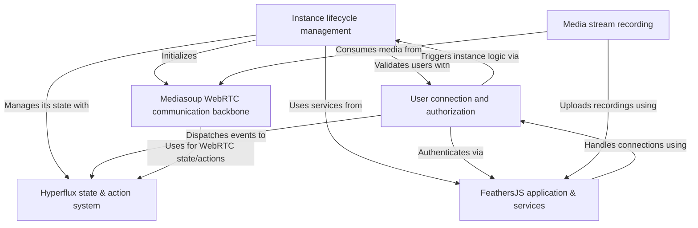

# Networking & multiplayer infrastructure

The multiplayer infrastructure of the iR Engine provides the foundation for building real-time multiplayer game servers. It manages the lifecycle of server instances, handles player connections and authorization, and enables real-time communication (audio, video, game data) using Mediasoup WebRTC. Player and server states are managed reactively by Hyperflux, and media streams can be recorded. The entire system is built upon the FeathersJS framework.

## Architecture overview

The multiplayer infrastructure consists of several interconnected components that work together to create a robust multiplayer experience:

## Documentation chapters

1. [Mediasoup WebRTC communication backbone](01_mediasoup_webrtc_communication_backbone_.md)
2. [Instance lifecycle management](02_instance_lifecycle_management_.md)
3. [User connection and authorization](03_user_connection_and_authorization_.md)
4. [FeathersJS application & services](04_feathersjs_application___services_.md)
5. [Hyperflux state & action system](05_hyperflux_state___action_system_.md)
6. [Media stream recording](06_media_stream_recording_.md)

---

