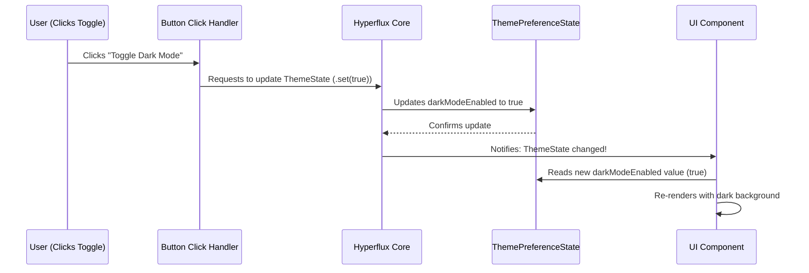

# Hyperflux state management

## Overview

Hyperflux is the primary state management system used in the iR Engine client core. It provides a centralized approach to managing application data and ensuring that the user interface stays synchronized with that data.

By implementing a reactive pattern, Hyperflux enables different parts of the application to respond automatically to data changes, creating a consistent and responsive user experience. This chapter explores the concepts, implementation, and usage of Hyperflux within the iR Engine client.

## Core concepts

### State management

State management refers to how an application handles and maintains its data over time. In a complex application like the iR Engine client, there are many pieces of information that need to be tracked:

- User authentication status and profile information
- UI preferences (theme settings, language, etc.)
- Current application view or route
- Active dialogs or modals
- Real-time data from server connections
- Local user interactions and temporary states

Without a structured approach to managing this data, applications can become difficult to maintain as the state becomes scattered across different components, leading to inconsistencies and bugs.

### Centralized state

Hyperflux implements a centralized state management pattern where:

1. All application state is stored in a central repository
2. Components access this state through a standardized API
3. State changes follow a predictable pattern
4. UI components automatically update when relevant state changes

This approach provides several benefits:
- Predictable data flow
- Easier debugging and state inspection
- Consistent state access patterns
- Automatic UI updates when data changes

## Implementation

### Defining state

The first step in using Hyperflux is defining a state object using the `defineState` function:

```typescript
// Example: Defining a theme preference state
import { defineState } from '@ir-engine/hyperflux';

export const ThemePreferenceState = defineState({
  name: 'ThemePreferenceState', // Unique identifier
  initial: {
    darkModeEnabled: false // Initial value
  }
});
```

This code:
1. Imports the `defineState` function from Hyperflux
2. Creates a new state definition with a unique name
3. Specifies the initial value for this state
4. Exports the state definition for use throughout the application

The `defineState` function registers this state with the Hyperflux system, making it available for components to access and modify.

### Reading state

Components can access state using hooks like `useMutableState` (for React components) or functions like `getState` (for non-React code):

```typescript
// Example: Reading state in a React component
import { useMutableState } from '@ir-engine/hyperflux';
import { ThemePreferenceState } from './ThemePreferenceState';

function ThemeToggleButton() {
  // Access the theme state
  const themePrefs = useMutableState(ThemePreferenceState);

  // Read the current value
  const isDarkModeOn = themePrefs.darkModeEnabled.value;

  return (
    <button>
      Turn Dark Mode {isDarkModeOn ? 'Off' : 'On'}
    </button>
  );
}
```

This component:
1. Imports the necessary functions and state definition
2. Uses `useMutableState` to access the theme preferences
3. Reads the current value of `darkModeEnabled`
4. Renders a button with text based on the current state

When using `useMutableState`, the component automatically re-renders whenever the accessed state changes, ensuring the UI stays in sync with the data.

### Modifying state

To change state values, components use functions like `getMutableState` and methods like `.set()`:

```typescript
// Example: Modifying state
import { getMutableState } from '@ir-engine/hyperflux';
import { ThemePreferenceState } from './ThemePreferenceState';

function handleThemeToggleClick() {
  // Get a mutable reference to the state
  const themePrefs = getMutableState(ThemePreferenceState);

  // Read the current value
  const currentMode = themePrefs.darkModeEnabled.value;

  // Set the new value (toggle it)
  themePrefs.darkModeEnabled.set(!currentMode);

  console.log('Dark mode is now:', themePrefs.darkModeEnabled.value);
}
```

This function:
1. Gets a mutable reference to the theme state
2. Reads the current value of `darkModeEnabled`
3. Sets a new value by toggling the current value
4. Logs the new state for debugging

When `.set()` is called, Hyperflux updates the state and notifies all components that are using this state, causing them to re-render with the new value.

## Reactivity system

The core of Hyperflux is its reactivity system, which ensures that UI components automatically update when the state they depend on changes.

### How reactivity works

The reactivity system follows these steps:

1. **Registration**: When a state is defined with `defineState`, Hyperflux registers it in its central system.
2. **Subscription**: When a component uses `useMutableState` to access a state, it subscribes to changes for that specific state.
3. **Notification**: When state is modified with `.set()`, Hyperflux:
   - Updates the value in its central store
   - Identifies all subscribers for that state
   - Notifies each subscriber that the state has changed
   - Triggers re-renders of affected components

This sequence diagram illustrates the process:



This reactive approach eliminates the need for manual UI updates when data changes, reducing bugs and simplifying code.

## Advanced usage

### Complex state structures

Hyperflux can manage complex nested state structures:

```typescript
// Example: Complex state with nested objects
export const UserProfileState = defineState({
  name: 'UserProfileState',
  initial: {
    personal: {
      name: '',
      email: '',
      avatar: ''
    },
    preferences: {
      notifications: {
        email: true,
        push: false,
        inApp: true
      },
      privacy: {
        showOnline: true,
        allowMessages: 'friends' // 'all', 'friends', 'none'
      }
    },
    statistics: {
      lastLogin: null,
      totalSessions: 0,
      averageSessionTime: 0
    }
  }
});
```

When working with nested structures, you can:
- Access nested properties: `userProfile.preferences.privacy.showOnline.value`
- Update nested properties: `userProfile.preferences.privacy.showOnline.set(false)`
- Update multiple properties: `userProfile.personal.merge({ name: 'Alice', email: 'alice@example.com' })`

### State actions

For more complex state updates, you can define actions within the state definition:

```typescript
// Example: State with actions
export const CounterState = defineState({
  name: 'CounterState',
  initial: {
    count: 0
  },

  // Actions are functions that modify the state
  increment: () => {
    const state = getMutableState(CounterState);
    state.count.set(state.count.value + 1);
  },

  decrement: () => {
    const state = getMutableState(CounterState);
    state.count.set(state.count.value - 1);
  },

  reset: () => {
    const state = getMutableState(CounterState);
    state.count.set(0);
  }
});

// Usage
CounterState.increment(); // Increases count by 1
CounterState.decrement(); // Decreases count by 1
CounterState.reset();     // Resets count to 0
```

Actions encapsulate state modification logic, making it easier to maintain and test.

### State composition

For complex applications, you can compose multiple state definitions:

```typescript
// Example: Composing multiple states
import { UserProfileState } from './UserProfileState';
import { ThemePreferenceState } from './ThemePreferenceState';
import { NotificationState } from './NotificationState';

function UserSettingsPage() {
  // Access multiple states
  const userProfile = useMutableState(UserProfileState);
  const themePrefs = useMutableState(ThemePreferenceState);
  const notifications = useMutableState(NotificationState);

  // Component logic using all three states
  // ...
}
```

This approach allows you to organize state logically while still accessing it easily where needed.

## Real-world examples

Let's examine some real examples from the iR Engine client codebase:

### Modal state management

The `ModalState` manages pop-up windows (modals) in the application:

```typescript
// Simplified from src/common/services/ModalState.tsx
import { defineState, getMutableState } from '@ir-engine/hyperflux';

// Define the shape of modal data
interface ModalData {
  element: JSX.Element;
  id: string;
}

export const ModalState = defineState({
  name: 'ee.client.ModalState',
  initial: {
    modals: [] as ModalData[]
  },

  // Action to open a modal
  openModal: (elementContent: JSX.Element) => {
    const modals = getMutableState(ModalState).modals;
    const id = generateUniqueId();
    modals.merge([{ element: elementContent, id }]);
    return id;
  },

  // Action to close a modal
  closeModal: (id: string) => {
    const state = getMutableState(ModalState);
    const currentModals = state.modals.value;
    const updatedModals = currentModals.filter(modal => modal.id !== id);
    state.modals.set(updatedModals);
  }
});
```

This state:
- Maintains a list of active modals
- Provides actions to open and close modals
- Generates unique IDs for each modal
- Updates the state when modals are added or removed

### Theme service

The `ThemeService` manages application themes (like light/dark mode):

```typescript
// Simplified from src/common/services/ThemeService.tsx
import { useMutableState, defineState, getMutableState } from '@ir-engine/hyperflux';
import { useEffect } from 'react';

// Define the theme state
export const ThemeState = defineState({
  name: 'ee.client.ThemeState',
  initial: {
    theme: 'light' // 'light' or 'dark'
  },

  // Action to toggle the theme
  toggleTheme: () => {
    const state = getMutableState(ThemeState);
    const currentTheme = state.theme.value;
    state.theme.set(currentTheme === 'light' ? 'dark' : 'light');
  }
});

// React hook to apply the theme
export const useThemeProvider = () => {
  const themeState = useMutableState(ThemeState);
  const currentTheme = themeState.theme.value;

  useEffect(() => {
    // Apply theme to document
    document.body.classList.remove('light-theme', 'dark-theme');
    document.body.classList.add(`${currentTheme}-theme`);

    // Update meta theme-color for mobile browsers
    const metaThemeColor = document.querySelector('meta[name="theme-color"]');
    if (metaThemeColor) {
      metaThemeColor.setAttribute(
        'content',
        currentTheme === 'dark' ? '#121212' : '#ffffff'
      );
    }
  }, [currentTheme]);

  return { currentTheme, toggleTheme: ThemeState.toggleTheme };
};
```

This example demonstrates:
- Defining a theme state with light/dark options
- Creating an action to toggle between themes
- Using a React hook to apply the theme to the document
- Returning the current theme and toggle function for components to use

## Benefits of Hyperflux

Hyperflux provides several key advantages for the iR Engine client:

1. **Centralized state management**: All application state is managed in a consistent way
2. **Reactive updates**: UI components automatically update when state changes
3. **Predictable data flow**: State changes follow a clear pattern
4. **Separation of concerns**: State logic is separated from UI components
5. **Improved maintainability**: State is organized into logical domains
6. **Easier debugging**: State can be inspected and tracked more easily
7. **Reduced boilerplate**: Less code needed to manage state and UI updates

These benefits make Hyperflux an essential foundation for the iR Engine client architecture.

## Next steps

With an understanding of how Hyperflux manages application state, the next chapter explores how the client communicates with the server to retrieve and send data using FeathersJS.

Next: [FeathersJS API & real-time services](02_feathersjs_api___real_time_services_.md)

---


