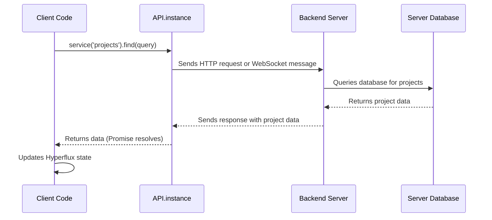
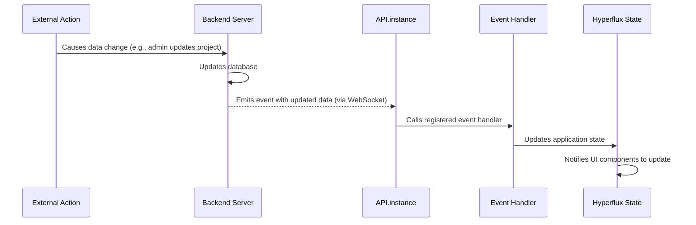

# FeathersJS API & real-time services

## Overview

The FeathersJS API & Real-time Services system provides the communication layer between the iR Engine client and backend server. It enables the client to request data, send updates, and receive real-time notifications about changes occurring on the server. By leveraging FeathersJS, a JavaScript framework designed for real-time applications, the iR Engine client maintains a persistent connection to the server that supports both traditional request-response patterns and live event-based updates. This chapter explores how the client uses FeathersJS to interact with server-side resources and maintain synchronized state across the application.

## Core concepts

### Client-server communication

Modern web applications typically need to communicate with a server to:

1. **Retrieve data**: Fetch information stored in databases (user profiles, content, settings)
2. **Submit changes**: Send user actions and updates to be processed and stored
3. **Receive notifications**: Get informed about events and changes from other users or system processes

Traditional web applications relied on manual page refreshes or periodic polling to stay updated. Modern applications like the iR Engine use more sophisticated approaches that provide immediate updates and a smoother user experience.

### FeathersJS framework

FeathersJS is a lightweight web framework that simplifies client-server communication:

- **Service-oriented**: Server resources are organized as services (users, projects, avatars)
- **Standardized methods**: Consistent API for common operations (find, get, create, update, remove)
- **Real-time capabilities**: Built-in support for WebSockets and event-based communication
- **Authentication integration**: Seamless handling of user authentication and authorization

The iR Engine client uses FeathersJS to provide a consistent, reliable communication layer that supports both traditional API calls and real-time updates.

## Implementation

### API client setup

The communication layer is initialized in the application's startup process:

```typescript
// Simplified from src/API.ts
import feathers from '@feathersjs/client';
import Primus from 'primus-client';
import primusClient from './util/primus-client';
import config from '@ir-engine/common/src/config';

// Create a new Feathers client instance
const feathersClient = feathers();

// Set up real-time connection using Primus (WebSockets)
const primus = new Primus(`${config.client.serverUrl}?${/* query params */}`);
feathersClient.configure(primusClient(primus));

// Configure authentication
feathersClient.configure(authentication({
  storageKey: 'ir-engine-jwt',
  jwtStrategy: 'jwt'
}));

// Make the client available globally
API.instance = feathersClient;
```

This initialization:
1. Creates a new FeathersJS client instance
2. Establishes a WebSocket connection using Primus
3. Configures authentication handling
4. Makes the client available throughout the application via `API.instance`

### Making service requests

The client interacts with server resources through services, using standardized methods:

```typescript
// Example: Fetching projects from the server
import { API } from '@ir-engine/common';
import { projectPath } from '@ir-engine/common/src/schema.type.module';
import { getMutableState } from '@ir-engine/hyperflux';
import { ProjectState } from './ProjectState';

async function fetchProjectsFromServer() {
  try {
    // Access the 'projects' service
    const projectService = API.instance.service(projectPath);

    // Request a list of projects with query parameters
    const projectData = await projectService.find({
      query: { 
        action: 'admin', 
        allowed: true,
        $sort: { createdAt: -1 }
      }
    });

    // Store the received data in Hyperflux state
    getMutableState(ProjectState).merge({ 
      projects: projectData.data,
      loaded: true,
      loading: false
    });
    
    return projectData.data;
  } catch (error) {
    console.error("Could not fetch projects:", error);
    getMutableState(ProjectState).loading.set(false);
    throw error;
  }
}
```

This function:
1. Gets a reference to the `projects` service using `API.instance.service(projectPath)`
2. Calls the `find()` method with query parameters to filter and sort the results
3. Waits for the server response using `await`
4. Updates the application state with the received data using Hyperflux
5. Handles any errors that might occur during the request

### Common service methods

FeathersJS provides standardized methods for interacting with services:

#### find

Retrieves multiple records, often with filtering:

```typescript
// Get a list of active projects
const activeProjects = await API.instance.service('projects').find({
  query: {
    status: 'active',
    $sort: { name: 1 }, // Sort by name ascending
    $limit: 25 // Limit to 25 results
  }
});
```

#### get

Retrieves a single record by ID:

```typescript
// Get a specific project by ID
const project = await API.instance.service('projects').get('project-123');
```

#### create

Creates a new record:

```typescript
// Create a new project
const newProject = await API.instance.service('projects').create({
  name: 'New Project',
  description: 'A project created from the client',
  visibility: 'private'
});
```

#### patch

Updates parts of an existing record:

```typescript
// Update a project's name and description
await API.instance.service('projects').patch('project-123', {
  name: 'Updated Project Name',
  description: 'This description has been updated'
});
```

#### remove

Deletes a record:

```typescript
// Delete a project
await API.instance.service('projects').remove('project-123');
```

### Real-time event handling

One of the most powerful features of FeathersJS is its real-time capabilities. The client can listen for events emitted by services when data changes:

```typescript
// Example: Setting up real-time listeners for project changes
import { API } from '@ir-engine/common';
import { projectPath } from '@ir-engine/common/src/schema.type.module';
import { getMutableState } from '@ir-engine/hyperflux';
import { ProjectState } from './ProjectState';

function setupProjectListeners() {
  const projectService = API.instance.service(projectPath);

  // When a project is created on the server
  projectService.on('created', (newProject) => {
    console.log('New project created:', newProject);
    
    // Update our local state to include the new project
    const currentProjects = getMutableState(ProjectState).projects.value || [];
    getMutableState(ProjectState).projects.set([newProject, ...currentProjects]);
  });

  // When a project is updated on the server
  projectService.on('patched', (updatedProject) => {
    console.log('Project updated:', updatedProject);
    
    // Update the project in our local state
    const currentProjects = getMutableState(ProjectState).projects.value || [];
    const updatedProjects = currentProjects.map(project => 
      project.id === updatedProject.id ? updatedProject : project
    );
    getMutableState(ProjectState).projects.set(updatedProjects);
  });

  // When a project is removed on the server
  projectService.on('removed', (removedProject) => {
    console.log('Project removed:', removedProject);
    
    // Remove the project from our local state
    const currentProjects = getMutableState(ProjectState).projects.value || [];
    const filteredProjects = currentProjects.filter(project => 
      project.id !== removedProject.id
    );
    getMutableState(ProjectState).projects.set(filteredProjects);
  });
}
```

This function:
1. Gets a reference to the `projects` service
2. Sets up listeners for three types of events: `created`, `patched`, and `removed`
3. Defines handler functions that update the local application state when these events occur
4. Ensures the UI stays synchronized with the server without manual refreshing

## Request-response flow

The process of making a request to the server follows this sequence:



This diagram illustrates:
1. Client code calls a service method on `API.instance`
2. The API client sends a request to the server
3. The server processes the request (often involving database operations)
4. The server sends back a response with the requested data
5. The API client resolves the Promise with the received data
6. The client code typically updates the application state with the new data

## Real-time event flow

The process of receiving real-time updates follows this sequence:



This diagram illustrates:
1. An external action (another user, system process) causes a data change on the server
2. The server updates its database and determines which clients should be notified
3. The server emits an event with the updated data to connected clients
4. The client's API instance receives the event and calls the registered handler
5. The handler updates the application state using Hyperflux
6. UI components react to the state change and update accordingly

## Integration with Hyperflux

The FeathersJS API layer works closely with Hyperflux state management:

1. **Data fetching**: Service methods retrieve data from the server, which is then stored in Hyperflux state
2. **Data submission**: User actions update Hyperflux state and trigger service method calls to send changes to the server
3. **Real-time updates**: Event handlers receive server notifications and update Hyperflux state accordingly

This integration creates a seamless flow of data between the server and the client UI:

```typescript
// Example of the complete data flow
import { API } from '@ir-engine/common';
import { getMutableState, useMutableState } from '@ir-engine/hyperflux';
import { ProjectState } from './ProjectState';

// React component that displays and manages projects
function ProjectManager() {
  // Access the project state
  const projectState = useMutableState(ProjectState);
  const projects = projectState.projects.value || [];
  const loading = projectState.loading.value;

  // Function to load projects from the server
  async function loadProjects() {
    // Update loading state
    getMutableState(ProjectState).loading.set(true);
    
    try {
      // Fetch projects from the server
      const projectService = API.instance.service('projects');
      const result = await projectService.find({ query: { status: 'active' } });
      
      // Update Hyperflux state with the results
      getMutableState(ProjectState).merge({
        projects: result.data,
        loading: false,
        loaded: true
      });
    } catch (error) {
      console.error("Failed to load projects:", error);
      getMutableState(ProjectState).loading.set(false);
    }
  }

  // Set up real-time listeners when the component mounts
  useEffect(() => {
    const projectService = API.instance.service('projects');
    
    // Listen for real-time updates
    const createdListener = (newProject) => {
      const currentProjects = getMutableState(ProjectState).projects.value || [];
      getMutableState(ProjectState).projects.set([newProject, ...currentProjects]);
    };
    
    projectService.on('created', createdListener);
    
    // Clean up listeners when the component unmounts
    return () => {
      projectService.removeListener('created', createdListener);
    };
  }, []);

  // Load projects when the component mounts
  useEffect(() => {
    if (!projectState.loaded.value) {
      loadProjects();
    }
  }, []);

  // Render the component
  return (
    <div>
      <h1>Projects</h1>
      {loading ? (
        <p>Loading projects...</p>
      ) : (
        <ul>
          {projects.map(project => (
            <li key={project.id}>{project.name}</li>
          ))}
        </ul>
      )}
      <button onClick={loadProjects}>Refresh Projects</button>
    </div>
  );
}
```

This component demonstrates:
1. Using Hyperflux state to access project data and loading status
2. Fetching projects from the server and updating Hyperflux state
3. Setting up real-time listeners to automatically update when new projects are created
4. Rendering the UI based on the current state
5. Providing a manual refresh option

## Benefits of FeathersJS

The FeathersJS API & Real-time Services system provides several key advantages:

1. **Standardized API**: Consistent methods across all services simplify development
2. **Real-time updates**: Automatic UI updates when server data changes
3. **Reduced network traffic**: No need for polling or frequent refresh requests
4. **Improved user experience**: Immediate feedback and live updates
5. **Simplified state management**: Clear patterns for integrating server data with client state
6. **Scalability**: Efficient communication that works well even with many concurrent users

These benefits make FeathersJS an essential foundation for the iR Engine client's communication layer.

## Next steps

With an understanding of how the client communicates with the server, the next chapter explores how the system secures these communications and manages user identity.

Next: [User authentication and authorization](03_user_authentication_and_authorization_.md)

---


