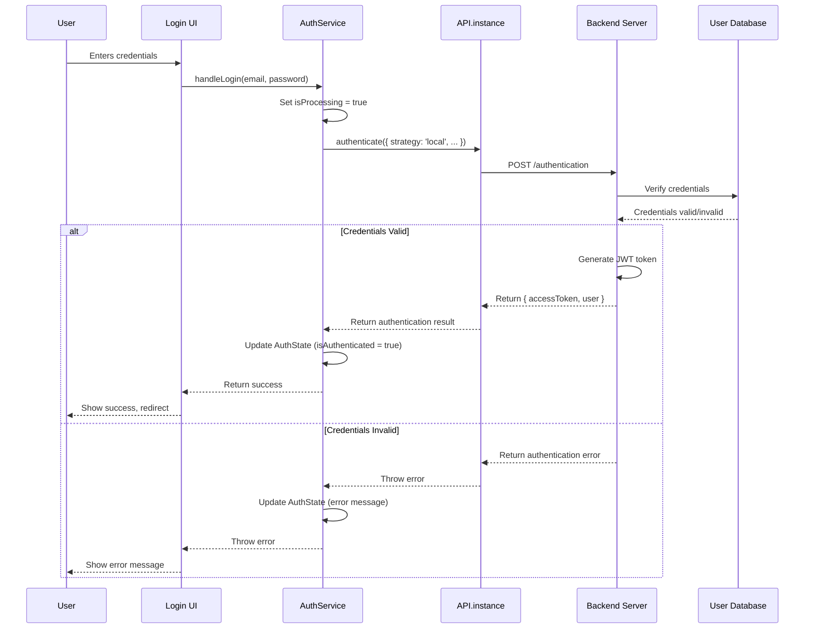
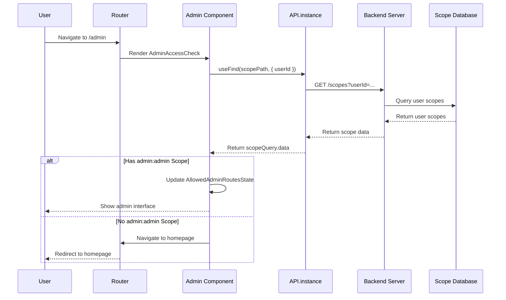

# User authentication and authorization

## Overview

The User Authentication and Authorization system manages user identity and access control within the iR Engine client. It verifies user identities through login processes, maintains secure sessions using tokens, and controls access to protected resources based on user permissions.

By implementing robust authentication and authorization mechanisms, the system ensures that users can only access the features and data they are permitted to use, providing security for sensitive operations like administrative functions. This chapter explores the implementation, workflow, and integration of authentication and authorization within the iR Engine client.

## Core concepts

### Authentication vs. authorization

Authentication and authorization serve distinct but complementary security functions:

- **Authentication**: Verifies the identity of a user ("Who are you?")
  - Validates credentials like username/password
  - Establishes a secure session with tokens
  - Maintains user identity across requests
  - Handles login, logout, and session management

- **Authorization**: Determines what actions a user can perform ("What can you do?")
  - Checks user permissions for specific resources
  - Controls access to protected areas like admin panels
  - Enforces role-based access control
  - Restricts operations based on user privileges

Together, these mechanisms ensure that users are properly identified and can only access appropriate resources.

### Identity verification methods

The iR Engine client supports several authentication methods:

1. **Email and password**: Traditional credential-based authentication
2. **OAuth providers**: Authentication through external services (Google, GitHub, etc.)
3. **Token-based sessions**: Maintaining authentication state using JWT (JSON Web Tokens)

These methods provide flexibility while maintaining security standards.

### Permission scopes

Authorization in the iR Engine is managed through permission scopes:

- Scopes are specific permissions assigned to users
- Each scope grants access to particular features or operations
- Examples include `admin:access`, `users:edit`, `projects:create`
- Scopes are checked when users attempt to access protected resources

This granular approach allows for precise control over user capabilities.

## Implementation

### Authentication state

The authentication state is managed through Hyperflux:

```typescript
// Simplified from src/user/services/AuthService.ts
import { defineState } from '@ir-engine/hyperflux';

// Default values for unauthenticated user
export const UserSeed = {
  id: '',
  name: 'Guest',
  // Other default user properties
};

export const AuthUserSeed = {
  accessToken: '',
  // Other authentication-specific properties
};

// Define the authentication state
export const AuthState = defineState({
  name: 'AuthState',
  initial: {
    isAuthenticated: false,
    isProcessing: false,
    error: '',
    authUser: AuthUserSeed, // Contains accessToken, etc.
    user: UserSeed        // Contains user details like id, name
  }
});
```

This state:
- Tracks whether a user is authenticated
- Stores the authentication token
- Maintains user profile information
- Records any authentication errors
- Indicates when authentication is in progress

### Login process

The login process authenticates a user and establishes a session:

```typescript
// Simplified from src/user/services/AuthService.ts
import { API } from '@ir-engine/common';
import { getMutableState } from '@ir-engine/hyperflux';
import { AuthState } from './AuthState';

async function handleLogin(email, password) {
  const authState = getMutableState(AuthState);

  // Indicate authentication is in progress
  authState.isProcessing.set(true);

  try {
    // Send credentials to the server via FeathersJS
    const authResult = await API.instance.authenticate({
      strategy: 'local', // Email/password strategy
      email: email,
      password: password
    });

    // Update AuthState with the authentication result
    authState.merge({
      isAuthenticated: true,
      isProcessing: false,
      error: '',
      authUser: {
        accessToken: authResult.accessToken,
        // Other auth properties
      },
      user: authResult.user
    });

    console.log('Login successful');
    return authResult;
  } catch (error) {
    // Handle authentication failure
    authState.merge({
      isAuthenticated: false,
      isProcessing: false,
      error: error.message || 'Authentication failed'
    });

    console.error('Login failed:', error);
    throw error;
  }
}
```

This function:
1. Updates the authentication state to indicate processing
2. Sends credentials to the server using the FeathersJS client
3. If successful, updates the state with the token and user information
4. If unsuccessful, records the error in the state
5. Returns the authentication result or throws an error

### Automatic re-authentication

The client can attempt to re-authenticate using a stored token:

```typescript
// Simplified from src/user/services/AuthService.ts
import { API } from '@ir-engine/common';
import { getMutableState, getState } from '@ir-engine/hyperflux';
import { AuthState, UserSeed, AuthUserSeed } from './AuthState';

async function tryAutoLogin() {
  const authState = getMutableState(AuthState);
  const existingToken = getState(AuthState).authUser.accessToken;

  if (existingToken) {
    try {
      // Configure FeathersJS to use the existing token
      await API.instance.authentication.setAccessToken(existingToken);

      // Attempt to re-authenticate with the server
      const result = await API.instance.reAuthenticate();

      // Update AuthState with the fresh authentication data
      authState.merge({
        isAuthenticated: true,
        error: '',
        authUser: result,
        user: result.user
      });

      console.log('Re-authenticated successfully');
      return result;
    } catch (error) {
      // Token is invalid or expired
      console.log('Token invalid or expired. Need to log in again.');

      // Reset to unauthenticated state
      authState.merge({
        isAuthenticated: false,
        error: 'Session expired',
        user: UserSeed,
        authUser: AuthUserSeed
      });

      throw error;
    }
  } else {
    // No token available
    console.log('No existing token. User is a guest.');

    // Ensure guest state
    authState.merge({
      isAuthenticated: false,
      user: UserSeed,
      authUser: AuthUserSeed
    });

    throw new Error('No authentication token');
  }
}
```

This function:
1. Checks if an authentication token exists in the state
2. If a token exists, attempts to re-authenticate with the server
3. Updates the authentication state based on the result
4. Handles cases where the token is invalid or missing

### Logout process

The logout process terminates the user's session:

```typescript
// Simplified from src/user/services/AuthService.ts
import { API } from '@ir-engine/common';
import { getMutableState } from '@ir-engine/hyperflux';
import { AuthState, UserSeed, AuthUserSeed } from './AuthState';

async function handleLogout() {
  const authState = getMutableState(AuthState);

  try {
    // Notify the server to invalidate the session
    await API.instance.logout();
  } catch (error) {
    console.error('Error during server logout:', error);
    // Continue with client-side logout regardless
  } finally {
    // Reset authentication state
    authState.merge({
      isAuthenticated: false,
      error: '',
      user: UserSeed,
      authUser: AuthUserSeed
    });

    console.log('User logged out');
  }
}
```

This function:
1. Attempts to notify the server about the logout
2. Resets the authentication state to unauthenticated
3. Ensures logout completes even if server communication fails

### Authorization checks

The client checks user permissions to control access to protected resources:

```typescript
// Simplified from src/admin/adminRoutes.tsx
import { useEffect } from 'react';
import { useFind } from '@ir-engine/common';
import { scopePath } from '@ir-engine/common/src/schema.type.module';
import { Engine } from '@ir-engine/ecs';
import { getMutableState, useMutableState } from '@ir-engine/hyperflux';
import { AllowedAdminRoutesState } from './AllowedAdminRoutesState';
import { RouterState } from '../common/services/RouterService';

function AdminAccessCheck() {
  const currentUserID = Engine.instance.userID;

  // Fetch user scopes from the server
  const scopeQuery = useFind(scopePath, {
    query: { userId: currentUserID, paginate: false }
  });

  const allowedRoutes = useMutableState(AllowedAdminRoutesState);

  useEffect(() => {
    if (scopeQuery.data) {
      // Check if the user has the admin scope
      const isAdmin = scopeQuery.data.find(scope => scope.type === 'admin:admin');

      if (isAdmin) {
        console.log('User is an admin. Access granted.');

        // Update allowed routes state to enable admin features
        // Example: allowedRoutes.users.access.set(true);
      } else {
        console.log('User is not an admin. Redirecting...');

        // Redirect to homepage or show an error
        RouterState.navigate('/', { redirectUrl: '/admin' });
      }
    }
  }, [scopeQuery.data, allowedRoutes]);

  // Render loading state or admin UI based on access
  return <div>Checking admin access...</div>;
}
```

This component:
1. Fetches the current user's permission scopes from the server
2. Checks if the user has the required admin scope
3. Updates the allowed routes state or redirects based on the result
4. Renders appropriate UI based on the authorization status

## Authentication workflow

The complete authentication workflow follows this sequence:



This diagram illustrates:
1. The user provides credentials through the login UI
2. The AuthService processes the login request
3. The API client sends the credentials to the server
4. The server verifies the credentials against the user database
5. If valid, a token is generated and returned
6. The AuthService updates the authentication state
7. The UI reflects the authentication result

## Authorization workflow

The authorization workflow determines what a user can access:



This diagram illustrates:
1. The user attempts to access a protected route
2. The router renders the component with access check
3. The component fetches the user's scopes from the server
4. The server retrieves the scopes from the database
5. The component checks if the user has the required scope
6. Based on the result, the user is either granted access or redirected

## Integration with other components

The authentication and authorization system integrates with several other components:

### Hyperflux state management

Authentication state is managed through Hyperflux:

```typescript
// Example of a component using authentication state
import { useMutableState } from '@ir-engine/hyperflux';
import { AuthState } from './user/services/AuthState';

function UserProfileButton() {
  const authState = useMutableState(AuthState);
  const isAuthenticated = authState.isAuthenticated.value;
  const userName = authState.user.name.value;

  if (isAuthenticated) {
    return <button>Profile: {userName}</button>;
  } else {
    return <button>Login</button>;
  }
}
```

This integration:
- Allows components to react to authentication state changes
- Provides consistent access to user information
- Enables UI updates based on authentication status

### FeathersJS API services

Authentication uses FeathersJS for server communication:

```typescript
// Example of authentication with FeathersJS
import { API } from '@ir-engine/common';

// Configure FeathersJS to include the token with requests
API.instance.configure(authentication({
  storageKey: 'ir-engine-jwt',
  jwtStrategy: 'jwt'
}));

// The token is automatically included in service requests
const protectedData = await API.instance.service('protected-resource').find();
```

This integration:
- Handles token management for API requests
- Ensures authenticated access to protected resources
- Maintains session consistency across service calls

### Client-side routing

Authorization affects navigation and route access:

```typescript
// Example of route protection
import { useEffect } from 'react';
import { useMutableState } from '@ir-engine/hyperflux';
import { AuthState } from './user/services/AuthState';
import { RouterState } from './common/services/RouterService';

function ProtectedRoute({ children }) {
  const authState = useMutableState(AuthState);
  const isAuthenticated = authState.isAuthenticated.value;

  useEffect(() => {
    if (!isAuthenticated) {
      // Redirect to login if not authenticated
      RouterState.navigate('/login', {
        redirectUrl: window.location.pathname
      });
    }
  }, [isAuthenticated]);

  // Only render children if authenticated
  return isAuthenticated ? children : null;
}
```

This integration:
- Controls access to protected routes
- Redirects unauthenticated users to the login page
- Preserves the intended destination for post-login redirection

## Benefits of the authentication and authorization system

The authentication and authorization system provides several key advantages:

1. **Security**: Protects sensitive operations and data from unauthorized access
2. **User identity**: Maintains consistent user identity across the application
3. **Personalization**: Enables user-specific content and features
4. **Access control**: Provides granular control over feature access
5. **Administrative functions**: Secures administrative capabilities for authorized users
6. **Session management**: Handles login, logout, and session persistence
7. **Integration**: Works seamlessly with other system components

These benefits make authentication and authorization essential components of the iR Engine client architecture.

## Next steps

With an understanding of how users are authenticated and authorized, the next chapter explores how the application manages navigation between different views and pages.

Next: [Client-side routing and navigation](04_client_side_routing_and_navigation_.md)

---


