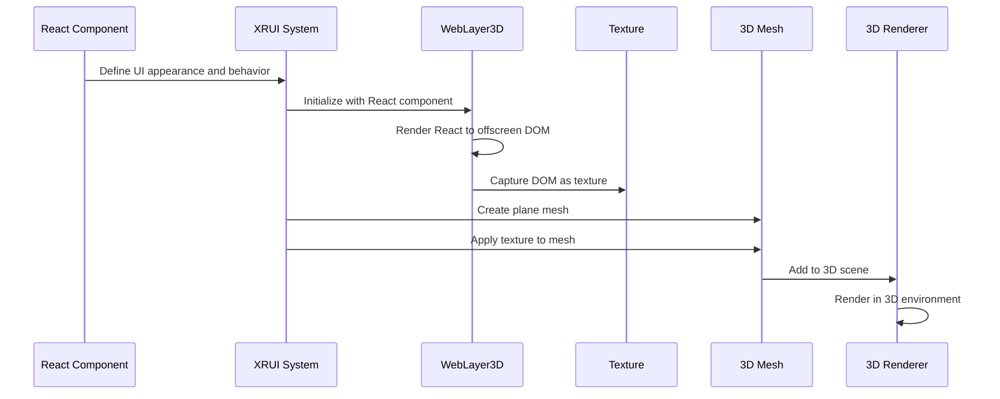
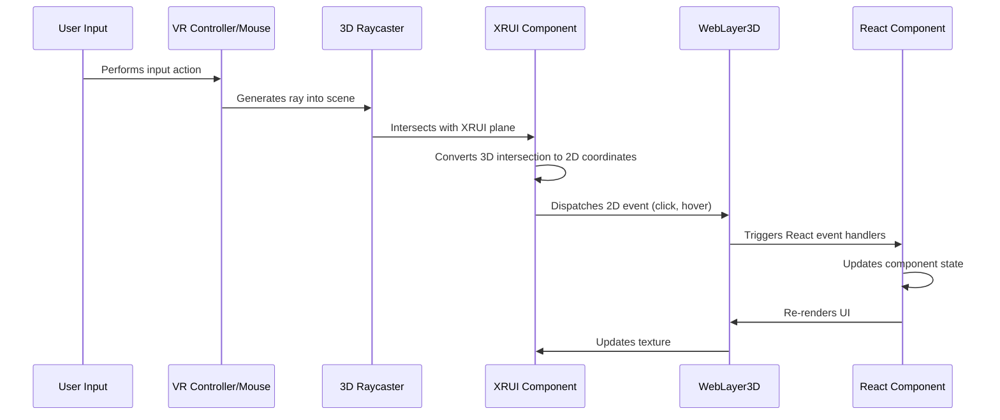

# XRUI and in-world widgets

## Overview

XRUI (Extended Reality User Interface) and In-World Widgets provide the foundation for creating user interfaces that exist within the 3D environment rather than as traditional 2D overlays. By rendering UI elements directly in the 3D scene, the system enables more immersive and spatially relevant interactions. 

This chapter explores the implementation, components, and workflow of the XRUI system within the iR Engine client, demonstrating how web technologies like React are leveraged to create interactive interfaces in 3D space.

## Core concepts

### Extended reality user interfaces

Traditional user interfaces in applications are typically rendered as 2D overlays on top of the viewport. In contrast, XRUI:

- Renders UI elements as part of the 3D scene
- Positions interfaces in 3D space
- Allows UI to be attached to specific objects or locations
- Enables interaction through 3D input methods (VR controllers, gaze, etc.)

This approach provides several benefits:
- Increased immersion by keeping users in the 3D environment
- Spatial context for information and controls
- Natural interaction with UI elements in the virtual space
- Consistent visual language between the world and its interfaces

### In-world widgets

Widgets are self-contained UI elements that serve specific purposes within the 3D environment:

- **Nameplates**: Display user information above avatars
- **Control panels**: Provide interactive controls for objects
- **Menus**: Offer navigation and selection options
- **Information displays**: Show contextual data in the environment
- **Notifications**: Present alerts and updates in 3D space

These widgets can be attached to objects, positioned relative to the user, or placed at fixed locations in the world.

### Widget management

The iR Engine client includes a comprehensive system for managing widgets:

- **Registration**: Define and register widget types
- **Visibility control**: Show or hide widgets as needed
- **State management**: Track widget states (open/closed, enabled/disabled)
- **Positioning**: Place widgets in appropriate locations
- **Interaction**: Handle user input with widget elements

This management system ensures consistent behavior and appearance across different widget types.

## Implementation

### XRUI component architecture

The XRUI system is built on several key components:

```typescript
// Simplified architecture of XRUI components
interface XRUISystem {
  XRUIComponent: ECSComponent;    // Attaches UI to entities
  WebLayer3D: Renderer;           // Renders web content to textures
  createXRUI: Function;           // Creates XRUI instances
  InteractionSystem: System;      // Handles input with UI elements
}
```

This architecture:
- Uses the Entity Component System (ECS) pattern
- Integrates web rendering with 3D graphics
- Provides a bridge between React components and 3D entities
- Handles input mapping between 3D and 2D spaces

### Creating XRUI elements

The process of creating an XRUI element involves several steps:

```typescript
// Simplified from various XRUI creation functions
import { createXRUI } from '@ir-engine/engine/src/xrui/createXRUI';
import { setComponent, getComponent } from '@ir-engine/ecs';
import { TransformComponent } from '@ir-engine/spatial';

function createNameplateXRUI(username) {
  // 1. Define the React component for the UI
  const NameplateUI = ({ username }) => (
    <div className="nameplate">
      {username}
    </div>
  );
  
  // 2. Create the XRUI instance with the React component
  const ui = createXRUI(NameplateUI, { username });
  
  // 3. Position the UI in 3D space
  const transform = getComponent(ui.entity, TransformComponent);
  transform.position.set(0, 0.2, 0); // Position above target
  
  // 4. Configure additional properties
  setComponent(ui.entity, VisibleComponent);
  
  return ui;
}
```

This function:
1. Defines or imports a React component for the UI appearance
2. Creates an XRUI instance using the `createXRUI` function
3. Positions the resulting entity in 3D space
4. Configures additional components as needed
5. Returns the XRUI instance for further use

### Widget registration

Widgets are registered with the widget management system:

```typescript
// Simplified from src/systems/Widgets.ts
import { Widgets } from './Widgets';
import { WidgetAppActions } from './WidgetAppService';
import { dispatchAction } from '@ir-engine/hyperflux';
import { createXRUI } from '@ir-engine/engine/src/xrui/createXRUI';

function registerControlPanelWidget() {
  // 1. Create the XRUI for the widget
  const ControlPanelUI = () => (
    <div className="control-panel">
      <h3>Control Panel</h3>
      <button onClick={() => console.log('Button clicked')}>
        Toggle Power
      </button>
      <div className="slider-container">
        <label>Volume</label>
        <input type="range" min="0" max="100" defaultValue="50" />
      </div>
    </div>
  );
  
  const ui = createXRUI(ControlPanelUI);
  
  // 2. Define the widget configuration
  const controlPanelWidget = {
    ui: ui,
    label: 'Control Panel',
    icon: ControlPanelIcon,
    onOpen: () => console.log('Control panel opened'),
    onClose: () => console.log('Control panel closed')
  };
  
  // 3. Register the widget with the system
  const widgetId = Widgets.registerWidget(ui.entity, controlPanelWidget);
  
  return widgetId;
}
```

This function:
1. Creates an XRUI instance for the widget's visual representation
2. Defines a configuration object with properties like label, icon, and event handlers
3. Registers the widget with the widget system, receiving a unique ID
4. Returns the widget ID for later reference

### Widget visibility control

Widgets can be shown or hidden programmatically:

```typescript
// Simplified widget visibility control
import { WidgetAppService } from './WidgetAppService';
import { WidgetAppActions } from './WidgetAppService';
import { dispatchAction } from '@ir-engine/hyperflux';

// Method 1: Using the service directly
function toggleWidgetVisibility(widgetId, visible) {
  WidgetAppService.setWidgetVisibility(widgetId, visible);
}

// Method 2: Using Hyperflux actions
function showWidget(widgetId) {
  dispatchAction(WidgetAppActions.showWidget({
    id: widgetId,
    shown: true
  }));
}

function hideWidget(widgetId) {
  dispatchAction(WidgetAppActions.showWidget({
    id: widgetId,
    shown: false
  }));
}
```

These functions:
- Provide different methods to control widget visibility
- Use either direct service calls or Hyperflux actions
- Allow widgets to be shown or hidden based on application state

### Nameplate example

A common use case for XRUI is displaying nameplates above avatars:

```typescript
// Simplified nameplate implementation
import { createXRUI } from '@ir-engine/engine/src/xrui/createXRUI';
import { setComponent, getComponent } from '@ir-engine/ecs';
import { TransformComponent } from '@ir-engine/spatial';
import { EntityTreeComponent } from '@ir-engine/ecs';

function addNameplateToAvatar(avatarEntity, username) {
  // 1. Create the nameplate UI component
  const NameplateUI = ({ username }) => (
    <div className="nameplate">
      <div className="username">{username}</div>
      <div className="status-indicator online"></div>
    </div>
  );
  
  // 2. Create the XRUI instance
  const ui = createXRUI(NameplateUI, { username });
  
  // 3. Position it above the avatar
  const transform = getComponent(ui.entity, TransformComponent);
  transform.position.set(0, 1.8, 0); // 1.8 units above avatar base
  
  // 4. Make it a child of the avatar entity so it moves with the avatar
  setComponent(ui.entity, EntityTreeComponent, { 
    parentEntity: avatarEntity 
  });
  
  return ui.entity;
}
```

This function:
1. Defines a React component for the nameplate appearance
2. Creates an XRUI instance with the username as a prop
3. Positions the nameplate above the avatar
4. Makes the nameplate a child of the avatar entity so it follows the avatar's movement
5. Returns the nameplate entity for further reference

## Technical implementation

### Rendering web content in 3D

The process of rendering web content in 3D involves several technical steps:



This process:
1. Takes a React component defining the UI
2. Renders it to an offscreen DOM using WebLayer3D
3. Captures the rendered DOM as a texture
4. Creates a plane mesh in the 3D scene
5. Applies the texture to the mesh
6. Renders the mesh in the 3D environment

### Input handling

Interaction with XRUI elements requires mapping between 3D and 2D input:



This process:
1. Captures user input from controllers or mouse
2. Uses raycasting to detect intersections with XRUI planes
3. Converts 3D intersection points to 2D coordinates on the UI
4. Dispatches appropriate events to the web layer
5. Triggers React event handlers in the component
6. Updates the UI based on the interaction
7. Renders the updated UI to the texture

### Widget management system

The widget management system uses Hyperflux for state management:

```typescript
// Simplified from src/systems/WidgetAppService.ts
import { defineState, defineAction } from '@ir-engine/hyperflux';

// Define the state structure for widgets
export const WidgetAppState = defineState({
  name: 'WidgetAppState',
  initial: {
    widgetsMenuOpen: false,
    widgets: {} as Record<string, {
      enabled: boolean;
      visible: boolean;
    }>
  }
});

// Define actions for widget management
export const WidgetAppActions = {
  registerWidget: defineAction({
    type: 'ee.client.WidgetApp.REGISTER_WIDGET',
    id: '' as string
  }),
  
  showWidget: defineAction({
    type: 'ee.client.WidgetApp.SHOW_WIDGET',
    id: '' as string,
    shown: false as boolean
  }),
  
  toggleWidgetsMenu: defineAction({
    type: 'ee.client.WidgetApp.TOGGLE_WIDGETS_MENU'
  })
};

// Service methods for widget management
export const WidgetAppService = {
  setWidgetVisibility: (id: string, visible: boolean) => {
    dispatchAction(WidgetAppActions.showWidget({
      id,
      shown: visible
    }));
  }
};
```

This system:
- Defines a Hyperflux state to track widget status
- Provides actions for registering widgets and controlling visibility
- Offers service methods for common widget operations
- Maintains a consistent state for all widgets in the application

## Widget types and use cases

### Nameplates

Nameplates display user information above avatars:

```typescript
// Nameplate widget example
function createNameplate(username, avatarEntity) {
  const ui = createXRUI(NameplateUI, { username });
  
  // Position above avatar and make it a child
  const transform = getComponent(ui.entity, TransformComponent);
  transform.position.set(0, 1.8, 0);
  setComponent(ui.entity, EntityTreeComponent, { 
    parentEntity: avatarEntity 
  });
  
  // Configure to always face the camera
  setComponent(ui.entity, BillboardComponent);
  
  return ui.entity;
}
```

Nameplates typically:
- Display usernames and status indicators
- Follow avatar movement
- Face the camera for readability
- Scale based on distance from the viewer

### Interactive panels

Interactive panels provide controls for objects or systems:

```typescript
// Interactive panel example
function createControlPanel(targetObject) {
  const ui = createXRUI(ControlPanelUI, { 
    onPowerToggle: () => targetObject.togglePower(),
    onVolumeChange: (value) => targetObject.setVolume(value)
  });
  
  // Position relative to the target object
  const transform = getComponent(ui.entity, TransformComponent);
  transform.position.copy(targetObject.position);
  transform.position.y += 1.2;
  transform.lookAt(camera.position);
  
  return ui.entity;
}
```

Interactive panels typically:
- Provide buttons, sliders, and other controls
- Trigger actions on target objects
- Position themselves contextually
- Respond to user input in real-time

### Menu systems

Menu systems provide navigation and selection options:

```typescript
// Widget menu example
function createWidgetMenu() {
  const ui = createXRUI(WidgetMenuUI, {
    widgets: registeredWidgets,
    onSelectWidget: (widgetId) => {
      WidgetAppService.setWidgetVisibility(widgetId, true);
      dispatchAction(WidgetAppActions.toggleWidgetsMenu());
    }
  });
  
  // Position relative to the user
  const transform = getComponent(ui.entity, TransformComponent);
  transform.position.set(0, 1.4, -0.8); // In front of user
  
  // Make it follow the user
  setComponent(ui.entity, FollowCameraComponent, {
    distance: 0.8,
    lockY: false
  });
  
  return ui.entity;
}
```

Menu systems typically:
- Display available options or widgets
- Allow selection through various input methods
- Position themselves for optimal visibility
- Maintain consistent access to functionality

## Integration with other components

The XRUI and widget systems integrate with several other components:

### Entity component system

XRUI elements are implemented as entities with components:

```typescript
// Example of XRUI integration with ECS
import { createEntity, addComponent } from '@ir-engine/ecs';
import { XRUIComponent } from '@ir-engine/spatial/src/xrui/components/XRUIComponent';
import { TransformComponent } from '@ir-engine/spatial';
import { VisibleComponent } from '@ir-engine/spatial';

function createXRUIEntity(ReactComponent, props) {
  // Create entity
  const entity = createEntity();
  
  // Add transform component
  addComponent(entity, TransformComponent);
  
  // Add XRUI component
  const xrui = new WebLayer3D(ReactComponent, props);
  addComponent(entity, XRUIComponent, { xrui });
  
  // Make it visible
  addComponent(entity, VisibleComponent);
  
  return { entity, xrui };
}
```

This integration:
- Leverages the ECS architecture for consistent behavior
- Allows XRUI elements to use standard components like Transform
- Enables systems to process XRUI entities like other entities
- Provides a familiar pattern for developers working with the engine

### Hyperflux state management

Widget state is managed through Hyperflux:

```typescript
// Example of widget state in Hyperflux
import { getMutableState, useMutableState } from '@ir-engine/hyperflux';
import { WidgetAppState } from './WidgetAppService';

// In a component that needs to check widget visibility
function WidgetController() {
  const widgetState = useMutableState(WidgetAppState);
  const isControlPanelVisible = widgetState.widgets['control-panel']?.visible || false;
  
  // Use the visibility state
  useEffect(() => {
    if (isControlPanelVisible) {
      // Perform actions when control panel becomes visible
    }
  }, [isControlPanelVisible]);
  
  // Render component
}

// To update widget state
function toggleControlPanel() {
  const widgetState = getMutableState(WidgetAppState);
  const currentVisibility = widgetState.widgets['control-panel']?.visible || false;
  
  dispatchAction(WidgetAppActions.showWidget({
    id: 'control-panel',
    shown: !currentVisibility
  }));
}
```

This integration:
- Uses Hyperflux for reactive state management
- Allows components to respond to widget state changes
- Provides a consistent pattern for state updates
- Enables widgets to be controlled from anywhere in the application

### Avatar system

XRUI elements like nameplates integrate with the avatar system:

```typescript
// Example of XRUI integration with avatars
import { AvatarComponent } from '../avatar/components/AvatarComponent';
import { createNameplate } from './createNameplate';

// System that adds nameplates to avatars
function executeNameplateSystem() {
  // Query for avatars without nameplates
  const avatarsWithoutNameplates = queryEntities([
    withComponent(AvatarComponent),
    withoutComponent(NameplateTagComponent)
  ]);
  
  // Add nameplates to avatars
  for (const entity of avatarsWithoutNameplates) {
    const avatar = getComponent(entity, AvatarComponent);
    const username = avatar.username || 'Unknown User';
    
    // Create nameplate
    createNameplate(username, entity);
    
    // Mark avatar as having a nameplate
    addComponent(entity, NameplateTagComponent);
  }
}
```

This integration:
- Automatically adds nameplates to avatars
- Updates nameplate content based on avatar properties
- Ensures nameplates follow avatar movement
- Creates a consistent visual identity for users

## Benefits of XRUI and in-world widgets

The XRUI and widget systems provide several key advantages:

1. **Immersion**: Keeps users in the 3D environment without breaking immersion
2. **Spatial context**: Places information and controls where they are most relevant
3. **Familiar technologies**: Leverages web technologies like React for UI development
4. **Consistency**: Provides a unified approach to UI across the application
5. **Flexibility**: Supports various widget types for different use cases
6. **Extensibility**: Allows new widget types to be easily created and integrated
7. **Performance**: Optimizes rendering through texture-based approaches

These benefits make XRUI and in-world widgets essential components for creating immersive and interactive 3D experiences.

## Next steps

With an understanding of how user interfaces are created in 3D space, the next chapter explores how users are represented within the virtual environment through avatars.

Next: [Avatar management and customization](06_avatar_management_and_customization_.md)

---


