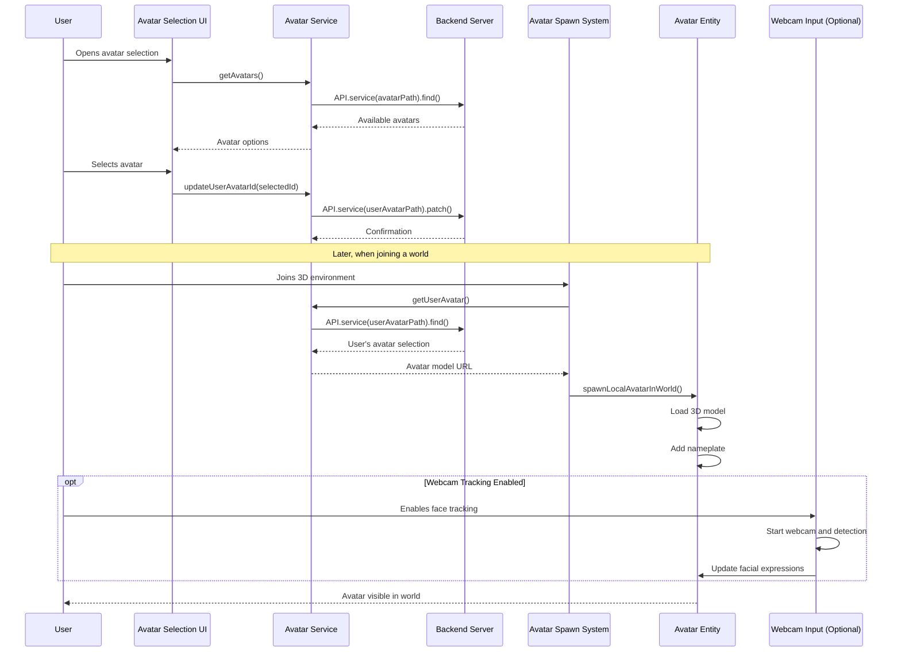

# Avatar management and customization

## Overview

The Avatar Management and Customization system provides users with a visual representation within the iR Engine's 3D environments. It handles the selection, customization, loading, and animation of avatars, allowing users to establish their identity and presence in virtual spaces. 

By integrating with external avatar creation services and implementing real-time facial expression mapping, the system creates more engaging and personalized experiences. This chapter explores the implementation, workflow, and components involved in managing avatars within the iR Engine client.

## Core concepts

### Digital representation

Avatars serve as the user's embodiment in virtual environments:

- **Visual identity**: Provides a recognizable form for each user
- **Spatial presence**: Gives users a physical location in the 3D world
- **Social interaction**: Enables non-verbal communication through positioning and animations
- **Personalization**: Allows users to express their identity or preferences

In the iR Engine, avatars are implemented as entities with specialized components that handle their appearance, animation, and associated UI elements.

### Avatar lifecycle

The avatar system manages several stages in an avatar's lifecycle:

1. **Selection**: Users choose from available avatar models or create custom ones
2. **Customization**: Users modify avatar appearance through integrated tools
3. **Loading**: The system loads the 3D model and prepares it for rendering
4. **Spawning**: The avatar is placed in the 3D world at an appropriate location
5. **Animation**: The avatar is animated based on user input and system events
6. **Enhancement**: Additional features like nameplates and expressions are applied
7. **Destruction**: The avatar is removed when the user leaves the environment

This lifecycle ensures a consistent experience from avatar selection to in-world interaction.

### Expression and animation

Avatars support various forms of expression and animation:

- **Locomotion**: Walking, running, and other movement animations
- **Gestures**: Predefined animations like waving or pointing
- **Facial expressions**: Emotional displays through facial morphing
- **Lip synchronization**: Mouth movements that match speech audio
- **Webcam-driven expressions**: Real-time mapping of user expressions to the avatar

These capabilities make avatars more lifelike and expressive, enhancing communication in virtual environments.

## Implementation

### Avatar spawning

When a user joins a 3D environment, the system spawns their avatar:

```typescript
// Simplified from src/networking/AvatarSpawnSystem.tsx
import { spawnLocalAvatarInWorld } from '@ir-engine/engine/src/avatar/functions/spawnLocalAvatarInWorld';
import { getRandomSpawnPoint } from '@ir-engine/engine/src/avatar/functions/getSpawnPoint';
import { getState } from '@ir-engine/hyperflux';
import { AuthState } from '../user/services/AuthService';

async function setupUserAvatar(userID, avatarURL, sceneUUID) {
  // Get a random spawn position
  const avatarSpawnPose = getRandomSpawnPoint(userID);
  
  // Get user information from authentication state
  const user = getState(AuthState).user;
  
  // Spawn the avatar in the world
  const avatarEntity = spawnLocalAvatarInWorld({
    parentUUID: sceneUUID,
    avatarSpawnPose,
    avatarURL: avatarURL, // 3D model URL
    name: user.name.value // Username for nameplate
  });
  
  console.log(`Avatar spawned for ${user.name.value} using ${avatarURL}`);
  return avatarEntity;
}
```

This function:
1. Determines a spawn position for the avatar
2. Retrieves user information from the authentication state
3. Calls `spawnLocalAvatarInWorld` to create the avatar entity
4. Configures the avatar with the appropriate model and username
5. Returns the created entity for further reference

### Avatar component

The avatar entity is managed through the AvatarComponent:

```typescript
// Simplified from @ir-engine/engine/src/avatar/components/AvatarComponent.ts
import { defineComponent } from '@ir-engine/ecs';

export const AvatarComponent = defineComponent({
  name: 'AvatarComponent',
  
  schema: {
    modelURL: { type: 'string', default: '' },
    name: { type: 'string', default: 'User' },
    height: { type: 'number', default: 1.8 },
    isLocal: { type: 'boolean', default: false },
    headBone: { type: 'ref', default: null },
    leftHandBone: { type: 'ref', default: null },
    rightHandBone: { type: 'ref', default: null },
    loaded: { type: 'boolean', default: false }
  },
  
  // Static methods for avatar management
  getSelfAvatarEntity: () => {
    // Return the entity ID of the local user's avatar
    return AvatarComponent.selfAvatarEntity;
  },
  
  // Other utility methods
});
```

This component:
- Stores essential avatar properties like model URL and username
- Tracks the avatar's loading state
- Maintains references to important bones for animation
- Provides utility methods for accessing avatar entities

### Avatar selection UI

Users select their avatar through a dedicated interface:

```jsx
// Simplified from src/user/menus/avatar/AvatarSelectMenu.tsx
import React, { useState, useEffect } from 'react';
import { useMutation, useFind } from '@ir-engine/common';
import { avatarPath, userAvatarPath } from '@ir-engine/common/src/schema.type.module';
import { Engine } from '@ir-engine/ecs';

function AvatarSelectionUI() {
  // Get available avatars from the server
  const avatarsQuery = useFind(avatarPath);
  
  // Get current user's avatar selection
  const userAvatarQuery = useFind(userAvatarPath, {
    query: { userId: Engine.instance.userID }
  });
  
  // State for the selected avatar
  const [selectedAvatarId, setSelectedAvatarId] = useState('');
  
  // Mutation for updating the user's avatar choice
  const userAvatarMutation = useMutation(userAvatarPath);
  
  // Set initial selection based on current avatar
  useEffect(() => {
    if (userAvatarQuery.data?.length > 0) {
      setSelectedAvatarId(userAvatarQuery.data[0].avatarId);
    }
  }, [userAvatarQuery.data]);
  
  // Handle avatar selection confirmation
  const handleConfirm = async () => {
    if (!selectedAvatarId) return;
    
    try {
      // Update the user's avatar preference on the server
      await userAvatarMutation.patch(
        null,
        { avatarId: selectedAvatarId },
        { query: { userId: Engine.instance.userID } }
      );
      
      console.log(`Avatar selection updated to ${selectedAvatarId}`);
    } catch (error) {
      console.error('Failed to update avatar selection:', error);
    }
  };
  
  // Render the avatar selection UI
  return (
    <div className="avatar-selection">
      <h2>Select Your Avatar</h2>
      
      <div className="avatar-grid">
        {avatarsQuery.data?.map(avatar => (
          <div 
            key={avatar.id}
            className={`avatar-option ${selectedAvatarId === avatar.id ? 'selected' : ''}`}
            onClick={() => setSelectedAvatarId(avatar.id)}
          >
            
            <p>{avatar.name}</p>
          </div>
        ))}
      </div>
      
      <button 
        onClick={handleConfirm}
        disabled={!selectedAvatarId}
      >
        Confirm Selection
      </button>
    </div>
  );
}
```

This component:
1. Fetches available avatars from the server
2. Retrieves the user's current avatar selection
3. Allows the user to select a new avatar
4. Saves the selection to the server when confirmed
5. Provides visual feedback on the current selection

### Avatar service

The AvatarService manages avatar-related operations:

```typescript
// Simplified from src/user/services/AvatarService.ts
import { API } from '@ir-engine/common';
import { avatarPath, userAvatarPath } from '@ir-engine/common/src/schema.type.module';
import { Engine } from '@ir-engine/ecs';

export const AvatarService = {
  // Get all available avatars
  async getAvatars() {
    try {
      return await API.instance.service(avatarPath).find({
        query: { $limit: 100 }
      });
    } catch (error) {
      console.error('Failed to fetch avatars:', error);
      return { data: [] };
    }
  },
  
  // Get the current user's avatar selection
  async getUserAvatar() {
    try {
      const result = await API.instance.service(userAvatarPath).find({
        query: { userId: Engine.instance.userID }
      });
      
      return result.data[0] || null;
    } catch (error) {
      console.error('Failed to fetch user avatar:', error);
      return null;
    }
  },
  
  // Update the user's avatar selection
  async updateUserAvatarId(avatarId) {
    try {
      await API.instance.service(userAvatarPath).patch(
        null,
        { avatarId },
        { query: { userId: Engine.instance.userID } }
      );
      
      return true;
    } catch (error) {
      console.error('Failed to update user avatar:', error);
      return false;
    }
  },
  
  // Create a new custom avatar
  async createCustomAvatar(avatarData) {
    try {
      const newAvatar = await API.instance.service(avatarPath).create(avatarData);
      
      // Automatically select the new avatar
      await this.updateUserAvatarId(newAvatar.id);
      
      return newAvatar;
    } catch (error) {
      console.error('Failed to create custom avatar:', error);
      return null;
    }
  }
};
```

This service:
- Provides methods for retrieving available avatars
- Handles fetching and updating the user's avatar selection
- Manages the creation of custom avatars
- Encapsulates API calls to the avatar-related endpoints

### Nameplate integration

Avatars are enhanced with nameplates using the XRUI system:

```typescript
// Simplified from src/systems/AvatarUISystem.tsx
import { setComponent, getComponent, hasComponent } from '@ir-engine/ecs';
import { XruiNameplateComponent } from '../social/components/XruiNameplateComponent';
import { AvatarComponent } from '@ir-engine/engine/src/avatar/components/AvatarComponent';

function addNameplateToAvatar(avatarEntity) {
  // Skip if already has a nameplate
  if (hasComponent(avatarEntity, XruiNameplateComponent)) {
    return;
  }
  
  // Get the avatar component to access the name
  const avatar = getComponent(avatarEntity, AvatarComponent);
  
  // Add the nameplate component with the avatar's name
  setComponent(avatarEntity, XruiNameplateComponent, {
    name: avatar.name
  });
  
  console.log(`Nameplate added to avatar: ${avatar.name}`);
}

// In the AvatarUISystem
function executeAvatarUISystem() {
  // Query for avatars without nameplates
  const avatarsWithoutNameplates = queryEntities([
    withComponent(AvatarComponent),
    withoutComponent(XruiNameplateComponent)
  ]);
  
  // Add nameplates to avatars that need them
  for (const entity of avatarsWithoutNameplates) {
    // Skip local avatar if configured to do so
    const avatar = getComponent(entity, AvatarComponent);
    if (avatar.isLocal && !config.showNameplateOnSelf) {
      continue;
    }
    
    addNameplateToAvatar(entity);
  }
}
```

This system:
1. Identifies avatars that need nameplates
2. Retrieves the avatar's name from the AvatarComponent
3. Adds an XruiNameplateComponent to display the name
4. Configures the nameplate based on system settings

### Webcam-driven expressions

The system can use webcam input to drive avatar facial expressions:

```typescript
// Simplified from src/media/webcam/WebcamInput.ts
import { getMutableState } from '@ir-engine/hyperflux';
import { MediaStreamState } from '@ir-engine/network/src/media/MediaStreamState';
import { AvatarComponent } from '@ir-engine/engine/src/avatar/components/AvatarComponent';
import { WebcamInputComponent } from './WebcamInputComponent';

// Toggle face tracking on/off
export async function toggleFaceTracking() {
  const mediaStreamState = getMutableState(MediaStreamState);
  const currentState = mediaStreamState.faceTracking.value;
  
  if (currentState) {
    // Stop face tracking
    stopFaceTracking();
    mediaStreamState.faceTracking.set(false);
  } else {
    // Start face tracking
    const success = await startFaceTracking();
    if (success) {
      mediaStreamState.faceTracking.set(true);
    }
  }
}

// Start face tracking process
async function startFaceTracking() {
  try {
    // Initialize webcam stream
    const stream = await navigator.mediaDevices.getUserMedia({
      video: { width: 640, height: 480 }
    });
    
    // Initialize face detection worker
    const faceWorker = new Worker('/workers/face-detection-worker.js');
    
    // Start processing loop
    processFaceTracking(stream, faceWorker);
    
    return true;
  } catch (error) {
    console.error('Failed to start face tracking:', error);
    return false;
  }
}

// Process webcam frames for face tracking
function processFaceTracking(stream, faceWorker) {
  const video = document.createElement('video');
  video.srcObject = stream;
  video.play();
  
  // Process frames at regular intervals
  const processInterval = setInterval(async () => {
    // Get current video frame
    const canvas = document.createElement('canvas');
    canvas.width = video.videoWidth;
    canvas.height = video.videoHeight;
    const ctx = canvas.getContext('2d');
    ctx.drawImage(video, 0, 0);
    
    // Send frame to worker for processing
    const imageData = ctx.getImageData(0, 0, canvas.width, canvas.height);
    faceWorker.postMessage({ imageData });
    
    // Worker will return detected expressions
  }, 100);
  
  // Handle worker responses
  faceWorker.onmessage = (event) => {
    const { expressions } = event.data;
    if (!expressions) return;
    
    // Get the local avatar entity
    const avatarEntity = AvatarComponent.getSelfAvatarEntity();
    if (!avatarEntity) return;
    
    // Update expression values on the avatar
    for (const [expression, value] of Object.entries(expressions)) {
      if (value > 0.5) { // Threshold for expression detection
        WebcamInputComponent.setExpression(avatarEntity, expression, value);
      }
    }
  };
}
```

This implementation:
1. Provides a function to toggle face tracking on and off
2. Initializes the webcam stream and face detection worker
3. Processes video frames at regular intervals
4. Updates avatar expressions based on detected facial features
5. Applies the expressions to the avatar's morph targets

## Avatar workflow

The complete avatar workflow follows this sequence:



This diagram illustrates:
1. The user selects an avatar through the UI
2. The selection is saved to the server
3. When joining a 3D environment, the system retrieves the user's avatar preference
4. The avatar is spawned with the appropriate model
5. A nameplate is added to display the username
6. Optionally, webcam-driven expressions are enabled
7. The avatar becomes visible to the user and others in the environment

## Integration with other components

The avatar system integrates with several other components:

### XRUI system

Avatars use XRUI for nameplates and other UI elements:

```typescript
// Example of XRUI integration with avatars
import { createXRUI } from '@ir-engine/engine/src/xrui/createXRUI';
import { setComponent, getComponent } from '@ir-engine/ecs';
import { TransformComponent } from '@ir-engine/spatial';
import { EntityTreeComponent } from '@ir-engine/ecs';

// Implementation of XruiNameplateComponent
function createNameplateForAvatar(avatarEntity, username) {
  // Create the nameplate UI component
  const NameplateUI = ({ username }) => (
    <div className="nameplate">
      <span>{username}</span>
    </div>
  );
  
  // Create the XRUI instance
  const ui = createXRUI(NameplateUI, { username });
  
  // Position it above the avatar
  const transform = getComponent(ui.entity, TransformComponent);
  transform.position.set(0, 1.8, 0); // Above the avatar's head
  
  // Make it a child of the avatar entity
  setComponent(ui.entity, EntityTreeComponent, {
    parentEntity: avatarEntity
  });
  
  return ui.entity;
}
```

This integration:
- Creates UI elements that are positioned relative to avatars
- Ensures UI elements like nameplates move with the avatar
- Provides contextual information about users in the 3D space

### Authentication system

Avatars are associated with authenticated users:

```typescript
// Example of authentication integration with avatars
import { getState } from '@ir-engine/hyperflux';
import { AuthState } from '../user/services/AuthService';

function getAvatarInfoFromAuth() {
  const authState = getState(AuthState);
  
  // Only proceed if user is authenticated
  if (!authState.isAuthenticated.value) {
    return null;
  }
  
  // Get user information from auth state
  const user = authState.user;
  
  return {
    userId: user.id.value,
    username: user.name.value,
    // Other relevant user information
  };
}
```

This integration:
- Retrieves user information from the authentication state
- Associates avatars with specific user accounts
- Ensures avatars display the correct username

### FeathersJS API services

Avatar data is managed through FeathersJS services:

```typescript
// Example of FeathersJS integration with avatars
import { API } from '@ir-engine/common';
import { avatarPath, userAvatarPath } from '@ir-engine/common/src/schema.type.module';

// Fetch avatar data from server
async function fetchAvatarData(userId) {
  try {
    // Get the user's avatar preference
    const userAvatarResult = await API.instance.service(userAvatarPath).find({
      query: { userId }
    });
    
    if (userAvatarResult.data.length === 0) {
      return null;
    }
    
    const userAvatar = userAvatarResult.data[0];
    
    // Get the detailed avatar information
    const avatar = await API.instance.service(avatarPath).get(userAvatar.avatarId);
    
    return {
      id: avatar.id,
      name: avatar.name,
      modelUrl: avatar.modelResource.url,
      thumbnailUrl: avatar.thumbnailResource?.url
    };
  } catch (error) {
    console.error('Failed to fetch avatar data:', error);
    return null;
  }
}
```

This integration:
- Retrieves avatar preferences and data from the server
- Manages the relationship between users and their selected avatars
- Provides the necessary information for avatar spawning and display

## Benefits of avatar management

The Avatar Management and Customization system provides several key advantages:

1. **User identity**: Gives users a recognizable presence in virtual environments
2. **Personalization**: Allows users to express themselves through avatar appearance
3. **Social interaction**: Facilitates non-verbal communication through avatars
4. **Immersion**: Enhances the sense of presence in virtual spaces
5. **Expression**: Enables emotional communication through animations and expressions
6. **Integration**: Works seamlessly with other systems like XRUI and authentication
7. **Extensibility**: Supports integration with external avatar creation services

These benefits make avatar management an essential component for creating engaging and personalized experiences in the iR Engine.

## Next steps

With an understanding of how users are represented as avatars, the next chapter explores how multiple users connect to the same virtual environment.

Next: [Instance provisioning and networking](07_instance_provisioning_and_networking_.md)

---


