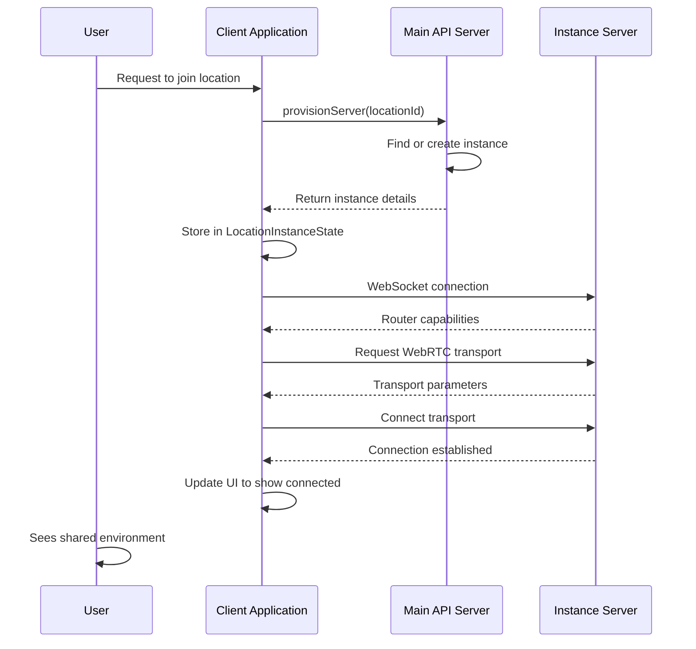

# Instance provisioning and networking

## Overview

The Instance Provisioning and Networking system enables multiple users to connect to shared virtual environments within the iR Engine. It handles the discovery, creation, and connection to server instances that host these shared spaces, establishing real-time communication channels between users. By leveraging WebRTC technology and specialized server architectures, the system creates the foundation for multi-user experiences where users can see and interact with each other in the same virtual space. This chapter explores the implementation, workflow, and components involved in connecting users to shared instances within the iR Engine client.

## Core concepts

### Server instances

A server instance represents a running server process that hosts a shared virtual environment:

- **Definition**: A specific, running copy of a server that hosts a shared 3D world or media session
- **Isolation**: Each instance is separate, with its own set of connected users and state
- **Types**: Instances can be world instances (3D environments) or media instances (voice/video chat)
- **Identification**: Each instance has a unique ID and is associated with a specific location or channel

Instances serve as the "meeting places" where users gather to share experiences in the iR Engine.

### Instance provisioning

Provisioning is the process of obtaining access to a server instance:

- **Purpose**: Locate or create a server instance for a specific location or channel
- **Process**: Request instance details from a central provisioning service
- **Result**: Obtain connection information (IP address, port, room code)
- **Types**: Can provision existing public instances, create new private instances, or join specific instances by ID

This process ensures users can find and access the appropriate server for their desired virtual location.

### Real-time networking

Networking establishes communication channels between the client and server instance:

- **Technologies**: Uses WebRTC for real-time communication, often with Mediasoup as a media server
- **Connections**: Establishes data channels for entity synchronization and media streams for audio/video
- **Topologies**: Supports both client-server (Mediasoup) and peer-to-peer (P2P) architectures
- **Signaling**: Uses WebSocket connections to exchange connection establishment information

These connections enable the real-time synchronization necessary for shared virtual experiences.

## Implementation

### Instance provisioning service

The LocationInstanceConnectionService handles the provisioning of world instances:

```typescript
// Simplified from src/common/services/LocationInstanceConnectionService.ts
import { API } from '@ir-engine/common';
import { instanceProvisionPath, LocationID, InstanceID } from '@ir-engine/common/src/schema.type.module';
import { getMutableState, getState } from '@ir-engine/hyperflux';
import { AuthState } from '../../user/services/AuthService';
import { LocationInstanceState } from './LocationInstanceConnectionService';

export const LocationInstanceConnectionService = {
  // Define the state for storing instance information
  state: LocationInstanceState,
  
  // Provision a server for a specific location
  provisionServer: async (locationId?: LocationID, instanceId?: InstanceID, sceneId?: string) => {
    try {
      // Get authentication token
      const token = getState(AuthState).authUser.accessToken;
      
      // Request instance provisioning from the server
      const provisionResult = await API.instance.service(instanceProvisionPath).find({
        query: { 
          locationId, 
          instanceId, 
          sceneId, 
          token 
        }
      });
      
      // Handle server-based instance
      if (provisionResult.ipAddress && provisionResult.port) {
        // Store instance details in state
        getMutableState(LocationInstanceState).instances.merge({
          [provisionResult.id]: {
            ipAddress: provisionResult.ipAddress,
            port: provisionResult.port,
            locationId: locationId || '',
            sceneId: sceneId || '',
            roomCode: provisionResult.roomCode || '',
            instanceId: provisionResult.id,
            p2p: false
          }
        });
        
        console.log(`Server provisioned: ${provisionResult.ipAddress}:${provisionResult.port}`);
        return provisionResult;
      } 
      // Handle peer-to-peer instance
      else if (provisionResult.p2p) {
        // Store P2P instance details
        getMutableState(LocationInstanceState).instances.merge({
          [provisionResult.id]: {
            instanceId: provisionResult.id,
            locationId: locationId || '',
            sceneId: sceneId || '',
            roomCode: provisionResult.roomCode || '',
            p2p: true
          }
        });
        
        console.log(`P2P instance provisioned: ${provisionResult.id}`);
        return provisionResult;
      } 
      else {
        console.error('Failed to provision server: Invalid response');
        throw new Error('Invalid provisioning response');
      }
    } catch (error) {
      console.error('Failed to provision server:', error);
      throw error;
    }
  },
  
  // Remove an instance from state
  removeInstance: (instanceId: InstanceID) => {
    const instances = getMutableState(LocationInstanceState).instances;
    if (instances[instanceId]) {
      delete instances[instanceId];
      console.log(`Removed instance ${instanceId} from state`);
    }
  }
};
```

This service:
1. Sends a request to the server's instance provisioning endpoint
2. Receives connection details for an appropriate instance
3. Stores these details in the LocationInstanceState
4. Provides methods to manage instance state

### Instance state management

Instance information is stored using Hyperflux state:

```typescript
// Simplified from src/common/services/LocationInstanceConnectionService.ts
import { defineState } from '@ir-engine/hyperflux';

// Define the structure of instance information
export type LocationInstanceType = {
  ipAddress?: string;
  port?: number;
  locationId: LocationID;
  sceneId: string;
  roomCode: string;
  instanceId: InstanceID;
  p2p: boolean;
};

// Define the state for storing instance information
export const LocationInstanceState = defineState({
  name: 'LocationInstanceState',
  initial: {
    instances: {} as Record<InstanceID, LocationInstanceType>
  }
});
```

This state:
- Stores information about all provisioned instances
- Associates each instance with its unique ID
- Contains connection details like IP address and port
- Indicates whether the instance is server-based or P2P
- Is observed by components that need to establish connections

### Network instance provisioning

The NetworkInstanceProvisioning component observes instance state and establishes connections:

```jsx
// Simplified from src/networking/NetworkInstanceProvisioning.tsx
import React, { useEffect } from 'react';
import { useHookstate } from '@hookstate/core';
import { getMutableState, getState } from '@ir-engine/hyperflux';
import { LocationInstanceState } from '../common/services/LocationInstanceConnectionService';
import { connectToInstance } from '../transports/mediasoup/MediasoupClientFunctions';
import { connectToP2PInstance } from '../transports/p2p/PeerToPeerNetworkState';

// Component for managing a single world instance connection
function WorldInstance({ instanceId }) {
  useEffect(() => {
    // Get instance details from state
    const worldInstance = getState(LocationInstanceState).instances[instanceId];
    
    // Skip if instance details are not available
    if (!worldInstance) return;
    
    // Handle P2P instance
    if (worldInstance.p2p) {
      console.log(`Connecting to P2P instance ${instanceId}`);
      
      // Connect to P2P instance
      const cleanup = connectToP2PInstance({
        instanceId: instanceId,
        locationId: worldInstance.locationId,
        roomCode: worldInstance.roomCode
      });
      
      // Return cleanup function
      return cleanup;
    } 
    // Handle server-based instance
    else if (worldInstance.ipAddress && worldInstance.port) {
      console.log(`Connecting to server instance ${worldInstance.ipAddress}:${worldInstance.port}`);
      
      // Connect to Mediasoup instance
      const cleanup = connectToInstance(
        instanceId,
        worldInstance.ipAddress,
        worldInstance.port,
        worldInstance.locationId,
        undefined, // channelId (not used for world instances)
        worldInstance.roomCode
      );
      
      // Return cleanup function
      return cleanup;
    }
  }, [instanceId]);
  
  // This component doesn't render anything visible
  return null;
}

// Component that manages all world instance connections
export function WorldInstanceProvisioning() {
  // Get all instances from state
  const locationInstances = useHookstate(getMutableState(LocationInstanceState).instances);
  
  return (
    <>
      {/* Create a WorldInstance component for each instance */}
      {locationInstances.keys.map((id) => (
        <WorldInstance key={id} instanceId={id} />
      ))}
    </>
  );
}
```

This component:
1. Observes the LocationInstanceState for changes
2. Creates a WorldInstance component for each provisioned instance
3. Establishes connections to instances based on their type (P2P or server-based)
4. Provides cleanup functions to properly disconnect when unmounting

### Mediasoup connection

The connectToInstance function establishes WebRTC connections to server instances:

```typescript
// Simplified from src/transports/mediasoup/MediasoupClientFunctions.ts
import Primus from 'primus-client';
import mediasoupClient from 'mediasoup-client';
import { getMutableState, getState, dispatchAction } from '@ir-engine/hyperflux';
import { AuthState } from '../../user/services/AuthService';
import { NetworkState, createNetwork, addNetwork } from '@ir-engine/network';
import { MediasoupTransportActions } from '@ir-engine/common/src/transports/mediasoup/MediasoupTransportState';

export const connectToInstance = (
  instanceId,
  ipAddress,
  port,
  locationId,
  channelId,
  roomCode
) => {
  // Get authentication token
  const token = getState(AuthState).authUser.accessToken;
  
  // Prepare query parameters
  const query = {
    peerID: Engine.instance.store.peerID,
    instanceID: instanceId,
    token,
    locationId,
    channelId,
    roomCode
  };
  
  // Create WebSocket connection for signaling
  const primus = new Primus(
    `https://${ipAddress}:${port}?${new URLSearchParams(query).toString()}`
  );
  
  // Handle WebSocket connection open
  primus.on('incoming::open', async () => {
    console.log(`WebSocket connected to instance ${instanceId}`);
    
    try {
      // Authenticate with the instance server
      const { routerRtpCapabilities, hostPeerID } = await authenticatePrimus(
        primus,
        token,
        instanceId
      );
      
      // Initialize Mediasoup device
      const mediasoupDevice = new mediasoupClient.Device();
      await mediasoupDevice.load({ routerRtpCapabilities });
      
      // Create network object
      const network = createNetwork(
        instanceId,
        hostPeerID,
        locationId || channelId,
        primus,
        mediasoupDevice
      );
      
      // Add network to state
      addNetwork(network);
      
      // Request WebRTC transports
      dispatchAction(MediasoupTransportActions.requestTransport({
        network: network.id,
        direction: 'send'
      }));
      
      dispatchAction(MediasoupTransportActions.requestTransport({
        network: network.id,
        direction: 'recv'
      }));
      
      console.log(`Successfully connected to instance ${instanceId}`);
    } catch (error) {
      console.error(`Failed to initialize connection to ${instanceId}:`, error);
    }
  });
  
  // Handle WebSocket disconnection
  primus.on('incoming::end', () => {
    console.log(`WebSocket disconnected from instance ${instanceId}`);
  });
  
  // Return cleanup function
  return () => {
    console.log(`Cleaning up connection to instance ${instanceId}`);
    primus.end();
    removeNetwork(instanceId);
  };
};
```

This function:
1. Establishes a WebSocket connection to the instance server for signaling
2. Authenticates with the instance server
3. Initializes a Mediasoup device with the server's capabilities
4. Creates a network object to manage the connection
5. Requests WebRTC transports for sending and receiving data
6. Provides a cleanup function to properly disconnect

## Connection workflow

The complete instance connection workflow follows this sequence:



This diagram illustrates:
1. The user requests to join a specific location
2. The client requests instance provisioning from the API server
3. The API server finds or creates an appropriate instance
4. The client receives and stores the instance details
5. The client establishes a WebSocket connection to the instance
6. The client and instance exchange WebRTC parameters
7. The WebRTC connection is established
8. The user enters the shared environment

## P2P networking

For peer-to-peer connections, the system uses a different approach:

```typescript
// Simplified from src/transports/p2p/PeerToPeerNetworkState.tsx
import { API } from '@ir-engine/common';
import { instanceSignalingPath } from '@ir-engine/common/src/schema.type.module';
import { getMutableState, getState } from '@ir-engine/hyperflux';
import { AuthState } from '../../user/services/AuthService';

export const connectToP2PInstance = ({
  instanceId,
  locationId,
  roomCode
}) => {
  // Get authentication token
  const token = getState(AuthState).authUser.accessToken;
  const peerID = Engine.instance.store.peerID;
  
  // Create signaling client
  const signalingClient = API.instance.service(instanceSignalingPath);
  
  // Join the signaling room
  signalingClient.join({
    instanceId,
    peerID,
    token,
    roomCode
  }).then(async (result) => {
    console.log(`Joined P2P signaling room for ${instanceId}`);
    
    // Get list of peers already in the room
    const peers = result.peers || [];
    
    // Create P2P connections to each peer
    for (const remotePeerID of peers) {
      if (remotePeerID !== peerID) {
        createP2PConnection(remotePeerID, signalingClient, instanceId);
      }
    }
    
    // Listen for new peers joining
    signalingClient.on('peer-join', (data) => {
      if (data.peerID !== peerID) {
        createP2PConnection(data.peerID, signalingClient, instanceId);
      }
    });
    
    // Listen for peers leaving
    signalingClient.on('peer-leave', (data) => {
      if (data.peerID !== peerID) {
        removeP2PConnection(data.peerID);
      }
    });
    
    // Listen for signaling messages
    signalingClient.on('signal', (data) => {
      handleSignalingMessage(data, signalingClient);
    });
  }).catch((error) => {
    console.error(`Failed to join P2P signaling room for ${instanceId}:`, error);
  });
  
  // Return cleanup function
  return () => {
    signalingClient.leave({ instanceId, peerID });
    cleanupP2PConnections();
  };
};
```

This function:
1. Joins a signaling room for the P2P instance
2. Creates P2P connections to existing peers
3. Sets up listeners for new peers joining and leaving
4. Handles signaling messages for WebRTC connection establishment
5. Provides a cleanup function to leave the signaling room

## Media instance connections

Similar to world instances, media instances (for voice/video chat) are provisioned and connected:

```typescript
// Simplified from src/common/services/MediaInstanceConnectionService.ts
import { API } from '@ir-engine/common';
import { mediaInstanceProvisionPath } from '@ir-engine/common/src/schema.type.module';
import { getMutableState, getState } from '@ir-engine/hyperflux';
import { AuthState } from '../../user/services/AuthService';
import { MediaInstanceState } from './MediaInstanceConnectionService';

export const MediaInstanceConnectionService = {
  // Provision a media server for a channel
  provisionServer: async (channelId) => {
    try {
      // Get authentication token
      const token = getState(AuthState).authUser.accessToken;
      
      // Request media instance provisioning
      const provisionResult = await API.instance.service(mediaInstanceProvisionPath).find({
        query: { channelId, token }
      });
      
      // Store instance details in state
      if (provisionResult.ipAddress && provisionResult.port) {
        getMutableState(MediaInstanceState).instances.merge({
          [provisionResult.id]: {
            ipAddress: provisionResult.ipAddress,
            port: provisionResult.port,
            channelId,
            instanceId: provisionResult.id
          }
        });
        
        console.log(`Media server provisioned: ${provisionResult.ipAddress}:${provisionResult.port}`);
        return provisionResult;
      } else {
        console.error('Failed to provision media server: Invalid response');
        throw new Error('Invalid media provisioning response');
      }
    } catch (error) {
      console.error('Failed to provision media server:', error);
      throw error;
    }
  }
};
```

This service:
1. Requests media instance provisioning for a specific channel
2. Stores the instance details in MediaInstanceState
3. Follows a similar pattern to the LocationInstanceConnectionService

## Integration with other components

The instance provisioning and networking system integrates with several other components:

### Authentication system

Instance connections require authentication:

```typescript
// Example of authentication integration
import { getState } from '@ir-engine/hyperflux';
import { AuthState } from '../../user/services/AuthService';

function getAuthenticationToken() {
  const authState = getState(AuthState);
  
  // Check if user is authenticated
  if (!authState.isAuthenticated.value) {
    throw new Error('User is not authenticated');
  }
  
  // Get authentication token
  const token = authState.authUser.accessToken.value;
  if (!token) {
    throw new Error('Authentication token not available');
  }
  
  return token;
}
```

This integration:
- Retrieves the authentication token from AuthState
- Ensures the user is authenticated before attempting to connect
- Includes the token in provisioning and connection requests

### Avatar system

Avatars are spawned in the shared instance:

```typescript
// Example of avatar integration
import { spawnLocalAvatarInWorld } from '@ir-engine/engine/src/avatar/functions/spawnLocalAvatarInWorld';
import { getState } from '@ir-engine/hyperflux';
import { AuthState } from '../../user/services/AuthService';

function spawnAvatarInInstance(instanceId, sceneId) {
  // Get user information
  const user = getState(AuthState).user;
  const username = user.name.value;
  
  // Get avatar URL from user preferences
  const avatarUrl = user.avatarUrl.value;
  
  // Spawn avatar in the world
  const avatarEntity = spawnLocalAvatarInWorld({
    parentUUID: sceneId,
    avatarURL: avatarUrl,
    name: username
  });
  
  console.log(`Avatar spawned in instance ${instanceId}`);
  return avatarEntity;
}
```

This integration:
- Spawns the user's avatar in the shared instance
- Uses the user's name and avatar URL from their profile
- Creates a visual representation of the user in the shared space

### Hyperflux state management

Instance and network state is managed through Hyperflux:

```typescript
// Example of Hyperflux integration
import { defineState, getMutableState } from '@ir-engine/hyperflux';

// Define network state
export const NetworkState = defineState({
  name: 'NetworkState',
  initial: {
    networks: {} as Record<string, NetworkType>,
    connected: false
  }
});

// Update network connection status
function updateNetworkStatus(instanceId, connected) {
  const networkState = getMutableState(NetworkState);
  
  // Update specific network status
  if (networkState.networks[instanceId]) {
    networkState.networks[instanceId].connected.set(connected);
  }
  
  // Update overall connection status
  const anyConnected = Object.values(networkState.networks.value)
    .some(network => network.connected);
  
  networkState.connected.set(anyConnected);
}
```

This integration:
- Defines state structures for network information
- Provides reactive state updates when connection status changes
- Enables components to respond to network events

## Benefits of instance provisioning and networking

The Instance Provisioning and Networking system provides several key advantages:

1. **Multi-user experiences**: Enables multiple users to share the same virtual environment
2. **Dynamic instance allocation**: Automatically finds or creates appropriate server instances
3. **Real-time communication**: Establishes low-latency connections for data and media sharing
4. **Scalability**: Supports both server-based and peer-to-peer architectures
5. **Seamless integration**: Works with authentication, avatars, and other system components
6. **Connection management**: Handles the complex WebRTC connection establishment process
7. **Fault tolerance**: Provides error handling and reconnection capabilities

These benefits make instance provisioning and networking essential components for creating shared virtual experiences in the iR Engine.

## Next steps

With an understanding of how users connect to shared virtual environments, the next chapter explores how administrators can manage the system through a dedicated interface.

Next: [Admin panel system](08_admin_panel_system_.md)

---


