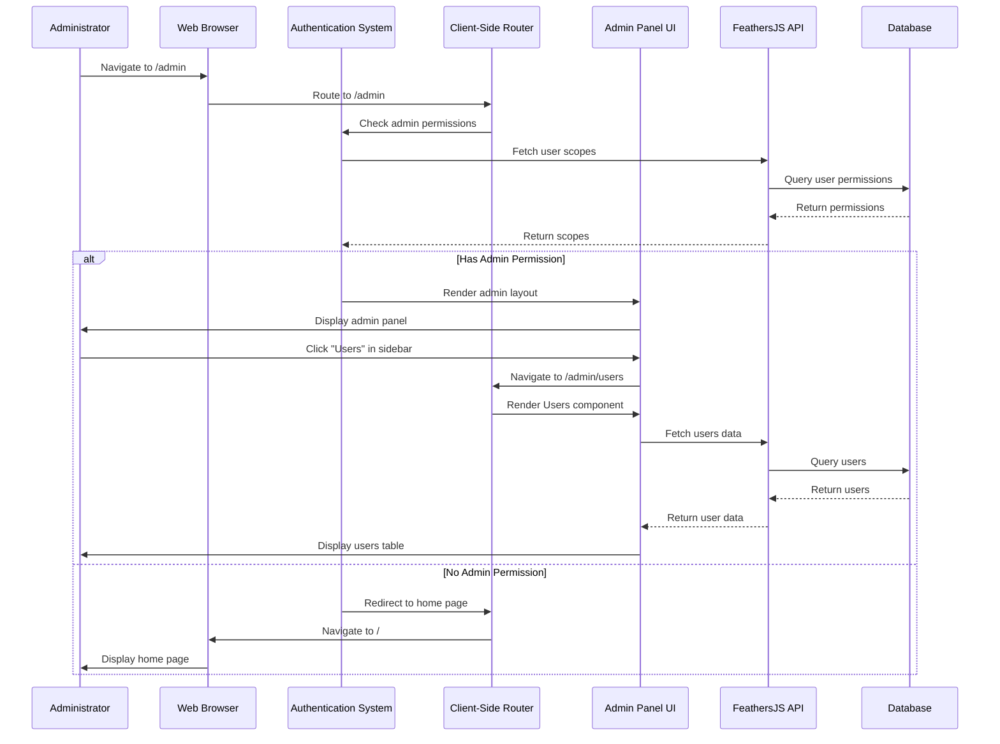

# Admin panel system

## Overview

The Admin Panel System provides a centralized interface for managing and monitoring the iR Engine platform. It enables administrators to view and modify users, projects, locations, and server instances through a secure, role-based interface. 

By leveraging the client core's routing, authentication, and API services, the admin panel creates a comprehensive management dashboard that separates administrative functions from the regular user experience. This chapter explores the implementation, components, and workflow of the admin panel within the iR Engine client.

## Core concepts

### Centralized management

The admin panel serves as a unified control center for administrative tasks:

- **Consolidated interface**: Provides a single location for all management functions
- **Separation of concerns**: Keeps administrative features separate from the regular user experience
- **Comprehensive oversight**: Enables monitoring and management of all system aspects
- **Structured organization**: Groups related functions into logical sections

This centralized approach simplifies administration and provides a consistent management experience.

### Data-driven interface

The admin panel uses standardized components to display and manipulate data:

- **Tables**: Display lists of entities (users, projects, locations) with sorting and pagination
- **Forms**: Provide structured interfaces for creating and editing entities
- **Filters**: Allow administrators to narrow down large datasets
- **Actions**: Enable operations like enabling/disabling, deleting, or modifying entities

These components create a consistent pattern for interacting with different types of data.

### Role-based access control

Access to the admin panel and its features is controlled through permissions:

- **Admin access**: Only users with specific admin permissions can access the panel
- **Granular permissions**: Different sections may require different permission scopes
- **Feature restrictions**: Some actions may be limited based on the user's role
- **Audit trail**: Administrative actions are often logged for accountability

This security model ensures that only authorized personnel can perform administrative functions.

## Implementation

### Admin routes definition

The admin panel's structure is defined through route configurations:

```typescript
// Simplified from src/admin/DefaultAdminRoutes.tsx
import React, { lazy } from 'react';
import { HiUser, HiOutlineTableCells, HiServer } from 'react-icons/hi';

// Lazy-loaded components for each admin section
const Dashboard = lazy(() => import('./components/dashboard'));
const Users = lazy(() => import('./components/user'));
const Projects = lazy(() => import('./components/project'));
const Locations = lazy(() => import('./components/location'));
const Servers = lazy(() => import('./components/server'));

// Define the admin routes and their properties
export const DefaultAdminRoutes = {
  dashboard: {
    name: 'user:dashboard.dashboard',
    scope: 'admin',
    component: Dashboard,
    access: false, // Will be updated based on user permissions
    icon: <HiOutlineTableCells />
  },
  users: {
    name: 'user:dashboard.users',
    scope: 'user',
    component: Users,
    access: false,
    icon: <HiUser />
  },
  projects: {
    name: 'user:dashboard.projects',
    scope: 'projects',
    component: Projects,
    access: false,
    icon: <HiOutlineTableCells />
  },
  locations: {
    name: 'user:dashboard.locations',
    scope: 'location',
    component: Locations,
    access: false,
    icon: <HiOutlineTableCells />
  },
  servers: {
    name: 'user:dashboard.servers',
    scope: 'instance',
    component: Servers,
    access: false,
    icon: <HiServer />
  }
};
```

This configuration:
- Defines each admin section with a unique key (e.g., "users", "projects")
- Specifies the React component to render for each section
- Indicates the permission scope required to access each section
- Provides an icon for the navigation sidebar
- Sets an initial `access` value that will be updated based on the user's permissions

### Admin routes state

The admin routes are managed through Hyperflux state:

```typescript
// Simplified from src/admin/AllowedAdminRoutesState.tsx
import { defineState } from '@ir-engine/hyperflux';
import { ReactNode } from 'react';

// Define the structure of an admin route
export type AdminRouteStateType = {
  name: string;
  scope: string;
  component: React.ComponentType;
  access: boolean;
  icon: ReactNode;
};

// Define the state for storing allowed admin routes
export const AllowedAdminRoutesState = defineState({
  name: 'AllowedAdminRoutesState',
  initial: {} as Record<string, AdminRouteStateType>
});
```

This state:
- Defines the structure of admin route information
- Creates a Hyperflux state to store the routes
- Will be populated with routes from DefaultAdminRoutes
- Will have the `access` property updated based on the user's permissions

### Admin panel entry point

The main admin routes component serves as the entry point to the admin panel:

```jsx
// Simplified from src/admin/adminRoutes.tsx
import React, { useEffect } from 'react';
import { Routes, Route } from 'react-router-dom';
import { useFind } from '@ir-engine/common';
import { scopePath } from '@ir-engine/common/src/schema.type.module';
import { Engine } from '@ir-engine/ecs';
import { getMutableState, useMutableState } from '@ir-engine/hyperflux';
import { AllowedAdminRoutesState } from './AllowedAdminRoutesState';
import { DefaultAdminRoutes } from './DefaultAdminRoutes';
import { RouterState } from '../common/services/RouterService';
import AdminTopBar from './components/AdminTopBar';
import AdminSideBar from './components/AdminSideBar';
import AllowedRoutes from './allowedRoutes';

function AdminRoutes() {
  // Get the current user ID
  const currentUserID = Engine.instance.userID;
  
  // Fetch the user's permission scopes from the server
  const scopeQuery = useFind(scopePath, {
    query: { userId: currentUserID }
  });
  
  // Get the allowed routes state
  const allowedRoutes = useMutableState(AllowedAdminRoutesState);
  
  // Update allowed routes based on user permissions
  useEffect(() => {
    if (scopeQuery.data) {
      // Check if the user has admin access
      const isAdmin = scopeQuery.data.find(scope => scope.type === 'admin:admin');
      
      if (!isAdmin) {
        // If not an admin, redirect to home page
        console.log('User is not an admin. Redirecting...');
        RouterState.navigate('/', { redirectUrl: '/admin' });
        return;
      }
      
      // Initialize routes with DefaultAdminRoutes
      const routes = { ...DefaultAdminRoutes };
      
      // Update access for each route based on user's scopes
      for (const [key, route] of Object.entries(routes)) {
        const hasAccess = scopeQuery.data.some(scope => 
          scope.type === `admin:${route.scope}` || scope.type === 'admin:admin'
        );
        
        routes[key] = {
          ...route,
          access: hasAccess
        };
      }
      
      // Update the allowed routes state
      getMutableState(AllowedAdminRoutesState).merge(routes);
    }
  }, [scopeQuery.data]);
  
  // If no data yet, show loading
  if (!scopeQuery.data) {
    return <div>Loading...</div>;
  }
  
  // Render the admin panel layout
  return (
    <div className="admin-layout">
      <AdminTopBar />
      <main className="admin-content">
        <AdminSideBar />
        <div className="admin-main-content">
          <Routes>
            <Route path="/*" element={<AllowedRoutes />} />
          </Routes>
        </div>
      </main>
    </div>
  );
}

export default AdminRoutes;
```

This component:
1. Fetches the user's permission scopes from the server
2. Checks if the user has admin access and redirects if not
3. Updates the AllowedAdminRoutesState based on the user's permissions
4. Renders the admin panel layout with top bar, sidebar, and content area
5. Uses React Router to handle sub-routes within the admin panel

### Admin sidebar navigation

The sidebar provides navigation between admin sections:

```jsx
// Simplified from src/admin/components/AdminSideBar.tsx
import React from 'react';
import { Link } from 'react-router-dom';
import { useMutableState } from '@ir-engine/hyperflux';
import { AllowedAdminRoutesState } from '../AllowedAdminRoutesState';

function AdminSideBar() {
  // Get the allowed routes from state
  const allowedRoutes = useMutableState(AllowedAdminRoutesState);
  
  return (
    <nav className="admin-sidebar">
      <ul>
        {/* Create a navigation link for each allowed route */}
        {Object.entries(allowedRoutes.value).map(([key, route]) => {
          // Skip routes the user doesn't have access to
          if (!route.access) return null;
          
          return (
            <li key={key}>
              <Link to={`/admin/${key}`} className="admin-nav-link">
                <span className="admin-nav-icon">{route.icon}</span>
                <span className="admin-nav-text">{route.name}</span>
              </Link>
            </li>
          );
        })}
      </ul>
    </nav>
  );
}

export default AdminSideBar;
```

This component:
- Reads the allowed routes from AllowedAdminRoutesState
- Creates navigation links for each route the user has access to
- Uses React Router's Link component for client-side navigation
- Displays the icon and name for each route

### Route rendering

The AllowedRoutes component renders the appropriate content for the current route:

```jsx
// Simplified from src/admin/allowedRoutes.tsx
import React, { Suspense } from 'react';
import { Routes, Route, useLocation } from 'react-router-dom';
import { useMutableState } from '@ir-engine/hyperflux';
import { AllowedAdminRoutesState } from './AllowedAdminRoutesState';

function AllowedRoutes() {
  // Get the current location
  const { pathname } = useLocation();
  
  // Get the allowed routes from state
  const allowedRoutes = useMutableState(AllowedAdminRoutesState);
  
  // Extract the current route key from the URL
  // e.g., "/admin/users" -> "users"
  const path = pathname.split('/')[2] || 'dashboard';
  
  // Get the route definition for the current path
  const currentRoute = allowedRoutes[path]?.value;
  
  // If no route found or user doesn't have access, show not found
  if (!currentRoute || !currentRoute.access) {
    return <div>Page not found or access denied</div>;
  }
  
  // Get the component to render
  const RouteComponent = currentRoute.component;
  
  // Render the component with Suspense for lazy loading
  return (
    <Suspense fallback={<div>Loading...</div>}>
      <Routes>
        <Route path="/*" element={<RouteComponent />} />
      </Routes>
    </Suspense>
  );
}

export default AllowedRoutes;
```

This component:
- Determines the current route from the URL
- Checks if the user has access to that route
- Renders the appropriate component with Suspense for lazy loading
- Handles nested routes within the admin section

### Data table component

The admin panel uses a reusable table component for displaying data:

```jsx
// Simplified from src/admin/common/Table.tsx
import React from 'react';
import { UseFind } from '@ir-engine/common';

// Define the structure of a table column
export interface ITableHeadCell {
  id: string;
  label: string;
  sortable?: boolean;
}

// Props for the DataTable component
interface DataTableProps {
  query: UseFind<any>; // Result from useFind hook
  columns: ITableHeadCell[]; // Column definitions
  rows: any[]; // Data rows
  onRowClick?: (row: any) => void; // Optional row click handler
}

function DataTable({ query, columns, rows, onRowClick }: DataTableProps) {
  // Handle sort column change
  const handleSort = (columnId) => {
    if (!query.setQuery) return;
    
    // Toggle sort direction or set initial sort
    const currentSort = query.query?.$sort || {};
    const newSort = { [columnId]: currentSort[columnId] === 1 ? -1 : 1 };
    
    // Update the query with new sort
    query.setQuery({
      ...query.query,
      $sort: newSort
    });
  };
  
  // Handle pagination
  const handlePageChange = (newPage) => {
    if (!query.setQuery) return;
    
    const limit = query.query?.$limit || 10;
    const skip = newPage * limit;
    
    // Update the query with new pagination
    query.setQuery({
      ...query.query,
      $skip: skip
    });
  };
  
  // Calculate current page and total pages
  const limit = query.query?.$limit || 10;
  const skip = query.query?.$skip || 0;
  const currentPage = Math.floor(skip / limit);
  const totalPages = Math.ceil((query.total || 0) / limit);
  
  return (
    <div className="data-table-container">
      {/* Loading indicator */}
      {query.loading && <div className="loading-overlay">Loading...</div>}
      
      {/* Table */}
      <table className="data-table">
        <thead>
          <tr>
            {columns.map((column) => (
              <th 
                key={column.id}
                onClick={() => column.sortable && handleSort(column.id)}
                className={column.sortable ? 'sortable-column' : ''}
              >
                {column.label}
                {/* Sort indicator */}
                {query.query?.$sort?.[column.id] === 1 && ' ↑'}
                {query.query?.$sort?.[column.id] === -1 && ' ↓'}
              </th>
            ))}
          </tr>
        </thead>
        <tbody>
          {rows.map((row) => (
            <tr 
              key={row.id}
              onClick={() => onRowClick && onRowClick(row)}
              className={onRowClick ? 'clickable-row' : ''}
            >
              {columns.map((column) => (
                <td key={`${row.id}-${column.id}`}>
                  {row[column.id]}
                </td>
              ))}
            </tr>
          ))}
        </tbody>
      </table>
      
      {/* Pagination */}
      {totalPages > 1 && (
        <div className="pagination">
          <button 
            onClick={() => handlePageChange(currentPage - 1)}
            disabled={currentPage === 0}
          >
            Previous
          </button>
          <span>
            Page {currentPage + 1} of {totalPages}
          </span>
          <button 
            onClick={() => handlePageChange(currentPage + 1)}
            disabled={currentPage === totalPages - 1}
          >
            Next
          </button>
        </div>
      )}
    </div>
  );
}

export default DataTable;
```

This component:
- Takes query results from the useFind hook
- Displays data in a table with sortable columns
- Handles pagination for large datasets
- Supports row click events for interactive tables
- Shows loading indicators during data fetching

### Admin section implementation

Each admin section is implemented as a React component that fetches and displays data:

```jsx
// Simplified example of a Users admin section
import React, { useState } from 'react';
import { useFind } from '@ir-engine/common';
import { userPath } from '@ir-engine/common/src/schema.type.module';
import DataTable, { ITableHeadCell } from '../common/Table';
import UserForm from './UserForm';

// Define the table columns
const userColumns: ITableHeadCell[] = [
  { id: 'name', label: 'Name', sortable: true },
  { id: 'email', label: 'Email', sortable: true },
  { id: 'createdAt', label: 'Created', sortable: true },
  { id: 'status', label: 'Status', sortable: true }
];

function UsersAdminPage() {
  // State for the selected user (for editing)
  const [selectedUser, setSelectedUser] = useState(null);
  
  // Fetch users from the server
  const usersQuery = useFind(userPath, {
    query: {
      $limit: 10,
      $skip: 0,
      $sort: { createdAt: -1 }
    }
  });
  
  // Prepare rows for the table
  const tableRows = usersQuery.data?.map(user => ({
    id: user.id,
    name: user.name,
    email: user.email || 'N/A',
    createdAt: new Date(user.createdAt).toLocaleDateString(),
    status: user.active ? 'Active' : 'Inactive'
  })) || [];
  
  // Handle row click to select a user for editing
  const handleRowClick = (row) => {
    const user = usersQuery.data.find(u => u.id === row.id);
    setSelectedUser(user);
  };
  
  // Handle form close
  const handleFormClose = () => {
    setSelectedUser(null);
  };
  
  return (
    <div className="admin-section">
      <h1>Manage Users</h1>
      
      {/* User table */}
      <DataTable
        query={usersQuery}
        columns={userColumns}
        rows={tableRows}
        onRowClick={handleRowClick}
      />
      
      {/* Edit form (shown when a user is selected) */}
      {selectedUser && (
        <UserForm
          user={selectedUser}
          onClose={handleFormClose}
        />
      )}
    </div>
  );
}

export default UsersAdminPage;
```

This component:
- Fetches user data from the server using the useFind hook
- Formats the data for display in the DataTable
- Handles user selection for editing
- Renders a form for editing when a user is selected

## Admin workflow

The complete admin panel workflow follows this sequence:



This diagram illustrates:
1. The administrator navigates to the admin panel
2. The system checks if the user has admin permissions
3. If authorized, the admin panel layout is rendered
4. The administrator clicks a section in the sidebar
5. The appropriate component is rendered for that section
6. Data is fetched from the server and displayed
7. If not authorized, the user is redirected to the home page

## Integration with other components

The admin panel integrates with several other components of the iR Engine client:

### Authentication and authorization

The admin panel relies on the authentication system for access control:

```typescript
// Example of authentication integration
import { useFind } from '@ir-engine/common';
import { scopePath } from '@ir-engine/common/src/schema.type.module';
import { Engine } from '@ir-engine/ecs';

function checkAdminAccess() {
  // Get the current user ID
  const currentUserID = Engine.instance.userID;
  
  // Fetch the user's permission scopes
  const scopeQuery = useFind(scopePath, {
    query: { userId: currentUserID }
  });
  
  // Check if the user has admin permission
  const isAdmin = scopeQuery.data?.some(scope => 
    scope.type === 'admin:admin'
  );
  
  return isAdmin;
}
```

This integration:
- Fetches the user's permission scopes from the server
- Checks if the user has the required admin permissions
- Controls access to the admin panel and its features

### Client-side routing

The admin panel uses the client-side routing system for navigation:

```jsx
// Example of routing integration
import { Routes, Route, Link } from 'react-router-dom';
import { RouterState } from '../common/services/RouterService';

function AdminNavigation() {
  // Programmatic navigation
  const navigateToDashboard = () => {
    RouterState.navigate('/admin/dashboard');
  };
  
  return (
    <nav>
      {/* Declarative navigation with Link */}
      <Link to="/admin/users">Users</Link>
      <Link to="/admin/projects">Projects</Link>
      
      {/* Programmatic navigation with button */}
      <button onClick={navigateToDashboard}>Dashboard</button>
    </nav>
  );
}
```

This integration:
- Uses React Router for declarative navigation with Link components
- Leverages the RouterState for programmatic navigation
- Creates a consistent navigation experience within the admin panel

### FeathersJS API services

The admin panel uses FeathersJS services to fetch and modify data:

```typescript
// Example of FeathersJS integration
import { useFind, useMutation } from '@ir-engine/common';
import { userPath } from '@ir-engine/common/src/schema.type.module';

function UserManagement() {
  // Fetch users
  const usersQuery = useFind(userPath);
  
  // Create mutation for updating users
  const userMutation = useMutation(userPath);
  
  // Function to update a user
  const updateUser = async (userId, data) => {
    try {
      await userMutation.patch(userId, data);
      console.log('User updated successfully');
    } catch (error) {
      console.error('Failed to update user:', error);
    }
  };
  
  // Function to create a new user
  const createUser = async (userData) => {
    try {
      const newUser = await userMutation.create(userData);
      console.log('User created successfully:', newUser);
    } catch (error) {
      console.error('Failed to create user:', error);
    }
  };
  
  // Component implementation
  // ...
}
```

This integration:
- Uses the useFind hook to fetch data from services
- Leverages the useMutation hook for creating, updating, and deleting data
- Provides a consistent pattern for data operations across the admin panel

## Benefits of the admin panel

The Admin Panel System provides several key advantages:

1. **Centralized management**: Provides a single interface for all administrative tasks
2. **Role-based access**: Ensures only authorized users can perform administrative functions
3. **Consistent interface**: Uses shared components for a unified management experience
4. **Efficient operations**: Streamlines common administrative tasks
5. **Comprehensive oversight**: Enables monitoring of all system aspects
6. **Extensibility**: Allows new administrative sections to be added easily
7. **Separation of concerns**: Keeps administrative functions separate from the regular user experience

These benefits make the admin panel an essential tool for managing the iR Engine platform.

## Conclusion

The Admin Panel System completes our exploration of the iR Engine client core. Throughout this documentation, we've examined:

1. Hyperflux State Management for reactive application state
2. FeathersJS API & Real-time Services for server communication
3. User Authentication and Authorization for security
4. Client-Side Routing and Navigation for moving between views
5. XRUI and In-World Widgets for 3D user interfaces
6. Avatar Management and Customization for user representation
7. Instance Provisioning and Networking for shared environments
8. Admin Panel System for platform management

Together, these components form a comprehensive client architecture that enables immersive, multi-user experiences with robust management capabilities.

---


