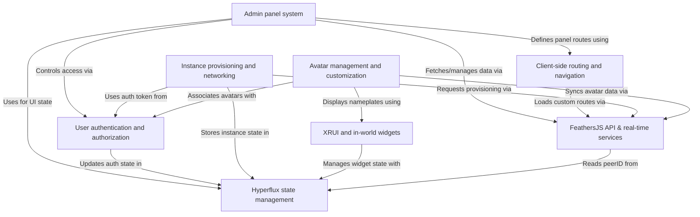

# Client core

The client-side core for the iR Engine is a platform designed for creating and experiencing shared 3D or XR (Extended Reality) environments. It includes an Admin Panel that allows administrators to manage various aspects of the platform, such as users, projects, and servers. Users can authenticate themselves, navigate through different parts of the application using a client-side routing system, and have their 3D avatars managed and customized. The system also handles the provisioning of real-time server instances required for these interactive experiences and supports in-world user interfaces (XRUI) for immersive interaction.

## Architecture overview

The client core consists of several interconnected components that work together to provide a complete client-side experience:

## Documentation chapters

1. [Hyperflux state management](01_hyperflux_state_management_.md)
2. [FeathersJS API & real-time services](02_feathersjs_api___real_time_services_.md)
3. [User authentication and authorization](03_user_authentication_and_authorization_.md)
4. [Client-side routing and navigation](04_client_side_routing_and_navigation_.md)
5. [XRUI and in-world widgets](05_xrui_and_in_world_widgets_.md)
6. [Avatar management and customization](06_avatar_management_and_customization_.md)
7. [Instance provisioning and networking](07_instance_provisioning_and_networking_.md)
8. [Admin panel system](08_admin_panel_system_.md)

---

