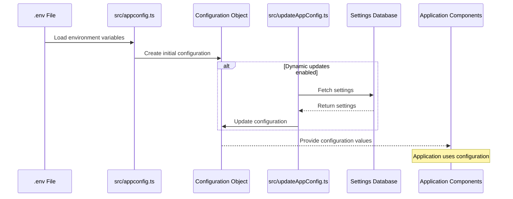

# Application configuration

## Overview

The Application Configuration component is a foundational element of the iR Engine's server core that manages the server's operational parameters and environment-specific settings. It provides a centralized system for defining, accessing, and updating configuration values that control various aspects of the server's behavior.

By abstracting configuration from code, this system enables the server to adapt to different deployment environments without requiring code changes. This chapter explores the implementation, workflow, and benefits of the application configuration system within the iR Engine.

## Core concepts

### Environment variables

Environment variables serve as external inputs to the configuration system:

- **Definition**: Key-value pairs provided to the application from its runtime environment
- **Sources**: Can be loaded from `.env` files, system environment, or deployment platforms
- **Isolation**: Keeps sensitive information separate from the codebase
- **Flexibility**: Allows different values in development, testing, and production environments
- **Security**: Provides a way to manage secrets without committing them to version control

These variables form the foundation of the configuration system.

### Structured configuration

The system transforms raw environment variables into a structured configuration object:

- **Organization**: Groups related settings into logical categories
- **Type safety**: Provides TypeScript interfaces for configuration objects
- **Default values**: Defines fallbacks when environment variables are missing
- **Validation**: Ensures required values are present and properly formatted
- **Documentation**: Self-documents the server's configuration requirements

This structured approach makes configuration more maintainable and less error-prone.

### Dynamic updates

Some configurations can be updated at runtime:

- **Database-stored settings**: Configuration values stored in a database
- **Runtime modifications**: Ability to change certain settings without restarting
- **Overrides**: Database values can override environment variables
- **Centralized management**: Enables configuration changes across multiple instances
- **Versioning**: Tracks changes to configuration over time

This dynamic capability enhances flexibility in production environments.

## Implementation

### Configuration loading

The configuration system loads values from environment variables:

```typescript
// Simplified from: src/appconfig.ts
import dotenv from 'dotenv';
import path from 'path';

// Load environment variables from .env file
dotenv.config({
  path: path.resolve(process.cwd(), '.env.local')
});

// Database configuration
export const db = {
  username: process.env.MYSQL_USER || 'defaultuser',
  password: process.env.MYSQL_PASSWORD || '',
  database: process.env.MYSQL_DATABASE || 'irengine',
  host: process.env.MYSQL_HOST || 'localhost',
  port: parseInt(process.env.MYSQL_PORT || '3306'),
  dialect: 'mysql',
  url: process.env.DATABASE_URL
};

// Server configuration
export const server = {
  port: parseInt(process.env.SERVER_PORT || '3030'),
  hostname: process.env.SERVER_HOST || 'localhost',
  publicDir: process.env.PUBLIC_DIR || path.resolve('./public/'),
  nodeEnv: process.env.NODE_ENV || 'development',
  paginate: {
    default: parseInt(process.env.PAGINATE_DEFAULT || '10'),
    max: parseInt(process.env.PAGINATE_MAX || '100')
  }
};

// Authentication configuration
export const authentication = {
  entity: 'identity-provider',
  service: 'identity-provider',
  secret: process.env.AUTH_SECRET || 'default-secret-change-me',
  authStrategies: ['jwt', 'local'],
  local: {
    usernameField: 'email',
    passwordField: 'password'
  },
  jwtOptions: {
    expiresIn: process.env.JWT_EXPIRES_IN || '1d'
  }
};

// AWS configuration
export const aws = {
  s3: {
    accessKeyId: process.env.AWS_ACCESS_KEY_ID || '',
    secretAccessKey: process.env.AWS_SECRET_ACCESS_KEY || '',
    region: process.env.AWS_REGION || 'us-east-1',
    s3ForcePathStyle: true,
    signatureVersion: 'v4'
  }
};

// Combine all configurations
const config = {
  db,
  server,
  authentication,
  aws,
  // Other configuration categories...
};

export default config;
```

This code:
- Loads environment variables from a `.env.local` file
- Defines structured configuration objects for different aspects of the system
- Provides default values for missing environment variables
- Combines all configuration categories into a single exported object

### Configuration usage

Other parts of the application import and use the configuration:

```typescript
// Example of configuration usage in database setup
import config from './appconfig';
import knex from 'knex';

// Create database connection using configuration
export const createKnexClient = () => {
  return knex({
    client: 'mysql2',
    connection: {
      host: config.db.host,
      port: config.db.port,
      user: config.db.username,
      password: config.db.password,
      database: config.db.database
    },
    pool: {
      min: 2,
      max: 10
    }
  });
};
```

This code:
- Imports the configuration object from `appconfig.ts`
- Uses database configuration values to create a database connection
- Demonstrates how configuration is consumed by other components

### Dynamic configuration updates

The system can update configuration values from a database:

```typescript
// Simplified from: src/updateAppConfig.ts
import config from './appconfig';
import { createKnexClient } from './db';

/**
 * Updates application configuration with values from the database
 */
export const updateAppConfig = async (): Promise<void> => {
  // Create database client
  const knexClient = createKnexClient();

  try {
    // Fetch settings from database
    const settings = await knexClient('engine_settings')
      .select('category', 'key', 'value')
      .where('enabled', true);

    // Update configuration with database values
    for (const setting of settings) {
      updateNestedConfig(
        config,
        setting.category,
        setting.key,
        setting.value
      );
    }

    console.log('Configuration updated from database settings');
  } catch (error) {
    console.error('Failed to update configuration from database:', error);
  } finally {
    // Close database connection
    await knexClient.destroy();
  }
};

/**
 * Updates a nested property in the configuration object
 */
function updateNestedConfig(
  config: any,
  category: string,
  key: string,
  value: string
): void {
  // Ensure category exists
  if (!config[category]) {
    config[category] = {};
  }

  // Update the value, converting to appropriate type
  if (value === 'true' || value === 'false') {
    config[category][key] = value === 'true';
  } else if (!isNaN(Number(value))) {
    config[category][key] = Number(value);
  } else {
    config[category][key] = value;
  }
}
```

This code:
- Connects to the database using the initial configuration
- Fetches settings from an `engine_settings` table
- Updates the configuration object with values from the database
- Handles type conversion for boolean and numeric values

## Configuration workflow

The complete configuration workflow follows this sequence:



This diagram illustrates:
1. Environment variables are loaded from `.env` files
2. The `appconfig.ts` file creates the initial configuration object
3. If dynamic updates are enabled, `updateAppConfig.ts` fetches settings from the database
4. The configuration object is updated with database values
5. Application components use the configuration values

## Configuration categories

The configuration system includes several categories of settings:

### Database configuration

Settings for database connections:

```typescript
// Database configuration example
export const db = {
  username: process.env.MYSQL_USER || 'defaultuser',
  password: process.env.MYSQL_PASSWORD || '',
  database: process.env.MYSQL_DATABASE || 'irengine',
  host: process.env.MYSQL_HOST || 'localhost',
  port: parseInt(process.env.MYSQL_PORT || '3306'),
  dialect: 'mysql',
  url: process.env.DATABASE_URL
};
```

These settings control:
- Database connection credentials
- Database server location
- Connection parameters
- Database type and dialect

### Server configuration

Settings for the server itself:

```typescript
// Server configuration example
export const server = {
  port: parseInt(process.env.SERVER_PORT || '3030'),
  hostname: process.env.SERVER_HOST || 'localhost',
  publicDir: process.env.PUBLIC_DIR || path.resolve('./public/'),
  nodeEnv: process.env.NODE_ENV || 'development',
  paginate: {
    default: parseInt(process.env.PAGINATE_DEFAULT || '10'),
    max: parseInt(process.env.PAGINATE_MAX || '100')
  }
};
```

These settings control:
- Network port and hostname
- Public directory for static files
- Environment mode (development, production)
- Pagination defaults for API responses

### Authentication configuration

Settings for user authentication:

```typescript
// Authentication configuration example
export const authentication = {
  entity: 'identity-provider',
  service: 'identity-provider',
  secret: process.env.AUTH_SECRET || 'default-secret-change-me',
  authStrategies: ['jwt', 'local'],
  local: {
    usernameField: 'email',
    passwordField: 'password'
  },
  jwtOptions: {
    expiresIn: process.env.JWT_EXPIRES_IN || '1d'
  }
};
```

These settings control:
- Authentication strategies
- JWT secret and expiration
- User entity and service
- Field mappings for authentication

### Storage configuration

Settings for file storage:

```typescript
// Storage configuration example
export const storage = {
  provider: process.env.STORAGE_PROVIDER || 'local',
  local: {
    baseDir: process.env.STORAGE_LOCAL_BASE_DIR || path.resolve('./uploads')
  },
  s3: {
    bucket: process.env.STORAGE_S3_BUCKET || 'irengine-uploads',
    region: process.env.AWS_REGION || 'us-east-1',
    accessKeyId: process.env.AWS_ACCESS_KEY_ID || '',
    secretAccessKey: process.env.AWS_SECRET_ACCESS_KEY || ''
  },
  gcs: {
    bucket: process.env.STORAGE_GCS_BUCKET || 'irengine-uploads',
    keyFilename: process.env.GOOGLE_APPLICATION_CREDENTIALS || ''
  }
};
```

These settings control:
- Storage provider selection
- Local storage directory
- Cloud storage credentials and buckets
- Region and access settings

## Integration with other components

The configuration system integrates with several other components of the server core:

### Database management

The configuration provides database connection details:

```typescript
// Example of database integration
import config from './appconfig';
import knex from 'knex';

// Create database connection
const db = knex({
  client: 'mysql2',
  connection: {
    host: config.db.host,
    port: config.db.port,
    user: config.db.username,
    password: config.db.password,
    database: config.db.database
  }
});

// Export database client
export default db;
```

This integration:
- Uses database configuration to establish connections
- Ensures consistent database access across the application
- Allows database settings to be changed without code modifications

### Authentication & authorization

The configuration defines authentication strategies and settings:

```typescript
// Example of authentication integration
import config from './appconfig';
import { AuthenticationService } from '@feathersjs/authentication';
import { JWTStrategy } from '@feathersjs/authentication-jwt';
import { LocalStrategy } from '@feathersjs/authentication-local';

// Configure authentication service
export default function(app) {
  const authentication = new AuthenticationService(app);

  // Set up JWT strategy
  authentication.register('jwt', new JWTStrategy({
    secret: config.authentication.secret,
    jwtOptions: config.authentication.jwtOptions
  }));

  // Set up local strategy
  authentication.register('local', new LocalStrategy({
    usernameField: config.authentication.local.usernameField,
    passwordField: config.authentication.local.passwordField
  }));

  // Add authentication service
  app.use('/authentication', authentication);
}
```

This integration:
- Configures authentication strategies based on configuration
- Sets up JWT secrets and options
- Defines username and password fields
- Creates a flexible authentication system

### Storage providers

The configuration determines which storage provider to use:

```typescript
// Example of storage integration
import config from './appconfig';
import { LocalStorage } from './storage/local';
import { S3Storage } from './storage/s3';
import { GCSStorage } from './storage/gcs';

// Create appropriate storage provider
export function createStorageProvider() {
  switch (config.storage.provider) {
    case 's3':
      return new S3Storage(config.storage.s3);
    case 'gcs':
      return new GCSStorage(config.storage.gcs);
    case 'local':
    default:
      return new LocalStorage(config.storage.local);
  }
}
```

This integration:
- Selects the appropriate storage provider based on configuration
- Initializes the provider with the correct settings
- Enables switching between storage options without code changes
- Provides a consistent interface regardless of the underlying provider

## Benefits of application configuration

The Application Configuration system provides several key advantages:

1. **Separation of concerns**: Keeps configuration separate from code
2. **Environment adaptability**: Enables the server to run in different environments
3. **Security**: Keeps sensitive information out of the codebase
4. **Centralization**: Provides a single source of truth for configuration
5. **Flexibility**: Allows configuration changes without code modifications
6. **Dynamic updates**: Enables runtime configuration changes in some cases
7. **Documentation**: Self-documents the server's configuration requirements

These benefits make the application configuration system an essential foundation for the iR Engine's server core.

## Next steps

With an understanding of how the server is configured, the next chapter explores how these configurations are used to set up the main application framework.

Next: [Feathers application](02_feathers_application_.md)

---


