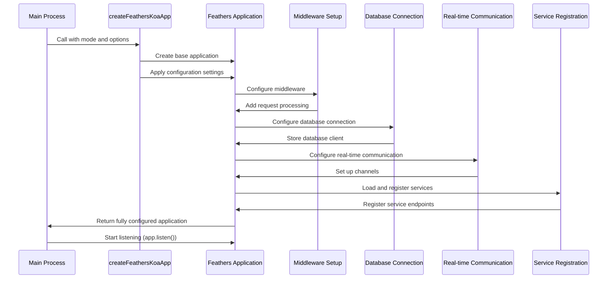

# Feathers application

## Overview

The Feathers Application component is the central element of the iR Engine's server core that serves as the main application instance and orchestrates all server functionality. It initializes the web server, configures middleware, sets up services, and establishes communication channels. By leveraging the FeathersJS framework built on top of KoaJS, this component provides a structured foundation for building a robust, real-time backend system. This chapter explores the implementation, initialization process, and structure of the Feathers application within the iR Engine.

## Core concepts

### Application instance

The Feathers application instance serves as the central hub for the server:

- **Central coordination**: Acts as the main entry point and coordinator for all server components
- **Configuration storage**: Maintains application-wide settings and parameters
- **Service registration**: Provides a registry for all application services
- **Middleware pipeline**: Manages the processing of incoming requests
- **Event system**: Facilitates communication between different parts of the application

This instance is the foundation upon which all other functionality is built.

### Middleware

Middleware functions process requests and responses in a sequential pipeline:

- **Request processing**: Transforms and validates incoming requests
- **Response modification**: Formats and enhances outgoing responses
- **Cross-cutting concerns**: Handles aspects like security, logging, and error handling
- **Order-dependent execution**: Processes requests in a specific sequence
- **Composability**: Can be combined and reused across different routes

Middleware provides a flexible way to add functionality to the request-response cycle.

### Configuration modules

Configuration modules encapsulate setup logic for specific features:

- **Modular setup**: Organizes initialization code into focused modules
- **Pluggable architecture**: Allows features to be added or removed easily
- **Dependency management**: Handles the initialization order of interdependent components
- **Separation of concerns**: Isolates different aspects of the application
- **Reusability**: Enables the same setup logic to be used in different contexts

This approach creates a clean, maintainable structure for application initialization.

## Implementation

### Application creation

The application is created in a dedicated factory function:

```typescript
// Simplified from: src/createApp.ts
import { feathers } from '@feathersjs/feathers';
import { koa } from '@feathersjs/koa';
import { ServerMode } from './ServerState';
import appConfig from './appconfig';
import logger from './ServerLogger';

/**
 * Creates a Feathers application with Koa as the HTTP provider
 * @param mode Server mode (API, Instance, etc.)
 * @param options Additional options
 * @returns Configured Feathers application
 */
export const createFeathersKoaApp = async (
  mode: ServerMode,
  options: any = {}
) => {
  // Create the base Feathers application with Koa
  const app = koa(feathers());
  
  // Store the server mode
  app.set('mode', mode);
  
  // Set up logging
  app.set('logger', logger);
  logger.info(`Creating Feathers application in ${mode} mode`);
  
  // Apply configuration settings
  app.set('port', appConfig.server.port);
  app.set('host', appConfig.server.hostname);
  app.set('paginate', appConfig.server.paginate);
  app.set('authentication', appConfig.authentication);
  
  // Store additional options
  if (options) {
    Object.keys(options).forEach(key => {
      app.set(key, options[key]);
    });
  }
  
  // Return the configured application
  return app;
};
```

This function:
1. Creates a new Feathers application with Koa as the HTTP provider
2. Sets the server mode (API, Instance, etc.)
3. Configures logging
4. Applies settings from the application configuration
5. Stores additional options provided during initialization

### Middleware setup

Middleware is added to process requests and responses:

```typescript
// Simplified from: src/createApp.ts
import { bodyParser, errorHandler, rest } from '@feathersjs/koa';
import helmet from 'koa-helmet';
import cors from '@koa/cors';
import compress from 'koa-compress';
import { logger as loggerMiddleware } from './middleware/logger';

/**
 * Configures middleware for the Feathers application
 * @param app Feathers application
 */
const configureMiddleware = (app: Application) => {
  const logger = app.get('logger');
  logger.info('Configuring middleware');
  
  // Add security headers
  app.use(helmet({
    contentSecurityPolicy: false
  }));
  
  // Enable CORS
  app.use(cors({
    origin: '*',
    credentials: true
  }));
  
  // Compress responses
  app.use(compress());
  
  // Parse request bodies
  app.use(bodyParser());
  
  // Log requests
  app.use(loggerMiddleware(app));
  
  // Handle errors
  app.use(errorHandler());
  
  // Enable REST API
  app.configure(rest());
  
  // Serve static files if in API mode
  if (app.get('mode') === ServerMode.API) {
    app.use(serveStatic(appConfig.server.publicDir));
  }
  
  logger.info('Middleware configured');
};
```

This function:
1. Adds security headers with Helmet
2. Enables Cross-Origin Resource Sharing (CORS)
3. Compresses responses for better performance
4. Parses request bodies (JSON, form data, etc.)
5. Adds request logging
6. Configures error handling
7. Enables the REST API
8. Serves static files in API mode

### Database connection

The application connects to the database:

```typescript
// Simplified from: src/mysql.ts
import knex from 'knex';
import appConfig from './appconfig';

/**
 * Configures the database connection
 * @param app Feathers application
 */
export default function(app: Application) {
  const logger = app.get('logger');
  logger.info('Configuring database connection');
  
  // Create Knex client
  const db = knex({
    client: 'mysql2',
    connection: {
      host: appConfig.db.host,
      port: appConfig.db.port,
      user: appConfig.db.username,
      password: appConfig.db.password,
      database: appConfig.db.database
    },
    pool: {
      min: 2,
      max: 10
    },
    debug: appConfig.server.nodeEnv === 'development'
  });
  
  // Store the database client in the app
  app.set('knexClient', db);
  
  // Add a hook to close the database connection when the app is stopped
  app.hooks({
    teardown: async () => {
      logger.info('Closing database connection');
      await db.destroy();
    }
  });
  
  logger.info('Database connection configured');
}
```

This function:
1. Creates a Knex database client using configuration settings
2. Stores the client in the application for use by services
3. Adds a teardown hook to close the connection when the app stops
4. Configures connection pooling for better performance

### Real-time communication

The application sets up real-time communication channels:

```typescript
// Simplified from: src/util/primus.ts
import { Primus } from '@feathersjs/primus';
import { PrimusOptions } from '@feathersjs/primus/lib';

/**
 * Configures Primus for real-time communication
 * @param options Primus configuration options
 * @returns Configuration function for Feathers
 */
export default function(options: PrimusOptions = {}) {
  return function(app: Application) {
    const logger = app.get('logger');
    logger.info('Configuring Primus for real-time communication');
    
    // Default options
    const primusOptions: PrimusOptions = {
      transformer: 'websockets',
      ...options
    };
    
    // Create Primus server
    const primus = new Primus(app, primusOptions);
    
    // Store the Primus instance
    app.set('primus', primus);
    
    // Configure channels for event distribution
    app.configure(channels);
    
    logger.info('Primus configured');
  };
}

/**
 * Configures channels for event distribution
 * @param app Feathers application
 */
function channels(app: Application) {
  const logger = app.get('logger');
  logger.info('Configuring channels');
  
  app.on('connection', connection => {
    // On a new real-time connection, add it to the anonymous channel
    app.channel('anonymous').join(connection);
    
    connection.on('authenticate', (auth: any) => {
      // If the connection is authenticated, remove it from anonymous
      app.channel('anonymous').leave(connection);
      
      // Add it to the authenticated channel
      app.channel('authenticated').join(connection);
      
      // Add it to user-specific channel
      app.channel(`user/${auth.user.id}`).join(connection);
    });
  });
  
  // Publish service events to appropriate channels
  app.publish((data, context) => {
    // Get the service that sent the event
    const { service, path } = context;
    
    // Determine which channels should receive the event
    // This is a simplified example - actual logic would be more complex
    if (path === 'messages') {
      // For messages, publish to the specific room
      return app.channel(`room/${data.roomId}`);
    }
    
    // For user-specific data, publish to that user's channel
    if (data.userId) {
      return app.channel(`user/${data.userId}`);
    }
    
    // Default: publish to the authenticated channel
    return app.channel('authenticated');
  });
  
  logger.info('Channels configured');
}
```

This code:
1. Creates a Primus server for WebSocket communication
2. Configures channels for event distribution
3. Sets up connection handling for new clients
4. Defines publishing rules for service events
5. Manages authenticated and anonymous connections

### Service loading

The application loads and registers all services:

```typescript
// Simplified from: src/services.ts
import userService from './user/user.service';
import authService from './user/authentication.service';
import projectService from './project/project.service';
import assetService from './asset/asset.service';
// ... other service imports

/**
 * Configures all services for the application
 * @param app Feathers application
 */
export default async function(app: Application) {
  const logger = app.get('logger');
  logger.info('Configuring services');
  
  // Configure authentication first
  app.configure(authService);
  
  // Configure user-related services
  app.configure(userService);
  
  // Configure project-related services
  app.configure(projectService);
  
  // Configure asset-related services
  app.configure(assetService);
  
  // ... configure other services
  
  logger.info('Services configured');
}
```

This function:
1. Loads and registers all application services
2. Ensures services are initialized in the correct order
3. Organizes services by functional area
4. Provides a central place to manage service registration

### Application type definition

The application type is extended to include custom properties:

```typescript
// Simplified from: src/declarations.ts
import type { Application as KoaFeathers } from '@feathersjs/koa';
import type { ServiceTypes } from '@ir-engine/common/declarations';
import type { Knex } from 'knex';
import type { Logger } from 'winston';
import type { ServerMode } from './ServerState';

// Extended Application type
export type Application = KoaFeathers<ServiceTypes> & {
  // Custom properties
  primus: any;
  sync: any;
  isSetup: Promise<boolean>;
  
  // Typed getters for common properties
  get(key: 'knexClient'): Knex;
  get(key: 'logger'): Logger;
  get(key: 'mode'): ServerMode;
  get(key: string): any;
};
```

This type definition:
1. Extends the base Feathers application type
2. Adds custom properties specific to the iR Engine
3. Provides type-safe getters for common properties
4. Improves developer experience with better type checking

## Application initialization workflow

The complete application initialization workflow follows this sequence:



This diagram illustrates:
1. The main process calls `createFeathersKoaApp` with a mode and options
2. The creator function builds the base application and applies settings
3. Middleware is configured to process requests
4. The database connection is established
5. Real-time communication is set up
6. Services are loaded and registered
7. The fully configured application is returned
8. The main process starts the server listening for requests

## Application components

The Feathers application consists of several key components:

### Core application

The core application provides the foundation:

```typescript
// Core application creation
const app = koa(feathers());
```

This creates:
- A Feathers application instance
- With Koa as the HTTP provider
- Supporting both REST and real-time communication
- With an event system for internal communication

### Configuration store

The application stores configuration values:

```typescript
// Configuration storage
app.set('port', appConfig.server.port);
app.set('host', appConfig.server.hostname);
app.set('paginate', appConfig.server.paginate);
app.set('authentication', appConfig.authentication);
```

This provides:
- A central store for application settings
- Access to configuration throughout the application
- Type-safe retrieval of settings
- Runtime configuration management

### Middleware pipeline

The middleware pipeline processes requests:

```typescript
// Middleware pipeline
app.use(helmet());
app.use(cors());
app.use(compress());
app.use(bodyParser());
app.use(loggerMiddleware(app));
app.use(errorHandler());
```

This creates:
- A sequential processing pipeline for requests
- Security enhancements with Helmet
- Cross-origin request handling with CORS
- Response compression for better performance
- Request body parsing for different content types
- Logging and error handling

### Service registry

The service registry manages application services:

```typescript
// Service registration
app.configure(authService);
app.configure(userService);
app.configure(projectService);
app.configure(assetService);
```

This provides:
- A registry of all application services
- Standard methods for data operations (find, get, create, etc.)
- Event emission for real-time updates
- Integration with the database
- Business logic organization

### Channel system

The channel system manages real-time communication:

```typescript
// Channel configuration
app.on('connection', connection => {
  app.channel('anonymous').join(connection);
  
  connection.on('authenticate', auth => {
    app.channel('anonymous').leave(connection);
    app.channel('authenticated').join(connection);
    app.channel(`user/${auth.user.id}`).join(connection);
  });
});

app.publish((data, context) => {
  // Determine which channels should receive the event
  // ...
});
```

This creates:
- A system for organizing client connections
- Selective event distribution
- Authentication-aware channels
- Custom publishing rules
- Real-time updates for clients

## Integration with other components

The Feathers application integrates with several other components of the server core:

### Application configuration

The application uses configuration values:

```typescript
// Example of configuration integration
import appConfig from './appconfig';

// Inside createFeathersKoaApp
app.set('port', appConfig.server.port);
app.set('host', appConfig.server.hostname);
app.set('paginate', appConfig.server.paginate);
app.set('authentication', appConfig.authentication);
```

This integration:
- Uses configuration values from the application configuration
- Applies settings to the Feathers application
- Makes configuration available to all parts of the application
- Adapts the application to different environments

### Database management

The application connects to the database:

```typescript
// Example of database integration
import mysql from './mysql';

// Inside createFeathersKoaApp
app.configure(mysql);

// Inside mysql.ts
export default function(app) {
  const db = knex({
    client: 'mysql2',
    connection: {
      host: appConfig.db.host,
      port: appConfig.db.port,
      user: appConfig.db.username,
      password: appConfig.db.password,
      database: appConfig.db.database
    }
  });
  
  app.set('knexClient', db);
}
```

This integration:
- Establishes a connection to the database
- Makes the database client available to services
- Uses configuration values for connection details
- Manages the database connection lifecycle

### Authentication & authorization

The application configures authentication:

```typescript
// Example of authentication integration
import authentication from './user/authentication';

// Inside createFeathersKoaApp
app.configure(authentication);

// Inside authentication.ts
export default function(app) {
  const authService = new AuthenticationService(app);
  
  authService.register('jwt', new JWTStrategy());
  authService.register('local', new LocalStrategy());
  
  app.use('/authentication', authService);
}
```

This integration:
- Sets up authentication services
- Configures authentication strategies
- Provides login and token validation
- Secures access to protected resources

## Benefits of the Feathers application

The Feathers Application component provides several key advantages:

1. **Structured foundation**: Provides a clear, organized structure for the server
2. **Modular architecture**: Enables easy addition and removal of features
3. **Standardized patterns**: Creates consistent approaches to common tasks
4. **Real-time capabilities**: Supports instant updates and communication
5. **REST API**: Provides a standard interface for HTTP clients
6. **Event system**: Facilitates communication between components
7. **Extensibility**: Allows the application to be customized and extended

These benefits make the Feathers application an essential foundation for the iR Engine's server core.

## Next steps

With an understanding of the main application structure, the next chapter explores how the actual business logic and data management are organized.

Next: [Services (FeathersJS)](03_services__feathersjs__.md)

---


