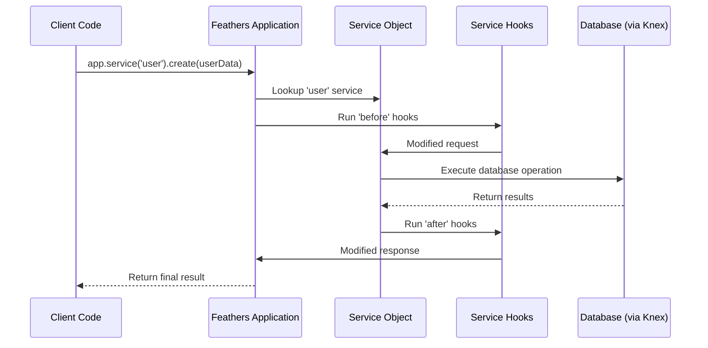

# Services (FeathersJS)

## Overview

The Services component is a fundamental element of the iR Engine's server core that organizes business logic and data operations into modular, resource-specific units. Each service manages a particular type of data or functionality, providing standardized methods for creating, reading, updating, and deleting resources. By implementing the service-oriented architecture pattern of FeathersJS, this component creates a clean separation of concerns and enables consistent API access across different resources. This chapter explores the implementation, structure, and usage of services within the iR Engine.

## Core concepts

### Service-oriented architecture

Services organize application functionality into resource-specific modules:

- **Resource encapsulation**: Each service manages a specific type of data or functionality
- **Separation of concerns**: Business logic is isolated by resource type
- **Standardized interfaces**: Consistent methods across different resources
- **Modular design**: Services can be developed and tested independently
- **Reusability**: Common patterns can be shared across services

This architectural approach creates a maintainable and scalable codebase.

### Standard service methods

FeathersJS services implement a standard set of methods:

- **find(params)**: Retrieve multiple resources, often with filtering
- **get(id, params)**: Retrieve a single resource by its identifier
- **create(data, params)**: Create a new resource
- **update(id, data, params)**: Replace an existing resource completely
- **patch(id, data, params)**: Update parts of an existing resource
- **remove(id, params)**: Delete a resource

These methods provide a consistent interface for all data operations.

### Service registration

Services are registered with the application to make them available:

- **Path binding**: Each service is associated with a specific URL path
- **Method mapping**: HTTP methods are mapped to service methods
- **Middleware integration**: Services participate in the request pipeline
- **Event emission**: Service operations trigger events for real-time updates
- **Centralized registration**: All services are registered in a coordinated way

This registration process connects services to the application framework.

## Implementation

### Service class definition

Services are typically implemented as classes:

```typescript
// Simplified from: src/user/user/user.class.ts
import { KnexService } from '@feathersjs/knex';
import { UserType, UserData, UserParams, UserPatch } from '@ir-engine/common/schemas';
import { Application } from '../../declarations';

/**
 * User service for managing user accounts
 */
export class UserService extends KnexService<
  UserType,    // The type of a full user object
  UserData,    // The type for data when creating a user
  UserParams,  // The type for parameters passed to service methods
  UserPatch    // The type for data when patching a user
> {
  /**
   * Constructor for the user service
   * @param options Configuration options
   * @param app Feathers application
   */
  constructor(options: any, app: Application) {
    // Call the parent constructor with options
    super(options);
    
    // Store the application instance
    this.app = app;
  }
  
  /**
   * Find users with optional filtering
   * @param params Query parameters
   * @returns Promise resolving to users
   */
  async find(params?: UserParams): Promise<UserType[]> {
    // Use the parent implementation for basic functionality
    return super.find(params);
  }
  
  /**
   * Get a user by ID
   * @param id User ID
   * @param params Query parameters
   * @returns Promise resolving to a user
   */
  async get(id: string, params?: UserParams): Promise<UserType> {
    // Use the parent implementation for basic functionality
    return super.get(id, params);
  }
  
  /**
   * Create a new user
   * @param data User data
   * @param params Query parameters
   * @returns Promise resolving to the created user
   */
  async create(data: UserData, params?: UserParams): Promise<UserType> {
    // Use the parent implementation for basic functionality
    return super.create(data, params);
  }
  
  /**
   * Update a user (replace completely)
   * @param id User ID
   * @param data User data
   * @param params Query parameters
   * @returns Promise resolving to the updated user
   */
  async update(id: string, data: UserData, params?: UserParams): Promise<UserType> {
    // Use the parent implementation for basic functionality
    return super.update(id, data, params);
  }
  
  /**
   * Patch a user (partial update)
   * @param id User ID
   * @param data Partial user data
   * @param params Query parameters
   * @returns Promise resolving to the patched user
   */
  async patch(id: string, data: UserPatch, params?: UserParams): Promise<UserType> {
    // Use the parent implementation for basic functionality
    return super.patch(id, data, params);
  }
  
  /**
   * Remove a user
   * @param id User ID
   * @param params Query parameters
   * @returns Promise resolving to the removed user
   */
  async remove(id: string, params?: UserParams): Promise<UserType> {
    // Use the parent implementation for basic functionality
    return super.remove(id, params);
  }
}
```

This code:
- Defines a service class that extends `KnexService` for database operations
- Specifies type parameters for type safety
- Implements the standard service methods
- Uses the parent class implementation for basic functionality
- Can be extended with custom business logic as needed

### Service registration

Services are registered with the application in dedicated setup files:

```typescript
// Simplified from: src/user/user/user.service.ts
import { Application } from '../../declarations';
import { UserService } from './user.class';
import { userPath, userMethods } from './user.shared';
import hooks from './user.hooks';

/**
 * Configures the user service
 * @param app Feathers application
 */
export default function(app: Application): void {
  // Service options
  const options = {
    Model: app.get('knexClient'),
    name: 'user',
    paginate: app.get('paginate')
  };
  
  // Register the service
  app.use(userPath, new UserService(options, app));
  
  // Get the registered service
  const service = app.service(userPath);
  
  // Set up hooks
  service.hooks(hooks);
}
```

This function:
1. Creates options for the service, including the database connection
2. Registers the service on a specific path using `app.use()`
3. Retrieves the registered service
4. Sets up hooks for the service (more on hooks in a later chapter)

### Service aggregation

All services are aggregated and registered in a central location:

```typescript
// Simplified from: src/services.ts
import { Application } from './declarations';

// Import service configurators
import userService from './user/user/user.service';
import authService from './user/authentication/authentication.service';
import projectService from './project/project/project.service';
import assetService from './asset/asset/asset.service';
// ... other service imports

/**
 * Configures all services for the application
 * @param app Feathers application
 */
export default async function(app: Application): Promise<void> {
  const logger = app.get('logger');
  logger.info('Configuring services');
  
  // Configure authentication first
  app.configure(authService);
  
  // Configure user-related services
  app.configure(userService);
  
  // Configure project-related services
  app.configure(projectService);
  
  // Configure asset-related services
  app.configure(assetService);
  
  // ... configure other services
  
  logger.info('Services configured');
}
```

This function:
1. Imports all service configurator functions
2. Configures authentication first (as it's often a dependency)
3. Configures all other services in a logical order
4. Logs the progress for monitoring

### Service usage

Services are used by calling their methods:

```typescript
// Example of service usage
import { Application } from './declarations';

/**
 * Creates a new user
 * @param app Feathers application
 * @param userData User data
 * @returns Promise resolving to the created user
 */
async function createUser(app: Application, userData: any): Promise<any> {
  // Get the user service
  const userService = app.service('user');
  
  // Create a new user
  const user = await userService.create(userData);
  
  return user;
}

/**
 * Finds users matching criteria
 * @param app Feathers application
 * @param query Query parameters
 * @returns Promise resolving to matching users
 */
async function findUsers(app: Application, query: any): Promise<any> {
  // Get the user service
  const userService = app.service('user');
  
  // Find users matching the query
  const users = await userService.find({
    query
  });
  
  return users;
}

/**
 * Updates a user
 * @param app Feathers application
 * @param userId User ID
 * @param userData User data
 * @returns Promise resolving to the updated user
 */
async function updateUser(app: Application, userId: string, userData: any): Promise<any> {
  // Get the user service
  const userService = app.service('user');
  
  // Update the user
  const user = await userService.patch(userId, userData);
  
  return user;
}
```

This code:
1. Gets a reference to a service using `app.service(path)`
2. Calls service methods like `create()`, `find()`, and `patch()`
3. Passes appropriate parameters to each method
4. Handles the returned promises

## Service workflow

The complete service workflow follows this sequence:



This diagram illustrates:
1. Client code calls a service method through the application
2. The application looks up the registered service
3. Before hooks process the request (validation, authorization, etc.)
4. The service executes the core logic, often involving database operations
5. After hooks process the response (formatting, filtering, etc.)
6. The final result is returned to the client

## Service types

The iR Engine implements several types of services:

### Database services

Services that interact with database tables:

```typescript
// Example of a database service
import { KnexService } from '@feathersjs/knex';

export class ProjectService extends KnexService {
  // KnexService provides implementations for all standard methods
  // that interact with a database table
}
```

These services:
- Extend `KnexService` for database operations
- Map service methods to SQL operations
- Handle pagination and filtering
- Manage database connections
- Provide consistent data access patterns

### Custom services

Services with specialized business logic:

```typescript
// Example of a custom service
import { ServiceMethods } from '@feathersjs/feathers';

export class AnalyticsService implements ServiceMethods<any, any> {
  app: Application;
  
  constructor(options: any, app: Application) {
    this.app = app;
  }
  
  // Implement only the methods needed
  async find(params?: any): Promise<any> {
    // Custom implementation for analytics queries
    const knex = this.app.get('knexClient');
    
    // Complex query logic
    const results = await knex.raw(`
      SELECT 
        date_trunc('day', created_at) as day,
        COUNT(*) as count
      FROM events
      WHERE event_type = ?
      GROUP BY day
      ORDER BY day
    `, [params.query.eventType]);
    
    return results;
  }
  
  // Other methods can throw "Method not implemented" errors
  // or be implemented as needed
}
```

These services:
- Implement custom business logic
- May not use all standard methods
- Often perform complex operations
- Can integrate with external systems
- Provide specialized functionality

### Proxy services

Services that delegate to other services or external APIs:

```typescript
// Example of a proxy service
import axios from 'axios';
import { ServiceMethods } from '@feathersjs/feathers';

export class WeatherService implements ServiceMethods<any, any> {
  apiKey: string;
  
  constructor(options: any) {
    this.apiKey = options.apiKey;
  }
  
  async find(params?: any): Promise<any> {
    // Call external weather API
    const response = await axios.get('https://api.weather.com/forecast', {
      params: {
        key: this.apiKey,
        location: params.query.location
      }
    });
    
    // Transform and return the data
    return response.data;
  }
  
  // Implement other methods as needed
}
```

These services:
- Act as facades for external APIs
- Transform data between formats
- Handle authentication with external systems
- Cache responses when appropriate
- Provide a consistent interface for external resources

## Integration with other components

Services integrate with several other components of the server core:

### Database management

Services use the database client for data operations:

```typescript
// Example of database integration
import { KnexService } from '@feathersjs/knex';

// Service class
export class UserService extends KnexService {
  // KnexService uses the provided Model (Knex client)
  // to perform database operations
}

// Service registration
export default function(app: Application): void {
  const options = {
    Model: app.get('knexClient'), // Get the database client
    name: 'user' // Table name
  };
  
  app.use('/users', new UserService(options, app));
}
```

This integration:
- Uses the Knex client for database operations
- Maps service methods to SQL queries
- Handles database connections and transactions
- Provides a consistent data access layer
- Abstracts database details from service consumers

### Hooks

Services use hooks for request and response processing:

```typescript
// Example of hooks integration
import { hooks } from '@feathersjs/feathers';
import { authenticate } from '@feathersjs/authentication/hooks';

// Service registration
export default function(app: Application): void {
  // Register the service
  app.use('/users', new UserService(options, app));
  
  // Get the registered service
  const service = app.service('/users');
  
  // Set up hooks
  service.hooks({
    before: {
      all: [authenticate('jwt')], // Require authentication for all methods
      find: [hooks.disallow('external')], // Prevent external find calls
      create: [validateUserData()] // Validate data before creation
    },
    after: {
      all: [hooks.discard('password')] // Remove password from responses
    }
  });
}
```

This integration:
- Applies hooks to service methods
- Processes requests before they reach the service
- Processes responses before they reach the client
- Implements cross-cutting concerns like authentication
- Keeps services focused on core business logic

### Real-time communication

Services emit events for real-time updates:

```typescript
// Example of real-time integration
// This happens automatically when services are registered

// When a service method completes, events are emitted
// For example, when userService.create() completes:
// 1. A 'created' event is emitted with the new user data
// 2. The event is published to appropriate channels
// 3. Connected clients receive the event via WebSockets

// Client-side code can listen for these events
const userService = app.service('users');
userService.on('created', (user) => {
  console.log('New user created:', user);
  // Update UI or take other actions
});
```

This integration:
- Automatically emits events for service operations
- Distributes events to connected clients
- Enables real-time updates in the user interface
- Maintains data consistency across clients
- Creates a reactive application experience

## Benefits of services

The Services component provides several key advantages:

1. **Organization**: Structures the application around specific resources
2. **Standardization**: Provides consistent interfaces for data operations
3. **Separation of concerns**: Isolates business logic by resource type
4. **Reusability**: Enables code sharing across similar resources
5. **Testability**: Makes services easier to test in isolation
6. **Scalability**: Allows the application to grow with additional services
7. **API consistency**: Creates a uniform API for clients

These benefits make services an essential foundation for the iR Engine's server core.

## Next steps

With an understanding of how services organize business logic, the next chapter explores how these services interact with the database.

Next: [Database management (Knex)](04_database_management__knex__.md)

---


