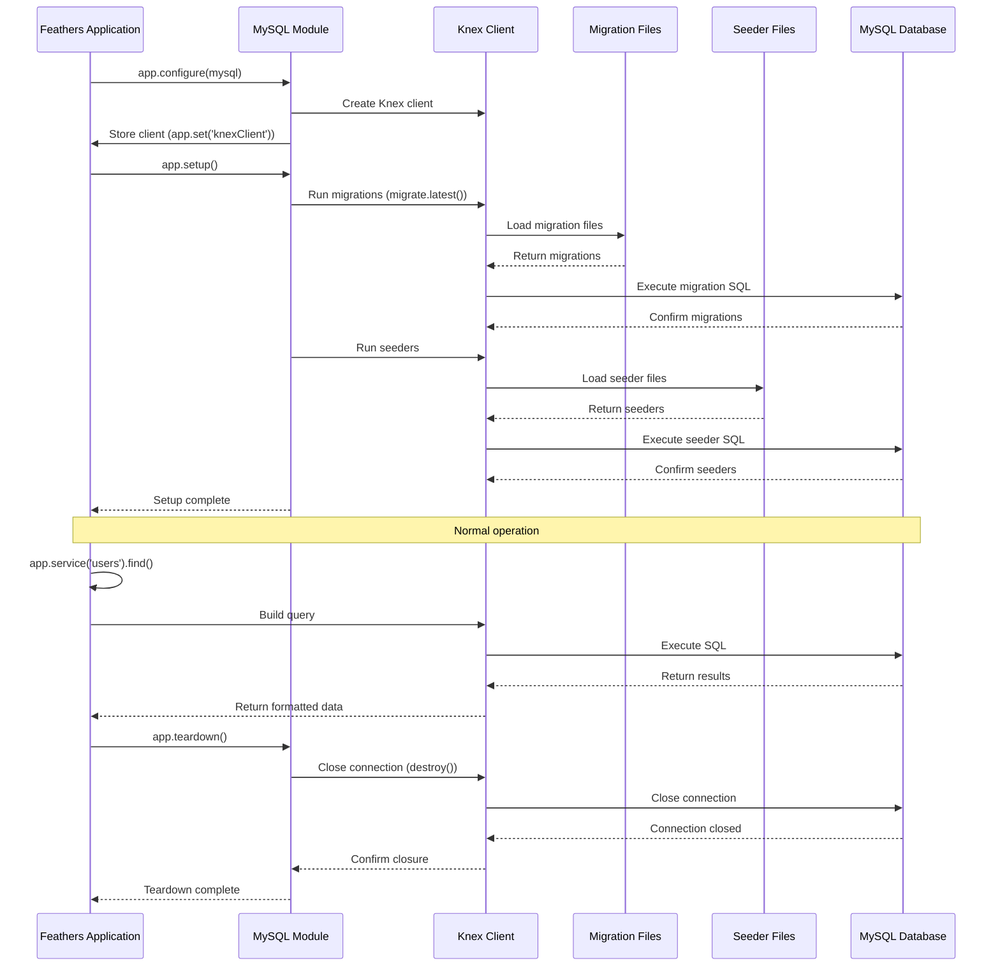

# Database management (Knex)

## Overview

The Database Management component is a critical element of the iR Engine's server core that handles persistent data storage and retrieval. It provides a structured approach to defining database schemas, managing data operations, and maintaining data integrity. 

By leveraging Knex.js, a flexible SQL query builder, this component creates an abstraction layer between the application and the underlying database system. This chapter explores the implementation, workflow, and tools used for database management within the iR Engine.

## Core concepts

### SQL database

The system uses a relational database for persistent storage:

- **Structured data**: Information organized into tables with defined relationships
- **ACID compliance**: Ensures data reliability through atomicity, consistency, isolation, and durability
- **Query language**: Uses SQL (Structured Query Language) for data operations
- **Schema definition**: Requires predefined structure for data storage
- **Indexing**: Optimizes data retrieval through strategic indexing

This approach provides a robust foundation for data management.

### Query builder

Knex.js serves as a query builder to simplify database interactions:

- **SQL abstraction**: Translates JavaScript method chains into SQL queries
- **Database agnostic**: Works with multiple database systems (MySQL, PostgreSQL, etc.)
- **Parameterized queries**: Prevents SQL injection by properly escaping values
- **Promise-based**: Uses JavaScript promises for asynchronous operations
- **Migration support**: Provides tools for evolving database schemas

This abstraction layer enhances developer productivity and code maintainability.

### Schema migrations

Migrations define and evolve the database structure:

- **Version control**: Tracks changes to database schema over time
- **Up/down functions**: Provides methods to apply and revert changes
- **Incremental changes**: Allows gradual evolution of the database structure
- **Reproducibility**: Ensures consistent database setup across environments
- **Coordination**: Manages dependencies between structural changes

This approach creates a reliable process for database schema management.

## Implementation

### Database connection

The database connection is established in a dedicated module:

```typescript
// Simplified from: src/mysql.ts
import knex from 'knex';
import appConfig from './appconfig';
import { Application } from './declarations';

/**
 * Configures the database connection for the application
 * @param app Feathers application
 */
export default function(app: Application): void {
  const logger = app.get('logger');
  logger.info('Configuring database connection');
  
  // Create Knex client
  const db = knex({
    client: 'mysql2',
    connection: {
      host: appConfig.db.host,
      port: appConfig.db.port,
      user: appConfig.db.username,
      password: appConfig.db.password,
      database: appConfig.db.database
    },
    pool: {
      min: 2,
      max: 10
    },
    debug: appConfig.server.nodeEnv === 'development'
  });
  
  // Store the database client in the app
  app.set('knexClient', db);
  
  // Set up application lifecycle hooks
  app.hooks({
    setup: async () => {
      logger.info('Running database migrations');
      
      // Run migrations to ensure schema is up-to-date
      await db.migrate.latest();
      
      // Run seeders if needed
      if (appConfig.db.runSeeders) {
        logger.info('Running database seeders');
        await runSeeders(app);
      }
      
      logger.info('Database setup complete');
    },
    
    teardown: async () => {
      logger.info('Closing database connection');
      await db.destroy();
    }
  });
  
  logger.info('Database connection configured');
}
```

This function:
1. Creates a Knex client configured to connect to the database
2. Stores the client in the application for use by services
3. Sets up hooks to run migrations during application setup
4. Ensures the database connection is properly closed during shutdown

### Migration definition

Migrations define the database schema structure:

```typescript
// Example migration file: src/user/user/migrations/20210501000000_create_user_table.ts
import type { Knex } from 'knex';

/**
 * Creates the user table
 * @param knex Knex client
 */
export async function up(knex: Knex): Promise<void> {
  // Check if the table already exists
  if (await knex.schema.hasTable('user')) {
    return;
  }
  
  // Create the user table
  await knex.schema.createTable('user', (table) => {
    // Primary key
    table.uuid('id').primary();
    
    // Authentication fields
    table.string('email').unique().notNullable();
    table.string('password').notNullable();
    
    // Profile fields
    table.string('name').notNullable();
    table.string('avatar_url').nullable();
    
    // Status fields
    table.boolean('is_active').defaultTo(true);
    table.boolean('is_verified').defaultTo(false);
    
    // Timestamps
    table.timestamp('created_at').defaultTo(knex.fn.now());
    table.timestamp('updated_at').defaultTo(knex.fn.now());
  });
}

/**
 * Drops the user table
 * @param knex Knex client
 */
export async function down(knex: Knex): Promise<void> {
  // Drop the table if it exists
  await knex.schema.dropTableIfExists('user');
}
```

This migration:
1. Defines an `up` function to create the table with specific columns
2. Specifies column types, constraints, and default values
3. Includes a `down` function to revert the changes if needed
4. Checks if the table exists before attempting to create it

### Seeder implementation

Seeders populate the database with initial data:

```typescript
// Example seeder file: src/user/role/role.seed.ts
import type { Knex } from 'knex';

/**
 * Seeds the role table with default roles
 * @param knex Knex client
 */
export const seed = async (knex: Knex): Promise<void> => {
  // Check if roles already exist
  const existingRoles = await knex('role').select('name');
  const existingRoleNames = existingRoles.map(role => role.name);
  
  // Default roles to create
  const defaultRoles = [
    { id: '1', name: 'admin', description: 'Administrator with full access' },
    { id: '2', name: 'user', description: 'Standard user with limited access' },
    { id: '3', name: 'guest', description: 'Guest user with minimal access' }
  ];
  
  // Filter out roles that already exist
  const rolesToCreate = defaultRoles.filter(
    role => !existingRoleNames.includes(role.name)
  );
  
  // Insert new roles if any
  if (rolesToCreate.length > 0) {
    await knex('role').insert(rolesToCreate);
    console.log(`Created ${rolesToCreate.length} default roles`);
  }
};
```

This seeder:
1. Checks if the default roles already exist in the database
2. Defines the default roles to be created
3. Filters out roles that already exist to avoid duplicates
4. Inserts only the missing roles into the database

### Seeder configuration

Seeders are aggregated and configured centrally:

```typescript
// Simplified from: src/seeder-config.ts
import { Application } from './declarations';
import { userRoleSeed } from './user/role/role.seed';
import { engineSettingSeed } from './setting/engine-setting/engine-setting.seed';
// ... other seeder imports

/**
 * Seeder configuration
 */
export default {
  // Core seeders that run in a specific order
  coreSeeds: [
    // User-related seeders
    userRoleSeed,
    
    // Settings seeders
    engineSettingSeed,
    
    // ... other core seeders
  ],
  
  // Feature seeders that can run in parallel
  featureSeeds: [
    // Project-related seeders
    projectTypeSeed,
    
    // ... other feature seeders
  ]
};
```

This configuration:
1. Imports seeder functions from various modules
2. Organizes seeders into core and feature categories
3. Defines the order for core seeders that have dependencies
4. Allows feature seeders to run in parallel for efficiency

### Knex configuration

The Knex configuration is defined in a dedicated file:

```typescript
// Simplified from: knexfile.ts
import type { Knex } from 'knex';
import appConfig from './src/appconfig';
import { CustomMigrationSource } from './src/migration-source';

/**
 * Knex configuration
 */
const config: Knex.Config = {
  // Database client
  client: 'mysql2',
  
  // Connection details from application configuration
  connection: {
    host: appConfig.db.host,
    port: appConfig.db.port,
    user: appConfig.db.username,
    password: appConfig.db.password,
    database: appConfig.db.database
  },
  
  // Connection pool settings
  pool: {
    min: 2,
    max: 10
  },
  
  // Migration configuration
  migrations: {
    // Custom migration source that finds migrations across the codebase
    migrationSource: new CustomMigrationSource(),
    
    // Table to track applied migrations
    tableName: 'knex_migrations'
  },
  
  // Debug mode in development
  debug: appConfig.server.nodeEnv === 'development'
};

export default config;
```

This configuration:
1. Specifies the database client (MySQL)
2. Uses connection details from the application configuration
3. Configures connection pooling for performance
4. Sets up a custom migration source to find migrations across the codebase
5. Enables debug mode in development environments

### Custom migration source

A custom migration source locates migrations across the codebase:

```typescript
// Simplified from: src/migration-source.ts
import { Knex } from 'knex';
import glob from 'glob';
import path from 'path';

/**
 * Custom migration source that finds migrations across the codebase
 */
export class CustomMigrationSource implements Knex.MigrationSource<string> {
  // Migration patterns to search for
  private patterns = [
    // Core migrations
    'src/**/migrations/*.ts',
    
    // Feature migrations
    'src/**/*/migrations/*.ts'
  ];
  
  // Cache of migration files
  private migrationCache: Record<string, string> | null = null;
  
  /**
   * Gets all migration names
   */
  async getMigrations(): Promise<string[]> {
    const migrations = await this.getMigrationMap();
    return Object.keys(migrations).sort();
  }
  
  /**
   * Gets the migration file for a specific name
   * @param name Migration name
   */
  async getMigration(name: string): Promise<Knex.Migration> {
    const migrations = await this.getMigrationMap();
    const migrationPath = migrations[name];
    
    if (!migrationPath) {
      throw new Error(`Migration ${name} not found`);
    }
    
    // Import the migration file
    const migration = require(migrationPath);
    
    return {
      up: migration.up,
      down: migration.down
    };
  }
  
  /**
   * Gets a map of migration names to file paths
   */
  private async getMigrationMap(): Promise<Record<string, string>> {
    // Return cached map if available
    if (this.migrationCache) {
      return this.migrationCache;
    }
    
    // Find all migration files
    const migrationFiles: string[] = [];
    
    for (const pattern of this.patterns) {
      const files = glob.sync(pattern);
      migrationFiles.push(...files);
    }
    
    // Create map of migration names to file paths
    const migrationMap: Record<string, string> = {};
    
    for (const file of migrationFiles) {
      const basename = path.basename(file, path.extname(file));
      migrationMap[basename] = path.resolve(file);
    }
    
    // Cache the map
    this.migrationCache = migrationMap;
    
    return migrationMap;
  }
}
```

This class:
1. Implements the Knex `MigrationSource` interface
2. Searches for migration files across the codebase using glob patterns
3. Creates a map of migration names to file paths
4. Imports migration files when needed
5. Caches the migration map for performance

## Database workflow

The complete database workflow follows this sequence:



This diagram illustrates:
1. The application configures the MySQL module
2. The MySQL module creates a Knex client and stores it in the application
3. During setup, migrations and seeders are run to prepare the database
4. During normal operation, services use the Knex client for data operations
5. During teardown, the database connection is properly closed

## Query building

Knex.js provides a fluent interface for building SQL queries:

### Select queries

Retrieving data from the database:

```typescript
// Example of select queries
import { Application } from './declarations';

/**
 * Finds users with optional filtering
 * @param app Feathers application
 * @param query Query parameters
 * @returns Promise resolving to users
 */
async function findUsers(app: Application, query: any): Promise<any[]> {
  const knex = app.get('knexClient');
  
  // Basic select
  const allUsers = await knex('user').select('*');
  
  // Select with specific columns
  const userProfiles = await knex('user').select('id', 'name', 'email');
  
  // Select with where clause
  const activeUsers = await knex('user').where({ is_active: true });
  
  // Select with complex conditions
  const recentUsers = await knex('user')
    .where('created_at', '>', knex.raw('DATE_SUB(NOW(), INTERVAL 7 DAY)'))
    .orderBy('created_at', 'desc');
  
  // Select with joins
  const usersWithRoles = await knex('user')
    .join('user_role', 'user.id', '=', 'user_role.user_id')
    .join('role', 'user_role.role_id', '=', 'role.id')
    .select('user.id', 'user.name', 'role.name as role_name');
  
  // Select with pagination
  const paginatedUsers = await knex('user')
    .select('*')
    .limit(10)
    .offset(0);
  
  // Return the appropriate result based on the query
  // This is a simplified example
  return allUsers;
}
```

These queries demonstrate:
- Basic selection of all columns
- Selection of specific columns
- Filtering with where clauses
- Complex conditions with date functions
- Joining related tables
- Pagination with limit and offset

### Insert queries

Creating new records in the database:

```typescript
// Example of insert queries
import { Application } from './declarations';
import { v4 as uuidv4 } from 'uuid';

/**
 * Creates a new user
 * @param app Feathers application
 * @param userData User data
 * @returns Promise resolving to the created user
 */
async function createUser(app: Application, userData: any): Promise<any> {
  const knex = app.get('knexClient');
  
  // Generate a UUID for the new user
  const userId = uuidv4();
  
  // Basic insert
  const [id] = await knex('user').insert({
    id: userId,
    email: userData.email,
    password: userData.password,
    name: userData.name,
    created_at: knex.fn.now(),
    updated_at: knex.fn.now()
  });
  
  // Insert with returning (if supported by the database)
  const [createdUser] = await knex('user')
    .insert({
      id: userId,
      email: userData.email,
      password: userData.password,
      name: userData.name
    })
    .returning('*');
  
  // Get the created user
  const user = await knex('user').where({ id: userId }).first();
  
  return user;
}
```

These queries demonstrate:
- Basic insertion of a record
- Using UUID for primary keys
- Using database functions for timestamps
- Retrieving the created record

### Update queries

Modifying existing records in the database:

```typescript
// Example of update queries
import { Application } from './declarations';

/**
 * Updates a user
 * @param app Feathers application
 * @param userId User ID
 * @param userData User data
 * @returns Promise resolving to the updated user
 */
async function updateUser(app: Application, userId: string, userData: any): Promise<any> {
  const knex = app.get('knexClient');
  
  // Basic update
  await knex('user')
    .where({ id: userId })
    .update({
      name: userData.name,
      updated_at: knex.fn.now()
    });
  
  // Update with returning (if supported by the database)
  const [updatedUser] = await knex('user')
    .where({ id: userId })
    .update({
      name: userData.name,
      updated_at: knex.fn.now()
    })
    .returning('*');
  
  // Get the updated user
  const user = await knex('user').where({ id: userId }).first();
  
  return user;
}
```

These queries demonstrate:
- Basic update of a record
- Using where clauses to target specific records
- Using database functions for timestamps
- Retrieving the updated record

### Delete queries

Removing records from the database:

```typescript
// Example of delete queries
import { Application } from './declarations';

/**
 * Removes a user
 * @param app Feathers application
 * @param userId User ID
 * @returns Promise resolving to the removed user
 */
async function removeUser(app: Application, userId: string): Promise<any> {
  const knex = app.get('knexClient');
  
  // Get the user before deletion
  const user = await knex('user').where({ id: userId }).first();
  
  // Basic delete
  await knex('user')
    .where({ id: userId })
    .delete();
  
  return user;
}
```

These queries demonstrate:
- Retrieving a record before deletion
- Basic deletion of a record
- Using where clauses to target specific records

## Integration with other components

The database management system integrates with several other components of the server core:

### Services

Services use the database client for data operations:

```typescript
// Example of service integration
import { KnexService } from '@feathersjs/knex';
import { Application } from '../../declarations';

// Service class
export class UserService extends KnexService {
  // KnexService uses the provided Model (Knex client)
  // to perform database operations
}

// Service registration
export default function(app: Application): void {
  const options = {
    Model: app.get('knexClient'), // Get the database client
    name: 'user' // Table name
  };
  
  app.use('/users', new UserService(options, app));
}
```

This integration:
- Uses the Knex client for database operations
- Maps service methods to SQL queries
- Handles database connections and transactions
- Provides a consistent data access layer
- Abstracts database details from service consumers

### Application configuration

The database connection uses configuration values:

```typescript
// Example of configuration integration
import appConfig from './appconfig';
import knex from 'knex';

// Create database connection
const db = knex({
  client: 'mysql2',
  connection: {
    host: appConfig.db.host,
    port: appConfig.db.port,
    user: appConfig.db.username,
    password: appConfig.db.password,
    database: appConfig.db.database
  }
});
```

This integration:
- Uses database configuration from the application configuration
- Applies connection settings to the Knex client
- Enables configuration changes without code modifications
- Supports different environments (development, production, etc.)
- Centralizes database configuration

## Benefits of database management

The Database Management component provides several key advantages:

1. **Persistence**: Ensures data survives application restarts
2. **Structure**: Provides a defined schema for data organization
3. **Relationships**: Enables connections between different data entities
4. **Query flexibility**: Supports complex data retrieval patterns
5. **Transaction support**: Ensures data integrity during operations
6. **Migration system**: Facilitates controlled schema evolution
7. **Seeding capability**: Enables consistent initial data setup

These benefits make database management an essential foundation for the iR Engine's server core.

## Next steps

With an understanding of how the application stores structured data in a database, the next chapter explores how it handles unstructured data like files.

Next: [Storage providers](05_storage_providers_.md)

---


