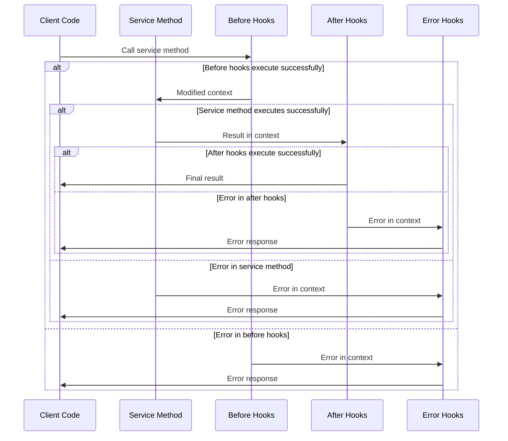

# Hooks (FeathersJS)

## Overview

The Hooks component is a powerful feature of the iR Engine's server core that enables the addition of processing logic before, after, or during error handling of service method executions. It provides a structured way to implement cross-cutting concerns such as authentication, validation, and data transformation without cluttering the core service logic. By leveraging the hook system of FeathersJS, this component creates a modular, reusable approach to handling common patterns across different services. This chapter explores the implementation, types, and usage of hooks within the iR Engine.

## Core concepts

### Hook functions

Hooks are specialized functions that process service method calls:

- **Function signature**: Hooks receive a context object and return it (possibly modified)
- **Execution points**: Hooks can run before, after, or during error handling of service methods
- **Context access**: Hooks have access to the service, method, parameters, and data
- **Modification capability**: Hooks can modify the incoming data or outgoing results
- **Chain of responsibility**: Multiple hooks can be executed in sequence

This functional approach creates a flexible system for extending service behavior.

### Hook types

The system defines three main types of hooks:

- **Before hooks**: Execute before the service method runs
  - Validate incoming data
  - Authorize the request
  - Transform or augment the data
  - Set up additional context for the service method

- **After hooks**: Execute after the service method completes successfully
  - Transform the result data
  - Remove sensitive information
  - Trigger side effects like notifications
  - Log successful operations

- **Error hooks**: Execute when an error occurs in before hooks, the service method, or after hooks
  - Format error responses
  - Log detailed error information
  - Attempt error recovery
  - Clean up resources

These types provide a comprehensive framework for controlling the service method lifecycle.

### Hook context

The hook context object contains all information about the service call:

- **Service information**: References to the service and application
- **Method details**: The method being called and its parameters
- **Data access**: The incoming data and outgoing results
- **User information**: The authenticated user (if available)
- **Error details**: Information about any errors that occurred

This context enables hooks to make informed decisions and modifications.

## Implementation

### Hook function structure

Hook functions follow a standard structure:

```typescript
// Example hook function
import { Hook, HookContext } from '@feathersjs/feathers';

/**
 * Example hook that adds a timestamp to incoming data
 * @param context Hook context
 * @returns Modified context
 */
export const addTimestamp: Hook = async (context: HookContext) => {
  // Only run on create, update, or patch methods
  if (['create', 'update', 'patch'].includes(context.method)) {
    // Add createdAt for new records
    if (context.method === 'create') {
      context.data.createdAt = new Date();
    }
    
    // Always add updatedAt
    context.data.updatedAt = new Date();
  }
  
  // Always return the context
  return context;
};
```

This function:
1. Receives the hook context as its parameter
2. Checks the method to determine if it should run
3. Modifies the data by adding timestamp fields
4. Returns the modified context

### Hook registration

Hooks are registered in dedicated hook configuration files:

```typescript
// Example hook configuration file: src/user/user.hooks.ts
import { authenticate } from '@feathersjs/authentication/hooks';
import { hooks as schemaHooks } from '@feathersjs/schema';
import { addTimestamp } from '../../hooks/add-timestamp';
import { validateUserData } from './validators';
import { logError } from '../../hooks/log-error';

/**
 * Hook configuration for the user service
 */
export default {
  before: {
    // Hooks that run before all methods
    all: [
      authenticate('jwt')
    ],
    
    // Method-specific hooks
    find: [
      schemaHooks.validateQuery(validateUserQuery)
    ],
    get: [],
    create: [
      schemaHooks.validateData(validateUserData),
      addTimestamp
    ],
    update: [
      schemaHooks.validateData(validateUserData),
      addTimestamp
    ],
    patch: [
      schemaHooks.validateData(validateUserPatchData),
      addTimestamp
    ],
    remove: []
  },
  
  after: {
    all: [
      // Remove password from all responses
      context => {
        if (context.result) {
          const removePassword = result => {
            if (result.password) {
              delete result.password;
            }
            return result;
          };
          
          // Handle both single results and arrays
          if (Array.isArray(context.result.data)) {
            context.result.data = context.result.data.map(removePassword);
          } else if (Array.isArray(context.result)) {
            context.result = context.result.map(removePassword);
          } else {
            context.result = removePassword(context.result);
          }
        }
        return context;
      }
    ],
    find: [],
    get: [],
    create: [],
    update: [],
    patch: [],
    remove: []
  },
  
  error: {
    all: [
      logError
    ],
    find: [],
    get: [],
    create: [],
    update: [],
    patch: [],
    remove: []
  }
};
```

This configuration:
1. Imports hook functions from various sources
2. Organizes hooks by type (before, after, error) and method
3. Specifies the execution order of hooks for each method
4. Includes both reusable hooks and inline hook functions

### Hook application

Hooks are applied to services during registration:

```typescript
// Example service registration: src/user/user.service.ts
import { Application } from '../../declarations';
import { UserService } from './user.class';
import hooks from './user.hooks';

/**
 * Configures the user service
 * @param app Feathers application
 */
export default function(app: Application): void {
  // Create the service
  app.use('/users', new UserService({
    Model: app.get('knexClient'),
    name: 'user',
    paginate: app.get('paginate')
  }));
  
  // Get the registered service
  const service = app.service('users');
  
  // Set up hooks
  service.hooks(hooks);
}
```

This function:
1. Creates and registers the service
2. Retrieves the registered service
3. Applies the hook configuration to the service

### Common hooks

The system includes several common hooks for reuse:

#### Authentication hook

```typescript
// Simplified from: src/hooks/authenticate.ts
import { authenticate as feathersAuthenticate } from '@feathersjs/authentication/hooks';
import { HookContext } from '@feathersjs/feathers';

/**
 * Authentication hook that supports multiple strategies
 * @param strategies Authentication strategies to use
 * @returns Hook function
 */
export const authenticate = (...strategies: string[]) => {
  return async (context: HookContext) => {
    // Use the Feathers authentication hook
    await feathersAuthenticate(...strategies)(context);
    
    // Additional custom logic if needed
    
    return context;
  };
};
```

This hook:
- Wraps the Feathers authentication hook
- Supports multiple authentication strategies
- Can add custom logic after authentication

#### Validation hook

```typescript
// Simplified from: src/hooks/validate-schema.ts
import Ajv from 'ajv';
import { HookContext } from '@feathersjs/feathers';

/**
 * Validates data against a JSON schema
 * @param schema JSON schema to validate against
 * @param dataPath Path to the data in the context (default: 'data')
 * @returns Hook function
 */
export const validateSchema = (schema: object, dataPath = 'data') => {
  const ajv = new Ajv({ allErrors: true });
  const validate = ajv.compile(schema);
  
  return async (context: HookContext) => {
    // Get the data to validate
    const data = dataPath === 'data' ? context.data : context.params.query;
    
    // Validate the data
    const valid = validate(data);
    
    // If validation fails, throw an error
    if (!valid) {
      const errors = validate.errors || [];
      throw new Error(`Validation failed: ${errors.map(e => e.message).join(', ')}`);
    }
    
    return context;
  };
};
```

This hook:
- Compiles a JSON schema for validation
- Validates data or query parameters
- Throws an error with detailed messages if validation fails

#### Error logging hook

```typescript
// Simplified from: src/hooks/log-error.ts
import { HookContext } from '@feathersjs/feathers';

/**
 * Logs errors that occur during service method execution
 * @param context Hook context
 * @returns Modified context
 */
export const logError = async (context: HookContext) => {
  // Get the logger from the app
  const logger = context.app.get('logger');
  
  // Log the error with context information
  logger.error(`Error in ${context.path}.${context.method}:`, {
    error: {
      message: context.error.message,
      stack: context.error.stack,
      code: context.error.code
    },
    params: context.params,
    data: context.data
  });
  
  // Continue with the error
  return context;
};
```

This hook:
- Retrieves the logger from the application
- Logs detailed error information
- Includes context data for debugging
- Allows the error to continue propagating

## Hook workflow

The complete hook workflow follows this sequence:



This diagram illustrates:
1. Before hooks execute first, potentially modifying the context
2. If before hooks succeed, the service method executes
3. If the service method succeeds, after hooks execute
4. If any step fails, error hooks execute
5. The final result or error is returned to the client

## Hook context properties

The hook context object contains several important properties:

### Core properties

```typescript
// Hook context structure
interface HookContext {
  // Application and service information
  app: Application;           // The Feathers application
  service: any;               // The service this hook is running on
  path: string;               // The service path (e.g., 'users')
  method: string;             // The service method (e.g., 'create')
  type: 'before' | 'after' | 'error'; // The hook type
  
  // Method parameters
  params: {
    query?: any;              // Query parameters for find
    provider?: string;        // How the service was called (e.g., 'rest')
    user?: any;               // The authenticated user
    [key: string]: any;       // Other parameters
  };
  
  // Method-specific properties
  id?: string | number;       // The ID for get, update, patch, remove
  data?: any;                 // The data for create, update, patch
  result?: any;               // The result (for after hooks)
  error?: Error;              // The error (for error hooks)
  
  // Hook utilities
  statusCode?: number;        // HTTP status code for the response
  dispatch?: boolean;         // Whether to dispatch events
}
```

These properties:
- Provide complete information about the service call
- Allow hooks to access and modify the request and response
- Enable hooks to make decisions based on the context
- Support different types of service methods

### Context modification

Hooks can modify various aspects of the context:

```typescript
// Example of context modification in hooks
const modifyContext = async (context: HookContext) => {
  // Modify data (for before hooks)
  if (context.data) {
    context.data.modifiedBy = context.params.user?.id;
  }
  
  // Modify query (for before hooks)
  if (context.params.query) {
    context.params.query.active = true;
  }
  
  // Modify result (for after hooks)
  if (context.result) {
    if (Array.isArray(context.result.data)) {
      context.result.data.forEach(item => {
        delete item.secretField;
      });
    } else {
      delete context.result.secretField;
    }
  }
  
  // Add custom parameters
  context.params.customValue = 'some value';
  
  return context;
};
```

This example shows:
- Modifying incoming data in before hooks
- Adjusting query parameters in before hooks
- Transforming results in after hooks
- Adding custom parameters for later hooks or the service method

## Integration with other components

The hooks system integrates with several other components of the server core:

### Services

Hooks extend service functionality:

```typescript
// Example of service integration
import { authenticate } from '../../hooks/authenticate';
import { validateSchema } from '../../hooks/validate-schema';
import { userSchema } from './user.schema';

// In user.hooks.ts
export default {
  before: {
    create: [
      authenticate('jwt'),
      validateSchema(userSchema)
    ]
  }
};

// In user.service.ts
export default function(app: Application): void {
  app.use('/users', new UserService(options));
  app.service('users').hooks(hooks);
}
```

This integration:
- Adds authentication to service methods
- Validates incoming data against schemas
- Keeps service implementation focused on core logic
- Separates cross-cutting concerns from business logic

### Authentication & authorization

Hooks implement security checks:

```typescript
// Example of authentication integration
import { authenticate } from '@feathersjs/authentication/hooks';
import { isProvider } from 'feathers-hooks-common';
import { verifyScope } from '../../hooks/verify-scope';

// In project.hooks.ts
export default {
  before: {
    all: [
      // Only authenticate external requests
      isProvider('external') ? authenticate('jwt') : null,
      // Verify the user has the required scope
      context => {
        if (context.params.provider && context.params.user) {
          return verifyScope('project', 'write')(context);
        }
        return context;
      }
    ]
  }
};
```

This integration:
- Authenticates users before allowing access
- Verifies authorization scopes for operations
- Applies security checks only when needed
- Creates a layered security approach

### Database management

Hooks enhance database operations:

```typescript
// Example of database integration
import { softDelete } from '../../hooks/soft-delete';
import { addTimestamp } from '../../hooks/add-timestamp';

// In document.hooks.ts
export default {
  before: {
    create: [
      addTimestamp
    ],
    update: [
      addTimestamp
    ],
    patch: [
      addTimestamp
    ],
    remove: [
      // Use soft delete instead of actual deletion
      softDelete
    ]
  }
};
```

This integration:
- Adds timestamps to database records
- Implements soft deletion instead of hard deletion
- Ensures consistent data handling
- Maintains data integrity

## Benefits of hooks

The Hooks component provides several key advantages:

1. **Separation of concerns**: Isolates cross-cutting concerns from core service logic
2. **Reusability**: Enables hook functions to be shared across multiple services
3. **Modularity**: Allows functionality to be added or removed without changing service code
4. **Composability**: Supports combining multiple hooks to create complex behaviors
5. **Testability**: Makes it easier to test hooks and services independently
6. **Consistency**: Ensures common patterns are applied uniformly across services
7. **Extensibility**: Provides a framework for adding new functionality to existing services

These benefits make hooks an essential component for creating maintainable and secure applications.

## Next steps

With an understanding of how hooks extend service functionality, the next chapter explores how they are used to implement authentication and authorization.

Next: [Authentication & authorization](07_authentication___authorization_.md)

---


