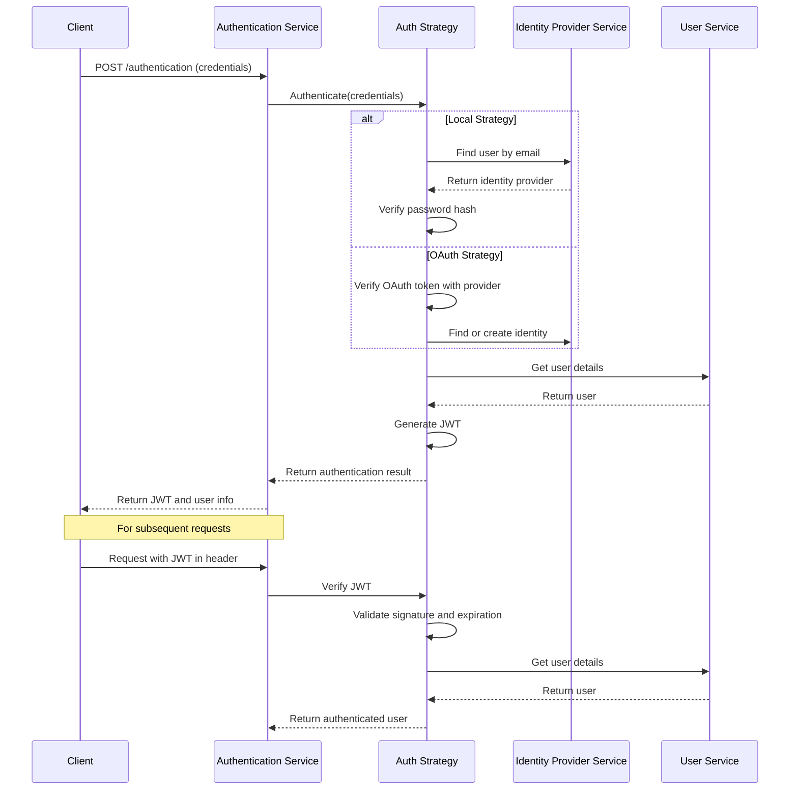
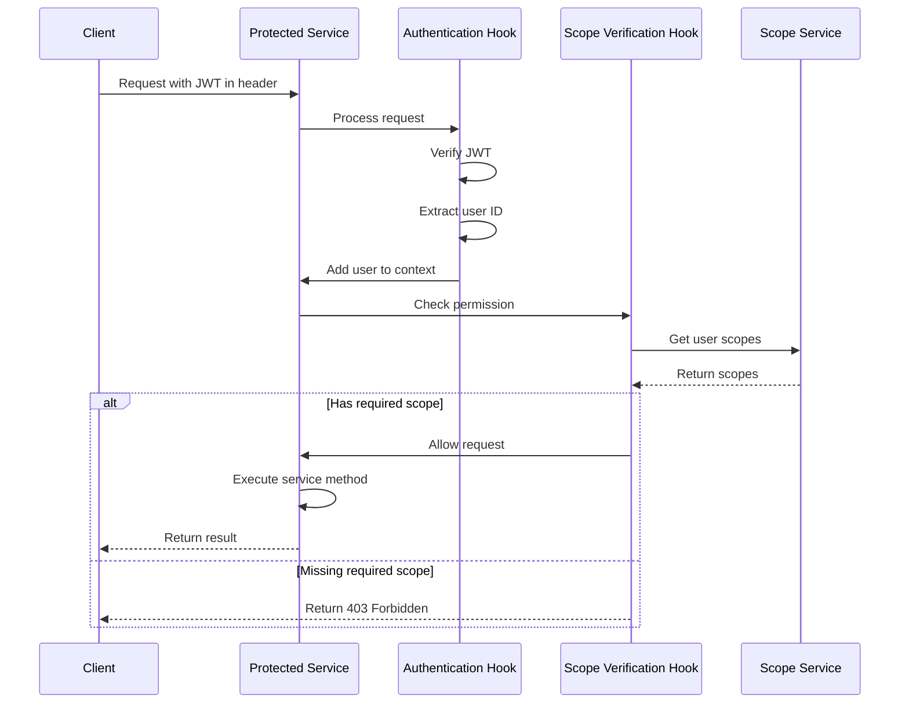

# Authentication & authorization

## Overview

The Authentication & Authorization component is a critical element of the iR Engine's server core that manages user identity verification and access control. It ensures that only legitimate users can access the system and that they can only perform actions they are permitted to do. By implementing a comprehensive security layer using JSON Web Tokens (JWT) and scope-based permissions, this component protects sensitive data and functionality from unauthorized access. This chapter explores the implementation, workflow, and security mechanisms of authentication and authorization within the iR Engine.

## Core concepts

### Authentication

Authentication verifies the identity of users:

- **Identity verification**: Confirms that users are who they claim to be
- **Credential validation**: Checks usernames, passwords, or third-party tokens
- **Session management**: Maintains user identity across multiple requests
- **Token issuance**: Provides secure tokens for subsequent requests
- **Multiple strategies**: Supports various authentication methods

This process ensures that only legitimate users can access the system.

### Authorization

Authorization controls what authenticated users can do:

- **Permission checking**: Determines if users can perform specific actions
- **Scope-based access**: Assigns granular permissions to users
- **Resource protection**: Restricts access to sensitive data
- **Role management**: Groups permissions into roles for easier assignment
- **Context-aware rules**: Applies permissions based on the current context

This process ensures that users can only access resources they are permitted to use.

### JSON Web Tokens

JWT serves as the primary authentication mechanism:

- **Stateless tokens**: Contains all necessary information without server storage
- **Digital signatures**: Ensures token integrity and authenticity
- **Expiration**: Limits token validity to enhance security
- **Payload customization**: Stores user-specific information
- **Cross-service compatibility**: Works across different parts of the system

This token-based approach provides secure and efficient authentication.

## Implementation

### Authentication configuration

Authentication settings are defined in the application configuration:

```typescript
// Simplified from: src/appconfig.ts
export const authentication = {
  // Secret key for signing JWTs
  secret: process.env.AUTH_SECRET || 'default-secret-change-me',
  
  // Entity and service for user identity
  entity: 'identity-provider',
  service: 'identity-provider',
  
  // Available authentication strategies
  authStrategies: ['jwt', 'local'],
  
  // JWT configuration
  jwtOptions: {
    header: { type: 'access' },
    audience: 'https://ir-engine.com',
    issuer: 'ir-engine',
    algorithm: 'HS256',
    expiresIn: '1d'
  },
  
  // Local authentication configuration
  local: {
    usernameField: 'email',
    passwordField: 'password'
  },
  
  // OAuth provider configuration
  oauth: {
    google: {
      key: process.env.GOOGLE_CLIENT_ID,
      secret: process.env.GOOGLE_CLIENT_SECRET,
      scope: ['email', 'profile'],
      nonce: true
    },
    github: {
      key: process.env.GITHUB_CLIENT_ID,
      secret: process.env.GITHUB_CLIENT_SECRET
    }
    // Other providers...
  },
  
  // Paths that don't require authentication
  whiteList: [
    '/authentication',
    '/users/create',
    '/health'
  ]
};
```

This configuration:
- Defines the secret key for signing JWTs
- Specifies available authentication strategies
- Configures JWT options like expiration and algorithm
- Sets up OAuth providers for social login
- Lists paths that don't require authentication

### Authentication service setup

The authentication service is configured in a dedicated module:

```typescript
// Simplified from: src/user/authentication.ts
import { AuthenticationService, JWTStrategy } from '@feathersjs/authentication';
import { LocalStrategy } from '@feathersjs/authentication-local';
import { oauth, OAuthStrategy } from '@feathersjs/authentication-oauth';
import { Application } from '../declarations';

/**
 * Configures authentication for the application
 * @param app Feathers application
 */
export default function(app: Application): void {
  const authentication = new AuthenticationService(app);
  
  // Register JWT strategy
  authentication.register('jwt', new JWTStrategy());
  
  // Register local strategy (username/password)
  authentication.register('local', new LocalStrategy());
  
  // Register OAuth strategies
  authentication.register('google', new OAuthStrategy());
  authentication.register('github', new OAuthStrategy());
  
  // Add authentication service
  app.use('/authentication', authentication);
  
  // Configure OAuth
  app.configure(oauth());
}
```

This function:
1. Creates an authentication service
2. Registers various authentication strategies
3. Adds the authentication service to the application
4. Configures OAuth for social login

### Authentication hook

The authentication hook verifies user identity:

```typescript
// Simplified from: src/hooks/authenticate.ts
import { authenticate as feathersAuthenticate } from '@feathersjs/authentication/hooks';
import { HookContext } from '@feathersjs/feathers';
import { NotAuthenticated } from '@feathersjs/errors';
import config from '../appconfig';

/**
 * Authentication hook
 * @param context Hook context
 * @returns Modified context
 */
export const authenticate = async (context: HookContext) => {
  // Skip for internal calls that already have a user
  if (!context.params.provider && context.params.user) {
    return context;
  }
  
  // Check if the path is whitelisted
  const path = context.path;
  if (config.authentication.whiteList.includes(path)) {
    return context;
  }
  
  try {
    // Authenticate using JWT strategy
    await feathersAuthenticate('jwt')(context);
    
    // Get the user ID from the JWT payload
    const userId = context.params.user?.id;
    
    if (!userId) {
      throw new NotAuthenticated('User ID not found in token');
    }
    
    // Get the full user object
    const user = await context.app.service('users').get(userId);
    
    // Update the user in the context
    context.params.user = user;
    
    return context;
  } catch (error) {
    // Try API key authentication if JWT fails
    const apiKey = context.params.headers?.['x-api-key'];
    
    if (apiKey) {
      const apiKeyRecord = await context.app.service('api-keys').find({
        query: { key: apiKey, active: true }
      });
      
      if (apiKeyRecord.total > 0) {
        const userId = apiKeyRecord.data[0].userId;
        const user = await context.app.service('users').get(userId);
        
        context.params.user = user;
        return context;
      }
    }
    
    // If all authentication methods fail
    throw new NotAuthenticated('Authentication failed');
  }
};
```

This hook:
1. Checks if the request is internal or the path is whitelisted
2. Attempts to authenticate using the JWT strategy
3. Retrieves the full user object if JWT authentication succeeds
4. Falls back to API key authentication if JWT fails
5. Throws an error if all authentication methods fail

### Scope verification hook

The scope verification hook checks user permissions:

```typescript
// Simplified from: src/hooks/verify-scope.ts
import { HookContext } from '@feathersjs/feathers';
import { Forbidden, NotAuthenticated } from '@feathersjs/errors';

/**
 * Verifies that the user has the required scope
 * @param resourceType Type of resource (e.g., 'project', 'user')
 * @param permission Required permission (e.g., 'read', 'write', 'admin')
 * @returns Hook function
 */
export const verifyScope = (resourceType: string, permission: string) => {
  return async (context: HookContext) => {
    // Check if the user is authenticated
    if (!context.params.user) {
      throw new NotAuthenticated('You must be authenticated');
    }
    
    const userId = context.params.user.id;
    
    // Skip for super admins
    if (context.params.user.isAdmin) {
      return context;
    }
    
    // Construct the required scope
    const requiredScope = `${resourceType}:${permission}`;
    
    // Get the user's scopes
    const userScopes = await context.app.service('scopes').find({
      query: {
        userId,
        active: true
      }
    });
    
    // Check if the user has the required scope
    const hasScope = userScopes.data.some(scope => 
      scope.type === requiredScope || scope.type === `${resourceType}:admin`
    );
    
    if (!hasScope) {
      throw new Forbidden(`Missing required scope: ${requiredScope}`);
    }
    
    return context;
  };
};
```

This hook:
1. Checks if the user is authenticated
2. Skips permission checking for super admins
3. Constructs the required scope from resource type and permission
4. Retrieves the user's scopes from the database
5. Checks if the user has the required scope or an admin scope
6. Throws an error if the user lacks the necessary permission

### Identity provider model

The identity provider model manages user authentication methods:

```typescript
// Simplified from: src/user/identity-provider/identity-provider.model.ts
import { Knex } from 'knex';

/**
 * Creates the identity provider table
 * @param knex Knex client
 */
export async function up(knex: Knex): Promise<void> {
  await knex.schema.createTable('identity-provider', table => {
    // Primary key
    table.uuid('id').primary();
    
    // User relationship
    table.uuid('userId').notNullable();
    table.foreign('userId').references('id').inTable('user');
    
    // Provider information
    table.string('type').notNullable(); // 'local', 'google', 'github', etc.
    table.string('providerId').nullable(); // ID from the provider
    
    // Authentication details
    table.string('email').nullable();
    table.string('password').nullable(); // Hashed password for local auth
    
    // OAuth tokens
    table.string('accessToken').nullable();
    table.string('refreshToken').nullable();
    
    // Status
    table.boolean('active').defaultTo(true);
    
    // Timestamps
    table.timestamp('createdAt').defaultTo(knex.fn.now());
    table.timestamp('updatedAt').defaultTo(knex.fn.now());
    
    // Indexes
    table.index(['userId', 'type']);
    table.index(['type', 'providerId']);
    table.index(['email']);
  });
}
```

This model:
- Stores authentication information for users
- Supports multiple authentication methods per user
- Manages OAuth tokens and local passwords
- Tracks the status and creation of authentication methods

### Scope model

The scope model manages user permissions:

```typescript
// Simplified from: src/user/scope/scope.model.ts
import { Knex } from 'knex';

/**
 * Creates the scope table
 * @param knex Knex client
 */
export async function up(knex: Knex): Promise<void> {
  await knex.schema.createTable('scope', table => {
    // Primary key
    table.uuid('id').primary();
    
    // User relationship
    table.uuid('userId').notNullable();
    table.foreign('userId').references('id').inTable('user');
    
    // Scope information
    table.string('type').notNullable(); // e.g., 'project:read', 'user:admin'
    
    // Status
    table.boolean('active').defaultTo(true);
    
    // Timestamps
    table.timestamp('createdAt').defaultTo(knex.fn.now());
    table.timestamp('updatedAt').defaultTo(knex.fn.now());
    
    // Indexes
    table.index(['userId', 'type']);
    table.index(['type']);
  });
}
```

This model:
- Stores permission scopes for users
- Uses a format of `resourceType:permission` for scope types
- Tracks the status and creation of scopes
- Enables efficient querying of user permissions

## Authentication workflow

The complete authentication workflow follows this sequence:



This diagram illustrates:
1. The client sends credentials to the authentication service
2. The appropriate strategy authenticates the credentials
3. The strategy retrieves or creates an identity provider record
4. The strategy generates a JWT for the authenticated user
5. The client uses the JWT for subsequent requests
6. The JWT is verified and the user is retrieved for each request

## Authorization workflow

The complete authorization workflow follows this sequence:



This diagram illustrates:
1. The client sends a request with a JWT to a protected service
2. The authentication hook verifies the JWT and adds the user to the context
3. The scope verification hook checks if the user has the required permission
4. If the user has the required scope, the service method executes
5. If the user lacks the required scope, a 403 Forbidden error is returned

## Integration with other components

The authentication and authorization system integrates with several other components of the server core:

### Hooks

Authentication and authorization are implemented as hooks:

```typescript
// Example of hook integration in a service
import { authenticate } from '../../hooks/authenticate';
import { verifyScope } from '../../hooks/verify-scope';

// In project.hooks.ts
export default {
  before: {
    all: [
      authenticate
    ],
    find: [
      verifyScope('project', 'read')
    ],
    get: [
      verifyScope('project', 'read')
    ],
    create: [
      verifyScope('project', 'write')
    ],
    update: [
      verifyScope('project', 'write')
    ],
    patch: [
      verifyScope('project', 'write')
    ],
    remove: [
      verifyScope('project', 'admin')
    ]
  }
};
```

This integration:
- Applies authentication to all service methods
- Specifies required permissions for each method
- Creates a clear security policy for the service
- Leverages the hook system for consistent security enforcement

### Application configuration

The authentication system uses configuration values:

```typescript
// Example of configuration integration
import config from '../../appconfig';

// In authentication.ts
const authService = new AuthenticationService(app);

// Configure JWT strategy
authService.register('jwt', new JWTStrategy({
  jwtOptions: config.authentication.jwtOptions,
  secret: config.authentication.secret
}));

// Configure local strategy
authService.register('local', new LocalStrategy({
  usernameField: config.authentication.local.usernameField,
  passwordField: config.authentication.local.passwordField
}));
```

This integration:
- Uses configuration values for authentication settings
- Applies JWT options from configuration
- Configures local authentication fields
- Enables environment-specific authentication settings

### Services

Authentication interacts with various services:

```typescript
// Example of service integration
import { NotAuthenticated } from '@feathersjs/errors';

// In authenticate.ts
// Get the user from the JWT payload
const userId = context.params.payload.userId;

// Retrieve the full user object
try {
  const user = await context.app.service('users').get(userId);
  context.params.user = user;
} catch (error) {
  throw new NotAuthenticated('User not found');
}
```

This integration:
- Uses the user service to retrieve user information
- Accesses the identity provider service for authentication
- Queries the scope service for permission checking
- Creates a cohesive security system across services

## Benefits of authentication & authorization

The Authentication & Authorization component provides several key advantages:

1. **Security**: Protects sensitive data and functionality from unauthorized access
2. **Flexibility**: Supports multiple authentication methods (local, OAuth, API keys)
3. **Granularity**: Enables fine-grained permission control through scopes
4. **Statelessness**: Uses JWTs to maintain sessions without server-side storage
5. **Consistency**: Applies uniform security policies across all services
6. **Auditability**: Tracks authentication and authorization activities
7. **Scalability**: Works efficiently in distributed and high-load environments

These benefits make authentication and authorization essential components for creating secure and reliable applications.

## Next steps

With an understanding of how the system secures access to resources, the next chapter explores how it enables real-time communication between the server and clients.

Next: [Real-time communication (Primus)](08_real_time_communication__primus__.md)

---


