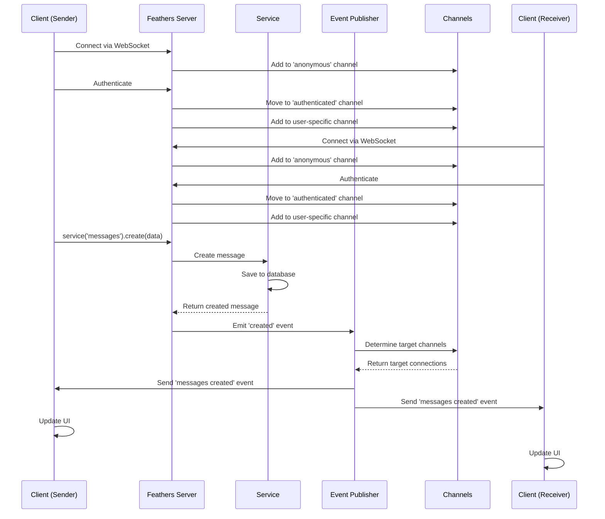

# Real-time communication (Primus)

## Overview

The Real-time Communication component is a critical element of the iR Engine's server core that enables instant, bidirectional data exchange between the server and connected clients. It provides a robust infrastructure for pushing updates to clients without requiring them to poll the server, creating a responsive and interactive user experience. 

By leveraging WebSockets through the Primus library, this component supports features like live updates, messaging, and collaborative interactions. This chapter explores the implementation, configuration, and event distribution system of real-time communication within the iR Engine.

## Core concepts

### WebSockets

WebSockets provide a persistent connection for bidirectional communication:

- **Persistent connections**: Maintains an open connection between client and server
- **Full-duplex communication**: Allows simultaneous data transmission in both directions
- **Low latency**: Minimizes delay in message delivery
- **Reduced overhead**: Eliminates the need for repeated HTTP headers
- **Event-based messaging**: Facilitates real-time event notifications

This protocol creates the foundation for efficient real-time communication.

### Primus

Primus serves as an abstraction layer for real-time communication:

- **Transport agnostic**: Works with various underlying technologies (WebSockets, Socket.IO, etc.)
- **Consistent API**: Provides a unified interface regardless of the transport
- **Automatic reconnection**: Handles connection interruptions gracefully
- **Plugin system**: Supports extensions for additional functionality
- **Cross-browser compatibility**: Works across different browsers and environments

This abstraction simplifies the implementation of real-time features.

### Channels

Channels organize and target real-time event distribution:

- **Selective broadcasting**: Directs events to specific groups of connections
- **Dynamic membership**: Allows connections to join and leave channels
- **Context-aware routing**: Routes events based on data and context
- **Scalable distribution**: Efficiently manages event delivery to many clients
- **Access control**: Limits event reception to authorized connections

This system ensures that events reach only the appropriate clients.

## Implementation

### Primus configuration

Primus is configured in a dedicated module:

```typescript
// Simplified from: src/util/primus.ts
import { socket } from '@feathersjs/transport-commons';
import http from 'http';
import Primus from 'primus';
import Emitter from 'primus-emitter';
import { Application } from '../declarations';

/**
 * Configures Primus for real-time communication
 * @param options Primus configuration options
 * @param configurer Optional function to further configure Primus
 * @returns Configuration function for Feathers
 */
export default function(options: any = {}, configurer?: Function) {
  return function(app: Application) {
    // Promise that resolves when Primus is fully set up
    const done = new Promise<Primus>((resolve) => {
      // Get the original setup method
      const { setup } = app;
      
      // Override the setup method to initialize Primus
      app.setup = function(this: Application, server: http.Server = http.createServer()) {
        // Only create Primus instance if it doesn't exist
        if (!this.primus) {
          // Create a new Primus instance
          const primus = new Primus(server, {
            transformer: 'websockets',
            ...options
          });
          
          // Add the emitter plugin for event-based communication
          primus.plugin('emitter', Emitter);
          
          // Handle new connections
          primus.on('connection', (spark) => {
            // A new client has connected
            console.log('New connection established');
            
            // Handle authentication events
            spark.on('authenticate', (data) => {
              // Process authentication data
              console.log('Client attempting to authenticate');
            });
          });
          
          // Handle disconnections
          primus.on('disconnection', (spark) => {
            console.log('Connection closed');
          });
          
          // Store the Primus instance on the app
          this.primus = primus;
        }
        
        // Call the custom configurer if provided
        if (typeof configurer === 'function') {
          configurer.call(this, this.primus);
        }
        
        // Resolve the promise with the Primus instance
        resolve(this.primus);
        
        // Call the original setup method
        return setup.call(this, server);
      };
    });
    
    // Configure Feathers to use socket transport with Primus
    app.configure(
      socket({
        done,
        socketKey: 'primus',
        getParams(spark) {
          // Extract parameters from the spark connection
          return spark.request.feathers;
        }
      })
    );
  };
}
```

This function:
1. Returns a configuration function for Feathers
2. Overrides the application's setup method to initialize Primus
3. Creates a Primus instance with WebSockets as the transformer
4. Adds the emitter plugin for event-based communication
5. Sets up handlers for connection and disconnection events
6. Configures Feathers to use socket transport with Primus

### Channel configuration

Channels are configured to manage event distribution:

```typescript
// Simplified from: src/channels.ts
import { HookContext } from '@feathersjs/feathers';
import { Application } from './declarations';

/**
 * Configures channels for event distribution
 * @param app Feathers application
 */
export default function(app: Application): void {
  if (typeof app.channel !== 'function') {
    // Channels are not available
    return;
  }
  
  /**
   * Event handler for new connections
   */
  app.on('connection', (connection: any) => {
    // Add the connection to the anonymous channel
    app.channel('anonymous').join(connection);
    
    // Handle authentication events
    connection.on('authenticate', (auth: any) => {
      // Remove the connection from the anonymous channel
      app.channel('anonymous').leave(connection);
      
      // Add the connection to the authenticated channel
      app.channel('authenticated').join(connection);
      
      // Add the connection to a user-specific channel
      app.channel(`user/${auth.user.id}`).join(connection);
      
      // Add the connection to role-specific channels
      if (auth.user.roles) {
        auth.user.roles.forEach((role: string) => {
          app.channel(`role/${role}`).join(connection);
        });
      }
    });
  });
  
  /**
   * Event publisher for service events
   */
  app.publish((data: any, context: HookContext) => {
    // Get the service and method that generated the event
    const { service, path, method } = context;
    
    // For user-specific events, publish to the user's channel
    if (data.userId) {
      return app.channel(`user/${data.userId}`);
    }
    
    // For project-specific events, publish to the project's channel
    if (data.projectId) {
      return app.channel(`project/${data.projectId}`);
    }
    
    // For chat messages, publish to the room's channel
    if (path === 'messages' && data.roomId) {
      return app.channel(`room/${data.roomId}`);
    }
    
    // Default: publish to the authenticated channel
    return app.channel('authenticated');
  });
}
```

This function:
1. Sets up an event handler for new connections
2. Organizes connections into channels based on authentication status
3. Creates user-specific and role-specific channels
4. Defines a publisher function that determines which channels receive events
5. Routes events based on the data and context of the service method

### Application integration

Real-time communication is integrated into the main application:

```typescript
// Simplified from: src/createApp.ts
import { feathers } from '@feathersjs/feathers';
import { koa } from '@feathersjs/koa';
import primus from './util/primus';
import channels from './channels';
import { Application } from './declarations';

/**
 * Creates a Feathers application with real-time capabilities
 * @returns Configured Feathers application
 */
export const createFeathersKoaApp = async (): Promise<Application> => {
  // Create the base Feathers application
  const app = koa(feathers());
  
  // ... other configurations ...
  
  // Configure Primus for real-time communication
  app.configure(
    primus({
      transformer: 'websockets',
      pingInterval: 10000,
      cors: {
        origin: '*'
      }
    })
  );
  
  // Configure channels for event distribution
  app.configure(channels);
  
  // ... more configurations ...
  
  return app;
};
```

This function:
1. Creates a Feathers application with Koa as the HTTP provider
2. Configures Primus with WebSockets as the transformer
3. Sets up channels for event distribution
4. Returns the configured application with real-time capabilities

### Service events

Services automatically emit events for real-time updates:

```typescript
// Example of service events
import { Application } from './declarations';

/**
 * Creates a new message
 * @param app Feathers application
 * @param data Message data
 * @returns Promise resolving to the created message
 */
async function createMessage(app: Application, data: any): Promise<any> {
  // Create the message using the messages service
  const message = await app.service('messages').create(data);
  
  // The service automatically emits a 'created' event
  // No additional code needed for real-time updates
  
  return message;
}

/**
 * Updates a message
 * @param app Feathers application
 * @param id Message ID
 * @param data Message data
 * @returns Promise resolving to the updated message
 */
async function updateMessage(app: Application, id: string, data: any): Promise<any> {
  // Update the message using the messages service
  const message = await app.service('messages').patch(id, data);
  
  // The service automatically emits a 'patched' event
  // No additional code needed for real-time updates
  
  return message;
}
```

These functions:
1. Use standard service methods to create or update data
2. Rely on the automatic event emission by Feathers services
3. Don't require additional code for real-time updates

### Custom events

Custom events can be sent directly through Primus:

```typescript
// Example of custom events
import { Application } from './declarations';

/**
 * Sends a custom event to all connected clients
 * @param app Feathers application
 * @param eventName Event name
 * @param data Event data
 */
function broadcastEvent(app: Application, eventName: string, data: any): void {
  // Check if Primus is available
  if (!app.primus) {
    console.error('Primus not initialized');
    return;
  }
  
  // Send the event to all connected clients
  app.primus.forEach((spark: any) => {
    spark.send(eventName, data);
  });
}

/**
 * Sends a custom event to a specific client
 * @param app Feathers application
 * @param sparkId Client connection ID
 * @param eventName Event name
 * @param data Event data
 */
function sendEventToClient(app: Application, sparkId: string, eventName: string, data: any): void {
  // Check if Primus is available
  if (!app.primus) {
    console.error('Primus not initialized');
    return;
  }
  
  // Find the client connection
  const spark = app.primus.spark(sparkId);
  
  if (spark) {
    // Send the event to the client
    spark.send(eventName, data);
  } else {
    console.error(`Client ${sparkId} not found`);
  }
}
```

These functions:
1. Access the Primus instance directly
2. Send custom events to clients
3. Provide more control over event distribution than service events

## Real-time workflow

The complete real-time workflow follows this sequence:



This diagram illustrates:
1. Clients connect to the server via WebSockets
2. Clients authenticate and join appropriate channels
3. A client creates a new message through a service
4. The service emits a 'created' event
5. The publisher determines which channels should receive the event
6. The event is sent to all clients in the target channels
7. Clients update their UI based on the event

## Client-side integration

Clients connect to the server and listen for events:

```javascript
// Example of client-side integration
import io from 'socket.io-client';
import feathers from '@feathersjs/feathers';
import socketio from '@feathersjs/socketio-client';

// Create a Feathers client
const client = feathers();

// Connect to the server using Socket.IO
const socket = io('http://localhost:3030');
client.configure(socketio(socket));

// Get the messages service
const messagesService = client.service('messages');

// Listen for real-time events
messagesService.on('created', (message) => {
  console.log('New message created:', message);
  // Update UI with the new message
});

messagesService.on('updated', (message) => {
  console.log('Message updated:', message);
  // Update UI with the updated message
});

messagesService.on('patched', (message) => {
  console.log('Message patched:', message);
  // Update UI with the patched message
});

messagesService.on('removed', (message) => {
  console.log('Message removed:', message);
  // Remove the message from UI
});

// Create a new message
async function createMessage(text) {
  try {
    const message = await messagesService.create({ text });
    console.log('Message created:', message);
  } catch (error) {
    console.error('Error creating message:', error);
  }
}

// Authenticate with the server
async function login(email, password) {
  try {
    const response = await client.authenticate({
      strategy: 'local',
      email,
      password
    });
    
    console.log('Authenticated:', response);
    return response.user;
  } catch (error) {
    console.error('Authentication error:', error);
  }
}
```

This code:
1. Creates a Feathers client
2. Connects to the server using Socket.IO
3. Gets a reference to the messages service
4. Sets up event listeners for real-time updates
5. Provides functions for creating messages and authenticating

## Integration with other components

The real-time communication system integrates with several other components of the server core:

### Services

Services emit events for real-time updates:

```typescript
// Example of service integration
import { ServiceMethods } from '@feathersjs/feathers';
import { Application } from '../../declarations';

/**
 * Chat message service
 */
export class MessageService implements ServiceMethods<any> {
  app: Application;
  
  constructor(app: Application) {
    this.app = app;
  }
  
  /**
   * Creates a new message
   * @param data Message data
   * @param params Request parameters
   * @returns Promise resolving to the created message
   */
  async create(data: any, params?: any): Promise<any> {
    // Create the message in the database
    const message = {
      id: Date.now().toString(),
      text: data.text,
      userId: params.user.id,
      roomId: data.roomId,
      createdAt: new Date()
    };
    
    // Store the message
    const db = this.app.get('knexClient');
    await db('messages').insert(message);
    
    // The service automatically emits a 'created' event
    // which will be distributed to the appropriate channels
    
    return message;
  }
  
  // Other service methods...
}
```

This integration:
- Leverages the automatic event emission by Feathers services
- Relies on the channel system to distribute events
- Enables real-time updates without additional code

### Authentication & authorization

Authentication affects channel membership:

```typescript
// Example of authentication integration
app.on('connection', (connection) => {
  // Add to anonymous channel initially
  app.channel('anonymous').join(connection);
  
  connection.on('authenticate', (auth) => {
    // Remove from anonymous channel
    app.channel('anonymous').leave(connection);
    
    // Add to authenticated channel
    app.channel('authenticated').join(connection);
    
    // Add to user-specific channel
    app.channel(`user/${auth.user.id}`).join(connection);
    
    // Add to channels based on user permissions
    auth.user.permissions.forEach(permission => {
      app.channel(`permission/${permission}`).join(connection);
    });
  });
});
```

This integration:
- Updates channel membership based on authentication status
- Creates user-specific channels for targeted updates
- Uses permission-based channels for authorization
- Ensures events are only sent to authorized clients

### Hooks

Hooks can modify event distribution:

```typescript
// Example of hook integration
import { HookContext } from '@feathersjs/feathers';

/**
 * Hook to customize event distribution
 * @param context Hook context
 * @returns Modified context
 */
export const customizeEventDistribution = (context: HookContext) => {
  // Only run after successful service method execution
  if (context.type !== 'after') {
    return context;
  }
  
  // Add custom dispatch information
  context.dispatch = context.dispatch || {};
  context.dispatch.customData = 'This will be included in the event';
  
  // Specify which channels should receive this event
  context.result.channels = [`room/${context.data.roomId}`];
  
  return context;
};
```

This integration:
- Modifies the event data before distribution
- Specifies custom channels for event distribution
- Enhances events with additional information
- Provides fine-grained control over real-time updates

## Benefits of real-time communication

The Real-time Communication component provides several key advantages:

1. **Responsiveness**: Delivers updates to clients instantly without polling
2. **Efficiency**: Reduces server load by eliminating unnecessary requests
3. **Interactivity**: Enables collaborative features and live interactions
4. **Flexibility**: Supports various communication patterns (broadcasts, direct messages, etc.)
5. **Scalability**: Efficiently manages connections and event distribution
6. **Integration**: Works seamlessly with the service-oriented architecture
7. **Consistency**: Ensures all clients have the latest data

These benefits make real-time communication an essential component for creating dynamic and interactive applications.

## Conclusion

The Real-time Communication component provides a robust foundation for instant, bidirectional data exchange between the server and clients. By leveraging WebSockets through Primus and integrating with the service-oriented architecture of FeathersJS, it enables a wide range of interactive features while maintaining efficiency and scalability.

This concludes our exploration of the iR Engine's server core. We've covered the key components that make up this powerful backend system, from application configuration to real-time communication. Each component plays a vital role in creating a flexible, secure, and responsive server that can support complex applications.

---


