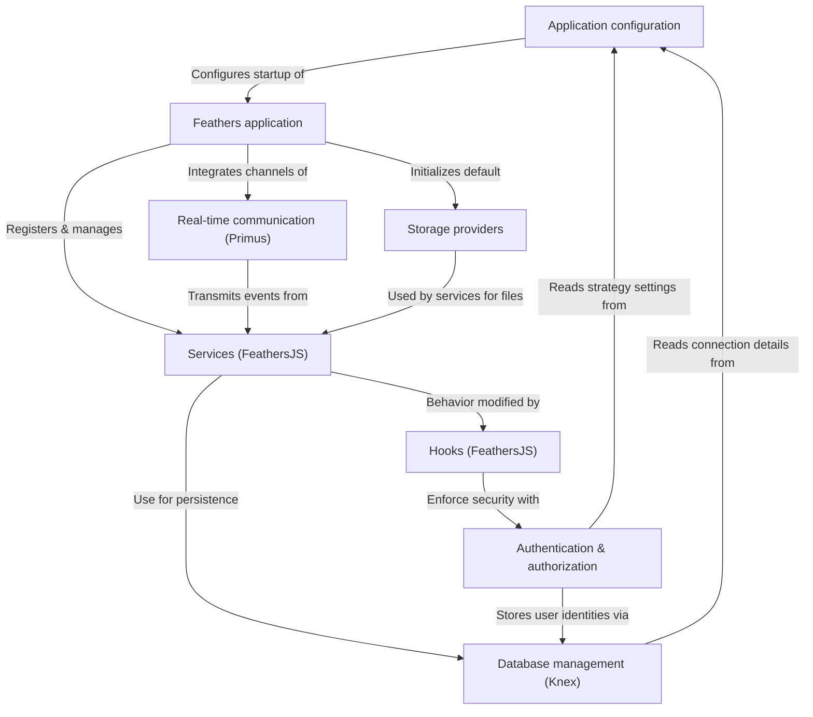

# Server core

The iR Engine Server Core is the backend system for a real-time 3D application. It uses the FeathersJS framework to manage data through various services (users, projects, media files), handles user authentication and authorization, and enables live, two-way communication with clients using WebSockets. The system supports different file storage solutions (local, S3, GCS) and relies on a SQL database, managed by Knex, for persistent data. All operations are guided by a central application configuration system.

## Architecture overview

The server core consists of several interconnected components that work together to provide a robust backend infrastructure:

## Documentation chapters

1. [Application configuration](01_application_configuration_.md)
2. [Feathers application](02_feathers_application_.md)
3. [Services (FeathersJS)](03_services__feathersjs__.md)
4. [Database management (Knex)](04_database_management__knex__.md)
5. [Storage providers](05_storage_providers_.md)
6. [Hooks (FeathersJS)](06_hooks__feathersjs__.md)
7. [Authentication & authorization](07_authentication___authorization_.md)
8. [Real-time communication (Primus)](08_real_time_communication__primus__.md)

---

