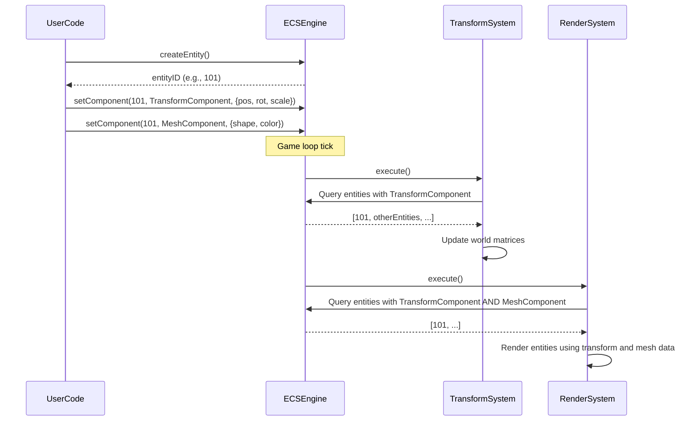

# Entity component system (ECS) core

## Overview

The Entity Component System (ECS) is the foundational architecture of the iR Engine. This design pattern provides a flexible, modular approach to building complex virtual environments by separating identity, data, and logic into three distinct concepts: entities, components, and systems.

## Core concepts

### Entities

Entities represent individual objects in the virtual world. In the iR Engine, an entity is essentially a unique identifier that serves as a container for components. Entities themselves do not contain data or behavior; they simply provide an identity to which components can be attached.

```typescript
// From: src/initializeEngine.ts (simplified)
import { createEntity } from '@ir-engine/ecs';

const myEntity = createEntity();
```

This code creates a new entity with a unique ID. At this stage, the entity is just an empty container with no properties or behaviors.

### Components

Components are data containers that define specific attributes or properties of an entity. Each component type represents a single aspect of an entity, such as its position, appearance, or behavior. Components store only data, not logic.

```typescript
// From: src/initializeEngine.ts (simplified)
import { createEntity, setComponent } from '@ir-engine/ecs';
import { NameComponent } from './common/NameComponent';
import { TransformComponent } from './transform/components/TransformComponent';

const cubeEntity = createEntity();

// Add a name component
setComponent(cubeEntity, NameComponent, 'Cube Entity');

// Add a transform component with default values
setComponent(cubeEntity, TransformComponent);
```

In this example, the entity is given two components:
- A `NameComponent` that provides a human-readable identifier
- A `TransformComponent` that defines its position, rotation, and scale in 3D space

Components are defined using a schema that specifies their data structure:

```typescript
// From: src/camera/components/CameraComponent.ts (simplified)
import { defineComponent } from '@ir-engine/ecs/src/ComponentFunctions';
import { S } from '@ir-engine/ecs/src/schemas/JSONSchemas';
import { PerspectiveCamera, ArrayCamera } from 'three';

export const CameraComponent = defineComponent({
  name: 'CameraComponent',
  schema: S.Object({
    fov: S.Number({ default: 60 }),
    aspect: S.Number({ default: 1 }),
    // Additional camera properties
  }),
  onInit: (initial) => new ArrayCamera([/* Camera initialization */]),
  // Additional component configuration
});
```

### Systems

Systems contain the logic that operates on entities with specific component combinations. Each system performs a specialized function, such as rendering, physics simulation, or input processing. Systems query the ECS database for entities that match their required component signature and then process those entities accordingly.

```typescript
// From: src/camera/systems/CameraSystem.tsx (simplified)
import { defineSystem, QueryReactor } from '@ir-engine/ecs';
import { CameraComponent } from '../components/CameraComponent';

export const CameraSystem = defineSystem({
  uuid: 'ee.engine.CameraSystem',
  
  reactor: () => {
    // Query for entities with CameraComponent
    return <QueryReactor 
      Components={[CameraComponent]} 
      ChildEntityReactor={CameraEntityReactor} 
    />;
  }
});

const CameraEntityReactor = () => {
  // Process each camera entity
  // Update camera properties, handle view changes, etc.
  return null;
};
```

The system execution occurs within the engine's main loop:

```typescript
// From: src/startTimer.ts (simplified)
import { Timer, executeSystems } from '@ir-engine/ecs';

export const startTimer = () => {
  const timer = Timer((time, xrFrame) => {
    // Pre-system operations
    executeSystems(time); // Execute all registered systems
    // Post-system operations
  });
  
  timer.start();
};
```

## Implementation details

### Entity implementation

Entities are typically implemented as simple numeric identifiers. This approach allows for efficient storage and retrieval of entities and their associated components.

### Component storage

Components of the same type are often stored together in contiguous memory blocks (arrays or similar data structures). This organization enables efficient iteration when systems process entities with specific component types.

### System queries

Systems use queries to efficiently find entities that match their required component signature. These queries are optimized to quickly filter the entity database and return only relevant entities.

## Practical example

The following example demonstrates how the ECS architecture works together to create a red cube in a 3D scene:

1. **Create the entity**:
   ```typescript
   const cube = createEntity();
   ```

2. **Add components**:
   ```typescript
   // Position the cube at (5, 0, 0)
   setComponent(cube, TransformComponent, { 
     position: {x: 5, y: 0, z: 0} 
   });
   
   // Define the cube's appearance
   setComponent(cube, MeshComponent, { 
     mesh: redCubeMeshData 
   });
   
   // Give the cube a name
   setComponent(cube, NameComponent, "Red Cube");
   ```

3. **Systems process the entity**:
   - The transform system calculates the cube's final position, rotation, and scale
   - The rendering system uses the transform and mesh data to draw the cube on screen

4. **Adding behavior**:
   ```typescript
   // Make the cube move along the X axis
   setComponent(cube, VelocityComponent, { x: 1, y: 0, z: 0 });
   ```
   - The movement system finds entities with both transform and velocity components
   - It updates their positions each frame based on their velocity

## System execution flow

The following sequence diagram illustrates the typical flow of execution in the ECS architecture:



## Benefits of ECS architecture

The ECS architecture provides several advantages for game and simulation development:

1. **Composition over inheritance**: Entities can be constructed by combining different components, avoiding deep inheritance hierarchies
2. **Data-oriented design**: Separating data (components) from logic (systems) enables more efficient memory access patterns
3. **Modularity**: Systems can be added, removed, or modified without affecting other parts of the codebase
4. **Flexibility**: New entity types can be created by combining existing components in different ways
5. **Performance**: Systems can process large batches of similar components efficiently, often leading to better cache utilization

## Next steps

With an understanding of the Entity Component System architecture, the next chapter explores the transform system, which manages the spatial properties of entities in the 3D environment.

Next: [Transform system](02_transform_system_.md)

---


