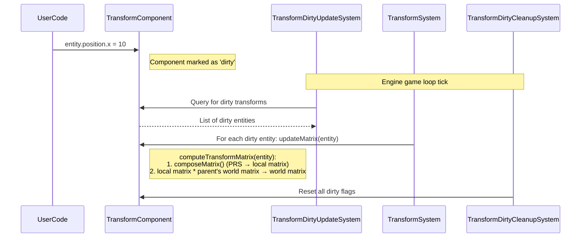

# Transform system

## Overview

The transform system is a fundamental component of the iR Engine that manages the spatial properties of entities in the 3D environment. It handles the position, rotation, and scale of objects, as well as their hierarchical relationships. This system is essential for determining where objects appear in the virtual world and how they relate spatially to one another.

## TransformComponent

The core data structure of the transform system is the `TransformComponent`. This component stores the spatial information for an entity and is defined with the following key properties:

| Property | Type | Description |
|----------|------|-------------|
| `position` | Vector3 | The (x, y, z) coordinates of the entity in 3D space |
| `rotation` | Quaternion | The orientation of the entity, stored as a quaternion |
| `scale` | Vector3 | The size of the entity along each axis |
| `matrix` | Matrix4 | The local transformation matrix derived from position, rotation, and scale |
| `matrixWorld` | Matrix4 | The final world transformation matrix, accounting for parent transformations |

```typescript
// Simplified from: src/transform/components/TransformComponent.ts
import { S } from '@ir-engine/ecs/src/schemas/JSONSchemas';
import { T } from '../../schema/schemaFunctions';

export const TransformComponent = defineComponent({
  name: 'TransformComponent',
  schema: S.Object({
    position: T.Vec3(),
    rotation: T.Quaternion(),
    scale: T.Vec3(),
    matrix: T.Mat4(),
    matrixWorld: T.Mat4()
  }),
  // Additional component configuration
});
```

## Using the transform component

### Adding a transform to an entity

To position an entity in 3D space, a `TransformComponent` is added to it:

```typescript
import { createEntity, setComponent } from '@ir-engine/ecs';
import { TransformComponent } from './transform/components/TransformComponent';

const entity = createEntity();

// Add a TransformComponent with specific position values
setComponent(entity, TransformComponent, {
  position: { x: 5, y: 2, z: -3 }
  // Rotation and scale will use default values
});
```

### Modifying transform properties

Transform properties can be modified directly through the component:

```typescript
import { getComponent } from '@ir-engine/ecs';

// Get the transform component of an entity
const transform = getComponent(entity, TransformComponent);

// Update position
transform.position.x = 10;
transform.position.y += 2;

// Update rotation (quaternion)
transform.rotation.setFromAxisAngle(new Vector3(0, 1, 0), Math.PI/2);

// Update scale
transform.scale.set(2, 1, 1); // Twice as wide on the x-axis
```

When these properties are modified, the transform system automatically marks the component as "dirty," indicating that its matrices need to be recalculated.

## Transform system operation

The transform system performs several key operations during each frame of execution:

### 1. Dirty state management

The system first identifies which transform components need to be updated:

- Components whose position, rotation, or scale have changed
- Components whose parent's transform has changed
- Components that have been newly added to entities

```typescript
// Conceptual from: src/transform/systems/TransformSystem.ts
function identifyDirtyTransforms() {
  for (const entity of entitiesWithTransform) {
    const isDirty = checkSelfDirty(entity) || 
                   checkParentDirty(entity) || 
                   checkComputedTransformDirty(entity);
    
    if (isDirty) {
      dirtyEntities.add(entity);
    }
  }
}
```

### 2. Local matrix calculation

For each dirty transform, the system calculates the local transformation matrix from the position, rotation, and scale values:

```typescript
// Simplified from: src/transform/components/TransformComponent.ts
function composeMatrix(entity) {
  const transform = getComponent(entity, TransformComponent);
  
  // Create a 4x4 matrix from position, rotation, and scale
  transform.matrix.compose(
    transform.position,
    transform.rotation,
    transform.scale
  );
}
```

### 3. World matrix calculation

The system then calculates the world matrix, which accounts for parent-child relationships:

```typescript
// Simplified from: src/transform/components/TransformComponent.ts
export const TransformComponent = defineComponent({
  // ...
  computeTransformMatrix: (entity: Entity) => {
    const transform = getComponent(entity, TransformComponent);
    
    // Update local matrix
    composeMatrix(entity);

    // Update world matrix based on parent (if any)
    const parentEntity = getOptionalComponent(entity, EntityTreeComponent)?.parentEntity;
    
    if (parentEntity) {
      const parentTransform = getOptionalComponent(parentEntity, TransformComponent);
      if (parentTransform) {
        // worldMatrix = parent.worldMatrix * localMatrix
        transform.matrixWorld.multiplyMatrices(
          parentTransform.matrixWorld, 
          transform.matrix
        );
      } else {
        transform.matrixWorld.copy(transform.matrix);
      }
    } else {
      transform.matrixWorld.copy(transform.matrix);
    }
  }
  // ...
});
```

### 4. Dirty state cleanup

After all transforms have been updated, the system resets the dirty flags for the next frame:

```typescript
// Conceptual from: src/transform/systems/TransformSystem.ts
function cleanupDirtyFlags() {
  TransformComponent.dirty.fill(0); // Reset all dirty flags
}
```

## Transform hierarchy

The transform system supports hierarchical relationships between entities, allowing child objects to inherit transformations from their parents:

### Parent-child relationships

When an entity is a child of another entity, its final world position, rotation, and scale are influenced by its parent's transform:

```typescript
// Create parent and child entities
const parentEntity = createEntity();
const childEntity = createEntity();

// Set up parent-child relationship
setComponent(childEntity, EntityTreeComponent, {
  parentEntity: parentEntity
});

// Position parent at (10, 0, 0)
setComponent(parentEntity, TransformComponent, {
  position: { x: 10, y: 0, z: 0 }
});

// Position child at (0, 5, 0) relative to parent
setComponent(childEntity, TransformComponent, {
  position: { x: 0, y: 5, z: 0 }
});

// Child's world position will be (10, 5, 0)
```

### Matrix propagation

The transform system automatically propagates changes through the hierarchy:

1. When a parent's transform changes, all its children are marked as dirty
2. The system processes entities in hierarchical order, ensuring parents are updated before their children
3. Each child's world matrix is calculated by multiplying its local matrix by its parent's world matrix

## Execution flow

The following sequence diagram illustrates the transform system's execution flow when an entity's position is changed:



## Integration with other systems

The transform system provides essential spatial information to several other engine systems:

- **Rendering system**: Uses world matrices to position and orient visual elements
- **Physics system**: Uses and updates transforms based on physical simulation
- **Input system**: May modify transforms in response to user input
- **Animation system**: Updates transforms over time to create movement

## Performance considerations

The transform system is optimized for performance in several ways:

1. **Dirty flagging**: Only recalculates matrices when necessary
2. **Hierarchical processing**: Updates entities in the correct order to minimize redundant calculations
3. **Batch processing**: Processes transforms in batches for better cache utilization
4. **Matrix reuse**: Avoids creating new matrix objects during calculations

## Next steps

With an understanding of how entities are positioned and oriented in 3D space, the next chapter explores the rendering system, which uses this spatial information to visualize objects on screen.

Next: [Rendering system](03_rendering_system_.md)

---


