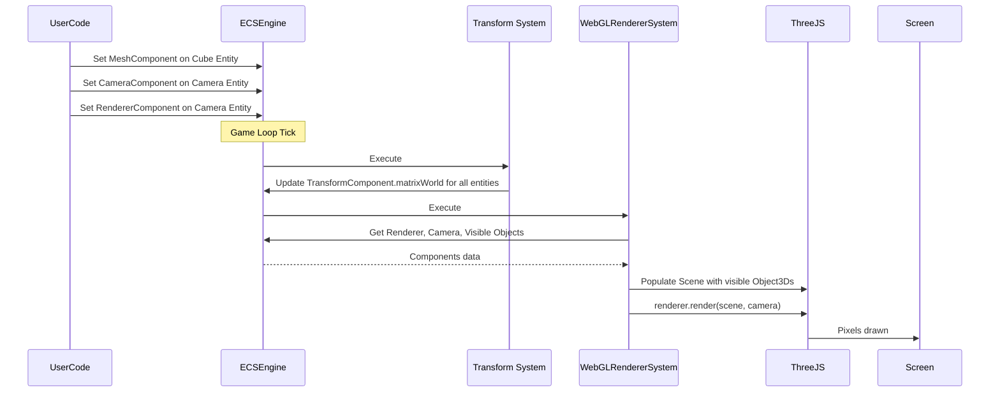

# Rendering system

## Overview

The rendering system is responsible for visualizing 3D objects on screen. It bridges the gap between the abstract entity-component representation of objects and their visual appearance. This system leverages Three.js, a powerful WebGL-based 3D graphics library, to handle the complex process of transforming 3D data into 2D images on the user's display.

## Core components

The rendering system consists of several specialized components that work together to create the visual output:

### RendererComponent

The `RendererComponent` serves as the central hub for rendering operations. It manages:

- The WebGL rendering context via Three.js `WebGLRenderer`
- The HTML canvas element where the scene is drawn
- The main Three.js `Scene` object that contains all visible elements
- The `EffectComposer` for post-processing effects

```typescript
// Simplified from: src/renderer/components/RendererComponent.ts
export const RendererComponent = defineComponent({
  name: 'RendererComponent',
  schema: S.Object({
    canvas: S.Type<HTMLCanvasElement | null>(),
    renderer: S.Type<WebGLRenderer | null>(),
    effectComposer: S.Type<EffectComposer | null>(),
    scene: S.Class(() => new Scene()),
    // Additional properties
  }),
  // Implementation details
});
```

### CameraComponent

The `CameraComponent` defines the viewpoint from which the scene is observed. It encapsulates:

- Field of view (FOV) settings
- Aspect ratio
- Near and far clipping planes
- Camera type (perspective or orthographic)

```typescript
// Simplified from: src/camera/components/CameraComponent.ts
export const CameraComponent = defineComponent({
  name: 'CameraComponent',
  schema: S.Object({
    fov: S.Number({ default: 60 }),
    aspect: S.Number({ default: 1 }),
    near: S.Number({ default: 0.1 }),
    far: S.Number({ default: 1000 }),
    // Additional properties
  }),
  onInit: (initial) => new ArrayCamera([/* Camera initialization */]),
  // Implementation details
});
```

### ObjectComponent

The `ObjectComponent` serves as the bridge between the ECS architecture and Three.js objects. It:

- Links a Three.js `Object3D` to an entity
- Synchronizes the entity's `TransformComponent` with the Three.js object's transform
- Handles matrix updates and parent-child relationships

```typescript
// Simplified from: src/renderer/components/ObjectComponent.ts
export const ObjectComponent = defineComponent({
  name: 'ObjectComponent',
  schema: S.Type<Object3D>({ required: true }),
  onSet(entity, component, obj: Object3D) {
    // Ensure entity has a TransformComponent
    setComponent(entity, TransformComponent);
    const transform = getComponent(entity, TransformComponent);
    
    // Link Three.js object's transform to ECS TransformComponent
    obj.matrix = transform.matrix;
    obj.matrixWorld = transform.matrixWorld;
    obj.matrixAutoUpdate = false; // ECS handles updates
    
    // Additional setup
    component.set(obj);
  },
  // Additional methods
});
```

### MeshComponent

The `MeshComponent` is a specialized version of `ObjectComponent` specifically for 3D models (meshes). It:

- Takes a Three.js `Mesh` object (geometry + material)
- Delegates to `ObjectComponent` for transform synchronization
- Provides a convenient interface for visible 3D objects

```typescript
// Simplified from: src/renderer/components/MeshComponent.ts
export const MeshComponent = defineComponent({
  name: 'MeshComponent',
  schema: S.Type<Mesh>({ required: true }),
  onSet(entity, component, mesh: Mesh) {
    setComponent(entity, ObjectComponent, mesh);
    component.set(mesh);
  },
  // Additional methods
});
```

### SceneComponent

The `SceneComponent` helps organize entities into logical groups for rendering. It:

- Defines which entities belong to which scene
- Allows for selective rendering of different parts of the world
- Facilitates scene management for complex environments

### PostProcessingComponent

The `PostProcessingComponent` enables visual effects to be applied after the main rendering pass. It:

- Configures post-processing effects like bloom, depth of field, or color correction
- Integrates with the `EffectComposer` in the `RendererComponent`
- Provides a framework for extending the visual capabilities of the engine

## WebGLRendererSystem

The `WebGLRendererSystem` is the system that orchestrates the rendering process each frame. Its responsibilities include:

1. Finding active renderer and camera entities
2. Collecting all visible objects from the scene
3. Updating the Three.js scene with these objects
4. Executing the rendering process
5. Applying post-processing effects if configured

```typescript
// Simplified concept from: src/renderer/WebGLRendererSystem.tsx
function execute() {
  // Find entities with both RendererComponent and CameraComponent
  const rendererEntities = rendererQuery();
  
  for (const entity of rendererEntities) {
    const camera = getComponent(entity, CameraComponent);
    const rendererComponent = getComponent(entity, RendererComponent);
    const threeJsScene = rendererComponent.scene;
    
    // Collect all visible objects
    const visibleObjects = collectVisibleObject3Ds(
      rendererComponent.scenes, 
      entity
    );
    
    // Update scene contents
    threeJsScene.children = visibleObjects;
    
    // Set scene properties (background, environment, fog)
    
    // Perform the actual render
    render(rendererComponent, threeJsScene, camera, deltaTime);
  }
}
```

## Rendering process

The rendering process follows a specific sequence of operations:

### 1. Setup phase

Before rendering can occur, the necessary components must be set up:

```typescript
// Create and configure a camera entity
const cameraEntity = createEntity();
setComponent(cameraEntity, TransformComponent, { 
  position: { x: 0, y: 2, z: 10 } 
});
setComponent(cameraEntity, CameraComponent, {
  fov: 75,
  aspect: window.innerWidth / window.innerHeight,
  near: 0.1,
  far: 1000
});

// Create and configure a renderer entity (often the same as the camera entity)
setComponent(cameraEntity, RendererComponent, {
  canvas: document.getElementById('renderCanvas'),
  // Additional configuration
});

// Create a visible object
const cubeEntity = createEntity();
setComponent(cubeEntity, TransformComponent, {
  position: { x: 5, y: 0, z: 0 }
});
setComponent(cubeEntity, MeshComponent, createCubeMesh());
```

### 2. Per-frame execution

During each frame of the game loop:

1. The transform system updates all entity transforms
2. The `WebGLRendererSystem` executes:
   - It identifies the active renderer and camera
   - It collects all visible objects
   - It updates the Three.js scene
   - It triggers the actual rendering



### 3. Transform synchronization

A key aspect of the rendering system is how it synchronizes entity transforms with Three.js objects:

1. The `ObjectComponent` links a Three.js object to an entity's `TransformComponent`
2. It makes the Three.js object's matrices point directly to the `TransformComponent`'s matrices
3. When the transform system updates the `TransformComponent`, the Three.js object's transform is automatically updated
4. This ensures that visual objects appear at the correct position, rotation, and scale

## Post-processing

The rendering system supports post-processing effects through the `PostProcessingComponent` and Three.js `EffectComposer`:

1. The `RendererComponent` initializes an `EffectComposer`
2. The `PostProcessingComponent` configures which effects to apply
3. During rendering, instead of directly rendering to the screen, the scene is first rendered to a buffer
4. The configured effects are then applied to this buffer
5. The final result is presented on screen

Common post-processing effects include:
- Bloom (glow around bright objects)
- Depth of field (focus/blur based on distance)
- Color grading (adjusting colors for artistic effect)
- Ambient occlusion (simulating soft shadows in crevices)

## Integration with other systems

The rendering system integrates with several other engine systems:

- **Transform system**: Provides spatial information for positioning objects
- **Physics system**: May provide visual debugging representations
- **Input system**: May highlight objects under the cursor
- **Animation system**: Updates visual representations of animated entities

## Next steps

With an understanding of how entities are visualized on screen, the next chapter explores the input system, which handles user interactions with the 3D environment.

Next: [Input system](04_input_system_.md)

---


