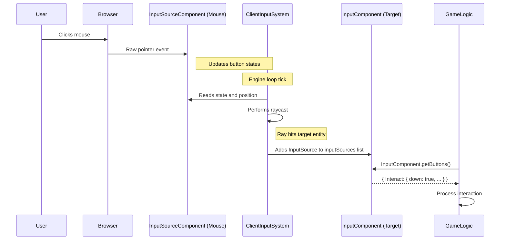

# Input system

## Overview

The input system enables user interaction with the 3D environment by detecting, processing, and routing user actions to the appropriate entities. It bridges the gap between physical input devices (mouse, keyboard, XR controllers) and the virtual objects in the scene, allowing users to select, manipulate, and interact with the 3D world.

## Core components

The input system consists of three primary components that work together to process user interactions:

### InputSourceComponent

The `InputSourceComponent` represents a physical or virtual input device and captures its raw input data. It serves as the entry point for user actions into the system.

Key properties:
- `source`: Raw device data (e.g., XR controller information)
- `buttons`: Current state of all buttons on the device
- `raycaster`: For pointer-based devices, provides an invisible ray for targeting
- `intersections`: List of entities intersected by the raycaster

```typescript
// Simplified from: src/input/components/InputSourceComponent.tsx
export const InputSourceComponent = defineComponent({
  name: 'InputSourceComponent',
  schema: S.Object({
    source: S.Type<XRInputSource>({ default: {} as XRInputSource }),
    buttons: S.Type<ButtonStateMap<typeof DefaultButtonBindings>>({ default: {} }),
    raycaster: S.Class(() => new Raycaster()),
    intersections: S.Array(/* ... */)
    // Additional properties
  }),
  // Implementation details
});
```

### InputComponent

The `InputComponent` is attached to entities that can respond to user input. It defines which actions an entity listens for and provides a mechanism to query the current state of these actions.

Key properties:
- `buttonBindings`: Maps semantic action names to physical buttons
- `inputSources`: References to entities with `InputSourceComponent` that are currently targeting this entity
- `buttons`: A proxy object that provides the current state of all defined actions

```typescript
// Simplified from: src/input/components/InputComponent.ts
export const InputComponent = defineComponent({
  name: 'InputComponent',
  schema: S.Object({
    buttonBindings: S.Record(S.String(), /* ... */),
    inputSources: S.Array(S.Entity()),
    cachedButtons: S.Type<ButtonStateMap<any>>(),
    buttons: S.SerializedClass(/* ... */)
    // Additional properties
  }),
  
  // Method to get button states for an entity
  getButtons: (entity) => {
    // Implementation details
    return buttonStateProxy;
  },
  
  // Additional methods
});
```

### ClientInputSystem

The `ClientInputSystem` is the central processor that coordinates input handling. It runs each frame to update input states, perform raycasting, and connect input sources to their targets.

Key responsibilities:
- Update the state of all input sources
- Perform raycasting for pointer-based inputs
- Determine which entities are being targeted
- Update the `inputSources` list on targeted entities' `InputComponent`s

```typescript
// Simplified concept from: src/input/systems/ClientInputSystem.tsx
function execute() {
  // Update XR controller transforms
  for (const entity of xrControllersQuery()) {
    updateXRControllerTransform(entity);
  }
  
  // Update pointer raycasters (mouse, touch)
  for (const entity of pointersQuery()) {
    updatePointerRaycaster(entity);
  }
  
  // Update gamepad button states
  for (const entity of inputSourcesQuery()) {
    ClientInputFunctions.updateGamepadInput(entity);
  }
  
  // Determine targets and assign input sources
  for (const entity of inputSourcesQuery()) {
    ClientInputFunctions.assignInputSources(entity);
  }
}
```

## Input processing workflow

The input system follows a specific sequence of operations to process user input:

### 1. Input capture

When a user interacts with an input device:

1. Browser events (e.g., `pointerdown`, `keydown`) are captured by event listeners
2. These events are translated into state changes in the appropriate `InputSourceComponent`
3. For pointer-based inputs, the position is converted to normalized coordinates

```typescript
// Simplified concept from: src/input/functions/ClientInputHooks.tsx
function handlePointerEvent(event, canvas) {
  // Find or create the input source entity for this pointer
  const sourceEntity = getPointerEntity(event.pointerId);
  
  // Calculate normalized coordinates (-1 to 1)
  const normalizedX = (event.clientX / canvas.width) * 2 - 1;
  const normalizedY = -(event.clientY / canvas.height) * 2 + 1;
  
  // Update the input source component
  setComponent(sourceEntity, InputSourceComponent, {
    buttons: {
      // Update button states based on event type
      PrimaryClick: event.type === 'pointerdown' ? { down: true, pressed: true } : { /* ... */ }
    },
    position: { x: normalizedX, y: normalizedY }
  });
}
```

### 2. Raycasting and target detection

During each frame, the `ClientInputSystem`:

1. Updates the raycaster for each pointer-based input source
2. Performs raycasting to find intersected entities
3. Sorts intersections by distance (closest first)

```typescript
// Simplified concept from: src/input/functions/ClientInputHeuristics.ts
function findRaycastedInput(sourceEntity) {
  const inputSource = getComponent(sourceEntity, InputSourceComponent);
  const raycaster = inputSource.raycaster;
  
  // Get all entities with InputComponent
  const interactiveEntities = getEntitiesWithInputComponent();
  
  // Perform raycasting
  const intersections = raycaster.intersectObjects(interactiveEntities, true);
  
  // Sort by distance
  return intersections.sort((a, b) => a.distance - b.distance);
}
```

### 3. Input source assignment

After determining targets, the system:

1. Updates the `inputSources` list on each targeted entity's `InputComponent`
2. Handles input focus and capture for exclusive input control

```typescript
// Simplified concept from: src/input/functions/ClientInputFunctions.ts
function assignInputSources(sourceEntity) {
  // Find entities intersected by the source's raycaster
  const intersections = findRaycastedInput(sourceEntity);
  
  // For each intersected entity
  for (const intersection of intersections) {
    const targetEntity = intersection.object.entity;
    
    // Get the target's InputComponent
    const inputComponent = getComponent(targetEntity, InputComponent);
    
    // Add this source to the target's inputSources list
    inputComponent.inputSources.add(sourceEntity);
  }
}
```

### 4. Input query and response

Game logic can then query the input state for specific entities:

```typescript
// In game logic code
function processEntityInput(entity) {
  // Get the current button states for this entity
  const buttons = InputComponent.getButtons(entity);
  
  // Check if a specific action was triggered
  if (buttons.Interact?.down) {
    // The Interact action was just initiated this frame
    performInteraction(entity);
  }
  
  if (buttons.Select?.pressed) {
    // The Select action is currently active (held down)
    updateSelection(entity);
  }
}
```

## Input flow example

The following sequence diagram illustrates the flow of a mouse click on an interactive object:



## Button state representation

The input system uses a standardized `ButtonState` object to represent the state of each button or action:

| Property | Description |
|----------|-------------|
| `down` | True only for the first frame the button is pressed |
| `pressed` | True for the entire duration the button is held down |
| `up` | True only for the first frame the button is released |
| `value` | For analog inputs, a value between 0 and 1 |

This representation allows for precise control over when actions are triggered:

```typescript
// Trigger once when button is first pressed
if (buttons.Action?.down) {
  triggerOneTimeAction();
}

// Continuous effect while button is held
if (buttons.Action?.pressed) {
  applyContinuousEffect();
}

// Trigger when button is released
if (buttons.Action?.up) {
  completeAction();
}
```

## Input binding

The `InputComponent` allows for flexible mapping between physical inputs and semantic actions:

```typescript
// Define custom actions mapped to specific inputs
setComponent(entity, InputComponent, {
  buttonBindings: {
    Jump: [KeyboardButton.Space, GamepadButton.A],
    Fire: [MouseButton.PrimaryClick, GamepadButton.RightTrigger],
    Crouch: [KeyboardButton.ControlLeft, GamepadButton.B]
  }
});
```

This approach provides several advantages:
- Input device independence (same action works with different devices)
- Semantic clarity in code (check for "Jump" instead of "Space key")
- Support for input remapping without changing game logic

## XR input integration

The input system seamlessly extends to XR (Virtual/Augmented Reality) controllers:

1. XR controllers are represented as entities with `InputSourceComponent`, `TransformComponent`, and `XRSpaceComponent`
2. The `ClientInputSystem` updates their transforms based on the XR session data
3. Raycasting is performed from the controller's position and orientation
4. The same input binding and query mechanisms work for XR inputs

This unified approach allows developers to create interactions that work across desktop, mobile, and XR platforms with minimal code changes.

## Next steps

With an understanding of how users can interact with the virtual environment, the next chapter explores the physics system, which simulates physical interactions between objects.

Next: [Physics system](05_physics_system_.md)

---


