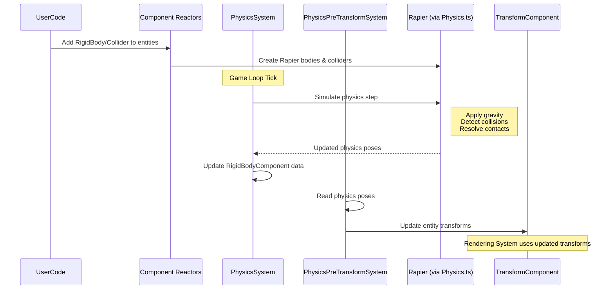

# Physics system

## Overview

The physics system simulates physical interactions between objects in the 3D environment. It enables entities to be affected by gravity, collide with each other, and respond to forces. Built on the Rapier physics engine, this system maintains a separate physics simulation that runs alongside the visual representation, calculating how objects should move and interact based on their physical properties.

## Core components

The physics system consists of several key components that work together to create realistic physical behavior:

### RigidBodyComponent

The `RigidBodyComponent` designates an entity as a physical object within the simulation. It defines the object's physical properties and how it should behave in the physics world.

Key properties:
- `type`: Determines how the object behaves in the physics simulation
  - `dynamic`: Fully simulated objects affected by gravity and forces
  - `fixed`: Immovable objects that serve as obstacles
  - `kinematic`: Objects moved programmatically that can still collide with dynamic objects
- `mass`: The object's mass (affects how forces impact it)
- `linearVelocity`: The object's current velocity vector
- `angularVelocity`: The object's current rotational velocity

```typescript
// Simplified from: src/physics/components/RigidBodyComponent.tsx
export const RigidBodyComponent = defineComponent({
  name: 'RigidBodyComponent',
  schema: S.Object({
    type: S.Enum(BodyTypes, { default: BodyTypes.Dynamic }),
    mass: S.Number({ default: 1 }),
    linearVelocity: T.Vec3({ default: { x: 0, y: 0, z: 0 } }),
    angularVelocity: T.Vec3({ default: { x: 0, y: 0, z: 0 } }),
    // Additional properties
  }),
  // Implementation details
});
```

### ColliderComponent

The `ColliderComponent` defines the physical shape of an entity for collision detection. This shape is often simpler than the visual model to optimize performance.

Key properties:
- `shape`: The geometric shape used for collision detection (box, sphere, capsule, etc.)
- Dimension properties: Size parameters specific to the chosen shape (radius, height, etc.)
- `friction`: How much the object resists sliding against other objects
- `restitution`: How "bouncy" the object is during collisions

```typescript
// Simplified from: src/physics/components/ColliderComponent.tsx
export const ColliderComponent = defineComponent({
  name: 'ColliderComponent',
  schema: S.Object({
    shape: S.Enum(Shapes, { default: Shapes.Box }),
    boxSize: T.Vec3({ default: { x: 1, y: 1, z: 1 } }),
    radius: S.Number({ default: 0.5 }),
    height: S.Number({ default: 1 }),
    friction: S.Number({ default: 0.5 }),
    restitution: S.Number({ default: 0 }),
    // Additional properties
  }),
  // Implementation details
});
```

## Physics systems

The physics simulation is managed by two primary systems:

### PhysicsSystem

The `PhysicsSystem` is the main coordinator that advances the physics simulation each frame. Its responsibilities include:

1. Storing the current physics state for interpolation
2. Advancing the Rapier physics simulation
3. Retrieving updated positions and rotations from Rapier
4. Processing collision events

```typescript
// Simplified concept from: src/physics/systems/PhysicsSystem.tsx
function execute() {
  // Get all non-fixed rigid bodies
  const allRigidBodies = nonFixedRigidbodyQuery();
  
  // Store current physics pose as 'previous' for interpolation
  Physics.updatePreviousRigidbodyPose(allRigidBodies);
  
  // Get simulation parameters
  const { simulationTimestep } = getState(ECSState);
  const kinematicEntities = kinematicQuery();
  
  // Run the Rapier physics simulation
  Physics.simulate(simulationTimestep, kinematicEntities);
  
  // Update RigidBodyComponent with new poses from Rapier
  Physics.updateRigidbodyPose(allRigidBodies);
  
  // Process collision events
  // ...
}
```

### PhysicsPreTransformSystem

The `PhysicsPreTransformSystem` serves as the bridge between the physics simulation and the visual representation. It runs before the main transform system and:

1. Updates Rapier rigid bodies when entities are manually moved
2. Updates entity `TransformComponent`s with the results of the physics simulation
3. Handles interpolation for smooth visual movement

```typescript
// Simplified concept from: src/physics/systems/PhysicsPreTransformSystem.ts
function execute() {
  // For entities whose TransformComponent was manually changed
  for (const entity of dirtyRigidbodyEntities) {
    copyTransformToRigidBody(entity);
  }
  
  // For entities moved by physics
  const alpha = calculateInterpolationFactor();
  for (const entity of awakeCleanRigidbodyEntities) {
    lerpTransformFromRigidbody(entity, alpha);
  }
}

function lerpTransformFromRigidbody(entity, alpha) {
  // Get RigidBodyComponent with physics-calculated position/rotation
  const rigidBody = getComponent(entity, RigidBodyComponent);
  
  // Interpolate between previous and current physics poses
  const interpolatedPosition = Vector3.lerp(
    rigidBody.previousPosition,
    rigidBody.position,
    alpha
  );
  
  // Update the entity's TransformComponent
  const transform = getComponent(entity, TransformComponent);
  transform.position.copy(interpolatedPosition);
  // Similar for rotation
  
  // Mark the TransformComponent as dirty for the transform system
  TransformComponent.dirty[entity] = 1;
}
```

## Physics wrapper

The `Physics` class (`src/physics/classes/Physics.ts`) serves as a wrapper around the Rapier physics engine, providing a bridge between the ECS architecture and Rapier's object-oriented API. Key functions include:

### createWorld

Creates a new Rapier physics world with specified gravity:

```typescript
// Simplified from: src/physics/classes/Physics.ts
function createWorld(id: Entity, args = { gravity: { x: 0.0, y: -9.81, z: 0.0 }}) {
  const world = new RAPIER.World(args.gravity);
  // Store in RapierWorldState
  return world;
}
```

### createRigidBody

Creates a Rapier rigid body from an entity's components:

```typescript
// Simplified from: src/physics/classes/Physics.ts
function createRigidBody(world: RAPIER.World, entity: Entity) {
  // Get entity's transform and rigid body data
  const transform = getComponent(entity, TransformComponent);
  const rigidBodyData = getComponent(entity, RigidBodyComponent);
  
  // Create appropriate Rapier rigid body description
  let rapierBodyDesc;
  if (rigidBodyData.type === BodyTypes.Dynamic) {
    rapierBodyDesc = RAPIER.RigidBodyDesc.dynamic();
  } else if (rigidBodyData.type === BodyTypes.Fixed) {
    rapierBodyDesc = RAPIER.RigidBodyDesc.fixed();
  } else if (rigidBodyData.type === BodyTypes.Kinematic) {
    rapierBodyDesc = RAPIER.RigidBodyDesc.kinematicPositionBased();
  }
  
  // Set position and rotation
  rapierBodyDesc.setTranslation(transform.position.x, transform.position.y, transform.position.z);
  // Set rotation from quaternion
  
  // Create the actual body in the Rapier world
  const body = world.createRigidBody(rapierBodyDesc);
  body.entity = entity; // Store entity ID for later lookup
  world.Rigidbodies.set(entity, body); // Track the body
}
```

### createColliderDesc and attachCollider

Create and attach collision shapes to rigid bodies:

```typescript
// Simplified from: src/physics/classes/Physics.ts
function createColliderDesc(world: RAPIER.World, entity: Entity) {
  const colliderData = getComponent(entity, ColliderComponent);
  
  // Create appropriate collider based on shape
  let rapierColliderDesc;
  if (colliderData.shape === Shapes.Box) {
    rapierColliderDesc = RAPIER.ColliderDesc.cuboid(
      colliderData.boxSize.x/2, 
      colliderData.boxSize.y/2, 
      colliderData.boxSize.z/2
    );
  } else if (colliderData.shape === Shapes.Sphere) {
    rapierColliderDesc = RAPIER.ColliderDesc.ball(colliderData.radius);
  }
  // Additional shapes
  
  // Set physical properties
  rapierColliderDesc.setFriction(colliderData.friction);
  rapierColliderDesc.setRestitution(colliderData.restitution);
  
  return rapierColliderDesc;
}

function attachCollider(world: RAPIER.World, desc: RAPIER.ColliderDesc, rbEntity: Entity, colEntity: Entity) {
  const rigidBody = world.Rigidbodies.get(rbEntity);
  const collider = world.createCollider(desc, rigidBody);
  collider.entity = colEntity;
  world.Colliders.set(colEntity, collider);
}
```

### simulate

Advances the physics simulation by one time step:

```typescript
// Simplified from: src/physics/classes/Physics.ts
function simulate(simulationTimestep: number, kinematicEntities: Entity[]) {
  // For each physics world
  for (const [worldId, world] of RapierWorldState.worlds) {
    // Calculate time step
    const timeStep = simulationTimestep / 1000 / world.substeps;
    
    // Run multiple substeps for stability
    for (let i = 0; i < world.substeps; i++) {
      // Handle kinematic body updates
      
      // Advance the Rapier simulation
      world.step(world.collisionEventQueue);
      
      // Process collision events
    }
  }
}
```

## Physics workflow example

The following example demonstrates how to create a ball that falls onto a floor:

### 1. Creating the floor (fixed rigid body)

```typescript
const floorEntity = createEntity();

// Position the floor at the origin
setComponent(floorEntity, TransformComponent, { 
  position: { x: 0, y: 0, z: 0 } 
});

// Make it a physical object that doesn't move
setComponent(floorEntity, RigidBodyComponent, { 
  type: BodyTypes.Fixed 
});

// Define its physical shape as a box
setComponent(floorEntity, ColliderComponent, { 
  shape: Shapes.Box, 
  boxSize: { x: 10, y: 0.1, z: 10 } 
});
```

### 2. Creating the ball (dynamic rigid body)

```typescript
const ballEntity = createEntity();

// Position the ball above the floor
setComponent(ballEntity, TransformComponent, { 
  position: { x: 0, y: 5, z: 0 } 
});

// Make it a physical object affected by gravity
setComponent(ballEntity, RigidBodyComponent, { 
  type: BodyTypes.Dynamic 
});

// Define its physical shape as a sphere
setComponent(ballEntity, ColliderComponent, { 
  shape: Shapes.Sphere, 
  radius: 0.5,
  restitution: 0.5 // Make it bounce
});
```

### 3. Physics simulation flow

When the engine runs:

1. Component reactors register the entities with Rapier
2. Each frame, the `PhysicsSystem` advances the simulation
3. Gravity pulls the ball downward
4. Rapier detects the collision between the ball and floor
5. Rapier resolves the collision, preventing penetration
6. The `PhysicsPreTransformSystem` updates the ball's `TransformComponent`
7. The rendering system draws the ball at its new position



## Advanced physics features

The physics system supports several advanced features:

### Collision detection and events

The system can detect and respond to collision events:

```typescript
// Add a collision component to receive events
setComponent(ballEntity, CollisionComponent);

// In a system or reactor
const collision = getComponent(ballEntity, CollisionComponent);
if (collision.colliding) {
  // The ball is colliding with something
  for (const collidingEntity of collision.collidingEntities) {
    // Handle specific collision
  }
}
```

### Joints and constraints

Physical constraints can be created between entities:

```typescript
// Create a ball-and-socket joint between two entities
setComponent(jointEntity, JointComponent, {
  type: JointTypes.BallSocket,
  bodyA: entityA,
  bodyB: entityB,
  anchor: { x: 0, y: 1, z: 0 }
});
```

### Raycasting

The physics system provides raycasting for detecting objects along a ray:

```typescript
// Cast a ray from origin in direction
const hits = Physics.raycast(
  world,
  origin,
  direction,
  maxDistance,
  collisionGroups
);

// Process hits
for (const hit of hits) {
  const hitEntity = hit.collider.entity;
  const hitDistance = hit.toi;
  // Handle hit
}
```

## Next steps

With an understanding of how entities can interact physically, the next chapter explores reference space management, which handles different coordinate systems within the virtual environment.

Next: [Reference space management](06_reference_space_management_.md)

---


