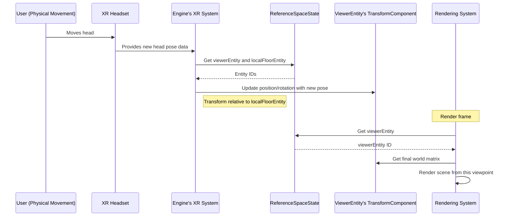

# Reference space management

## Overview

Reference space management provides a framework for defining and coordinating different coordinate systems within the virtual environment. This system is particularly important for XR (Virtual/Augmented Reality) applications, where multiple spatial reference frames must be synchronized: the virtual world's coordinate system, the user's physical space, and the viewer's perspective. 

By managing these different "spaces," the engine can correctly translate between physical movements and virtual positioning.

## ReferenceSpaceState

The core of the reference space management system is the `ReferenceSpaceState`, a global state object that tracks the key reference entities:

```typescript
// Simplified from: src/ReferenceSpaceState.ts
import { UndefinedEntity } from '@ir-engine/ecs';
import { defineState } from '@ir-engine/hyperflux';

export const ReferenceSpaceState = defineState({
  name: 'ReferenceSpaceState',
  initial: {
    // Entity for the XR session's local floor
    localFloorEntity: UndefinedEntity,
    // Entity for the absolute origin (0,0,0) of the world
    originEntity: UndefinedEntity,
    // Entity representing the viewer/camera
    viewerEntity: UndefinedEntity
  }
});
```

This state object provides a centralized registry for accessing the three fundamental reference entities:

1. **Origin entity**: Represents the absolute (0,0,0) point of the virtual world
2. **Local floor entity**: Represents the user's physical floor and play area in XR
3. **Viewer entity**: Represents the user's head position and orientation (camera viewpoint)

## Initialization process

The reference space entities are created during engine initialization:

### initializeSpatialEngine

This function sets up the origin and local floor entities:

```typescript
// Simplified from: src/initializeEngine.ts
import { createEntity, setComponent } from '@ir-engine/ecs';
import { NameComponent } from './common/NameComponent';
import { TransformComponent } from './transform/components/TransformComponent';
import { ReferenceSpaceState } from './ReferenceSpaceState';
import { getMutableState } from '@ir-engine/hyperflux';

export const initializeSpatialEngine = () => {
  // Create the origin entity at the world's (0,0,0)
  const originEntity = createEntity();
  setComponent(originEntity, NameComponent, 'origin');
  setComponent(originEntity, TransformComponent);

  // Create the local floor entity (initially at 0,0,0)
  const localFloorEntity = createEntity();
  setComponent(localFloorEntity, NameComponent, 'local floor');
  setComponent(localFloorEntity, TransformComponent);

  // Register these entities in the global state
  getMutableState(ReferenceSpaceState).merge({
    originEntity,
    localFloorEntity
  });
};
```

### initializeSpatialViewer

This function creates the viewer entity, which serves as the camera viewpoint:

```typescript
// Simplified from: src/initializeEngine.ts
import { CameraComponent } from './camera/components/CameraComponent';

export const initializeSpatialViewer = () => {
  // Create the viewer entity
  const viewerEntity = createEntity();
  setComponent(viewerEntity, NameComponent, 'viewer');
  setComponent(viewerEntity, TransformComponent);
  setComponent(viewerEntity, CameraComponent);

  // Register the viewer entity in the global state
  getMutableState(ReferenceSpaceState).merge({
    viewerEntity
  });
};
```

## Spatial relationships

The reference entities establish a hierarchical relationship that defines how coordinates are transformed between different spaces:

```
originEntity (world origin)
    │
    ├── localFloorEntity (user's physical space)
    │       │
    │       └── viewerEntity (user's head/camera)
    │
    └── [other world objects]
```

This hierarchy enables several important capabilities:

1. **World positioning**: Game objects are positioned relative to the origin entity
2. **XR anchoring**: The local floor entity defines where the user's physical space is located within the virtual world
3. **Camera perspective**: The viewer entity's transform determines the rendering viewpoint

## XR integration

The reference space system is particularly important for XR applications, where it bridges the physical and virtual worlds:

### XR session initialization

When an XR session begins, the system obtains reference spaces from the XR hardware:

```typescript
// Simplified concept from: src/xr/XRSessionFunctions.ts
async function initializeXRReferenceSpaces(xrSession) {
  // Request the 'local-floor' reference space from the XR system
  const localFloorSpace = await xrSession.requestReferenceSpace('local-floor');
  
  // Store this XR reference space
  ReferenceSpace.localFloor = localFloorSpace;
  
  // Update the engine's localFloorEntity to match this physical space
  computeAndUpdateWorldOrigin();
}
```

### Viewer tracking

During XR usage, the system continuously updates the viewer entity based on head tracking:

```typescript
// Simplified from: src/xr/XRCameraSystem.ts
function updateCameraBasedOnXR() {
  // Get the reference entities
  const viewerEntity = getState(ReferenceSpaceState).viewerEntity;
  const localFloorEntity = getState(ReferenceSpaceState).localFloorEntity;

  // Get their transform components
  const cameraTransform = getComponent(viewerEntity, TransformComponent);
  const floorTransform = getComponent(localFloorEntity, TransformComponent);

  // Get the latest XR pose data from the headset
  const xrPose = getXRPoseData();

  // Update the camera transform with the XR pose data
  cameraTransform.position.copy(xrPose.position);
  cameraTransform.rotation.copy(xrPose.orientation);
  
  // Calculate the final world position by combining with the local floor transform
  cameraTransform.matrixWorld
    .compose(cameraTransform.position, cameraTransform.rotation, cameraTransform.scale)
    .premultiply(floorTransform.matrixWorld)
    .decompose(cameraTransform.position, cameraTransform.rotation, cameraTransform.scale);
}
```

## Practical applications

The reference space system enables several important capabilities:

### Room-scale VR

For room-scale VR experiences, the system allows users to physically move within their play area:

1. The local floor entity is positioned at a specific location in the virtual world
2. As the user physically moves, the XR system updates the viewer entity's position relative to the local floor
3. This movement is reflected in the virtual world, allowing natural navigation

### World repositioning

The system allows the virtual world to be repositioned around the user:

```typescript
// Reposition the player's physical space within the virtual world
function teleportPlayer(newWorldPosition) {
  const localFloorEntity = getState(ReferenceSpaceState).localFloorEntity;
  const floorTransform = getComponent(localFloorEntity, TransformComponent);
  
  // Update the local floor's position in the world
  floorTransform.position.copy(newWorldPosition);
  
  // Mark the transform as dirty to trigger updates
  TransformComponent.dirty[localFloorEntity] = 1;
}
```

### Multi-user experiences

For multi-user XR applications, each user has their own local floor and viewer entities:

```typescript
// Create reference spaces for a new user
function setupUserReferenceSpaces(userId) {
  // Create local floor entity for this user
  const userLocalFloorEntity = createEntity();
  setComponent(userLocalFloorEntity, TransformComponent);
  
  // Create viewer entity for this user
  const userViewerEntity = createEntity();
  setComponent(userViewerEntity, TransformComponent);
  setComponent(userViewerEntity, CameraComponent);
  
  // Store these entities in user-specific state
  userReferenceSpaces.set(userId, {
    localFloorEntity: userLocalFloorEntity,
    viewerEntity: userViewerEntity
  });
}
```

## Reference space workflow

The following sequence diagram illustrates how reference spaces are used during an XR session:



## Next steps

With an understanding of how different coordinate systems are managed, the next chapter explores the specific implementation of XR features in the engine.

Next: [XR (extended reality) integration](07_xr__extended_reality__integration_.md)

---


