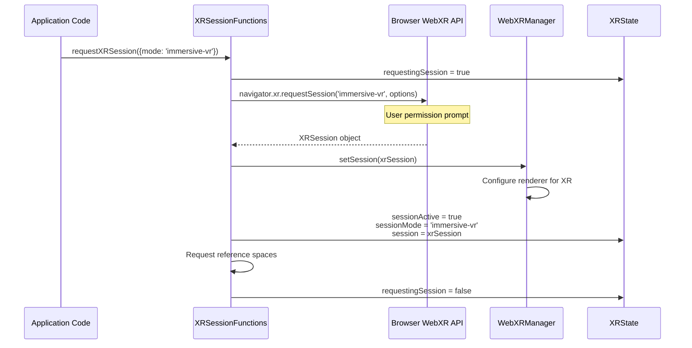

# XR (extended reality) integration

## Overview

The XR integration system enables the iR Engine to support immersive Virtual Reality (VR) and Augmented Reality (AR) experiences. It provides a bridge between the engine and the browser's WebXR API, allowing applications to initiate XR sessions, track user movement, handle XR input devices, and render content to XR displays. This system is essential for creating applications where users can interact with virtual environments through head-mounted displays and motion controllers.

## Core components

The XR integration system consists of several key components that work together to enable immersive experiences:

### XRState

The `XRState` serves as the central repository for XR-related information. It tracks the current status of XR sessions and provides access to essential XR objects:

```typescript
// Simplified from: src/xr/XRState.ts
import { defineState } from '@ir-engine/hyperflux';

export const XRState = defineState({
  name: 'XRState',
  initial: {
    // Whether an XR session is currently active
    sessionActive: false,
    // Whether a session request is in progress
    requestingSession: false,
    // The type of active session ('inline', 'immersive-ar', 'immersive-vr', or 'none')
    sessionMode: 'none' as 'inline' | 'immersive-ar' | 'immersive-vr' | 'none',
    // The browser's XRSession object
    session: null as XRSession | null,
    // The current XRFrame containing tracking data
    xrFrame: null as XRFrame | null,
    // Which session modes are supported by the current device
    supportedSessionModes: {
      'inline': true,
      'immersive-vr': false,
      'immersive-ar': false
    }
  }
});
```

### XRSessionFunctions

The `XRSessionFunctions` module provides methods for initiating and managing XR sessions:

```typescript
// Simplified from: src/xr/XRSessionFunctions.ts
import { getMutableState, getState } from '@ir-engine/hyperflux';
import { XRState } from './XRState';
import { ReferenceSpaceState } from '../ReferenceSpaceState';

// Request an XR session of the specified mode
export async function requestXRSession(action = { mode: 'immersive-vr' }) {
  const xrState = getMutableState(XRState);
  xrState.requestingSession.set(true);
  
  try {
    await setupXRSession(action.mode);
  } catch (error) {
    console.error('Failed to start XR session:', error);
  } finally {
    xrState.requestingSession.set(false);
  }
}

// End the current XR session
export async function endXRSession() {
  const xrState = getState(XRState);
  if (xrState.sessionActive && xrState.session) {
    await xrState.session.end();
  }
}

// Internal function to set up an XR session
async function setupXRSession(requestedMode) {
  // Implementation details
}
```

### WebXRManager

The `WebXRManager` serves as a bridge between the engine's rendering system and the browser's WebXR API:

```typescript
// Simplified concept from: src/xr/WebXRManager.ts
export class WebXRManager {
  constructor(renderer, gl) {
    this.renderer = renderer;
    this.gl = gl;
    this.isPresenting = false;
    this.xrFrame = null;
    this.session = null;
    this.referenceSpace = null;
  }
  
  // Set up the renderer for XR presentation
  async setSession(session, framebufferScaleFactor = 1) {
    this.session = session;
    
    // Make the WebGL context compatible with XR
    await this.gl.makeXRCompatible();
    
    // Create appropriate render targets for XR
    const baseLayer = new XRWebGLLayer(session, this.gl, {
      framebufferScaleFactor
    });
    
    session.updateRenderState({
      baseLayer,
      depthNear: 0.1,
      depthFar: 1000
    });
    
    // Configure the renderer for XR
    this.renderer.setRenderTarget(this.createRenderTarget(baseLayer));
    this.isPresenting = true;
  }
  
  // Additional methods for handling XR rendering
}
```

## XR-specific components

The system includes several specialized components for XR functionality:

### XRSpaceComponent

The `XRSpaceComponent` links an entity to an XR tracked object (like a controller or headset):

```typescript
// Simplified from: src/xr/XRComponents.ts
export const XRSpaceComponent = defineComponent({
  name: 'XRSpaceComponent',
  schema: S.Object({
    // The XRSpace from the WebXR API
    space: S.Type<XRSpace>(),
    // The reference space to use for tracking
    referenceSpace: S.String({ default: 'local-floor' }),
    // Whether this space is currently being tracked
    tracked: S.Boolean({ default: false })
  }),
  
  // Reactor updates the entity's transform based on XR tracking data
  reactor: () => {
    const entity = useEntityContext();
    const component = useComponent(entity, XRSpaceComponent);
    const xrState = useHookstate(getState(XRState));
    
    useEffect(() => {
      // When xrFrame updates, get the pose for this space
      if (xrState.xrFrame.value && component.space.value) {
        const pose = xrState.xrFrame.value.getPose(
          component.space.value,
          getReferenceSpace(component.referenceSpace.value)
        );
        
        if (pose) {
          // Update the entity's transform with the pose data
          updateEntityTransformFromPose(entity, pose);
          component.tracked.set(true);
        } else {
          component.tracked.set(false);
        }
      }
    }, [xrState.xrFrame]);
    
    return null;
  }
});
```

### XRHandComponent

The `XRHandComponent` provides access to hand tracking data when available:

```typescript
// Simplified from: src/xr/XRComponents.ts
export const XRLeftHandComponent = defineComponent({
  name: 'XRLeftHandComponent',
  schema: S.Object({
    // Store rotations for each joint in the hand
    rotations: S.Class(() => new Float32Array(4 * 19)),
    // Store positions for each joint
    positions: S.Class(() => new Float32Array(3 * 19)),
    // Whether the hand is currently being tracked
    tracked: S.Boolean({ default: false })
  }),
  
  // Reactor updates hand data from XR input sources
  reactor: () => {
    // Implementation details
    return null;
  }
});

// Similar definition for XRRightHandComponent
```

### XRAnchorComponent

The `XRAnchorComponent` enables AR applications to attach virtual objects to real-world locations:

```typescript
// Simplified from: src/xr/XRAnchorComponents.ts
export const XRAnchorComponent = defineComponent({
  name: 'XRAnchorComponent',
  schema: S.Object({
    // The XRAnchor from the WebXR API
    anchor: S.Type<XRAnchor>(),
    // Whether the anchor is currently being tracked
    tracked: S.Boolean({ default: false })
  }),
  
  // Reactor updates the entity's transform based on anchor tracking
  reactor: () => {
    // Implementation details
    return null;
  }
});
```

## XR session workflow

The following sequence illustrates the process of starting and using an XR session:

### 1. Session initialization

```typescript
// Check if VR is supported
navigator.xr?.isSessionSupported('immersive-vr').then((supported) => {
  if (supported) {
    // Enable VR button or UI element
    vrButton.disabled = false;
  }
});

// When user clicks "Enter VR" button
async function onEnterVRClick() {
  try {
    await requestXRSession({ mode: 'immersive-vr' });
    console.log("VR session started successfully");
  } catch (error) {
    console.error("Failed to start VR session:", error);
  }
}
```

### 2. Session setup

When `requestXRSession` is called, the following steps occur:

1. `XRState.requestingSession` is set to `true`
2. `setupXRSession` is called with the requested mode
3. The browser's WebXR API is used to request a session: `navigator.xr.requestSession(mode, options)`
4. The user may see a permission prompt from the browser
5. If approved, the `WebXRManager` is configured with the new session
6. XR reference spaces are requested and linked to the reference space entities
7. `XRState` is updated with the active session information



### 3. Per-frame updates

During an active XR session, the engine performs these operations each frame:

1. The current `XRFrame` is obtained from the session's `requestAnimationFrame` callback
2. The `XRFrame` is stored in `XRState.xrFrame`
3. The viewer entity's transform is updated based on head tracking data
4. XR controller entities are updated based on input source tracking
5. Hand tracking data is processed if available
6. The scene is rendered from the XR viewpoint

```typescript
// Simplified concept of XR frame handling
function onXRFrame(time, xrFrame) {
  // Store the current frame
  getMutableState(XRState).xrFrame.set(xrFrame);
  
  // Get viewer pose
  const viewerPose = xrFrame.getViewerPose(referenceSpace);
  if (viewerPose) {
    // Update camera transform
    updateViewerEntityFromPose(viewerPose);
    
    // Process input sources
    for (const inputSource of xrFrame.session.inputSources) {
      if (inputSource.gripSpace) {
        // Update controller entity
        const pose = xrFrame.getPose(inputSource.gripSpace, referenceSpace);
        if (pose) {
          updateControllerEntityFromPose(inputSource.handedness, pose);
        }
      }
      
      // Process hand tracking if available
      if (inputSource.hand) {
        updateHandTracking(inputSource.handedness, inputSource.hand, xrFrame);
      }
    }
    
    // Render the scene for XR
    renderXRFrame(viewerPose);
  }
  
  // Request the next frame
  xrFrame.session.requestAnimationFrame(onXRFrame);
}
```

## XR input handling

The XR system integrates with the input system to provide controller and hand tracking:

### Controller tracking

XR controllers are represented as entities with `XRSpaceComponent` and `InputSourceComponent`:

```typescript
// Create an entity for an XR controller
function createControllerEntity(inputSource) {
  const controllerEntity = createEntity();
  
  // Set up transform
  setComponent(controllerEntity, TransformComponent);
  
  // Link to XR tracking
  setComponent(controllerEntity, XRSpaceComponent, {
    space: inputSource.gripSpace,
    referenceSpace: 'local-floor'
  });
  
  // Set up input handling
  setComponent(controllerEntity, InputSourceComponent, {
    source: inputSource
  });
  
  return controllerEntity;
}
```

### Hand tracking

When hand tracking is available, hand joint data is processed and stored:

```typescript
// Update hand tracking data
function updateHandTracking(handedness, hand, xrFrame) {
  const handEntity = handedness === 'left' ? leftHandEntity : rightHandEntity;
  const handComponent = handedness === 'left' 
    ? getComponent(handEntity, XRLeftHandComponent)
    : getComponent(handEntity, XRRightHandComponent);
  
  let tracked = false;
  
  // Process each joint
  for (let i = 0; i < hand.size; i++) {
    const joint = hand.get(XRHand.WRIST + i);
    if (joint) {
      const jointPose = xrFrame.getJointPose(joint, referenceSpace);
      if (jointPose) {
        // Store joint rotation
        handComponent.rotations[i*4] = jointPose.transform.orientation.x;
        handComponent.rotations[i*4+1] = jointPose.transform.orientation.y;
        handComponent.rotations[i*4+2] = jointPose.transform.orientation.z;
        handComponent.rotations[i*4+3] = jointPose.transform.orientation.w;
        
        // Store joint position
        handComponent.positions[i*3] = jointPose.transform.position.x;
        handComponent.positions[i*3+1] = jointPose.transform.position.y;
        handComponent.positions[i*3+2] = jointPose.transform.position.z;
        
        tracked = true;
      }
    }
  }
  
  handComponent.tracked = tracked;
}
```

## Next steps

With an understanding of how the engine integrates with XR technologies, the next chapter explores the techniques used to adapt the Three.js library to work within the ECS architecture.

Next: [Three.js monkey patching & proxies](08_three_js_monkey_patching___proxies_.md)

---


