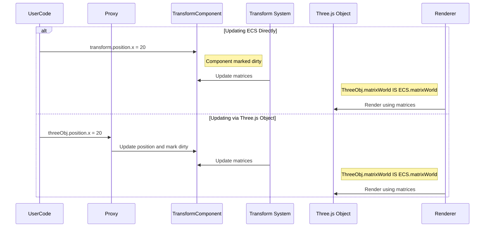

# Three.js monkey patching & proxies

## Overview

The iR Engine uses specialized techniques to integrate the Three.js rendering library with its Entity Component System (ECS) architecture. This integration ensures that the ECS remains the single source of truth for entity data while leveraging Three.js's powerful rendering capabilities. Two key techniques enable this seamless integration: monkey patching and JavaScript proxies. These mechanisms ensure that changes to entity transforms are consistently reflected in both the ECS and Three.js, preventing synchronization issues and maintaining system integrity.

## The integration challenge

Three.js and the ECS architecture both maintain their own representations of spatial data:

1. **ECS `TransformComponent`**: Stores position, rotation, and scale data for entities within the ECS framework
2. **Three.js `Object3D`**: Contains its own position, rotation, and scale properties for rendering

Without proper integration, these two systems could become desynchronized, leading to inconsistencies where:
- The ECS might think an entity is at position X=5
- The Three.js object might be rendered at position X=10

The iR Engine solves this challenge by ensuring the ECS `TransformComponent` is always the authoritative source of spatial information, while keeping Three.js objects automatically synchronized.

## Monkey patching

Monkey patching involves modifying the behavior of existing Three.js methods to make them compatible with the ECS architecture. This technique is implemented in the `threejsPatches.ts` file.

### World position calculation

One key area of patching is how Three.js calculates an object's world position:

```typescript
// Simplified from: src/threejsPatches.ts
import { Object3D, Vector3 } from 'three';

// Override Three.js's built-in method
Object3D.prototype.getWorldPosition = function(targetVector: Vector3): Vector3 {
  // Use the matrixWorld that's already linked to the ECS TransformComponent
  targetVector.setFromMatrixPosition(this.matrixWorld);
  return targetVector;
};
```

This patch ensures that when Three.js needs to determine an object's world position (for rendering, raycasting, etc.), it uses the matrix data that has already been calculated by the ECS transform system.

### Additional patches

The engine also patches other Three.js methods to maintain ECS compatibility:

```typescript
// Simplified examples of other patches
Object3D.prototype.getWorldQuaternion = function(targetQuaternion) {
  // Use ECS-calculated world matrix
  targetQuaternion.setFromRotationMatrix(this.matrixWorld);
  return targetQuaternion;
};

Object3D.prototype.getWorldScale = function(targetScale) {
  // Use ECS-calculated world matrix
  this.matrixWorld.decompose(_position, _quaternion, targetScale);
  return targetScale;
};
```

These patches ensure that all spatial queries in Three.js respect the ECS as the authoritative source of transform data.

## JavaScript proxies

While monkey patching modifies Three.js methods, JavaScript proxies intercept operations on Three.js objects to ensure changes are properly reflected in the ECS. This is particularly important for properties like `position`, `quaternion`, and `scale`.

### Vector3 proxies

The `proxifyVector3WithDirty` function creates a proxy for Three.js Vector3 properties:

```typescript
// Simplified from: src/common/proxies/createThreejsProxy.ts
export const proxifyVector3WithDirty = (
  ecsPositionStorage, // TransformComponent.position
  entity,             // Entity ID
  ecsDirtyFlags,      // TransformComponent.dirty
  threeJsVector       // Three.js Vector3 (e.g., mesh.position)
) => {
  // Intercept property access for 'x'
  Object.defineProperty(threeJsVector, 'x', {
    get() { 
      return ecsPositionStorage.x[entity]; // Read from ECS
    },
    set(newValue) {
      ecsDirtyFlags[entity] = 1; // Mark ECS component as dirty
      ecsPositionStorage.x[entity] = newValue; // Update ECS data
    }
  });
  
  // Similar definitions for 'y' and 'z'
  // ...
  
  return threeJsVector;
};
```

This proxy ensures that when code modifies a Three.js object's position (e.g., `mesh.position.x = 10`), the change is automatically applied to the ECS `TransformComponent` and the component is marked for update.

## ObjectComponent integration

The `ObjectComponent` is the bridge between an ECS entity and its Three.js representation. When an `ObjectComponent` is added to an entity, it sets up the necessary proxies and direct matrix links:

```typescript
// Simplified from: src/renderer/components/ObjectComponent.ts
export const ObjectComponent = defineComponent({
  name: 'ObjectComponent',
  schema: S.Type<Object3D>({ required: true }),
  
  onSet(entity, component, obj: Object3D) {
    // Ensure entity has a TransformComponent
    setComponent(entity, TransformComponent);
    const transform = getComponent(entity, TransformComponent);
    
    // Set up proxies for position, rotation, and scale
    proxifyVector3WithDirty(
      TransformComponent.position,
      entity,
      TransformComponent.dirty,
      obj.position
    );
    // Similar for quaternion and scale
    
    // Direct matrix linking - critical for performance
    obj.matrix = transform.matrix;
    obj.matrixWorld = transform.matrixWorld;
    obj.matrixAutoUpdate = false; // ECS handles updates
    
    component.set(obj);
  }
});
```

The direct linking of matrices (`obj.matrix = transform.matrix`) is particularly important. It means there's no copying of matrix data between the ECS and Three.js; they literally share the same underlying data structures.

## Data flow

The integration of these techniques creates two valid paths for updating an entity's transform:

### Path 1: Updating the ECS directly (recommended)

```typescript
// Get the transform component
const transform = getComponent(myEntity, TransformComponent);
// Update position
transform.position.x = 20;
// Mark as dirty (may be automatic depending on implementation)
TransformComponent.dirty[myEntity] = 1;
```

1. The `TransformComponent` data is updated
2. The transform system detects the dirty flag and recalculates matrices
3. Since the Three.js object's matrices are directly linked to the ECS matrices, the visual representation is automatically updated

### Path 2: Updating through the Three.js object

```typescript
// Get the Three.js object via ObjectComponent
const threeObject = getComponent(myEntity, ObjectComponent);
// Update position
threeObject.position.x = 20;
```

1. The proxy intercepts the property assignment
2. The proxy updates the ECS `TransformComponent` data
3. The proxy marks the component as dirty
4. The transform system processes the update as in Path 1



## Benefits

This integration approach provides several key benefits:

1. **Single source of truth**: The ECS `TransformComponent` is always the authoritative source of spatial data
2. **Consistency**: Changes are automatically synchronized between systems
3. **Performance**: Direct matrix linking avoids redundant calculations and data copying
4. **Flexibility**: Developers can work with either ECS components or Three.js objects as needed
5. **Maintainability**: Clear separation between data (Components) and logic (Systems)

## Best practices

While both update paths are valid, the recommended approach is to modify the ECS `TransformComponent` directly whenever possible. This ensures the most predictable behavior and maintains the architectural integrity of the system.

## Conclusion

The Three.js monkey patching and proxy techniques enable the iR Engine to leverage the powerful rendering capabilities of Three.js while maintaining the architectural benefits of an Entity Component System. This integration ensures consistent behavior, optimal performance, and a clean development experience.

Throughout this documentation series, we've explored the core systems of the iR Engine:
- The foundational [Entity component system (ECS) core](01_entity_component_system__ecs__core_.md)
- The spatial [Transform system](02_transform_system_.md)
- The visual [Rendering system](03_rendering_system_.md)
- The interactive [Input system](04_input_system_.md)
- The realistic [Physics system](05_physics_system_.md)
- The coordinate management in [Reference space management](06_reference_space_management_.md)
- The immersive [XR (extended reality) integration](07_xr__extended_reality__integration_.md)

These systems, combined with the integration techniques described in this chapter, provide a robust foundation for building complex, interactive 3D and XR applications.

---


