# Physics and spatial systems

The iR Engine physics and spatial systems provide the core architecture for managing three-dimensional environments and interactions. Built on an Entity Component System (ECS) foundation, these systems handle object transforms (position, rotation, scale), 3D rendering via Three.js, physics simulations, user input processing, and Extended Reality (XR) integration. 

The engine employs specialized systems that work together to manage different reference spaces for XR applications and adapt Three.js to the ECS architecture through custom patches and proxies.

## System architecture

The physics and spatial systems consist of several interconnected components that form the foundation of the 3D engine:

```mermaid
flowchart TD
    A0["Entity component system (ECS) core"]
    A1["Transform system"]
    A2["Rendering system"]
    A3["Input system"]
    A4["Physics system"]
    A5["XR (extended reality) integration"]
    A6["Reference space management"]
    A7["Three.js monkey patching & proxies"]
    A0 -- "Underpins components of" --> A1
    A0 -- "Underpins components of" --> A2
    A0 -- "Underpins components of" --> A3
    A0 -- "Underpins components of" --> A4
    A1 -- "Provides spatial data to" --> A2
    A4 -- "Updates transforms via" --> A1
    A7 -- "Synchronizes with" --> A1
    A5 -- "Directs rendering for" --> A2
    A5 -- "Provides input sources to" --> A3
    A6 -- "Defines coordinate frames for" --> A5
    A6 -- "Uses entities for" --> A0
    A4 -- "Supports raycasting for" --> A3
    A7 -- "Adapts objects for" --> A2
    A5 -- "Uses components for state" --> A0
    A3 -- "Can control transforms via" --> A1
```

## Key components

1. **Entity component system core**: The foundational architecture that organizes game objects and behaviors through a composition-based approach
2. **Transform system**: Manages the position, rotation, and scale of entities in the 3D environment
3. **Rendering system**: Handles the visualization of 3D objects using Three.js
4. **Input system**: Processes user interactions from various input devices
5. **Physics system**: Simulates physical interactions between objects
6. **Reference space management**: Coordinates different coordinate systems, particularly for XR applications
7. **XR integration**: Provides support for virtual and augmented reality experiences
8. **Three.js integration**: Adapts the Three.js library to work within the ECS architecture

## Documentation chapters

1. [Entity component system (ECS) core](01_entity_component_system__ecs__core_.md)
2. [Transform system](02_transform_system_.md)
3. [Rendering system](03_rendering_system_.md)
4. [Input system](04_input_system_.md)
5. [Physics system](05_physics_system_.md)
6. [Reference space management](06_reference_space_management_.md)
7. [XR (extended reality) integration](07_xr__extended_reality__integration_.md)
8. [Three.js monkey patching & proxies](08_three_js_monkey_patching___proxies_.md)

---

