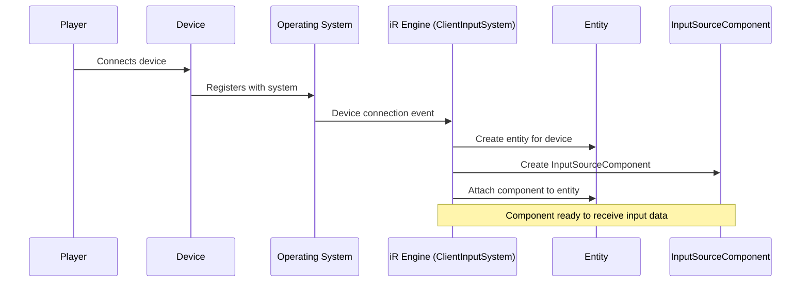

# Input source

## Overview

The input source component is the foundation of the iR Engine's input and interaction system. It serves as the primary data container for raw input from physical or emulated devices connected to the application. Each input source represents a specific input device and maintains up-to-date information about its current state.

## Input source types

The system supports various input device types, each represented by its own input source:

- **Keyboard**: Captures key presses and releases
- **Mouse**: Tracks button clicks, movement, and scroll actions
- **Gamepad**: Monitors button presses and analog stick positions
- **XR controllers**: Handles VR/AR controller input including buttons, triggers, and spatial positioning

## Technical implementation

In the iR Engine, input sources are implemented through the `InputSourceComponent`. This component is attached to entities that represent input devices within the ECS architecture.

### InputSourceComponent structure

The `InputSourceComponent` contains several key properties:

- **Button states**: Current status of all buttons on the device (pressed, released, etc.)
- **Axis values**: Position data for analog inputs like joysticks or triggers
- **Raycaster**: For pointing devices, provides an invisible ray for targeting objects in 3D space
- **Device-specific data**: Additional information relevant to particular device types

### Code example

```typescript
// From: components/InputSourceComponent.tsx

export const InputSourceComponent = defineComponent({
  name: 'InputSourceComponent',

  schema: {
    source: S.Type<XRInputSource>({ default: {} as XRInputSource }),
    buttons: S.Type<Readonly<ButtonStateMap<typeof DefaultButtonBindings>>>({ default: {} }),
    raycaster: S.Class(() => new Raycaster()),
    intersections: S.Array(/* ... */)
    // Additional fields omitted for brevity
  },

  onSet: (entity, component, args) => {
    // Initialization logic when component is added to an entity
    // Sets up default values or uses provided source data
    // May add related components like XRHandComponent if needed
  }
  // Additional methods omitted for brevity
});
```

## Input source lifecycle

The creation and management of input sources follow a specific process:

1. **Device connection**: A physical or emulated input device becomes available
2. **Entity creation**: The system creates an entity to represent the device
3. **Component attachment**: An `InputSourceComponent` is attached to the entity
4. **State initialization**: Default values are set based on the device type
5. **Continuous updates**: The `ClientInputSystem` regularly updates the component with the latest device state



## System integration

The `InputSourceComponent` interacts with several other systems:

- **ClientInputSystem**: Updates the component with the latest hardware input data
- **ClientInputHooks**: Sets up listeners for different device types:
  - `useNonSpatialInputSources`: For keyboard and mouse
  - `useGamepadInputSources`: For standard gamepads
  - `useXRInputSources`: For XR controllers

The `ClientInputSystem` performs these key operations each frame:

1. Updates pointer-based input sources using raycasting
2. Updates XR controller positions and orientations
3. Calls `ClientInputFunctions.updateGamepadInput` to refresh button and axis states

## Practical usage

Developers rarely need to create `InputSourceComponent` instances manually, as the engine automatically handles this for standard input devices. However, understanding the component's structure is essential when:

- Implementing custom input devices
- Creating advanced input handling logic
- Debugging input-related issues

## Next steps

With an understanding of how raw input data is captured and stored in input sources, the next chapter explores how this data is structured through standardized button and axis states.

Next: [Button and axis state](02_button_and_axis_state_.md)

---


