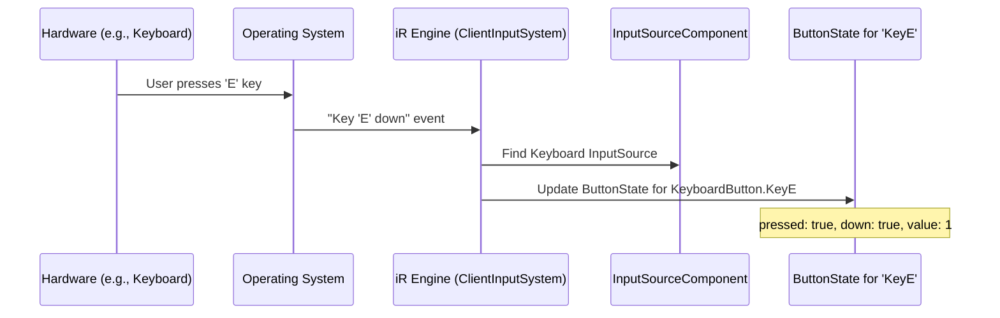

# Button and axis state

## Overview

The button and axis state system provides a standardized representation of input states across different device types. This abstraction layer allows the engine to process inputs consistently regardless of their physical source, enabling developers to create device-agnostic interaction systems.

## Standardized input representation

A key challenge in input handling is the diversity of input methods. The same logical action (e.g., "interact") might be triggered by:

- Pressing the 'E' key on a keyboard
- Clicking the left mouse button
- Pressing the 'A' button on a gamepad
- Pulling the trigger on an XR controller

The iR Engine addresses this challenge by implementing a common data structure for all input types, allowing different parts of the system to work with inputs without needing to know their physical origin.

## ButtonState structure

For each button the system tracks, it maintains a `ButtonState` object containing comprehensive information about the button's current condition:

| Property | Description | Usage |
|----------|-------------|-------|
| `pressed` | Whether the button is currently held down | `true` for every frame the button is held |
| `down` | Whether the button was just pressed this frame | `true` only for the first frame of a press |
| `up` | Whether the button was just released this frame | `true` only for the frame when released |
| `value` | Analog value for pressure-sensitive buttons | Range from 0.0 (not pressed) to 1.0 (fully pressed) |
| `touched` | Whether the button is being touched but not pressed | Used primarily with capacitive XR controller buttons |
| `dragging` | Whether the input device is moving while the button is pressed | Used for drag operations |

### Code example

```typescript
// Simplified representation of ButtonState
// (Found in: state/ButtonState.ts)
type ButtonState = {
  down: boolean;    // True ONLY the frame it's first pressed
  pressed: boolean; // True as long as it's held
  up: boolean;      // True ONLY the frame it's released
  value: number;    // For analog inputs (e.g., triggers 0.0 to 1.0)
  touched: boolean; // Is the button being touched (capacitive)?
  dragging: boolean;// Is the pointer moving while pressed?
  // Additional properties omitted for brevity
};
```

## Input enumeration

To provide a consistent way to reference specific buttons and axes, the system defines several enumeration types:

### Button enumerations

- **MouseButton**: Standard mouse buttons
  ```typescript
  enum MouseButton {
    'PrimaryClick' = 'PrimaryClick',   // Usually left mouse button
    'AuxiliaryClick' = 'AuxiliaryClick', // Usually middle mouse button/wheel
    'SecondaryClick' = 'SecondaryClick' // Usually right mouse button
  }
  ```

- **KeyboardButton**: Keyboard keys
  ```typescript
  enum KeyboardButton {
    'Space' = 'Space',
    'KeyW' = 'KeyW',
    'KeyA' = 'KeyA',
    'KeyS' = 'KeyS',
    'KeyD' = 'KeyD',
    'Enter' = 'Enter',
    // Many additional keys omitted for brevity
  }
  ```

- **StandardGamepadButton** & **XRStandardGamepadButton**: Gamepad and XR controller buttons
  ```typescript
  enum XRStandardGamepadButton {
    'XRStandardGamepadTrigger' = 0, // The main trigger
    'XRStandardGamepadSqueeze' = 1, // The grip button
    // Additional buttons omitted for brevity
  }
  ```

### Axis enumerations

- **MouseScroll**: Mouse wheel axes
- **StandardGamepadAxes**: Standard gamepad analog inputs
- **XRStandardGamepadAxes**: XR controller analog inputs
  ```typescript
  enum XRStandardGamepadAxes {
    'XRStandardGamepadTouchpadX' = 0, // Left/Right on touchpad/thumbstick
    'XRStandardGamepadTouchpadY' = 1, // Up/Down on touchpad/thumbstick
    // Additional axes omitted for brevity
  }
  ```

## Integration with input sources

The `InputSourceComponent` discussed in the previous chapter stores a collection of `ButtonState` objects indexed by the appropriate enumeration values. This creates a comprehensive representation of the device's current state:

```typescript
// Conceptual representation of an InputSourceComponent for a keyboard
InputSourceComponent (for Keyboard):
  - buttons:
    - KeyboardButton.KeyW: { down: false, pressed: true, up: false, value: 1, ... }
    - KeyboardButton.Space: { down: true, pressed: true, up: false, value: 1, ... }
    - KeyboardButton.ShiftLeft: { down: false, pressed: false, up: false, value: 0, ... }
    // Additional keys omitted for brevity
```

```typescript
// Conceptual representation of an InputSourceComponent for an XR controller
InputSourceComponent (for Left VR Controller):
  - buttons:
    - XRStandardGamepadButton.XRStandardGamepadTrigger: { 
        down: false, 
        pressed: true, 
        up: false, 
        value: 0.8, 
        touched: true, 
        ... 
      }
    // Additional buttons omitted for brevity
  - axes:
    - XRStandardGamepadAxes.XRStandardGamepadThumbstickX: -0.5 // Pushed left
    - XRStandardGamepadAxes.XRStandardGamepadThumbstickY: 0.0  // Centered
    // Additional axes omitted for brevity
```

## Processing pipeline

The transformation from hardware events to standardized button states follows this process:

1. **Hardware event**: Physical input occurs (e.g., key press)
2. **Operating system notification**: OS sends event to the application
3. **Event translation**: `ClientInputSystem` converts raw event to standardized format
4. **State update**: System updates the appropriate `ButtonState` in the relevant `InputSourceComponent`



### ButtonState initialization

When a button event first occurs, the system creates a new `ButtonState` object using the `createInitialButtonState` function:

```typescript
// From: state/ButtonState.ts
// (Simplified for brevity)

export const createInitialButtonState = (
  inputSourceEntity: Entity,
  initial: Partial<ButtonState> = { pressed: true, value: 1 }
) => {
  return {
    down: initial.down ?? initial.pressed ?? false,
    pressed: initial.pressed ?? true,
    // Additional properties omitted for brevity
    inputSourceEntity,
  } as ButtonState;
};
```

## Benefits of standardized input representation

This standardized approach to input state representation provides several advantages:

1. **Consistency**: All input types are represented in the same format
2. **Abstraction**: Higher-level systems can work with logical actions rather than specific physical inputs
3. **Flexibility**: Support for new input device types can be added without changing the core interaction system
4. **Readability**: Enumerated values provide clear, self-documenting code

## Next steps

With an understanding of how input states are standardized across different device types, the next chapter explores how game entities can listen for and respond to these inputs through the input receiver system.

Next: [Input receiver](03_input_receiver_.md)

---


