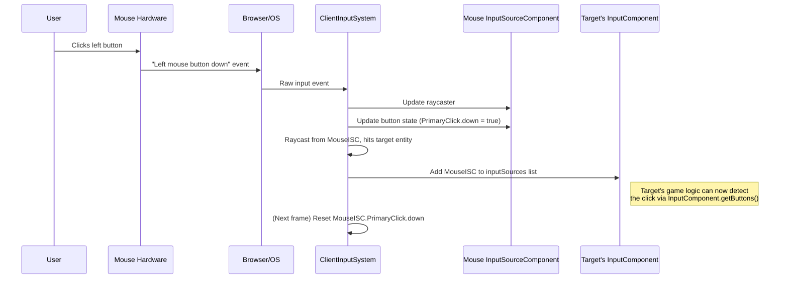

# Input system

## Overview

The input system serves as the central coordinator for all input processing in the iR Engine. It manages the flow of information from hardware devices to game entities, ensuring that inputs are properly captured, processed, and routed to the appropriate receivers.

## ClientInputSystem

The core component of the input system is the `ClientInputSystem`, an Entity Component System (ECS) system that executes once per frame to handle all client-side input processing. This system performs several critical functions:

1. **Input source updates**: Refreshes all input sources with the latest data from hardware devices
2. **Target detection**: Determines which entities in the scene are being targeted by input devices
3. **Source-receiver connection**: Links input sources to the appropriate input receivers
4. **State management**: Ensures input states are properly maintained between frames

## Processing pipeline

The `ClientInputSystem` follows a specific sequence of operations during each frame:

### 1. Update input sources

First, the system refreshes all input sources with the latest hardware data:

- **XR controllers**: Updates position and rotation from the XR session
- **Mouse/screen pointers**: Calculates raycasts from the current cursor position through the camera
- **Button and axis states**: Reads the current state of all buttons and analog inputs

### 2. Determine targets

Once input sources are updated, the system identifies which entities are being targeted:

- Uses raycasting for pointer-based inputs (mouse, XR controllers)
- May use proximity detection for non-pointer inputs
- Stores intersection results in the input source components

### 3. Connect sources to receivers

After identifying targets, the system links input sources to the appropriate receivers:

- Updates the `inputSources` array in each target entity's `InputComponent`
- Handles input focus and capture for entities that need exclusive input control
- Ensures that input receivers have access to the relevant input sources

### 4. Prepare for next frame

Finally, the system performs cleanup operations to prepare for the next frame:

- Resets transient states like `down` and `up` flags
- Clears consumed input markers
- Handles any pending input focus changes

## Implementation details

The `ClientInputSystem` is implemented in `systems/ClientInputSystem.tsx`. Here's a simplified representation of its main execution function:

```typescript
// Simplified conceptual structure from systems/ClientInputSystem.tsx

const execute = () => {
  // 1. Update XR Input Source transforms (e.g., VR controllers)
  for (const eid of xrSpacesQuery()) {
    // Update transform from XR pose
  }

  // 2. Update pointer-based Input Source raycasters (e.g., mouse)
  for (const eid of pointersQuery()) { 
    // Update raycaster from camera and pointer position
    // Update transform of the pointer entity
  }

  // 3. Update gamepad button/axis states in InputSourceComponents
  for (const sourceEid of inputSourceQuery()) {
    // Read hardware gamepad/controller states
    ClientInputFunctions.updateGamepadInput(sourceEid); 
  }

  // 4. Determine targets and assign InputSourceComponents to InputComponents
  const capturedEntity = getEntityCapturingInput();
  for (const sourceEid of inputSourceQuery()) {
    // Find targets and connect sources to receivers
    ClientInputFunctions.assignInputSources(sourceEid, capturedEntity);
  }
};
```

### Helper functions

The `ClientInputSystem` relies on several helper functions from `functions/ClientInputFunctions.ts`:

#### updateGamepadInput

```typescript
// Simplified from functions/ClientInputFunctions.ts
export function updateGamepadInput(entity: Entity) {
  const inputSource = getComponent(entity, InputSourceComponent);
  const gamepad = inputSource.source.gamepad;
  if (!gamepad) return;

  // For each button on the gamepad
  for (let i = 0; i < gamepad.buttons.length; i++) {
    const hardwareButton = gamepad.buttons[i];
    const buttonState = inputSource.buttons[i];

    // Update ButtonState based on hardware state
    // Set pressed, down, value properties
  }
  
  // Update axis values similarly
}
```

#### assignInputSources

```typescript
// Simplified from functions/ClientInputFunctions.ts
export function assignInputSources(sourceEntity: Entity, capturedEntity: Entity) {
  // Find entities intersected by the source's raycaster
  const sortedIntersections = findRaycastedInput(sourceEntity);
  
  // Create list of input sources for targets to listen to
  const finalInputSources = [sourceEntity, ...globalSources];
  
  // If an entity has captured input, only it receives the input
  if (capturedEntity !== UndefinedEntity) {
    setInputSources(capturedEntity, finalInputSources);
  } else {
    // Otherwise, assign to all intersected entities
    for (const intersection of sortedIntersections) {
      setInputSources(intersection.entity, finalInputSources);
    }
  }
}
```

#### setInputSources

```typescript
// Simplified from functions/ClientInputFunctions.ts
export function setInputSources(targetEntity: Entity, sourcesToAdd: Entity[]) {
  // Find the InputComponent on the target entity
  const inputComponent = getMutableComponent(targetEntity, InputComponent);
  
  // Add the source entities to the inputSources list
  if (inputComponent) {
    inputComponent.inputSources.merge(sourcesToAdd);
  }
}
```

## Input processing flow example

The following sequence diagram illustrates how the input system processes a mouse click on an interactive object:



## System integration

The input system integrates with several other components of the engine:

- **Camera system**: Provides the viewpoint for raycasting
- **Transform system**: Updates the spatial position of input devices
- **Physics system**: Used for raycasting and collision detection
- **Entity Component System**: Provides the framework for component queries and updates

## Next steps

With an understanding of how the input system coordinates the overall input processing pipeline, the next chapter explores the specific techniques used to determine which entities are being targeted by input devices.

Next: [Input target detection](05_input_target_detection_.md)

---


