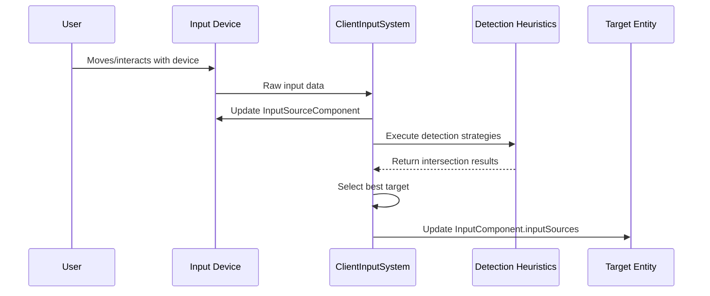

# Input target detection

## Overview

Input target detection is the process by which the iR Engine determines which entities in a 3D scene are being targeted by input devices. This critical subsystem enables the engine to identify the objects that users are attempting to interact with, whether through pointing, proximity, or other detection methods.

## Detection strategies

The engine employs several detection strategies, or heuristics, to identify potential interaction targets. These strategies are implemented in the `ClientInputHeuristics` module and provide different approaches to target identification:

### Raycasting against meshes

This strategy uses precise geometric intersection testing against detailed 3D models:

- **Implementation**: Projects an invisible ray from the input device and tests for intersections with the triangular meshes of scene objects
- **Accuracy**: High precision, as it detects intersections with the actual visible geometry
- **Performance**: More computationally intensive, especially with complex meshes
- **Use cases**: Precise targeting in detailed environments, interactive UI elements

```typescript
// Simplified concept from: functions/ClientInputHeuristics.ts
function meshHeuristic(
  viewerEntity: Entity,
  intersectionData: Set<IntersectionData>,
  pointerPosition: Vector3,
  pointerDirection: Vector3
) {
  _raycaster.set(pointerPosition, pointerDirection);
  const interactableObjects = getInteractableObjects();
  const hits = _raycaster.intersectObjects(interactableObjects, true);

  for (const hit of hits) {
    intersectionData.add({ 
      entity: hit.object.entity!, 
      distance: hit.distance 
    });
  }
}
```

### Raycasting against bounding boxes

This strategy uses simplified collision volumes for faster intersection testing:

- **Implementation**: Tests ray intersections against axis-aligned bounding boxes that encompass objects
- **Accuracy**: Lower precision than mesh raycasting, but sufficient for many interactions
- **Performance**: Significantly faster than mesh raycasting
- **Use cases**: Performance-critical scenarios, objects with simple shapes, initial filtering

```typescript
// Simplified concept from: functions/ClientInputHeuristics.ts
function boundingBoxHeuristic(
  viewerEntity: Entity,
  intersectionData: Set<IntersectionData>,
  pointerPosition: Vector3,
  pointerDirection: Vector3
) {
  ray.origin.copy(pointerPosition);
  ray.direction.copy(pointerDirection);

  const entitiesWithBoundingBoxes = getEntitiesWithBoundingBoxes();

  for (const entity of entitiesWithBoundingBoxes) {
    const boundingBox = getOptionalComponent(entity, BoundingBoxComponent);
    if (!boundingBox) continue;

    const didHit = ray.intersectBox(boundingBox.box, hitTarget);
    if (didHit) {
      intersectionData.add({ 
        entity, 
        distance: ray.origin.distanceTo(hitTarget) 
      });
    }
  }
}
```

### Proximity detection

This strategy identifies targets based on spatial proximity rather than direct pointing:

- **Implementation**: Measures the distance between input devices and potential targets
- **Accuracy**: Depends on the activation distance threshold defined for each target
- **Performance**: Generally efficient, especially with spatial partitioning
- **Use cases**: VR hand interactions, touch-like interfaces, area-of-effect selections

```typescript
// Simplified concept from: functions/ClientInputHeuristics.ts
function findProximity(
  isSpatialInput: boolean,
  sourceEntity: Entity,
  sortedIntersections: IntersectionData[],
  intersectionData: Set<IntersectionData>
) {
  TransformComponent.getWorldPosition(sourceEntity, _worldPosInputSource);
  const potentialTargets = getEntitiesWithInputComponent();

  for (const targetEntity of potentialTargets) {
    if (targetEntity === selfAvatarEntity) continue;

    const inputComponent = getComponent(targetEntity, InputComponent);
    TransformComponent.getWorldPosition(targetEntity, _worldPosTarget);

    const distSquared = _worldPosInputSource.distanceToSquared(_worldPosTarget);
    const activationDistSquared = inputComponent.activationDistance * inputComponent.activationDistance;

    if (activationDistSquared > distSquared) {
      intersectionData.add({ 
        entity: targetEntity, 
        distance: Math.sqrt(distSquared) 
      });
    }
  }
}
```

## Heuristic coordination

The engine uses a coordinated approach to manage these detection strategies:

### Heuristic registration and prioritization

Heuristics are registered with the `InputHeuristicState`, which maintains an ordered list of detection strategies. This ordering allows certain heuristics to take precedence over others, enabling scenarios such as:

- UI elements having priority over world objects
- Editor tools taking precedence over game interactions
- Custom interaction systems overriding default behaviors

### The findRaycastedInput function

The `findRaycastedInput` function serves as the primary coordinator for ray-based heuristics:

```typescript
// Simplified concept from: functions/ClientInputHeuristics.ts
export function findRaycastedInput(
  sourceEid: Entity,
  intersectionData: Set<IntersectionData>
) {
  // Get the pointer's current world position and direction
  TransformComponent.getWorldRotation(sourceEid, sourceRotation);
  direction.copy(ObjectDirection.Forward).applyQuaternion(sourceRotation);
  TransformComponent.getWorldPosition(sourceEid, position);

  // Get the registered heuristic functions
  const heuristics = getState(InputHeuristicState);

  // Get the viewer entity associated with this input source
  const viewerEntity = getComponent(sourceEid, InputSourceComponent).sourceEntity;
  if (!viewerEntity) return;

  // Run each heuristic in priority order
  for (const h of heuristics) {
    h.heuristic(viewerEntity, intersectionData, position, direction);
  }
}
```

## Integration with the input system

The target detection process is integrated with the broader input system through the following workflow:

1. **Input source update**: The `ClientInputSystem` updates the position and orientation of input devices
2. **Heuristic execution**: The system calls `findRaycastedInput` and other detection functions
3. **Result collection**: Detection results are stored in the `intersections` field of the `InputSourceComponent`
4. **Target selection**: The system selects the most appropriate target (typically the closest valid intersection)
5. **Input routing**: The selected target's `InputComponent` is updated to include the relevant input source



## Performance considerations

Target detection can be computationally intensive, particularly in complex scenes. The engine employs several optimization strategies:

- **Hierarchical testing**: Using bounding box tests before more expensive mesh tests
- **Spatial partitioning**: Limiting candidate objects based on spatial organization
- **Caching**: Reusing previous results when appropriate
- **Selective updating**: Only performing detection for active input sources
- **Custom heuristics**: Allowing developers to implement specialized, optimized detection for specific scenarios

## Next steps

With an understanding of how the engine determines which entities are being targeted by input devices, the next chapter explores how the system manages and visualizes input pointers in the 3D environment.

Next: [Input pointer management](06_input_pointer_management_.md)

---


