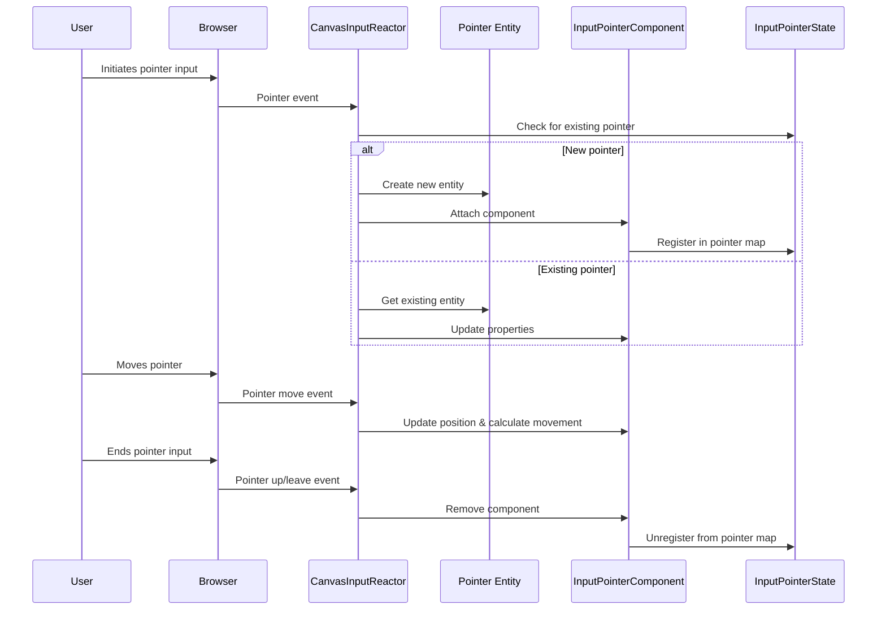

# Input pointer management

## Overview

Input pointer management is the subsystem responsible for tracking and managing individual pointer inputs such as mouse cursors, touch points, and other screen-space interaction devices. 

This system enables the engine to handle multiple simultaneous pointers across different rendering contexts, providing essential support for complex user interfaces and multi-touch interactions.

## Core components

The input pointer management system consists of two primary elements:

### InputPointerComponent

The `InputPointerComponent` represents a single, specific pointer input and maintains its current state. When attached to an entity, it provides the following key properties:

| Property | Type | Description |
|----------|------|-------------|
| `pointerId` | Number | Unique identifier for the specific pointer (e.g., mouse = 1, first touch = 2) |
| `cameraEntity` | Entity | Reference to the camera entity rendering the canvas this pointer interacts with |
| `position` | Vector2 | Current normalized 2D coordinates (-1 to +1 range) relative to the associated canvas |
| `lastPosition` | Vector2 | Previous frame's position |
| `movement` | Vector2 | Change in position since the last frame |

```typescript
// Conceptual representation of InputPointerComponent data
InputPointerComponent_Data: {
  pointerId: 1,                    // First pointer (e.g., mouse)
  cameraEntity: entityIdForCamera, // Associated camera
  position: { x: 0.5, y: -0.2 },   // Current normalized position
  lastPosition: { x: 0.48, y: -0.21 },
  movement: { x: 0.02, y: 0.01 }   // Movement delta
}
```

### InputPointerState

The `InputPointerState` serves as a central registry for all active pointers in the system. It maintains a mapping between pointer identifiers and their corresponding entities, enabling efficient lookup of pointer entities:

```typescript
// Conceptual representation of InputPointerState
InputPointerState_Data: {
  pointers: Map<CameraPointerHash, Entity>([
    ["canvas-101.pointer-1", entityForMouseOnCanvas101],
    ["canvas-202.pointer-1", entityForTouch1OnCanvas202],
    ["canvas-202.pointer-2", entityForTouch2OnCanvas202]
  ])
}
```

The `CameraPointerHash` is a unique string identifier created by combining the camera entity ID and the pointer ID, providing a consistent way to reference specific pointer instances.

## Pointer lifecycle

The lifecycle of a pointer in the system follows these stages:

### 1. Creation

When a new pointer input is detected (e.g., mouse movement on a canvas or a touch event):

- The `CanvasInputReactor` receives a browser pointer event
- The system checks if an entity already exists for this camera/pointer combination
- If not, a new entity is created
- An `InputPointerComponent` is attached to this entity

### 2. Registration

Once the pointer entity is created:

- The `InputPointerComponent` reactor automatically runs
- It creates a `CameraPointerHash` from the `cameraEntity` and `pointerId`
- It registers the entity in the `InputPointerState.pointers` map

### 3. Updates

As the pointer moves or changes state:

- Browser events trigger updates to the `InputPointerComponent`
- The system updates `position`, calculates `movement`, and stores `lastPosition`
- These updates flow through to any systems or components using the pointer data

### 4. Removal

When a pointer is no longer active (e.g., touch end or mouse leave):

- The `InputPointerComponent` may be removed from its entity
- The reactor's cleanup function removes the entry from `InputPointerState.pointers`
- The pointer entity may be destroyed or recycled



## Technical implementation

### InputPointerState definition

```typescript
// Simplified from: components/InputPointerComponent.ts
export const InputPointerState = defineState({
  name: 'InputPointerState',
  initial() {
    return {
      pointers: new Map<CameraPointerHash, Entity>()
    };
  }
});

// Helper function to create the unique hash key
function createCameraPointerHash(camera: Entity, pointer: number): CameraPointerHash {
  return `canvas-${camera}.pointer-${pointer}` as CameraPointerHash;
}
```

### InputPointerComponent definition

```typescript
// Simplified from: components/InputPointerComponent.ts
export const InputPointerComponent = defineComponent({
  name: 'InputPointerComponent',
  schema: {
    pointerId: S.Number({ default: -1 }),
    position: T.Vec2(),
    lastPosition: T.Vec2(),
    movement: T.Vec2(),
    cameraEntity: S.Entity()
  },
  
  // Reactor to maintain InputPointerState
  reactor: () => {
    const entity = useEntityContext();
    const comp = useComponent(entity, InputPointerComponent);

    useImmediateEffect(() => {
      const pId = comp.pointerId.value;
      const camEnt = comp.cameraEntity.value;
      const hash = createCameraPointerHash(camEnt, pId);

      getState(InputPointerState).pointers.set(hash, entity);
      return () => {
        getState(InputPointerState).pointers.delete(hash);
      };
    }, [comp.pointerId, comp.cameraEntity]);

    return null;
  }
});
```

### CanvasInputReactor implementation

```typescript
// Simplified from: functions/ClientInputHooks.tsx
function handlePointerEvent(event: PointerEvent, cameraEntity: Entity) {
  // Get existing pointer entity or create a new one
  const pointerEntity = InputPointerComponent.getPointerByID(cameraEntity, event.pointerId) 
                      || createEntity();

  // Ensure it has an InputSourceComponent
  setComponent(pointerEntity, InputSourceComponent, { 
    sourceEntity: cameraEntity 
  });

  // Calculate normalized coordinates
  const normalizedX = (event.clientX / canvasWidth) * 2 - 1;
  const normalizedY = -(event.clientY / canvasHeight) * 2 + 1;

  // Update the InputPointerComponent
  setComponent(pointerEntity, InputPointerComponent, {
    pointerId: event.pointerId,
    cameraEntity: cameraEntity,
    position: new Vector2(normalizedX, normalizedY)
    // lastPosition and movement are handled internally
  });
}
```

## Practical usage

### Accessing a specific pointer

```typescript
// Get a pointer entity by camera and pointer ID
const pointerEntity = InputPointerComponent.getPointerByID(cameraEntity, pointerId);

if (pointerEntity !== UndefinedEntity) {
  const pointerData = getComponent(pointerEntity, InputPointerComponent);
  
  // Access pointer properties
  const position = pointerData.position;
  const movement = pointerData.movement;
  
  // Use position for UI placement or interaction logic
}
```

### Tracking all pointers for a camera

```typescript
// In a React component or system
const activePointers = InputPointerComponent.usePointersForCamera(cameraEntity);

// Process all active pointers
for (const pointerEntity of activePointers) {
  const pointerData = getComponent(pointerEntity, InputPointerComponent);
  
  // Render cursor or handle interaction for each pointer
  drawCursor(pointerData.position.x, pointerData.position.y);
}
```

## Integration with other systems

The input pointer management system integrates with several other components of the engine:

- **Input sources**: Pointer entities typically have both `InputPointerComponent` and `InputSourceComponent`
- **Raycasting**: Pointer positions are used to create rays for 3D interaction
- **UI systems**: UI components use pointer data for hover states, drag operations, and click handling
- **Multi-touch gestures**: Multiple pointers can be tracked simultaneously for pinch, rotate, and other gestures

## Conclusion

The input pointer management system provides a robust framework for handling diverse pointer inputs across multiple rendering contexts. By maintaining a clear separation between physical pointer devices and their logical representation in the engine, this system enables:

- Support for multiple simultaneous pointers (essential for multi-touch)
- Association of pointers with specific cameras and canvases
- Normalized 2D coordinates for consistent UI interaction
- Efficient lookup of pointer entities for event handling

This completes our exploration of the iR Engine's input and interaction system. Throughout this documentation, we've covered:

1. How raw device inputs are captured by input sources
2. How these inputs are standardized into button and axis states
3. How game entities listen for and respond to inputs
4. How the input system coordinates the overall process
5. How the engine determines which entities are being targeted
6. How individual pointers are managed across different contexts

With this comprehensive understanding, developers can create sophisticated, responsive, and intuitive interactions in their iR Engine applications.

---


