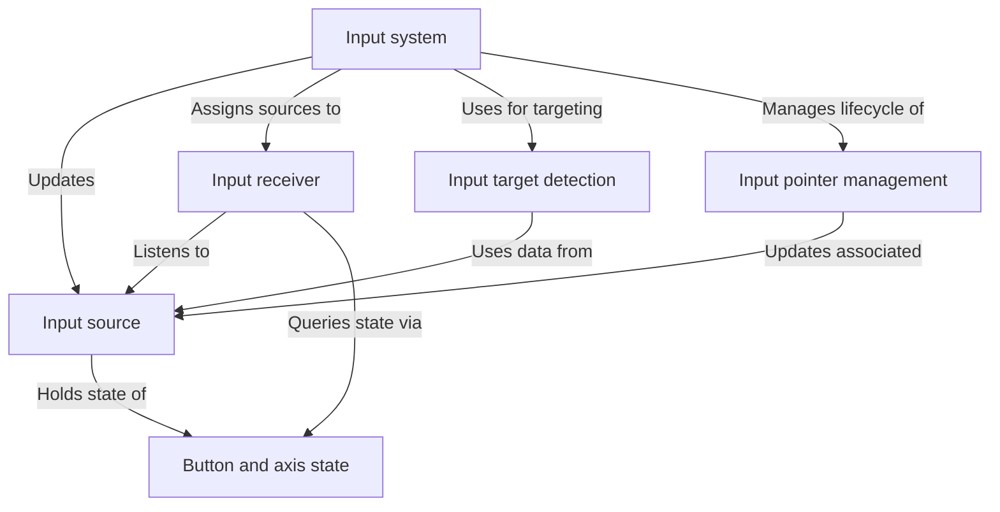

# Input and interaction system

The iR Engine input and interaction system provides a comprehensive framework for managing user inputs within the 3D engine environment. 

This system processes actions from various input devices including keyboards, mice, and XR controllers, determines what the user is attempting to interact with in the virtual environment, and enables game objects to respond to these inputs through the Entity Component System (ECS) architecture.

## System overview

The input and interaction system consists of several interconnected components that work together to capture, process, and respond to user input:

## Key components

1. **Input source**: Represents physical or emulated input devices and maintains their current state
2. **Button and axis state**: Standardized representation of input states across different device types
3. **Input receiver**: Listens for specific inputs and translates them into meaningful actions
4. **Input system**: Coordinates the overall input processing pipeline
5. **Input target detection**: Determines what objects in the scene are being targeted by input devices
6. **Input pointer management**: Handles pointer-based input devices and their interaction with the 3D environment

## Documentation chapters

1. [Input source](01_input_source_.md)
2. [Button and axis state](02_button_and_axis_state_.md)
3. [Input receiver](03_input_receiver_.md)
4. [Input system](04_input_system_.md)
5. [Input target detection](05_input_target_detection_.md)
6. [Input pointer management](06_input_pointer_management_.md)

---

