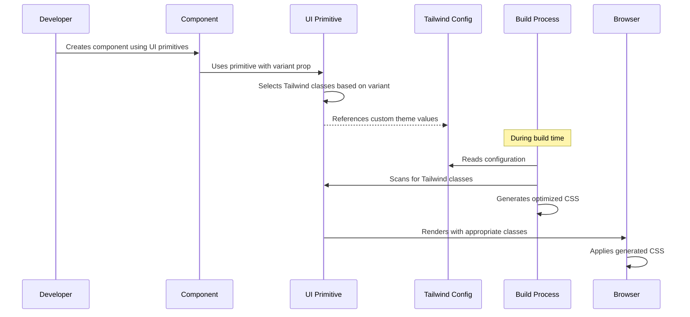

# UI primitives & styling (Tailwind)

## Overview

The UI primitives system forms the foundation of the iR Engine user interface framework. It provides a standardized set of reusable UI components that maintain consistent styling throughout the application. These primitives serve as the basic building blocks for constructing more complex UI elements and interfaces, ensuring visual coherence and reducing development time. 

The styling of these components is implemented using Tailwind CSS, a utility-first CSS framework that enables efficient and consistent design application.

## Core concepts

### UI primitives

UI primitives are fundamental, reusable interface components that serve as the basic building blocks for constructing the application's user interface. The iR Engine UI framework includes several essential primitives:

- `Button`: For triggering actions
- `Input`: For text and numeric entry
- `Checkbox`: For boolean selections
- `Select`: For dropdown option selection
- `Text`: For displaying labels and content

These primitives are designed to be:

1. **Reusable**: Each component can be used in multiple contexts throughout the application
2. **Consistent**: All instances of a component maintain the same visual style
3. **Configurable**: Components accept props to modify their appearance and behavior
4. **Accessible**: Components follow accessibility best practices

### Tailwind CSS

Tailwind CSS is a utility-first CSS framework that provides low-level utility classes to build custom designs without leaving your HTML (or JSX). Instead of writing custom CSS rules, developers apply pre-defined utility classes directly to elements:

```html
<!-- Traditional CSS approach -->
<button class="primary-button">Click Me</button>

<!-- Tailwind approach -->
<button class="bg-blue-500 text-white px-4 py-2 rounded-md">Click Me</button>
```

Key benefits of Tailwind in the iR Engine UI framework:

1. **Consistency**: Predefined color scales, spacing values, and other design tokens ensure visual consistency
2. **Development speed**: No need to write and maintain custom CSS files
3. **Flexibility**: Easy to create variations without writing new CSS
4. **Bundle size optimization**: Only the utility classes actually used are included in the final CSS

## Implementation

### Component structure

UI primitives are organized in the codebase as follows:

```
src/
├── primitives/
│   └── tailwind/
│       ├── Button/
│       │   └── index.tsx
│       ├── Input/
│       │   └── index.tsx
│       ├── Checkbox/
│       │   └── index.tsx
│       └── ...
└── index.ts  (exports all primitives)
```

Each primitive is implemented as a React component that applies Tailwind utility classes based on its props.

### Button component

The `Button` component is a fundamental UI primitive that demonstrates the implementation pattern used throughout the system:

```typescript
// Simplified from: src/primitives/tailwind/Button/index.tsx
import React from 'react';
import { twMerge } from 'tailwind-merge';

// Define style variants
const variants = {
  primary: 'bg-ui-primary text-text-primary-button hover:bg-ui-hover-primary',
  secondary: 'bg-[#4D84BF33] dark:bg-ui-secondary text-ui-primary',
  // Additional variants...
};

const Button = ({ 
  variant = 'primary',  // Default variant
  children,             // Button content
  className,            // Additional classes
  ...props              // Other HTML button props
}) => {
  // Combine base styles, variant styles, and custom classes
  const buttonClasses = twMerge(
    'flex items-center justify-center px-4 py-1 text-sm font-medium', // Base styles
    variants[variant],  // Variant-specific styles
    className           // Custom classes (override if needed)
  );

  return (
    <button className={buttonClasses} {...props}>
      {children}
    </button>
  );
};

export default React.forwardRef(Button);
```

This implementation:
1. Defines style variants as collections of Tailwind classes
2. Accepts a `variant` prop to select the appropriate style
3. Uses `twMerge` to intelligently combine multiple sets of Tailwind classes
4. Renders a standard HTML button with the combined classes
5. Forwards the React ref to the underlying button element

### Input component

The `Input` component follows a similar pattern:

```typescript
// Simplified from: src/primitives/tailwind/Input/index.tsx
import React from 'react';
import { twMerge } from 'tailwind-merge';

// Define height variants
const heights = {
  l: 'h-8 py-1.5 px-2',
  // Other size options...
};

const Input = ({
  height = 'l',
  className,
  ...props
}) => {
  return (
    <input
      className={twMerge(
        'rounded-md border-[0.5px] border-ui-outline',
        'text-xs placeholder-text-tertiary dark:bg-ui-background',
        heights[height],
        // Focus and disabled states...
        className
      )}
      {...props}
    />
  );
};

export default React.forwardRef(Input);
```

### Component exports

All UI primitives are exported from a central `index.ts` file, making them easily accessible throughout the application:

```typescript
// From: src/index.ts
export { default as Button } from './primitives/tailwind/Button';
export type { ButtonProps } from './primitives/tailwind/Button';
export { default as Input } from './primitives/tailwind/Input';
export type { InputProps } from './primitives/tailwind/Input';
// Additional exports...
```

This approach allows developers to import components with a clean, consistent syntax:

```typescript
import { Button, Input } from '@ir-engine/ui';
```

## Tailwind configuration

### Configuration file

The Tailwind configuration defines the design system's colors, spacing, typography, and other design tokens:

```javascript
// From: tailwind.config.js
import tailwindConfig from '../../tailwind.config'

module.exports = {
  ...tailwindConfig
}
```

The UI framework inherits its Tailwind configuration from a shared config file, ensuring consistency across the entire iR Engine ecosystem.

### Custom theme values

The shared configuration defines custom theme values like colors and spacing:

```javascript
// Conceptual content of the shared tailwind.config.js
module.exports = {
  theme: {
    extend: {
      colors: {
        'ui-primary': '#007bff',
        'text-primary-button': '#ffffff',
        'ui-hover-primary': '#0069d9',
        'ui-outline': '#e2e8f0',
        // Additional custom colors...
      },
      // Typography, spacing, and other theme extensions...
    },
  },
  // Plugins and other configuration...
};
```

### PostCSS processing

Tailwind classes are processed into standard CSS using PostCSS:

```javascript
// From: postcss.config.js
module.exports = {
  plugins: {
    tailwindcss: import('tailwindcss'),
    autoprefixer: import('autoprefixer'),
  },
}
```

This configuration:
1. Uses the Tailwind plugin to generate CSS from utility classes
2. Applies autoprefixer to ensure cross-browser compatibility

## Usage examples

### Basic button

```jsx
import { Button } from '@ir-engine/ui';

function ConfirmDialog() {
  const handleConfirm = () => {
    console.log("Action confirmed");
  };

  return (
    <div>
      <p>Are you sure you want to proceed?</p>
      <Button variant="primary" onClick={handleConfirm}>
        Confirm
      </Button>
    </div>
  );
}
```

### Form with multiple primitives

```jsx
import { Button, Input, Checkbox } from '@ir-engine/ui';

function SettingsForm() {
  const [name, setName] = useState('');
  const [enabled, setEnabled] = useState(false);

  return (
    <form>
      <div className="mb-4">
        <label>Name</label>
        <Input 
          value={name} 
          onChange={(e) => setName(e.target.value)} 
          placeholder="Enter name"
        />
      </div>
      
      <div className="mb-4">
        <Checkbox 
          checked={enabled} 
          onChange={(e) => setEnabled(e.target.checked)}
          label="Enable feature"
        />
      </div>
      
      <Button variant="primary" type="submit">
        Save Settings
      </Button>
    </form>
  );
}
```

## Styling workflow

The process of styling a component using the UI primitives and Tailwind follows this workflow:



## Next steps

With an understanding of the UI primitives and Tailwind styling system, the next chapter explores how these building blocks are used to create more complex UI structures for editing properties in the iR Engine editor.

Next: [Editor properties UI (NodeEditor components)](02_editor_properties_ui___nodeeditor__components__.md)

---


